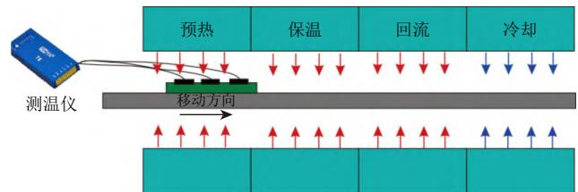
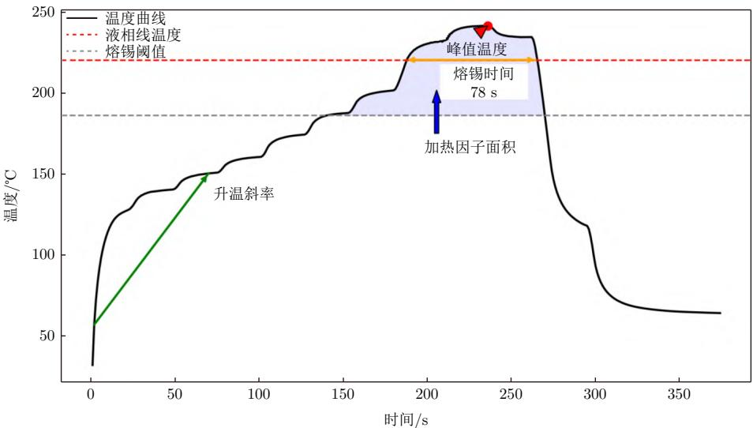
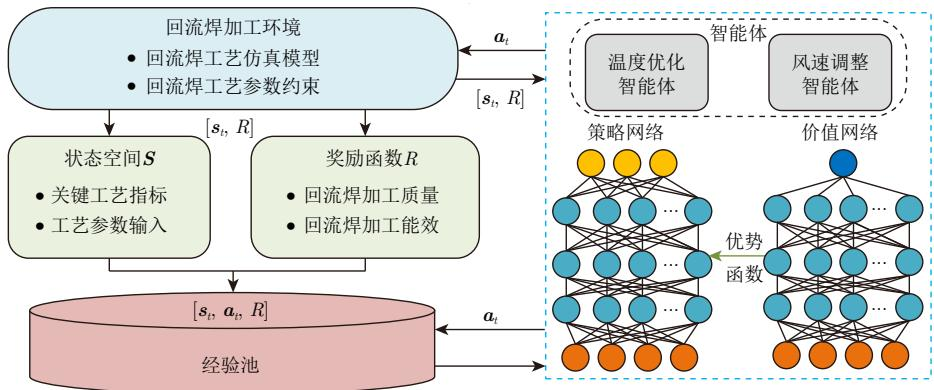
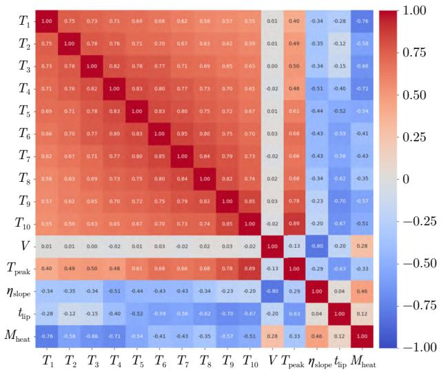
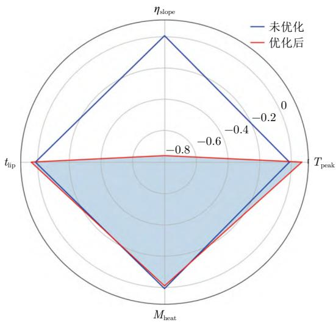
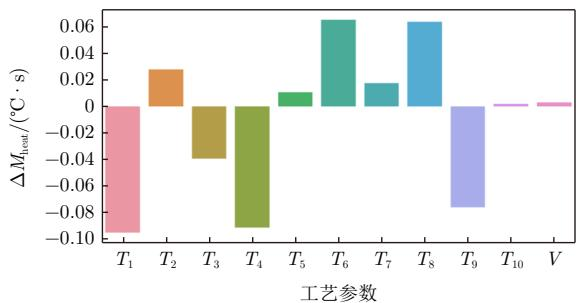
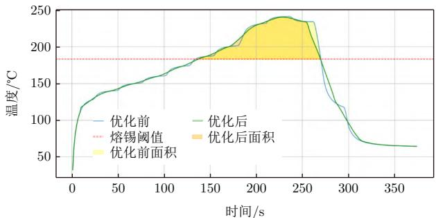

DOI: 10.19659/j.issn.1008–5300.20250703001

编者按：2025年，《电子机械工程》喜迎创刊 40 周年。40年筚路蓝缕、风雨兼程，《电子机械工程》紧密跟踪国内外电子机械领域的新动态、新技术、新发展，已成为电子机械技术领域内具有一定权威性和影响力的刊物，为我国电子机械领域的学术研究和成果展示做出了重要贡献。为此，编辑部特别策划了“创刊 40 周年纪念专辑（下）”，除收录部分特邀论文外，主要刊登各领域学者及从业科研人员的自由来稿，以全面展现电子机械工程领域内的最新研究成果，探索新一代技术的创新发展。感谢作者、读者、编委 40年来的同行与信任！站在新起点，《电子机械工程》将继续搭建高水平学术交流平台，助力中国电子机械技术迈向新高度。

# 基于强化学习的回流焊工艺参数智能优化研究

黄少华\*1，龙智新1，王燕清2，王博宇1，侯霄宇1，孙 浩1

（1. 南京航空航天大学机电学院，江苏 南京 210016； 2. 南京电子技术研究所，江苏 南京 210039）

摘 要：针对回流焊工艺过程中关键参数优化调控问题，文中以满足工艺关键指标和加热因子面积最小为目标，提出了一种基于近端策略优化算法的策略优化框架。首先，对回流焊工艺参数优化过程的工艺约束和优化指标进行分析，将其转化为序列决策框架下的连续控制优化问题。进一步将其形式化为马尔可夫决策过程，明确强化学习过程中的各项关键要素。然后，为提升强化学习算法的稳定性和策略表达能力，采用了集成广义优势估计的 Actor-Critic策略优化框架。最后，设计了针对回流焊参数优化的相关实验，验证了基于近端策略优化算法的智能优化方法具有较好的稳定性和泛化能力，为实际生产中的参数智能调节提供有效技术支持。关键词：回流焊；强化学习；工艺优化；近端策略优化；马尔可夫决策过程

中图分类号：TN405

文献标识码：A

文章编号：1008−5300(2025)04−0001−08

引用格式：黄少华, 龙智新, 王燕清, 等. 基于强化学习的回流焊工艺参数智能优化研究[J]. 电子机械工程, 2025, 41(4): 1−8.

HUANG S H, LONG Z X, WANG Y Q, et al. A study on intelligent optimization method of reflow soldering process parameters based on reinforcement learning[J]. Electro-Mechanical Engineering, 2025, 41(4): 1−8.

# A Study on Intelligent Optimization Method of Reflow Soldering Process Parameters Based on Reinforcement Learning

HUANG Shaohua\*1, LONG Zhixin1, WANG Yanqing2, WANG Boyu1, HOU Xiaoyu1, SUN Hao1

(1. College of Mechanical and Electrical Engineering, Nanjing University of Aeronautics and Astronautics, Nanjing 210016, China; 2. Nanjing Research Institute of Electronics Technology, Nanjing 210039, China)

Abstract：A strategy optimization framework based on the proximal policy optimization (PPO) algorithm is proposed to address the problem of optimizing and controlling key parameters in the reflow soldering process. The goal is to meet key process indicators while minimizing the heating factor area. Firstly, the process constraints and optimization indicators in the reflow soldering parameter optimization process are analyzed, and the problem is transformed into a continuous control optimization problem under the framework of sequential decision-making. It is further formalized as a Markov decision process, clarifying key elements in the reinforcement learning process. Then, to enhance the stability and policy expression ability of the reinforcement learning algorithm, an Actor-Critic strategy optimization framework incorporating generalized advantage estimation (GAE) is adopted. Finally, relevant experiments for reflow soldering parameter optimization are designed, verifying that the intelligent optimization method based on the PPO algorithm exhibits better stability and generalization ability compared to traditional methods, thus providing effective technical support for intelligent parameter

adjustment in actual production.

Key words：reflow soldering; reinforcement learning; process optimization; proximal policy optimization; Markov decision process

## 引 言

在国防领域，电子产品需长期面临复杂严苛的工作环境，装焊质量对产品工作稳定性起着决定性作用[1]。回流焊作为电子组件装焊的关键工艺，其工艺参数的调控优化对提升质量可靠性尤为重要。然而，当前的回流焊工艺参数设置与优化对人员经验和知识的依赖性较高，常发生因参数设置不当引起的虚焊和元器件损坏等问题，进而影响整体生产质量和周期[2]。如何借助智能化技术提升回流焊工艺过程的稳定性，已成为亟须突破的关键技术难题。

近年来，国内外专家学者围绕回流焊工艺过程的仿真建模与优化算法等方面展开了大量研究。文献[3]通过田口方法对回流焊工艺参数进行优化，并对优化的回流焊工艺参数进行试验，减少了焊点的缺陷。文献[4]基于反向传播（Back Propagation, BP）神经网络构建参数映射模型，结合遗传算法的全局优化能力对回流焊工艺参数进行优化，显著缩短传统工艺调试时间，提高了参数调整响应速度。针对回流焊工艺过程问题，文献[5]采用改进的先进过程控制策略优化回流焊工艺参数，借助遗传算法优化 BP 神经网络结构，然后对回流焊工艺参数进行预测，得到最优回流焊参数。文献[6]运用人工神经网络模型对回流焊工艺参数进行预测，并证明该模型具有较强的工业应用价值。

在优化方法的前沿探索中，文献[7]提出的Reflow-Net 架构创新性地引入跨域自适应 ConvLSTM 网络，实现了从工艺参数到温度场的端到端映射。文献[8]基于傅里叶热传导理论，构建了简化热模型，并采用量子启发式多目标粒子群优化算法同步优化传输速度与热累积效应。文献[9]针对传送带动态传热过程，设计了基于 ε 约束转换策略的进化优化框架，通过重构加热因子评价体系，实现了工艺稳定性和温控精度的显著提升。

综上所述，尽管当前关于回流焊工艺优化的研究已取得阶段性进展，但在多目标协同优化和复杂工艺环境适应方面仍存在显著提升空间。现有研究多聚焦于单一工艺参数或特定封装类型，缺乏对热曲线、焊点质量、封装热惯性等多维因素的系统建模与协同优化，难以满足高可靠性电子组装的实际需求。强化学习因具备动态策略调整和长期回报优化能力，在复杂时序决策问题中显示出独特优势。其中，近端策略优化（Proximal Policy Optimization, PPO）算法作为策略梯度类方法，具备良好的策略稳定性与收敛效率，尤其适用于回流焊中存在多参数强耦合、非线性动态响应的优化场景[10]。PPO 算法能够在高维工艺参数空间中有效探索帕累托最优解，兼顾焊点可靠性、空洞率控制及能耗等多目标需求，为构建智能化、柔性化的回流焊工艺控制系统提供了有力支撑。

因此，为应对回流焊工艺优化中多目标复杂耦合与能效平衡的挑战，本文构建了基于 PPO 的智能策略优化框架，并采用集成广义优势估计（GeneralizedAdvantage Estimation, GAE）的 Actor-Critic 策略优化框架，有效提升了策略收敛效率并增强了训练过程的数值稳定性。在奖励函数设计方面，采用多目标协同优化机制，在保证关键工艺参数满足控制精度的前提下，将加热因子面积等能效相关指标纳入综合评价体系，构建了贴合实际制造约束的优化模型，从而在工艺质量与能源利用之间实现动态平衡。所提方法兼具算法通用性与工业可部署性，为实现回流焊工艺的智能化、精益化优化提供了具有推广价值的技术路径。

## 1  问题描述

## 1.1  回流焊工艺描述

回流焊工艺作为表面组装技术（Surface MountedTechnology, SMT）的核心工艺，可系统划分为四个连续的热处理阶段：预热、保温、回流与冷却。印刷电路板组件经焊膏印刷与贴装后，沿输送路径依次经过各热区，各阶段温控依赖多个独立控温单元的协同调节，以实现整体热场的稳定均匀分布。在预热阶段，通过对基板施加预设的温区温度，使焊膏中的溶剂逐步挥发，促使基材及元器件适应热环境。保温阶段则将温度维持在较窄的温度平台区间，增强焊料对焊盘和元器件引脚的润湿能力。随着温度进一步升高并跨越焊料液相线，电子组件进入回流阶段，此时焊料熔化并形成牢固焊点，从而实现焊点的电气互连与结构固定。最后，冷却阶段需控制降温速率以防止应力集中，促使熔融焊料在受控条件下结晶固化，从而获得具有优良机械强度与电气性能的焊接连接[11]。具体工作原理如图 1 所示。

  
图1 回流炉原理图

## 1.2  问题描述

在回流焊工艺中，需预先设定若干关键工艺参数，以实现对热过程的精确控制。其中，温区设定温度、风速及传送带链速是影响热传导与能量分布的主要调控变量。在本优化问题中，设定传送带链速为定值，需要调整的工艺参数为风速设定值 V以及 10 个温区温度值，定义为 $T _ { 1 } , \ T _ { 2 } , \cdots , \ T _ { 1 0 ^ { \circ } }$ 根据回流焊实际工艺需求，风速可调节范围为 $[ V _ { 1 } , V _ { 2 } ]$ ；温度和风速作为影响焊接质量的重要因素，其调整范围约束较多，详见表 1。

表 1 工艺参数约束范围
<table><tr><td>工艺参数</td><td>约束范围</td></tr><tr><td>热风风速  $V / ( \mathrm { m } { \cdot } \mathrm { s } ^ { - 1 } )$ </td><td>风速控制在  $V _ { 1 } { = } 5  { \mathrm { m } / \mathrm { s } }$  到  $V _ { 2 } { = } 1 5 \mathrm { m } / \mathrm { s } \dot { \mathcal { Z } }$  间，且单次风速调整量  $\Delta V$  最大为±0.15 m/s。</td></tr><tr><td>温区温度  $T _ { 1 } { \sim } T _ { 7 } / \mathcal { C }$ </td><td>温区温度值严格递增，相邻温区温差  $T _ { \mathrm { m } } { \leqslant } 1 5 ~ \mathrm { { ^ { \circ } C } } ,$  且单次温度调整量  $\Delta T _ { i }$  最大为±3  $\mathcal { \mathrm { C } } \mathrm { ~ c ~ }$ </td></tr><tr><td>温区温度  $T _ { 7 } { \sim } T _ { 8 } / \mathrm { { } ^ { \circ } C }$ </td><td>两温区之间  $T _ { \mathrm { m } } { \leqslant } 4 0 \ \mathrm { { \leqslant C } } ,$  且单次温度调整量  $\Delta T _ { i }$  最大为±3℃。</td></tr><tr><td>温区温度  $T _ { 8 } { \sim } T _ { 1 0 } / \mathrm { { C } }$ </td><td>各个温区设定温度不得超过  $2 7 0 \ \mathrm { ‰}$  且单次温度调整量  $\Delta T _ { i }$  最大  $\yen 123,456$ </td></tr></table>

相应的约束条件可定义为：

$$
\left\{ \begin{array} { l l } { 5 \leqslant V \leqslant 1 5 } \\ { T _ { 1 } < T _ { 2 } < \cdots < T _ { 7 } } \\ { T _ { i + 1 } - T _ { i } \leqslant 1 5 , i \in \{ 1 , 2 , \cdots , 6 \} } \\ { T _ { 8 } - T _ { 7 } \leqslant 4 0 } \\ { T _ { j } \leqslant 2 7 0 , j \in \{ 8 , 9 , 1 0 \} } \\ { - 0 . 1 5 \leqslant \Delta V \leqslant 0 . 1 5 } \\ { - 3 \leqslant \Delta T _ { i } \leqslant 3 } \end{array} \right.\tag{1}
$$

区时特定监测点温度随时间变化的动态过程，曲线上各关键指标（峰值温度、升温斜率、熔锡时间及加热因子面积）可反映焊接质量的高低。如图 2 所示，峰值温度直接反映焊料的充分熔化程度；升温斜率不仅影响助焊剂的活性变化，还决定了电子元器件所承受的热冲击强度；熔锡时间关系到焊点的形成质量与结构完整性；加热因子面积则从热能利用效率的视角，量化了工艺过程中的热耗散情况[12]。为系统性地评估参数组合的优化效果，选取以上四项指标作为强化学习方法的综合判断依据。优化指标的选取依据如表 2 所示。

回流焊温度曲线作为反映焊接工艺输出性能的核心指标，描述了印刷电路板组件在回流炉内经过各温

  
图2 回流焊温度曲线关键指标示意图

本文聚焦于回流焊工艺过程参数优化问题，在回流焊工艺参数的给定范围内，通过调整参数组合$( T _ { 1 } { \sim } T _ { 1 0 } , V )$ ，寻求既能确保温度曲线关键指标符合要求，又能使加热因子面积最小的最优回流焊工艺参数配置，为回流焊工艺的精细化控制提供理论与方法支撑。

表 2 回流焊温度曲线优化指标
<table><tr><td>优化指标名称</td><td>选取依据</td></tr><tr><td>峰值温度/℃</td><td>需控制峰值温度在230℃～255℃范围内，避免过热导致元器件损伤或焊盘氧化。</td></tr><tr><td>升温斜率  $/ ( \mathrm { { } ^ { q } C \cdot { s } ^ { - 1 } ) }$ </td><td>升温速率限制在  $1 { \sim } 4 ~ \mathrm { \textmp C } / \mathrm { s } \vec { \mathcal { Z } }$  间以减少热应力，防止印刷电路板变形或元器件开裂。</td></tr><tr><td>熔锡时间/s</td><td>焊料熔融状态持续时间须在30～90s内，确保焊点冶金反应充分。</td></tr><tr><td>加热因子面积/(℃·s)</td><td>加热因子面积能衡量金属间化合物(Intermetallic Compound, IMC)厚度， 尽可能减小加热因子面积能提高焊点装焊质量。</td></tr></table>

## 2  PPO算法概述及设计

强化学习是一种以智能体与环境交互为基础、面向序列决策优化问题的自适应学习方法，广泛应用于工业过程控制中的高维参数调节与策略优化任务。其中，PPO 通过引入策略剪切函数与重要性采样机制，在提升训练稳定性的同时，能够有效抑制策略更新过程中的波动性与性能退化风险[13]。因此，针对回流焊工艺中多参数间存在强耦合、非线性交互及优化目标冲突等问题，本文基于 PPO 算法，构建了集成广义优势估计的Actor-Critic 策略优化框架，以提升训练的数值稳定性和对复杂回流焊工艺优化任务的适应能力。

## 2.1  马尔可夫决策过程的构建

在回流焊工艺参数的智能调节与多目标优化框架中，智能体的核心任务是基于当前环境状态，生成一组调节动作以优化温度曲线关键指标并最小化加热因子面积。针对回流焊加工过程的参数优化，本文重点研究 11 个关键可控参数，包括 10 个独立温区的温度设定和热风系统的风速控制。为此，设计了两类智能体：温度优化智能体和风速调整智能体。前者主要用于动态调节各温区温度，确保符合回流焊工艺的温度曲线要求；后者主要用于实时控制热风风速，以维持炉内温度分布的均匀性和稳定性。具体流程如图 3 所示，其中 $\mathbf { } \mathbf { a } _ { t }$ 为一组动作向量， $\mathbf { } _ { s _ { t } }$ 为一组状态向量。

  
图3 PPO算法设计流程图

回流焊加工过程作为典型的时序决策问题，在应用 PPO 算法进行参数优化前，需将其建模为马尔可夫决策过程（Markov Decision Process, MDP）。该MDP 模型由五元组 $N = \left( S , A , P \left( \tau \mid \theta \right) , R , \gamma \right)$ 构成。S其中，状态空间 表征回流焊工艺过程中的关键状态A变量；动作空间 定义了可调控的工艺参数操作集；状态转移函数 $P \left( \tau \mid \theta \right)$ 用于描述工艺参数调整对系统状态的影响；奖励函数 R 提供回流焊加工环境对智能体γ动作组合的反馈； 代表折扣因子，权衡长期回报与即时奖励。本文通过设计回流焊加工过程的状态空间、动作空间和奖励函数来构建 MDP。

## 2.1.1  状态空间

S状态空间 旨在为智能体提供足够的信息基础以S指导其进行正确的决策，因此 需要能够全面反映当前热工艺过程的物理状态与控制需求。此外，温度优化智能体和风速调整智能体具有共同的优化任务，且在调整优化参数时相互影响，因此两类智能体在训练过程中共享相同的状态空间。状态空间包括第 1 至第10 温区的电子组件设置温度、风速以及表 2 中的四项优化指标，具体表达式为：

$$
S = \{ T _ { \mathrm { p e a k } } , \eta _ { \mathrm { s l o p e } } , t _ { \mathrm { l i p } } , M _ { \mathrm { h e a t } } , T _ { 1 } , T _ { 2 } , \cdot \cdot \cdot , T _ { 1 0 } , V \} \in \mathbb { R } ^ { 1 5 }\tag{2}
$$

式中： $T _ { \mathrm { p e a k } }$ 为峰值温度； $\eta _ { \mathrm { s l o p e } }$ 为升温斜率； $t _ { \mathrm { l i p } }$ 为熔锡时间； $M _ { \mathrm { h e a t } }$ 为加热因子面积； $T _ { 1 } \sim T _ { 1 0 }$ 分别为对应的10 个温区温度；V为风速设定值。前 4 维代表当前状态下关键工艺的相应指标，后 11 维代表智能体可调控的工艺参数输入。

## 2.1.2  动作空间

在回流焊加工过程中主要涉及到优化温区温度和风速的两类智能体，考虑到工艺变量调节的连续性、高维性与联动性，离散化的固定步长会使动作组合数量指数增长，计算量激增。因此，本研究选用基于概率策略分布采样的连续动作空间。具体而言，策略网络针对每一维的连续变量输出一组参数化高斯分布，然后通过随机采样生成一组动作向量 $\mathbf { } \mathbf { a } _ { t }$ 作为当前时间步 t （0≤t≤T，T为参数优化任务中的总时间步数）下的控制策略，并将 $\Delta V ^ { ( t ) }$ $\Delta T _ { i } ^ { ( t ) }$ 分别定义为在当前时间步 t下的风速调整量和各温区温度调整量。为进一步确保动作值位于有界区间内，避免策略发散，采样后的动作经过归一化动作 $\mathbf { \Delta } \mathbf { a } _ { t } ^ { ' }$ 压缩至 $\operatorname { t a n h } ( \mathbf { a } _ { t } ) \in [ - 1 , 1 ]$ 再结合每个参数特定的调节幅度 $\zeta _ { i }$ ，映射为实际物理动作。具体定义为：

$$
\pmb { a } _ { t } = [ \Delta T _ { 1 } ^ { ( t ) } , \Delta T _ { 2 } ^ { ( t ) } , \allowbreak \cdots , \Delta T _ { 1 0 } ^ { ( t ) } , \Delta V ^ { ( t ) } ] = \zeta _ { i } \cdot \pmb { a } _ { t } ^ { ' }\tag{3}
$$

根据状态 $\mathbf { \Delta } _ { \mathbf { \mathcal { S } } _ { t } }$ 选择动作 $\mathbf { } \mathbf { a } _ { t }$ ，再从环境中获得奖励 $r _ { t ^ { 9 } }$ 并按照状态转移函数 $P \left( \tau \mid \theta \right)$ 生成状态 $s _ { t + 1 }$ 。通过与回流焊环境的不断交互，生成的状态和动作形成轨迹τ，可表示为：

$$
\pmb { \tau } = \left( \pmb { s } _ { 0 } , \pmb { a } _ { 0 } , r _ { 0 } , \pmb { s } _ { 1 } , \pmb { a } _ { 1 } , r _ { 1 } , \pmb { \cdot } \cdot \cdot , \pmb { s } _ { T } , \pmb { a } _ { T } , r _ { T } \right)\tag{4}
$$

定义 $\pi _ { \boldsymbol { \theta } } ( \mathbf { a } _ { t } | \mathbf { s } _ { t } )$ 为在给定状态下，采用策略参数θ的决策模型选择动作的参数化概率。则轨迹发生的概率为：

$$
P ( \tau \mid \theta ) = \rho ( s _ { 0 } ) \prod _ { t = 0 } ^ { T - 1 } \pi _ { \theta } ( \mathbf { a } _ { t } \mid s _ { t } ) { \cdot } P ( s _ { t + 1 } \mid s _ { t } , \mathbf { a } _ { t } )\tag{5}
$$

式中： $\rho ( s _ { 0 } )$ 为初始状态分布，通常为固定分布；$\nabla ( s _ { t + 1 } | s _ { t } , \mathbf { a } _ { t } )$ 为环境状态转移概率，描述采取动作$\mathbf { } \mathbf { a } _ { t }$ 转移至下一状态 $s _ { t + 1 }$ 的概率。

## 2.1.3  奖励函数

奖励函数是强化学习中的核心，用于引导智能体评估当前策略下动作的优劣。由于两类智能体的优化目标相同，均为在确保温度曲线关键指标最优的前提下，最小化加热因子面积，因此，它们为完全合作关系，共享同一个奖励函数。此外，回流焊加工环境下对智能体的行为进行反馈时需同时兼顾回流焊加工质量

与能效。

首先对目标温度曲线的关键指标进行量化，设定目标值与实际输出的差异作为负向奖励。回流焊加工质量的奖励函数 $r _ { \mathrm { { q u a l i t y } } }$ 设定为：

$$
r _ { \mathrm { q u a l i t y } } = - \sum _ { i = 1 } ^ { n } w _ { i } \cdot \left| y _ { i } ^ { \mathrm { s i m } } ( \pmb { a } ) - y _ { i } ^ { \mathrm { t a r g e t } } \right|\tag{6}
$$

式中： $y _ { i } ^ { \mathrm { s i m } } ( { \pmb a } )$ 为动作 $\mathbf { \delta } _ { \mathbf { \alpha } \mathbf { \delta } _ { a _ { } } }$ 所对应的仿真输出指标值；  
$y _ { i } ^ { \mathrm { t a r g e t } }$ 为各指标的目标值，通常取其工艺区间的中值；  
$w _ { i }$ 为各指标的权重。

其次，可将加热因子面积作为能耗的近似量度，对温区设定温度与风速组合的能耗估计给予适度惩罚。回流焊能效的奖励函数 $r _ { \mathrm { e n e r g y } }$ 设定为：

$$
r _ { \mathrm { e n e r g y } } = - \lambda \cdot { \frac { M _ { \mathrm { h e a t } } } { M _ { \mathrm { h e a t } } ^ { \mathrm { m a x } } } }\tag{7}
$$

式中： $\lambda$ 为加热系统面积的惩罚系数； $M _ { \mathrm { h e a t } } ^ { \mathrm { m a x } }$ 为历史观测中加热因子面积的最大值，用于归一化。

因此，在状态 $s \in S$ ，动作 $\mathbf { \pmb { a } } \in \mathbf { { \mathcal { A } } }$ 下，其最终的奖励函数组合定义为：

$$
\begin{array} { l } { { \displaystyle R = r _ { \mathrm { q u a l i t y } } + r _ { \mathrm { e n e r g y } } = } } \\ { { \displaystyle ~ - \sum _ { i = 1 } ^ { n } w _ { i } \cdot | y _ { i } ^ { \mathrm { s i m } } ( { \bf a } ) - y _ { i } ^ { \mathrm { t a r g e t } } | - \lambda \cdot \frac { M _ { \mathrm { h e a t } } } { M _ { \mathrm { h e a t } } ^ { \mathrm { m a x } } } } } \end{array}\tag{8}
$$

奖励函数鼓励智能体在满足工艺约束的前提下，降低加热因子面积，体现质量−效率−能耗之间的工程权衡。

## 2.2  Actor-Critic 框架

Actor-Critic 框架由策略网络（Actor）和价值网络（Critic）构成。Actor 通过将实时工艺参数转换为连续动作空间的概率分布，生成最佳控制策略。而 Critic则用于对状态值函数进行估计，为策略的优化过程提供相对稳定的参考基准[14]。这种协同工作机制显著提升了动作−状态组合的评估精度，特别适合在连续控制场景下实现收敛性良好的策略搜索过程。

## 2.2.1  Actor

Actor 通过参数化的动作策略 $\pi _ { \boldsymbol { \theta } } ( \pmb { a } | \pmb { s } )$ 定义了环境可执行的动作 $\mathbf { \delta } _ { : a }$ s在状态 下的概率分布，其中 θ 表示网络的可训练参数集合。本研究采用高斯分布的均值$\mu \left( s \right)$ ，将其策略表示为：

$$
\mu ( s ) = f _ { \theta } ^ { \mu } ( s )\tag{9}
$$

$$
\pi _ { \boldsymbol { \theta } } ( \mathbf { a } \mid s ) = \prod _ { j = 1 } ^ { 1 1 } { \mathcal { N } } ( \mathbf { a } _ { j } ; \mu _ { j } ( s ) , \sigma _ { j } ^ { 2 } )\tag{10}
$$

式中： $\mathcal { N } ( \pmb { a } _ { j } ; \mu _ { j } ( \pmb { s } ) , \sigma _ { j } ^ { 2 } )$ 为第 j维动作，服从均值为$\mu _ { j } ( s )$ 、方差为 $\sigma _ { j } ^ { 2 }$ 的一维高斯分布； $\mu _ { j } ( s )$ 为来源于策略网络的第j维动作的均值； $\sigma _ { j }$ 为第 $j$ 维动作的标准差，通常由网络输出或作为可学习参数。

为避免单一确定性策略带来的探索不足问题，通S过多层感知机制将输入状态 映射至特征空间，再经由两条分支输出动作分布的参数，其动作采样过程可形式化为：

$$
\pmb { a } _ { j } = \mu ( \pmb { s } _ { t } ) + \sigma _ { j } \cdot \varepsilon _ { j } , \varepsilon _ { j } \sim N ( 0 , 1 )\tag{11}
$$

式中， $\varepsilon _ { j }$ 为标准正态分布噪声，用于引入随机性。

将 PPO 中的裁剪型损失函数确立为策略优化阶段的核心目标函数。具体而言，通过引入新旧策略间的动作概率比值 $n _ { t } ,$ ，并将其与优势函数 $\hat { A } _ { t }$ 相结合，间接实现对策略网络参数 θ 的更新。

$$
\begin{array} { r l } & { L ^ { \mathrm { c l i p } } ( \theta ) = } \\ & { E _ { t } \left[ \operatorname* { m i n } \Big ( n _ { t } ( \theta ) \hat { A } _ { t } , \mathrm { c l i p } ( n _ { t } ( \theta ) , 1 - \omega , 1 + \omega ) \hat { A } _ { t } \Big ) \right] } \end{array}\tag{12}
$$

$$
n _ { t } ( \theta ) = \frac { \pi _ { \theta } ( { \pmb a } _ { t } | { \pmb s } _ { t } ) } { \pi _ { \theta _ { \mathrm { o l d } } } ( { \pmb a } _ { t } | { \pmb s } _ { t } ) }\tag{13}
$$

式中： $L ^ { \mathrm { c l i p } } ( \theta )$ 为策略网络的优化目标； $\omega$ 为裁剪范围超clip( )参数，常取 0.1 或 0.2； 为限制概率在 $[ 1 - \omega , 1 + \omega ]$ 内的函数； $\pi _ { \boldsymbol { \theta } } ( \cdot )$ 为当前策略； $\pi _ { \theta _ { \mathrm { o l d } } } ( \cdot )$ 为旧策略； $n _ { t } ( \theta )$ 为策略比，避免策略更新步长过大。

$\hat { A } _ { t }$ 通过限制策略更新幅度，保证了训练过程的稳定性。进一步引入GAE 方法，提升估值精度并抑制训练过程中的波动。其核心思想是结合时间差分误差 $\delta _ { t }$ 与累积折扣收益，对优势函数 $\hat { A } _ { t }$ 进行更为平滑的估计。

$$
\hat { A } _ { t } = \sum _ { i = 0 } ^ { \infty } ( \gamma \varphi ) ^ { t } \delta _ { t + l }\tag{14}
$$

$$
\delta _ { t } = r _ { t } + \gamma V ( s _ { t + 1 } ) - V ( s _ { t } )\tag{15}
$$

式中： $\delta _ { t + l }$ 为时间步 $t { + } l$ 的时序差分误差； $V ( s _ { t } )$ 为状态价值函数； $\gamma$ 为折扣因子； $\varphi \in [ 0 , 1 ]$ 为 GAE 的权衡参数，用于调节偏差与方差之间的权衡系数。

## 2.2.2  Critic

Critic 的主要功能是评估当前状态的价值函数，其输出不仅为策略梯度计算提供稳定基准，还显著抑制了优化过程中的随机扰动，用于辅助 Actor 策略优化，从而降低梯度估计方差。

$$
V ( \pmb { \mathscr { s } } _ { t } ) = f _ { \phi } ( \pmb { \mathscr { s } } ) , \quad f _ { \phi } : \mathbb { R } ^ { 1 5 }  \mathbb { R }\tag{16}
$$

式中， $f _ { \phi } ( \cdot )$ 表示参数为ϕ的价值网络。

在 PPO 框架中，Critic 的训练目标为最小化预测值与经验回报之间的均方误差损失函数，该函数的具体表达式为：

$$
L _ { V } ( \phi ) = E _ { t } \left[ \left( V _ { \phi } ( \pmb { s } _ { t } ) - R _ { t } \right) ^ { 2 } \right]\tag{17}
$$

式中： $E _ { t }$ 为期望运算，表示在时间步 t上的统计平均；$V _ { \phi } ( s _ { t } )$ ϕ表示由 Critic 参数 估计的状态价值函数，反映当前状态下的价值； $R _ { t }$ 表示经验回报值，即实际采样轨迹上获得的累积奖励。

在算法训练阶段，Critic 为 Actor 的策略更新提供了清晰且具指导性的方向，从而在提升整体训练体系的稳定性与实用性的同时，增强模型在实际工艺控制中的鲁棒性和适应能力。在训练完成后，系统可仅加载已训练的 Actor，依据实时状态 $\mathbf { \boldsymbol { s } } _ { t }$ 生成动作 $\mathbf { } \mathbf { a } _ { t }$ ，实现回流焊工艺参数的智能调节及优化。

## 3  实验设计与结果分析

为了验证所提算法对回流焊参数的优化性能，以某电子制造企业的回流焊工艺过程中某焊料的实际数据作为强化学习智能体的环境。以焊接过程中关键热参数满足工艺规范为目标，同时尽可能最小化加热因子面积，实现节能降耗。本实验所用焊料的标准工艺区间为：

$$
\left\{ \begin{array} { l l } { 2 3 0 ^ { \circ } \mathrm { C } \leqslant T _ { \mathrm { p e a k } } \leqslant 2 5 5 ^ { \circ } \mathrm { C } } \\ { 3 0 \mathrm { s } \leqslant t _ { \mathrm { l i p } } \leqslant 9 0 \mathrm { ~ s ~ } } \\ { 1 ^ { \circ } \mathrm { C } / \mathrm { s } \leqslant \eta _ { \mathrm { s l o p e } } \leqslant 4 ^ { \circ } \mathrm { C } / \mathrm { s } } \end{array} \right.\tag{18}
$$

## 3.1  实验参数设置

本 实 验 采用 Python 与 Stable-Baselines3 实 现PPO 强化学习算法的编程，利用两层多层感知器（Multilayer Perceptron, MLP） 架 构 搭 建 Actor-Critic 框架。程序在 Windows11 中运行，处理器为Intel（ R） Core（ TM） i5-12400@2.50 GHz（ 12CPUs） ，相应的实验参数设置如表 3 所示。

表 3 部分实验参数设置
<table><tr><td>参数名称</td><td>参数值</td></tr><tr><td>Actor结构</td><td>[256,256]</td></tr><tr><td>Critic结构</td><td>[256,256]</td></tr><tr><td>学习率</td><td> $3 \times 1 0 ^ { - 4 }$ </td></tr><tr><td>批量大小</td><td>256</td></tr><tr><td>GAE衰减参数</td><td>0.95</td></tr><tr><td>折扣因子γ</td><td>0.99</td></tr><tr><td>权重系数ω</td><td>0.2</td></tr></table>

## 3.2  实验结果及分析

为系统性地评估 PPO 算法模型在回流焊工艺参数优化过程中的性能表现，本文从参数相关性、优化效果对比和变量敏感性等多个维度构建可视化分析体系。通过对比分析优化前后的工艺参数温度曲线，验证了该优化方法的科学性与有效性。

如图 4 所示，参数相关性热力图揭示了工艺参数之间复杂而紧密的交互网络。具体而言，各温区温度呈现显著的正相关性，可防止因局部参数调整而导致整体热场的非均衡失调。风速参数与加热因子面积呈现负相关趋势，表明在一定调节范围内，增加风速输入能够有效促进热量的均匀扩散。

  
图4 参数相关性热力图

如图 5 所示，优化性能雷达图直观地呈现了优化前后四项核心工艺指标的归一化现象。整体来看，强化学习算法显著提升了工艺性能的综合水平：在温度控制方面，通过对峰值温度与升温斜率的精准调节，满足了各项关键指标；压缩了熔锡时间，有效降低了热损伤风险；加热因子面积的缩减则进一步体现了该方法在能量利用效率上的优化。

  
图5 优化性能雷达图

如图 6 所示，柱状图展示了加热因子面积对各工艺参数敏感度的分布特征。结果表明，不同参数对热场分布的影响强度存在显著差异，若干主导参数在加热区域的控制中发挥着关键且决定性的作用，而相对次要的参数则表现出较大的调节灵活性。

  
图6 加热因子面积的敏感性分析图

如图 7 所示，通过对优化前后对应工艺参数的温度曲线进行分析可知，在确保关键指标满足工艺要求的前提下，该算法模型可显著减小加热因子面积，进而促进焊接 IMC 厚度的增长，显著提升了焊点的焊接可靠性。此外，优化后的温度曲线表现出更为平稳且连续的特性，优化前曲线中存在的突变和波动被明显缓解，这使得对温度变化的控制更加合理，有效减少了印制电路板上的热应力残留。优化结果表明，回流焊整体焊接质量得到了较好提升。

  
图7 温度曲线优化前后对比图

## 4  结束语

本研究针对电子组件回流焊工艺在复杂热场中的参数优化调控问题，提出了一种基于 PPO 算法的智能优化方法。首先建立回流焊参数优化过程中连续控制问题的马尔可夫决策模型，明确状态空间、动作空间以及奖励函数等关键要素。然后采用集成 GAE 的Actor-Critic 策略优化框架以增强学习稳定性和策略表达能力。最后通过实验证明了该方法在满足回流焊工艺约束的前提下，可有效减少加热因子面积，确保焊接 IMC 厚度的增长，提高了焊接可靠性，具备良好的工程应用潜力。未来研究可进一步扩展方法的优化能力，如引入更多的输入参数，使得回流焊环境变得更加复杂，实现更全面的动作行为概述。在方法上，可进一步采用深度强化学习方法，提升算法处理问题的稳定性。

## 参 考 文 献

贲可存, 胡长明, 冯展鹰, 等. 复杂电子装备数字化车间发[1]展趋势与实践[J]. 电子机械工程, 2022, 38(1): 21−28.

金梓谦, 许庆, 苏煜. 选择性波峰焊的数值仿真方法与工艺[2]参数优化[J/OL]. 焊接学报, 1−7[2025−07−03]. http://kns.cnki.net/kcms/detail/23.1178.TG.20250515.1432.002.html.

CHIEN C S, CHIEN C W, LI Y T, et al. Taguchi[3] DoE for solder voids reduction[C]//2018 13th International Microsystems, Packaging, Assembly and Circuits Technology Conference (IMPACT). Piscataway, NJ: IEEE Press, 2018: 301−304.

PAN E S, JIN Y, XU H, et al. Forecasting and[4] parameters optimization of reflow soldering profile based on BPNN and GA[J]. Advanced Materials Research, 2010, 139: 990−995.

郭瑜, 孙志礼, 潘尔顺. 回流焊工艺参数在线控制及优化策[5]略[J]. 东北大学学报 (自然科学版), 2014, 35(4): 555−558.

冯泽虎. 一种基于人工神经网络模型的无铅无卤回流焊优[6]化工艺[J]. 兵器材料科学与工程, 2015, 38(4): 109−112.

KATAOKA J, FARRAG A, LAI Y Y, et al.[7] ReflowNet: ConvLSTM-based direct reflow oven recipe optimization framework[J]. Journal of Intelligent

Manufacturing, 2024(6): 1−15.

周文婷, 司玉鹏, 何宏舟, 等. 基于量子多目标优化算法的[8]回焊炉炉温设计[J]. 焊接学报, 2022, 43(1): 85−91, 118−119.

刘朗亭, 刘学文, 李汶霞. 回流焊工艺中炉温分布的多目[9]标优化[J/OL]. 重庆师范大学学报 (自然科学版), 1−11[2025−07−03]. http://kns.cnki.net/kcms/detail/50.1165.N.20250429.1534.012.html.

吴昊泽, 李艳武, 谢辉. 改进 PPO算法求解柔性作业车[10]间调度问题[J/OL]. 计算机集成制造系统, 1−20[2025−05−19]. http://kns.cnki.net/kcms/detail/11.5946.TP.20230601.0942.006.html.

YAO Y, KEER L M. Cohesive fracture mechanics[11] based numerical analysis to BGA packaging and lead free solders under drop impact[J]. Microelectronics Reliability, 2013, 53(4): 629−637.

孙昊晟, 张金珠. 回流焊接温度曲线优化的机理建模研究[12][J]. 科技创新导报, 2021, 18(14): 66−72.

姜智中, 贺建良. 基于改进 PPO算法的无人机航路规[13]划[J/OL]. 电光与控制, 1−8[2025−07−03]. http://kns.cnki.net/kcms/detail/41.1227.TN.20250507.1022.002.html.

蔺伟山, 王小君, 孙庆凯, 等. 不确定性环境下基于深度[14]强化学习的综合能源系统动态调度[J]. 电力系统保护与控制, 2022, 50(18): 50−60.

黄少华 男，1990 年生，博士，副研究员，主要从事数字化设计与制造、智能制造系统与技术研究。

龙智新 男，1999 年生，博士研究生，主要从事数字化设计与制造、智能制造系统与技术研究。

王燕清 女，1991 年生，硕士，高级工程师，主要从事高可靠电子装备组装工艺技术研究。

## 声明

为适应我国信息化建设，扩大本刊以及作者的知识信息交流渠道，本刊已被封面上的数据库全文收录，其作者文章著作权使用费与本刊稿酬一次性付给。如作者不同意文章被收录，请在来稿时向本刊申明，本刊将作适当处理。