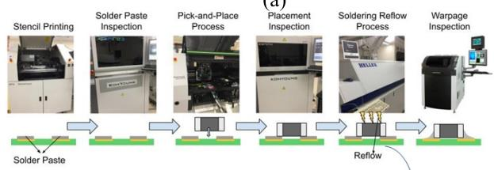
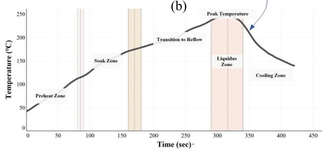
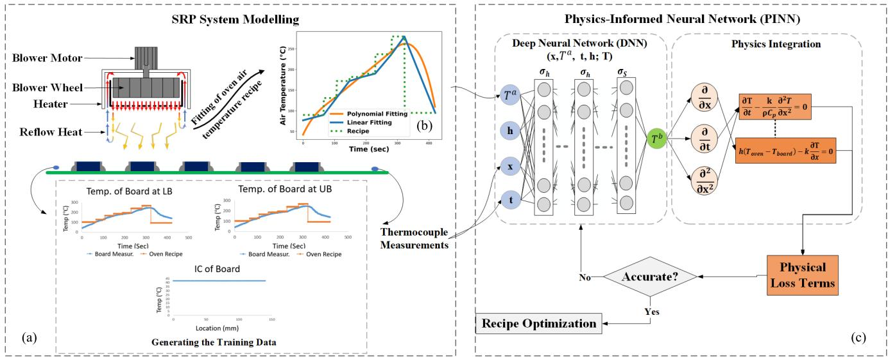
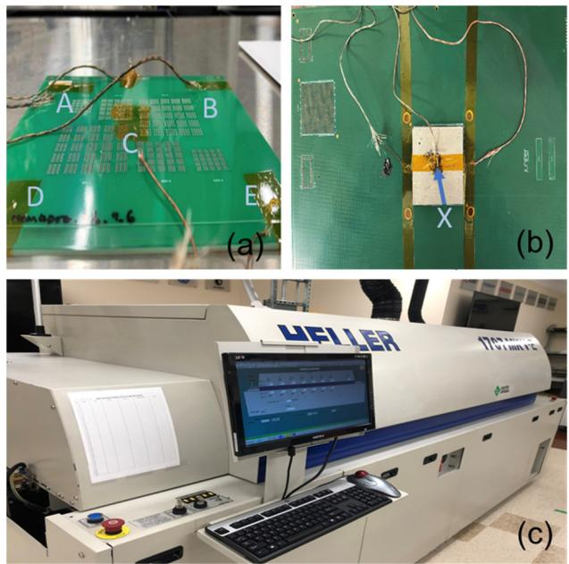
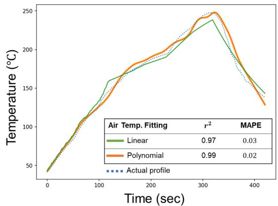
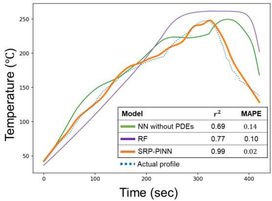
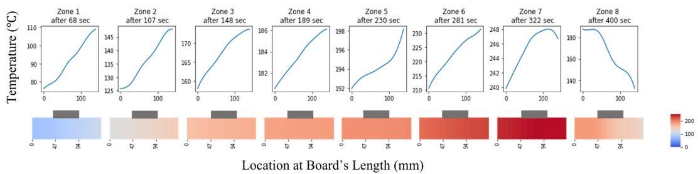
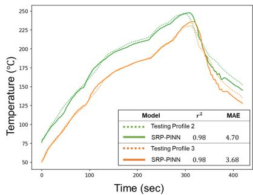

# SRP-PINN: A Physics-Informed Neural Network Model for Simulating Thermal Profile of Soldering Reflow Process

Abdelrahman Farrag , Jun Kataoka, Sang Won Yoon , Daehan Won , and Yu Jin

Abstract— Because of the tendency toward downsizing and the rising complexity of printed circuit board (PCB) design, monitoring and optimizing the soldering reflow process (SRP) has become an important but challenging task for surface mount technology (SMT). To ensure a PCB’s quality, the thermal behavior of the solder joints, which connect the electronic components to the PCB, should be precisely controlled to match the thermal profile specified by the solder joint manufacturer. Previous studies have been mapped the relationship between the process parameters and thermal profile by using physics-based techniques or traditional machine learning (ML) algorithms. However, those approaches require substantial computational costs or large data samples to capture the thermal profile accurately. This article proposes a physics-informed neural network (PINN), which is the first effective physics-based deep-learning framework for modeling the continuous nonlinear thermal behavior of a PCB during the SRP. Specifically, the governing equations of the system—including the general heat transfer and the convection partial differential equations (PDEs)—are solved by optimizing the parameters of a deep neural network (DNN) using a physics-based loss function. The performance of the proposed SRP-PINN is compared with benchmark ML algorithms to demonstrate its effectiveness and efficiency in predicting the thermal profile with limited experimental data for training, resulting in a surrogate model that can simulate the real-time thermal behavior of the board.

Index Terms— Physics-informed neural network (PINN), printed circuit board (PCB), soldering reflow process (SRP), thermal profile prediction.

## I. INTRODUCTION

HE soldering reflow process (SRP) is one of the most Timportant steps in the surface mount technology (SMT) assembly, where the solder paste is melted and then solidified to connect an electronic component to the printed circuit board (PCB). SMT, today, is the main technology used for PCB assembly within electronics packaging. Generally, SMT, as shown in Fig. 1(a), starts after the design phase of PCB, and three processes are involved: solder paste printing, component placement, and reflow soldering. A full 3-D automated optical inspection is carried out after each process to ensure performance and precision.

Because of the disparity in thermal masses between electronic components, inadequate and excessive heating can occur. Insufficient heating can result in a nonreflowed or partially reflowed solder joint with a lumpy or rough surface, reducing the effectiveness of flux’s cleaning action. Overheating can cause solder paste to dry before a solder joint forms and activate the flux too soon [1]. Poor-quality soldering can result in solder joint flaws (e.g., skewing, bridging, voiding, inadequate wetting), as well as reliability problems and nonoperation of electronic components [2]. Additionally, Lau et al. [3] found that an inadequate reflow profile might create significant thermal stress in the ball grid array (BGA) packages and a variety of soldering flaws, waste, and rework. To ensure the PCB’s quality, the thermal behavior of the solder joints should be precisely controlled to match the target thermal profile specified by the solder joint manufacturer based on the composition’s physical properties. Typically, a reflow oven consists of multiple heating zones—their number is dependent on oven capacity—and one cooling zone. In the heating zones, preheating, thermal soaking, and reflow are performed, where each zone has a recommended processing time and ramping rate based on the target thermal profile of the solder paste. In SRP, various factors, such as the reflow oven recipe (i.e., the temperature of seven heating zones) and board design, influence the thermal profile. The manufacturers of solder paste often offer the target thermal profile based on the composition’s physical properties, as shown in Fig. 1(b).

Therefore, monitoring and improving the SRP process has become a crucial but challenging task because of the propensity for downsizing and the increasing complexity of board design. Effective thermal management is crucial in PCB manufacturing to mitigate joint stress from different thermal expansion rates of various materials and components. This is particularly important in high-density and downsized PCBs, which may use novel materials with unique thermal properties. These factors necessitate precise thermal control during soldering to prevent uneven heating and ensure joint integrity, thereby maintaining the overall reliability of the PCB. There is a critical technological challenge that must be addressed to accomplish this goal: How to efficiently and accurately predict and monitor the real thermal performance of the solder joint based on the limited experimental data of new designs. The traditional method compares the observed temperature profile collected by experimental sensors to a target profile. Nonetheless, it is inefficient because the settings (i.e., reflow oven recipe) are set solely by trial and error. Many research developments were carried out to solve this problem by conducting numerical methods, such as computational fluid dynamics (CFDs), to predict the thermal profile. Despite the relentless progress of physics-based methods, modeling nonlinear systems introduce severe challenges, such as multiple sources of uncertainties and computation. In recent years, the development of ML and artificial intelligence allowed opportunities to reduce computational costs by replacing physics-based models with surrogate ML models. However, conventional ML algorithms require large data samples to accurately capture the thermal profile when changing the boundary conditions (BCs) or the PCB structure and design. Most crucially, using conventional methods that include noisy and missing data to solve real-world physical issues is difficult.

(a)  

  
Fig. 1. (a) SMT assembly process flow. (b) Target thermal profile of solder paste SAC305.

Considering the limitations of pure physics-based simulation models and ML methods, recent studies have been focusing on the possibility of combining the ML algorithms and physics-based models. However, current hybrid physics-ML models have limitations because they rely on high-quality data. Experimental measurements may contain noise, which affects the accuracy of the model. Furthermore, these models are restricted to the specific design and geometry of the board, making it difficult to capture changes in the thermal profile when the number, size, and distribution of mounted components are altered, as well as changes in physical parameters.

Therefore, an SRP-physics-informed neural network (PINN) model is proposed in this research. The main objective of this study is to accurately monitor the thermal profile during SRP with limited experimental training data. This model contributes to the SMT industry by accurately simulating the thermal behavior of SRP, offering a better physical interpretability and generalizability across various board designs and different thermal profiles. The proposed approach trains a deep neural network (DNN) with additional information obtained by enforcing the physical laws of SRP. Such physics-informed learning combines the few collected experimental measurements and the governing equations that model the SRP system. PINN offers the advantage of using much less data compared to the other ML algorithms to train the model. Moreover, PINN uses the governing equations of the system as prior knowledge and constraints that improve the interpretability of the DNN and the robustness of the model in the presence of imperfect data and can generate accurate, physically controlled, and consistent predictions.

The rest of this article is organized as follows: Section II demonstrates the recent literature carried out related to thermal profile prediction; Section III introduces the SRP system modeling and PINN architecture and the proposed approach in this research; Section IV shows the details of the experimental settings, the results, and testing analysis; and conclusion and future work are discussed in Section V.

## II. LITERATURE REVIEW

The temperature has been extensively researched as the most important component during SRP. The thermal profile prediction has been conducted using two methods, which are numerical simulation and ML methods.

Generally, numerical simulation software (such as ANSYS) uses physics-based methods, such as finite element analysis (FEA), to solve the governing equations [known as the partial differential equations (PDEs)] of the system of interest at various points for the specified mesh. To simulate the reflow soldering process, CFD models [1], [4] are frequently employed to describe the gas and airflow inside the oven and analyze the flow characteristics aiming at obtaining the thermal profile of the solder joint during the reflow soldering process. These models took various factors into account, such as conveyor speed, temperature settings, and component density. They achieve this by creating a 3-D CAD model of the PCB, its components, and the oven environment. Additionally, CFD models explore how air transfers from different oven stages to the PCB. This involves considering variations in oven design, such as different gas inlet openings, and in some cases, simplifying the model to just a quarter of the geometry to leverage symmetry [5]. Such approaches provided guidelines for the accurate control of temperature distributions within components and PCBs, which is one of the major requirements for achieving high reliability in electronic assemblies.

Despite the accurate results of the numerical methods, a huge computational cost is required due to the complex combination of BCs of the oven and PCB structure and design. These methods use pure theoretical physical laws to simulate the thermal profile of the reflow soldering process. However, they often do not capture the natural variances inherent in actual ovens, which can vary based on environmental conditions. Moreover, these numerical approaches are not fully generalizable and are highly dependent on specific factors, such as the board design, component densities, reflow settings, and oven design. This dependency limits their flexibility and adaptability to different manufacturing scenarios, emphasizing the need for more dynamic and versatile modeling techniques. To reduce the computation cost and capture the natural variances, many studies applied ML models to investigate the reflow soldering process. Therefore, in recent years, the development of ML algorithms and AI allowed the opportunities to develop surrogate ML models to replace the CFD models. However, the data used in training the model were based on experimental measurements and did not include solder joint temperatures. Sufficient experimental measurements are expensive to collect, which means much research uses small samples. In addition, the noncontact prediction model is crucial to the PCB manufacturing process and satisfies Industry 4.0 standards with a high level of automation. A few recent studies have investigated the application of noncontact ML-based [6] to predict the thermal profile of solder pastes at a specific location based on the given reflow oven recipe. Furthermore, the prediction outcomes may be connected to the other machines in the production assembly, such as printers, placing, and inspection machines, to enhance the effectiveness of machine-to-machine communication and support the realization of fully automatic optimization of the PCB assembly line.

The possibility of combining ML algorithms and physics-based simulation models has been demonstrated to leverage the advantages of both sides [7], [8]. Pure ML algorithms require expensive experiments to collect large data samples to accurately capture the thermal profile. To tackle this issue, Lai et al. [5], [9] developed a hybrid physics-ML model to provide the appropriate preset temperatures for the convection reflow oven during the soldering of packages with varying thermal masses. The training data for the ML model were generated from simulations based on the physics model. However, the effectiveness of this hybrid model is constrained by the quality of the collected data, which may include noise in the experimental measurements. Additionally, the model’s applicability is limited to specific board designs and geometries, struggling to accurately capture thermal profiles when there are changes in the number, size, and distribution of mounted components, as well as variations in the board’s physical parameters. To address this, components with the highest thermal masses were further analyzed using CFD, with the results informing an ML algorithm to optimize the reflow process [10]. Despite the accuracy of this approach, it lacks universality for heterogeneously integrated packages. Moreover, the CFD analysis does not fully capture the variance between components with the greatest thermal masses.

Therefore, in this case, a PINN is structured for the thermal profile prediction for improving the SRP. Generally, a PINN seamlessly integrates the information from the measurements and the governing equations by embedding the PDEs into the loss function of a DNN using automatic differentiation. In PINN, instead of solving PDEs using FE methods to generate training datasets, the PDEs of the model are used directly to train ML models [11]. To train PINNs, the loss function is commonly defined as the errors to meet the governing PDEs. The loss function is gradually minimized to train the PINN to satisfy the PDE. That method does not require pre-generated training data, such as FE results, which is a significant gain over earlier methods. Additionally, computation cost will be substantially less than FE models after training with initial conditions (ICs) and BCs as PINN inputs. This research introduces a novel, efficient approach that addresses previous study gaps, offering a solution highly applicable to various manufacturing contexts, especially in Industry 4.0 scenarios. Its adaptability to different board designs and soldering recipes, combined with the computational efficiency of the SRP-PINN model, allows for rapid thermal profile predictions. This capability enables near real-time feedback control in Industry 4.0 environments, ensuring effective temperature management without sacrificing quality or integrity.

## III. METHODOLOGY

In this study, the SRP-PINN model estimates solder paste’s thermal behavior using predicted PCB thermal distribution. The model predicts solder temperature profiles during the SRP for any given oven recipe, based on board dimensions and properties. This involves two key steps: SRP system modeling using governing equations and PINN construction, where these equations are integrated in the loss function of a DNN. The DNN is trained using ICs and BCs, ensuring that the PDEs governing the SRP are satisfied.

## A. System Modeling

The modeling of the SRP is considered a challenging, complex process due to the variety of fluid dynamics concepts, such as modeling the transient temperature change of air inside the oven in terms of forced blown air from above and below, the heat transfer by convection of air to the board, components, and solder paste, and the heat transfer by conduction in the PCB between the board and the other elements, in addition to the internal heat generation reaction by the solder paste during the solidification process. Therefore, in these types of complex systems, 1-D modeling and one electronic component are considered to reduce the computational costs. A schematic graphical representation of the SRP system is shown in Fig. 2(a). After the pick-and-place process, the PCB is conveyed from the entrance to the exit of the reflow oven by passing through seven heating zones and one cooling zone. During the SRP, heated forced air is blown from the top of each heating zone of the oven with different temperatures depending on the required recipe $T ^ { r }$ . The heat will start to transfer between air layers with thermal conductivity of $k ^ { a }$ and specific heat capacity of $C _ { p } ^ { a }$ until it reaches the surface of the board. Afterward, the heat is transferred from the air to the board with a convection coefficient h. In addition, heat conduction occurs within the board with the thermal conductivity of $k ^ { b }$ and specific heat capacity of $C _ { p } ^ { b }$

Consequently, to model the change in temperature of the air inside the oven $T ^ { a }$ , a closed control volume system will be considered—because the air is recirculated and reheated through the heater vents—such that mass, momentum, and energy flow in and out of the system are equal in addition to the work done by air layers in terms of the dynamic viscosity µ (e.g., the dissipation function $\mu \Phi _ { T } )$ , as well as the gravitational forces ${ \vec { F } } .$ Forced-blown air will create a divergence (∇.) in the velocity $\vec { u }$ and pressure $\vec { P }$ fields inside the oven environment based on the given $T ^ { r }$ for each zone. Therefore, the changes are given in the following list.

  
Fig. 2. Overview of the SRP-PINN framework. (a) SRP system modeling. (b) Oven air temperature fitting based on the given recipe. (c) Architecture of the PINN model.

1) Conservation of mass (the continuity equation)

$$
\boldsymbol { \nabla } \cdot \vec { u } = 0 .\tag{1}
$$

2) Conservation of momentum (Navier–Stokes equations)

$$
\rho ^ { a } \bigg ( \frac { \delta \vec { u } } { \delta t } + \big ( \nabla \cdot \vec { u } \big ) \vec { u } \bigg ) = - \nabla \cdot \vec { P } + \vec { F } + \mu \big ( \nabla ^ { 2 } \cdot \vec { u } \big ) .\tag{2}
$$

3) Conservation of energy

$$
\begin{array} { l } { \displaystyle { \rho ^ { a } C _ { p } ^ { a } \bigg ( \frac { \delta T ^ { a } } { \delta t } + \big ( \nabla \cdot \vec { u } \big ) \vec { u } \bigg ) = k ^ { a } \big ( \nabla ^ { 2 } \cdot \vec { T ^ { a } } \big ) } } \\ { \displaystyle { ~ + ~ \big ( \nabla \cdot \vec { P } \big ) \vec { u } + \mu \Phi _ { T } } . } \end{array}\tag{3}
$$

In terms of modeling the change in temperature of the board $T ^ { b }$ (with density $\rho ^ { b } )$ , the conservation of energy (4) is considered, including the heat transfer by conduction and convection, as well as the internal heat generation $\dot { Q }$ for all materials in the system

$$
\begin{array} { r l r } {  { \rho ^ { b } C _ { p } ^ { b } \bigg ( \frac { \delta T ^ { a } } { \delta t } + \big ( \nabla . \vec { u } \big ) \vec { u } \bigg ) = K ^ { b } \big ( \nabla ^ { 2 } . \vec { T ^ { b } } \big ) } } \\ & { } & { + \mathbin { \dot { Q } } - \rho ^ { b } L \bigg ( \frac { \delta f _ { l } } { \delta t } + ( \nabla . f _ { l } ) \vec { u } \bigg ) } \end{array}\tag{4}
$$

where L represents the latent heat of soldering that $f _ { l }$ is applied to differentiate between solid and liquid. Such that $f _ { l } = 0$ when $T _ { b } \ <$ the solidus temperature $T _ { s } ; \ f _ { l } = 1$ when $T _ { b } >$ the liquidus temperature $T _ { l } ;$ and $f _ { l } = ( T _ { b } - T _ { s } / T _ { l } - T _ { s } )$ ) when $T _ { s } \le T _ { b } \le T _ { l }$

Experimentally, the temperature of the solder paste during SRP is measured by attaching the thermocouple to the component, assuming that both the component and the solder paste have the same temperature during SRP. In the case of reflow soldering of passive components, the temperature of the board, passive component, and solder paste are relatively close.

  
Fig. 3. Overview of the experiment setup. (a) Board #1. (b) Board #2. (c) Heller 1707W reflow oven used in the experiments.

The temperature change can be considered in terms of the board’s length, as shown in Fig. 3(b), providing the temperature distribution along the board during SRP, so that temperature can be defined for multiple solders, such that many passive components can be considered. Therefore, the assumptions for the SRP modeling that considers computational efficiency are listed as follows.

1) Fitting the oven air temperature is based on linear and polynomial equations.

2) Which is the moving direction of the board where the major thermal changes were observed based on the preliminary study.

3) Neglecting the effect of $\dot { Q }$ because only one passive component is considered, and the reactive heat is very small for one solder paste compared to the heat transferred by convection and conduction within the board.

TABLE I  
ESTIMATED COEFFICIENTS OF HEAT
<table><tr><td>Zone</td><td>Tr [C]</td><td> $g _ { A }$  [U]</td><td>h  $[ W / m ^ { 2 } / K ]$ </td></tr><tr><td>1</td><td>90</td><td>2662</td><td>53</td></tr><tr><td>2</td><td>131</td><td>1477</td><td>64</td></tr><tr><td>3</td><td>172</td><td>1259</td><td>62</td></tr><tr><td>4</td><td>182</td><td>831</td><td>57</td></tr><tr><td>5</td><td>190</td><td>482</td><td>49</td></tr><tr><td>6</td><td>237</td><td>1641</td><td>51</td></tr><tr><td>7</td><td>280</td><td>672</td><td>52</td></tr><tr><td>8</td><td>95</td><td>5007</td><td>35</td></tr></table>

4) Ignoring the impact of L term since $L ^ { b }$ will vanish for the board as the soldering temperature will never reach the melting temperature of the board.

5) Considering the heat convection only on the upper boundary of the board.

Therefore, the following simplified PDEs of the SRP for the PINN model are:

$$
\frac { \delta T ^ { b } } { \delta t } - \frac { k ^ { b } } { \rho ^ { b } C _ { p } ^ { b } } \frac { \delta ^ { 2 } T ^ { b } } { \delta x ^ { 2 } } = 0\tag{5}
$$

$$
h \big ( T ^ { a } - T ^ { b } \big ) - k ^ { b } \frac { \delta T ^ { b } } { \delta x } = 0 .\tag{6}
$$

From the heat transfer perspective [17], the amount of heat transferred Q from the air to the board per unit of time can be calculated by (10), where the average convection coefficient h for each zone can be dynamically updated based on the integration of the change of temperature to the time for each zone (11), as shown in Table I. The adoption of adaptive estimation will improve the performance of the SRP-PINN significantly, especially in the critical heat zones and the cooling zone. Specifically, $V ^ { b }$ represents the volume of the board, and $q _ { A }$ is the quantity of heat absorbed by the board (with an exposed area of $A ^ { b } )$ for each zone, which is equal to $C _ { p } ^ { b } m ^ { b } ( T _ { 2 } ^ { \mathrm { b } } - T _ { 1 } ^ { b } )$

$$
Q = h A ^ { b } \big ( T ^ { a } - T ^ { b } \big ) = \rho ^ { b } V ^ { b } \rho ^ { b } \frac { \Delta T ^ { b } } { \Delta t }\tag{7}
$$

$$
h = \frac { k ^ { b } q _ { A } } { A ^ { b } \big [ \big ( T _ { 2 } ^ { b } - T _ { 1 } ^ { b } \big ) t _ { z } + T _ { o } ^ { b } \big ] } .\tag{8}
$$

The partial and ordinary differentiation are denoted by δ and $\Delta ,$ respectively. The estimations are validated according to B. Illés [18]. $T _ { 2 } ^ { b }$ and $T _ { 1 } ^ { b }$ are the exit and inlet temperatures of the board at each zone, respectively. $T _ { o } ^ { b }$ is the initial temperature of the board, $m ^ { b }$ represents the mass of the board, and $t _ { z }$ describes the processing time for the board in each zone.

## B. PINN Architecture

In this section, the formulation of the PINN is developed, as shown in Fig. 2(c). Based on the physics phenomenon described above, the proposed SRP-PINN is structured by integrating $\mathrm { s R P s }$ governing (5) and (6) into the DNN. The variables $\ : \mathrm {  ~ x ~ } : = \ : \left( x , t , h , T ^ { a } \right)$ are formulated as the set of independent variables, where are the location, time, convection coefficient, and temperature of the air, respectively, and $\mathbb { y } \ : = \ ( T ^ { b } )$ represents the dependent variable $T ^ { b }$ , which is the temperature of the board. The solution of variable y is approximated using a feed-forward DNN. Based on the PINN framework [11], the solution variable $\mathbb { y }$ is approximated using a feed-forward multilayer neural network

$$
\begin{array} { r } { \mathfrak { y } ( \mathrm { x } ) \approx \mathcal { N } ( \mathrm { x } ; \theta ) \approx \Sigma ^ { n } \ ^ { \circ } \ \Sigma ^ { n - 1 } , \ldots , \ \Sigma ^ { 1 } } \end{array}\tag{9}
$$

where $\mathcal { N }$ is an n-layer neural network with input features $x , t ,$ and $T ^ { a }$ . The set of all network parameters is denoted as $\theta \in \mathbb { R } ^ { \mathbb { D } }$ , where D is the total number of parameters and represents the number of degrees of freedom when analogizing the FE methods. The symbol ◦ is an operation that takes two-layer 6 functions $( \mathbf { e } . \mathbf { g } . , \ \Sigma ^ { n }$ and $\Sigma ^ { n - 1 } )$ producing one function. Each layer n is a function of the inputs of the previous layer $( n - 1 )$ with weight w and bias b parameters. In (10), the nonlinearity is introduced into the DNN using the hyperbolic-tangent activation function $\sigma _ { h }$ for all hidden layers [14]. It is crucial to use an activation function tailored to the governing model PDEs and the physical output quantity to generate a positive nonzero derivative at the output layer. Therefore, a Softplus activation function $\sigma _ { S }$ is applied (11).

PINN optimizes DNN parameters for solving PDEs by tightly integrating physical laws into the learning process. The loss function in PINN can be defined using the predicted output $T ^ { b }$ of the network and their gradients—obtained using the automatic differentiation feature of DNN—based on the PDEs of the model. Therefore, the total loss of the network $\mathcal { L } _ { \mathrm { t o t a l } }$ is calculated (12) as the total sum of the loss term for the PDEs of the model $( \mathcal { L } _ { T } )$ in addition to the loss of the IC $( \mathcal { L } _ { \mathrm { I C } } )$ and BCs $( \mathcal { L } _ { \mathrm { b c 1 } }$ and $\mathcal { L } _ { \mathrm { b c } 2 } )$ for all training data points (m). The IC of the proposed model can be considered as the initial temperature of the board across the location space (x), such that $T ^ { b } ( x ) = T _ { o } ^ { b }$ at t = 0. The BCs of a board of length l are defined as the temperature at $( x = 0 )$ and $( x = l )$ throughout the experiment time (t). Each loss term is evaluated on a set of training data from the model domain denoted as x. The loss terms are generated as mean squared errors of the PDEs, as shown in (13)–(15). During the training phase, the DNN is trained not only on data $\left( { \mathcal { L } } _ { \mathrm { d a t a } } \right)$ but also on the residuals of the PDEs, which represent the physical laws governing the system under study. This means that the DNN parameters are adjusted not only to fit the data but also to satisfy the underlying PDEs. As a result, PINNs can effectively learn both from sparse or noisy data and the intrinsic physics of the problem, leading to more accurate and generalized solutions of PDEs compared to traditional DNNs that rely only on data-driven learning

$$
\mathbb { z } ^ { n - 1 } = \sigma _ { h } \left( \mathbb { w } ^ { n - 1 } \cdot \mathbb { z } ^ { n - 2 } + \mathbb { b } ^ { n - 1 } \right)\tag{10}
$$

$$
\mathbb { Z } ^ { n } = \sigma _ { S } \left( \mathbb { w } ^ { n } \cdot \mathbb { z } ^ { n - 1 } + \mathfrak { b } ^ { n } \right)\tag{11}
$$

$$
\mathcal { L } _ { \mathrm { t o t a l } } = \mathcal { L } _ { \mathrm { d a t a } } + \mathcal { L } _ { T } + \mathcal { L } _ { \mathrm { I C } } + \mathcal { L } _ { \mathrm { b c } 1 } + \mathcal { L } _ { \mathrm { b c } 2 }\tag{12}
$$

$$
\mathcal { L } _ { T } = \frac { 1 } { m } \sum _ { i = 0 } ^ { m } \left( \left. \frac { \delta T ^ { b } } { \delta t _ { i } } \right| _ { x _ { i } } - \left. \frac { k ^ { b } } { \rho ^ { b } C _ { p } ^ { b } } \frac { \delta ^ { 2 } T ^ { b } } { \delta x _ { i } ^ { 2 } } \right| _ { x _ { i } } \right) ^ { 2 }\tag{13}
$$

$$
\mathcal { L } _ { \mathrm { I C } } = \frac { 1 } { m } \sum _ { i = 0 } ^ { m } (  T ^ { b } | _ { t = 0 } -  T _ { o } ^ { b } ( x _ { i } ) ) ^ { 2 }\tag{14}
$$

$$
\mathcal { L } _ { b c _ { 1 , 2 } } = \frac { 1 } { m } \sum _ { i = 0 } ^ { m } \bigg ( h T ^ { b } \big | _ { x = 0 , l } - k ^ { b } \frac { \delta T ^ { b } } { \delta x _ { i } } \bigg | _ { x = 0 , l } \bigg ) ^ { 2 } .\tag{15}
$$

## IV. RESULTS

## A. Experimental Setting and Data Collection

The experiments are carried out on a Heller 1707W reflow oven, as shown in Fig. 3(c). The PCB assembly is conveyed from the entrance section to the exit section by passing through seven heating zones and one cooling zone. Thermocouples are attached to the board during the SRP to measure the temperature at the desired location. According to [15], the K-type thermocouple is a reliable and effective method to measure both the temperature of the board and the solder paste. In this study, temperature data were collected using the SUPER M.O.L.E with the K-type thermocouple attached to the testing objects. The accuracy of the testing $\mathrm { i } \mathrm { s } \pm 1 ~ { } ^ { \circ } \mathrm { C }$ , with a resolution of $0 . 0 5 6 \ ^ { \circ } \mathrm { C } .$ . It is essential to define the solder paste’s type because the target profile is based on its physical properties, particularly its specific heat capacity. Lead-free solder paste is a popular option in the industry because of its reduced environmental and health impacts [16]. Because lead-free solder paste has a higher melting point than the leaded solder, the recipe and thermal profile are different. In this experiment, SAC305 was used due to its high yield strength [16]. The ITW MPM 100 printer was used to apply the solder paste to the board, while the universal fusion machine was used to place the components during the experiment. To show the effectiveness of the proposed SRP-PINN in predicting the thermal profile using limited data, two board designs are considered. Unlike previous studies that utilized variou recipes and collected temperature measurements every second throughout the entire 420-s reflow oven cycle, this study employs only one recipe for training the PINN. Data are collected every 2 s, resulting in a total of 210 measurements. Although PINNs can be trained without any empirical data, some nonlinear systems, like the SRP, may require a smal amount of data to properly tune the NN weights for specific tasks. This approach increases the risk of overfitting and underfitting; however, these risks are typically mitigated when the physical principles are comprehensively modeled within the loss function. The two boards have different designs in terms of the number of components mounted on the board and their sizes, such that in board #1, as shown in Fig. 3(a), three types of passive components are mounted: 0402, 0603, and 1005 M, totaling 1500 components, whereas, in board #2, as shown in Fig. 3(b), a BGA component is mounted. The two boards have relatively close physical properties, as shown in Table II.

The training data consist of 210 temperature measurements in total, which are collected at five locations of board #1. Locations A, B, D, and E represent the boundaries of the training board, while location C is the center of the board. As 1-D heat transfer is considered along the direction of the board’s length, only measurements at locations A, D, and C are considered in the training procedure. The SRP-PINN performance evaluation is based on two scenarios: testing based on different board designs (board #2) using a different recipe (Testing recipe #1) and testing based on multiple recipes (Testing recipes #2 and #3) considering the same board design (board #1). The testing data with 210 measurements (one experiment) are collected at location C of board #1 for the first scenario and another 210 measurements (two experiments in total) at X of board #2 based on the component’s location, as shown in Fig. 3(b). The objective of designing such an experiment is to show whether the proposed SRP-PINN can be sufficiently trained with limited training data to estimate the thermal profile of solder paste attached to any position on the board under a different recipe that is not included in the training data. The experiment is intended to demonstrate that the SRP-PINN can accurately capture the heat transferred from the reflow oven to the board during the SRP.

TABLE II  
PHYSICAL PROPERTIES OF THE BOARDS
<table><tr><td>Parameter</td><td>Board #1</td><td>Board #2</td></tr><tr><td>Thermal conductivity  $k \ [ W / m / K ]$ </td><td>0.5</td><td>0.42</td></tr><tr><td>Specific heat capacity  $C _ { p } \ [ J / k g / K ]$ </td><td>600</td><td>730</td></tr><tr><td>Density  $\rho \ [ k g / m ^ { 3 } ]$ </td><td>1900</td><td>1859</td></tr><tr><td>Dimensions l  $\times \textbf { \em w } \times \textbf { \em s } [ m ^ { 3 } ]$ </td><td></td><td> $0 . 1 4 \times 0 . 1 \times 0 . 0 0 1 6$ </td></tr></table>

  
Fig. 4. Comparison of the thermal profile prediction between the polynomial and linear fitting of oven air temperature.

  
Fig. 5. Comparison of the thermal profile prediction between the SRP-PINN, RF, and DNN models.

## B. Thermal Profile Prediction

The input of the proposed model includes the location, time, and the estimated oven air temperature using linear or polynomial fitting of the oven recipe. The output refers to the temperature profile of the testing board at any location throughout the experiment time. The proposed SRP-PINN is structured with ten layers, each of which includes ten neurons after several trials of preliminary analysis. The best performance can be achieved at a learning rate of $1 0 ^ { - 4 }$ (821 parameters in total in the network) after 500 epochs. The average log loss is reduced from 0.1 to $1 0 ^ { - 1 2 }$ in terms of the PDEs of the general heat transfer and the boundary heat convection. It is worth mentioning that the physical phenomena of oven air modeling are not integrated into the proposed SRP-PINN considering the computational efficiency. As illustrated in Section III-A, the oven air temperature can be estimated based on the linear or polynomial fitting of the oven recipe. Fig. 4 shows the thermal profile prediction results of testing board #2 under testing recipe #1 using different oven air temperature fitting methods. It is indicated that the thermal profile prediction by applying the polynomial fitting of oven air temperature can provide satisfying accuracy.

  
Fig. 6. Predicted thermal distribution of PCB along the direction of board length (140 mm) at a specific time in each oven zone.

1) Considering Different Board Designs: To further demonstrate the capability of the proposed SRP-PINN model, the SRP-PINN based on the polynomial air temperature fitting is compared with two conventional ML methods, random forest (RF), and a DNN without PDEs. The reason for choosing RF and DNN as benchmark methods is that they achieved better prediction accuracy than other ML methods in the preliminary study. Fig. 5 shows that the DNN and RF cannot learn from the limited experimental data sufficiently, especially in modeling the thermal behavior in the critical heating zones (zones 6 and 7) and cooling zone 8. In contrast, the proposed SRP-PINN maintained a satisfactory prediction accuracy throughout the SRP process. Moreover, the thermal distribution of the PCB can be obtained from the SRP-PINN prediction. Fig. 6 presents the thermal distribution of PCB along its moving temperatures predicted are bounded within a reasonable range without large variations that might be observed when using the RF and DNN. Therefore, the thermal profile of solder paste attached to the electronic components at any location on the board can be estimated by referring to the predicted PCB thermal distribution. In addition, the proposed SRP-PINN shows its advantage over using the FE methods in solving the convection heat transfer BCs since any change in the BCs, heat transfer coefficients, or board design will require a new FE to be performed. The SRP-PINN, however, can be well-trained with a small set of data to accommodate those changes.

2) Considering Different Oven Recipes: Two additional recipes, testing recipes #2 and #3 shown in Table III, are tested to demonstrate the effectiveness of the SRP-PINN model, which is trained only using one recipe but is still able to achieve satisfying prediction accuracy when giving a different oven recipe. As shown in Figs. 5 and 7, the SRP-PINN model did not accurately simulate the cooling zone for all three recipes, leading to the larger gaps observed in thermal profile prediction during the cooling. This is due to the oven air temperature fitting and results from the insufficient experiment measurements to capture the cooling rate of the system because the cooling zone acquires one-fourth (100 s) of the reflow soldering process to decrease the temperature of the board from approximately $2 7 0 ~ ^ { \circ } \mathrm { C }$ to $9 5 ~ ^ { \circ } \mathrm { C }$

TABLE III  
TRAINING AND TESTING RECIPES $\left( \mathrm { I N } \ ^ { \circ } \mathrm { C } \right)$
<table><tr><td>Zone</td><td>1</td><td>2</td><td>3</td><td>4</td><td>5</td><td>6</td><td>7</td><td>8</td></tr><tr><td>Training</td><td>90</td><td>131</td><td>172</td><td>182</td><td>190</td><td>237</td><td>280</td><td>95</td></tr><tr><td>Testing 1</td><td>103</td><td>130</td><td>168</td><td>188</td><td>198</td><td>242</td><td>270</td><td>95</td></tr><tr><td>Testing 2</td><td>95</td><td>131</td><td>175</td><td>185</td><td>195</td><td>220</td><td>260</td><td>150</td></tr><tr><td>Testing 3</td><td>90</td><td>120</td><td>152</td><td>160</td><td>170</td><td>195</td><td>217</td><td>125</td></tr></table>

  
Fig. 7. Evaluating the SRP-PINN model under different testing recipes using the same PCB design.

Moreover, the prediction results of the SRP-PINN model under different testing recipes using the same PCB design showed a better accuracy than the scenario with different board designs in terms of $r ^ { 2 }$ and the mean absolute error (MAE) values. This may result from the fact that the model does not consider the mechanical properties of the board material as an input and the component sizes may affect the heat transfer. In the experiment, the presence of the BGA, which is larger than a passive component, may have hindered the heat transfer from air to the board especially when the thermocouple probe is attached beside the BGA. Therefore, it prevented the SRP-PINN from capturing the board’s temperature perfectly. Compared to the hybrid model developed by Li et al. [6], which demonstrated an accuracy of 97%, the SRP-PINN model showed a closely comparable performance with an accuracy of 98%. However, SRP-PINN demonstrated consistent performance across different designs, highlighting its generalizability with limited training data.

## V. CONCLUSION AND DISCUSSION

In this study, an SRP-PINN is developed for modeling the heat transfer during the SRP and predicting the thermal profile at any location on the board to estimate the thermal behavior of solder paste. The proposed SRP-PINN model tackles the solution of the general heat transfer and convection PDEs, which govern the distribution and change of temperature from the oven air to the board, considering different board designs. The results show the capability of the SRP-PINN model to accurately predict the thermal profile of different board designs based on limited experimental data. Moreover, it does not depend on the domain discretization generally performed in physics-based models. The uniqueness of the proposed method in modeling the SRP provides the possible implementation for surrogate modeling for SRP as well as real-time monitoring and parameters optimization considering other process constraints. As a practical application, integrating the SRP-PINN model into reflow ovens can significantly streamline the temperature optimization process in PCB soldering. This model allows 1-D SRP model will be extended to two or three dimensions to incorporate denser or varied board thicknesses into the physical modeling. This development allows the model to include the components’ locations and densities, which will dynamically optimize temperature settings in real time for new boards. These boards may feature a varying number of components, each with different thermal masses, thus demanding a more adaptable modeling approach. It is worth noting that implementing further extensions will increase the training time, simultaneously pushing the computation cost to a significant upsurge. Therefore, a tradeoff will be made considering the prediction accuracy improvement and the increase in computation cost.

## REFERENCES

[1] C. Lau, M. Z. Abdullah, and F. Che Ani, “Computational fluid dynamic and thermal analysis for BGA assembly during forced convection reflow soldering process,” Soldering Surf. Mount Technol., vol. 24, no. 2, pp. 77–91, Apr. 2012, doi: 10.1108/09540911211214659.

[2] T.-N. Tsai, “Thermal parameters optimization of a reflow soldering profile in printed circuit board assembly: A comparative study,” Appl. Soft Comput., vol. 12, no. 8, pp. 2601–2613, Aug. 2012, doi: 10.1016/j.asoc.2012.03.066.

[3] C. Lau, M. Z. Abdullah, and C. Y. Khor, “Optimization of the reflow soldering process with multiple quality characteristics in ball grid array packaging by using the grey-based Taguchi method,” Microelectron. Int., vol. 30, no. 3, pp. 151–168, Jul. 2013, doi: 10.1108/mi-09-2012-0067.

[4] S. Shao et al., “Comprehensive study on 2.5D package design for board-level reliability in thermal cycling and power cycling,” in Proc. IEEE 68th Electron. Compon. Technol. Conf. (ECTC), May 2018, pp. 1668–1675, doi: 10.1109/ECTC.2018.00251.

[5] Y. Lai et al., “An intelligent system for reflow oven temperature settings based on hybrid physics-machine learning model,” Soldering Surf. Mount Technol., vol. 34, no. 5, pp. 266–276, Feb. 2022, doi: 10.1108/ssmt-10-2021-0063.

[6] Y. Li, J. He, D. Won, and S. W. Yoon, “Noncontact reflow oven thermal profile prediction based on artificial neural network,” IEEE Trans. Compon., Packag., Manuf. Technol., vol. 11, no. 12, pp. 2229–2237, Dec. 2021, doi: 10.1109/TCPMT.2021.3120310.

[7] J. He, Y. Cen, Y. Li, S. Park, and D. Won, “The dissimilar self-alignment characteristics of smaller passive components in the length and width directions,” J. Surf. Mount Technol., vol. 34, no. 2, pp. 7–15, Jul. 2021, doi: 10.37665/smt.v34i2.16.

[8] L. von Rueden, S. Mayer, R. Sifa, C. Bauckhage, and J. Garcke, “Combining machine learning and simulation to a hybrid modelling approach: Current and future directions,” in Advances in Intelligent Data Analysis XVIII (Lecture Notes in Computer Science). Cham, Switzerland: Springer, 2020, pp. 548–560, doi: 10.1007/978-3-030-44584-3\_43.

[9] Y. Lai, K. Pan, C. Cai, P. Yin, J. Yang, and S. Park, “Smarter temperature setup for reflow oven to minimize temperature variation among components,” IEEE Trans. Compon., Packag., Manuf. Technol., vol. 12, no. 3, pp. 562–569, Mar. 2022, doi: 10.1109/TCPMT.2022.3153952.

[10] Y. Lai, J. H. Ha, K. A. Deo, J. Yang, P. Yin, and S. Park, “Reflow recipe establishment based on CFD-informed machine learning model,” IEEE Trans. Compon., Packag., Manuf. Technol., vol. 13, no. 1, pp. 127–134, Jan. 2023, doi: 10.1109/TCPMT.2023.3239304.

[11] M. Raissi, P. Perdikaris, and G. E. Karniadakis, “Physics-informed neural networks: A deep learning framework for solving forward and inverse problems involving nonlinear partial differential equations,” J. Comput. Phys., vol. 378, pp. 686–707, Feb. 2019, doi: 10.1016/j.jcp.2018.10.045.

[12] F. P. Incropera, D. DeWitt, and T. L. Bergman, Fundamentals of Mass and Heat Transfer, 6th ed. Hoboken, NJ, USA: Wiley, 2006.

[13] B. Illés, “Distribution of the heat transfer coefficient in convection reflow oven,” Appl. Thermal Eng., vol. 30, no. 13, pp. 1523–1530, Sep. 2010, doi: 10.1016/j.applthermaleng.2010.02.016.

[14] P. Sibi, S. A. Jones, and P. Siddarth, “Analysis of different activation functions using back propagation neural networks,” J. Theor. Appl. Inf. Technol., vol. 47, no. 3, pp. 1264–1268, 2013.

[15] S. Wiese et al., “Temperature evaluation of solder joints for adjusting reflow profiles,” in Proc. 22nd Eur. Microelectron. Packag. Conf. Exhib. (EMPC), Sep. 2019, pp. 1–7, doi: 10.23919/EMPC44848.2019.8951800.

[16] M. Al Ahsan, S. M. Kamrul Hasan, A. Fahim, J. C. Suhling, and P. Lall, “Effect of different thermal cycling profiles on the mechanical behavior of SAC305 lead free solder,” in Proc. 19th IEEE Intersoc. Conf. Thermal Thermomech. Phenomena Electron. Syst. (ITherm), Jul. 2020, pp. 1170–1179, doi: 10.1109/ITherm45881.2020.9190169.

[17] S. Middleman, An Introduction to Mass and Heat Transfer: Principles of Analysis and Design. Hoboken, NJ, USA: Wiley, 1997.

[18] F. P. Incropera et al., Fundamentals of Heat and Mass Transfer, vol. 6. New York, NY, USA: Wiley, 1996.

Abdelrahman Farrag received the master’s degree from the Department of Mechanical Design and Production, Faculty of Engineering, Assiut University, Asyut, Egypt, in 2019. He is currently pursuing the Ph.D. degree with the Department of Systems Science and Industrial Engineering, Binghamton University, Binghamton, NY, USA.

His research interests include large-scale data predictive modeling, data analytics in healthcare and manufacturing, modeling and simulation, dynamic system optimization, and machine learning-based advanced process control.

Jun Kataoka is currently pursuing the Ph.D. degree with the Department of Systems Science and Industrial Engineering, Binghamton University, Binghamton, NY, USA.

His research interests include theory and application of transfer learning and domain adaptation, physics-guided machine learning, healthcare data analytics, and large-scale predictive modeling.

Sang Won Yoon received the Ph.D. degree from the School of Industrial Engineering, Purdue University, West Lafayette, IN, USA, in 2009.

He is currently a Professor with the Department of Systems Science and Industrial Engineering, Binghamton University, Binghamton, NY, USA. He directs the Complex Systems Design and Analysis Laboratory and is a Faculty Member with the Watson Institute for Systems Excellence, Binghamton. He has published over 150 internationally renowned journals and conference proceedings.

Daehan Won received the Ph.D. degree from the College of Engineering, University of Washington, Seattle, WA, USA, in 2014.

He is currently an Assistant Professor with the Department of Systems Science and Industrial Engineering, Binghamton University, Binghamton, NY, USA. His research interests include large-scale mathematical programming, data analytics/mining in healthcare, and designing smart manufacturing systems to advance Industry 4.0.

Yu (Chelsea) Jin received the Ph.D. degree in industrial engineering from the University of Arkansas, Fayetteville, AR, USA, in May 2020.

She is currently an Assistant Professor with the Department of Systems Science and Industrial Engineering, Binghamton University, Binghamton, NY, USA. Her research focuses on sensing and analytics, optimization, and simulation for advanced manufacturing and service applications. Her research has been sponsored by the Transdisciplinary Area of Excellence Seed Grant, Integrated Electronics Engineering Center Technical Advisory Board, and Watson Institute for Systems Excellence.