PAPER

# A prototype for infrared soldering of electronic devices using the active disturbance rejection control structure

To cite this article: R Citlalli Anguiano Cota et al 2025 Eng. Res. Express 7 045392

View the article online for updates and enhancements.

You may also like

Modeling, Identification, and Control of-Rapid Thermal Processing Systems Charles D. Schaper, Mehrdad M. Moslehi, Krishna C. Saraswat et al.

The simulation of Active Disturbance-Rejection Control for the temperature control in space environment Juan Ning, Jing-yi Shao, Ying Zhou et al.

Research on active disturbance rejectioncontrol of the main steam temperature of supercritical thermal power unit based on improved particle swarm optimization Xiaoguang Hao, Fei Jin, Bin Wang et al.

# Engineering Research Express

aaaaaaaaaaaa

PAPER

RECEIVED 15 July 2025

# A prototype for infrared soldering of electronic devices using the active disturbance rejection control structure

REVISED 18 November 2025

R Citlalli Anguiano Cotaaa, David I Rosas Almeida∗ aa and J Rigoberto Herrera Garcíaa

26 November 2025

PUBLISHED

Facultad de Ingeniería, Universidad Autónoma de Baja California, Blvd. Benito Juárez SN, Mexicali, B.C., Mexico ∗ Author to whom any correspondence should be addressed.

5 December 2025

E-mail: drosas@uabc.edu.mx

Keywords: temperature control, infrared light, robustness, tracking, delayed systems

## Abstract

The Active Disturbance Rejection Control (ADRC) framework offers a practical approach for stabilization, regulation, and tracking tasks in dynamic systems without relying on an exact mathematical model, making it a promising alternative to conventional PID control in industrial applications. This paper investigates the implementation ofan ADRC strategy to address the temperature-tracking problem in an infrared-based thermal system for electronic soldering. One of the main challenges of this system is the input delay introduced by the heating process. By analyzing this delay through a first-order Padé approximation, it is shown that its effect can be treated as an external disturbance, which the ADRC effectively estimates and compensates for in real time. The closed-loop performance was evaluated numerically and experimentally and compared with that ofa standard PID controller. Results show that ADRC achieved a 12% improvement in the control efficiency index (ITAE ), demonstrating a better trade-offbetween tracking accuracy and control energy. Furthermore, the proposed control approach improves precision and reliability in industrial soldering processes, potentially reducing energy consumption and electronic waste.

## 1. Introduction

Electronic circuit boards consist ofvarious electronic components that, according to their mounting technology, can be classified as Through-Hole Technology (THT) and Surface-Mount Technology (SMT). The soldering process of these components onto a printed circuit board is crucial for an electronic product to function adequately. Three essential elements are required to achieve a reliable solder joint: flux, to clean the joint surfaces so that the solder can adhere; solder, to fill the joint; and heat, to melt the solder to the joint surfaces and to create a solid connection. In electronic device soldering, it is essential to understand the solder’s properties and the thermal process requirements for each electronic component to prevent damage due to excessive temperature. A solder joint must solidify without forming defects that could compromise its integrity [1]. Consequently, an important factor in the soldering process of components is tracking the temperature profile with precision. This profile defines the relationship between temperature and time during the heating process. There are two basic temperature profile types: the Ramp-Soak-Spike (RSS) profile, the most commonly used one, and the linear ramp profile. While the RSS profile consists of distinct heating, soaking, and spiking stages allowing controlled thermal transitions, the linear ramp profile increases the temperature at a constant rate without holding periods. The component’s temperature profile must be verified according to the specifications provided by the device manufacturer to ensure that the temperature limit is not exceeded. Failure to follow the temperature profile specified by manufacturers results in various soldering-related issues. The most common problems include poor solder joints, solder bridges, excess solder, damaged solder balls, cold solder joints, overheated joints, component tomb-stoning, insufficient melting, solder skips, lifted pads, insufficient solder, and solder splatter [2, 3].

Modern electronics manufacturing increasingly relies on compact, automated, and energy-efficient surface-mount technology (SMT) systems, in which reflow soldering remains the standard method for bonding SMD components. In this context, infrared (IR) radiation and forced convection represent the two dominant heat transfer mechanisms. Among IR-based approaches, near-infrared (NIR) radiation systems have gained relevance for applications requiring localized and selective heating, especially on thermally sensitive or low-cost substrates such as PET. [4] presents an innovative approach that uses NIR LEDs to achieve selective and localized heating from the underside ofthe assembly, enabling reliable solder joints without damaging the substrate. The results demonstrate mechanical performance comparable to that ofconvection-soldered joints, with the added benefit ofreduced energy input. Another notable application ofnear-infrared (NIR) radiation to achieve focused and localized heating is presented in [5], where a QTH lamp (Quartz Tungsten Halogen) combined with an optical arrangement is used to direct infrared radiation onto a specific component. This setup enables efficient energy delivery over a well-defined and delimited area. However, certain limitations remain in both this and similar systems, most notably the lack ofa closed-loop control scheme capable of tracking a predefined temperature profile. Consequently, common issues such as thermal non-uniformity and solder beading may still arise. Despite these limitations, the referenced work represents a meaningful advancement toward the development ofmore energy-efficient and precise interconnection processes for surface mount technology (SMT) electronic devices.

In broader industrial contexts, IR-based furnaces provide rapid, contactless heating with high energy efficiency; however, their performance is highly sensitive to the emissivity and geometry of the materials involved. On ceramic substrates, infrared (IR) heating can produce significant thermal gradients that may impact assembly reliability. Therefore, a hybrid method is used that combines conduction heating on the underside ofthe substrate with IR radiation on the top surface to reduce thermal gradients. Additionally, masks, metal screens, or other heat-dissipating elements are employed to protect surrounding components and minimize thermal damage. Forced convection provides highly uniform heating with minimal temperature gradients and precise digital control ofairflow and temperature, which makes it the preferred method for multi-zone industrial processes and rework applications. Modern hybrid IR-convection systems combine the rapid heating capability of IR radiation with the uniformity offorced convection, enabling reliable lead-free soldering and precise loca lized thermal repairs [6].

Thermal control during reflow soldering depends on both material characterization and temperature uniformity throughout the process. Studies on PBGA packaging reveal that excessive warpage occurs when the over-pack material exceeds its glass transition temperature $( { \sim } 1 7 0 ^ { \circ } \mathrm { C } )$ , resulting in open connections or short circuits [7]. Similar problems are observed in IR-based ovens, where variations in surface emissivity and shading effects generate gradients of up to $1 0 ^ { \circ } \mathrm { C }$ along the substrate [8]. The emissivity of SMD packages varies with material and surface finish, influencing radiative heat absorption and thermal distribution during reflow. Therefore, considering emissivity is important to achieve uniform heating and reliable solder joints.

Advances in thermal modeling and intelligent control have further improved the accuracy and efficiency of reflow processes. [9] developed a three-dimensional transient thermal model that integrates conduction, convection, and radiation heat transfer, achieving a reliable agreement between empirical measurements and finite element/finite difference method (FEM/FDM) simulations. [10] developed a thermal simulation method for reflow soldering that predicts the temperature distributions on substrates, achieving a maximum error within $\pm 3 ^ { \circ } \mathrm { C }$ compared to experimental measurements. In a related development, [11] implemented a real-time temperature monitoring and control system using a machine learning method with a multiple-input singleoutput strategy, capable of maintaining temperature deviations within $\pm 2 ^ { \circ } \mathsf C$ through a fuzzy logic algorithm. These developments underscore the importance ofthermal analysis and real-time temperature control, enabling more efficient and repeatable reflow soldering processes.

This article presents the application of the ADRC control structure for tracking the heating process in soldering profiles ofelectronic devices using infrared light and an optical array. The trajectory tracking problem in this type of thermal system presents several challenges, such as the lack of a precise plant model, time delays, and unmodeled dynamics. The control ofdynamical systems with transport delays has been a research area for many decades [12, 13]. Two of the main approaches are the Smith predictor (and its modifications) [14, 15], and the Padé approximation (also and its improved versions) [16, 17]. These approaches have been mixed with several control algorithms to solve some control objectives in particular families ofsystems with transport delays, for example, PID controllers [18], fuzzy algorithms [19], sliding mode control [20], internal model control [21], and the active disturbance rejection control structure (ADRC) [22, 23]. The ADRC control structure is an attractive option because it does not depend on the knowledge of a precise mathematical model. It can estimate the disturbances present in the plant and compensate for them through the control, obtaining a robust closed-loop system.

As mentioned earlier, many control techniques have been proposed to address the regulation and tracking problems in systems with delays. However, this study proposes using a simplified model that avoids polynomial approximations of the delay. Based on the analysis of the dynamic system resulting from the first-order Padé approximation of the delay, we hypothesize that the effect of an input delay in a system can be considered a bounded external disturbance. Then, using the ADRC control structure, this disturbance can be estimated and compensated, leading to improved closed-loop system performance. Numerical and experimental results validate this hypothesis, demonstrating that the ADRC controller outperforms the widely used PID controller in industrial processes with time delays.

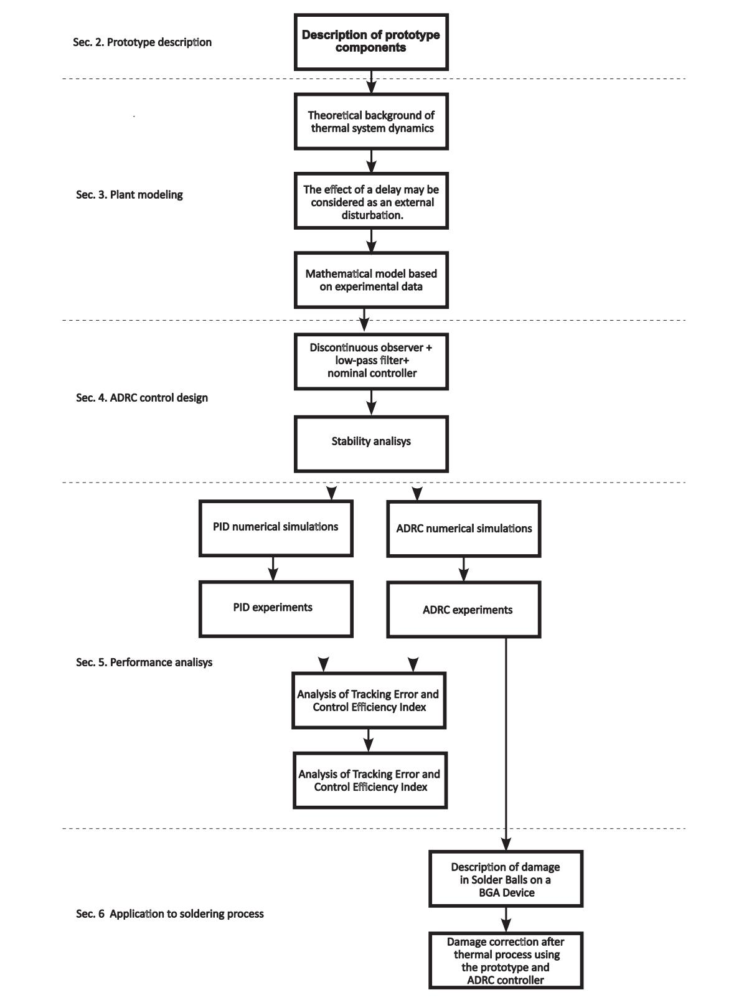  
Figure 1. Schematic representation ofthe paper organization.

A schematic representation of the paper organization is shown in figure 1 and is described as follows. Section 2, Prototype Description, introduces the developed prototype, which comprises an optical array consisting of a lamp, lenses, and a temperature control system. Section 3 presents the modeling and parameter

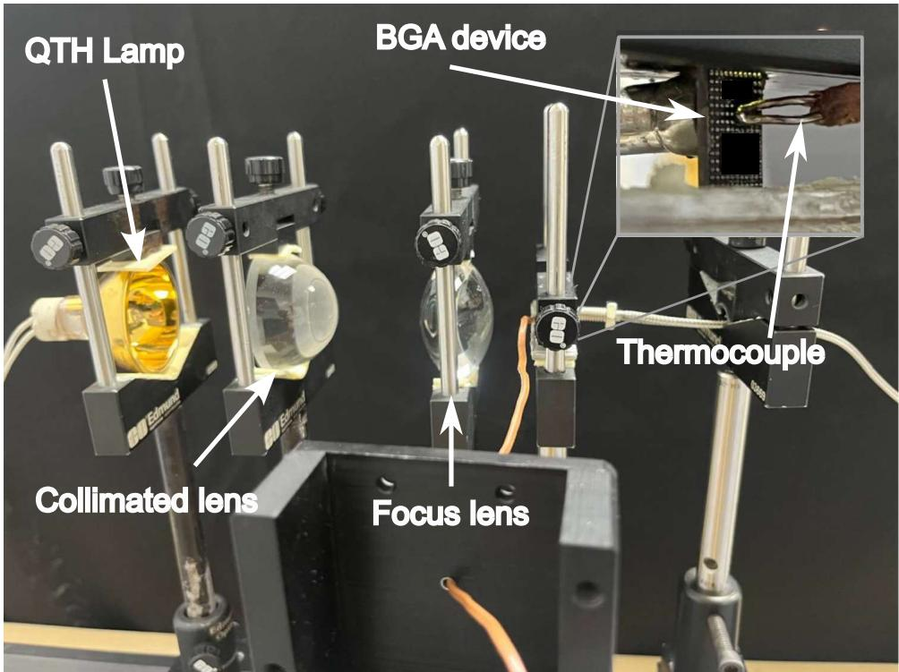  
Figure 2. Optical setup for heating process.

identification ofthe thermal system, derived from experimental data and supported by theoretical justification. This section also discusses how the input delay can be interpreted as an external disturbance affecting the system dynamics. Section 4 describes the design and implementation ofthe ADRC control strategy, including the formulation ofan extended state observer for disturbance estimation and the corresponding stability analysis. Section 5 provides the performance analysis ofthe closed-loop system, supported by numerical simulations and experimental validation. Section 6 evaluates the system’s effectiveness in the soldering process. Finally, section 7 summarizes the main conclusions and contributions ofthis work.

## 2. Prototype description

This section presents the experimental setup, the prototype shown in figure 2, for controlling the heating process for soldering electronic devices. The first element is a Quartz Tungsten Halogen (QTH) incandescent lamp integrated with an elliptical gold-coated reflector. The reflector emits a broad spectrum ofradiation, ranging from ultraviolet (UV) to infrared (IR) wavelengths, with particular emphasis on the IR region for this study. Due to its geometric properties, the elliptical reflector efficiently directs the emitted radiation toward its secondary focal point, concentrating the energy for enhanced thermal performance.

The lamp consumes 150 watts of electrical power, supplied at 15 V and 10 A. By adjusting the electrical power input, the optical power output can be modulated accordingly. This controlled variation enables precise temperature regulation at the lamp’s focal point, reaching up to 1200 C. This capability makes the system particularly suitable for applications requiring high-temperature precision and tunability, such as electronic soldering processes.

An optical system is incorporated to refine and control the emitted beam further. First, a collimating lens positioned beyond the reflector’s focal point captures and collimates the radiation. Then, a focusing lens placed downstream adjusts the diameter of the IR beam, ensuring precise energy delivery to the target component that requires thermal exposure. This configuration optimizes infrared radiation transfer, enhancing the accuracy and reproducibility of the heating process.

The heating target in this prototype is a Ball Grid Array (BGA) device, a type ofsurface mount technology (SMT) component characterized by an array ofsolder balls located exclusively on one side. The BGA device measures 5 mm × 6 mm and features a structured solder ball arrangement. Some solder balls in this device present damaged defects, which are one of the problems that must be solved in the electronics soldering industry.

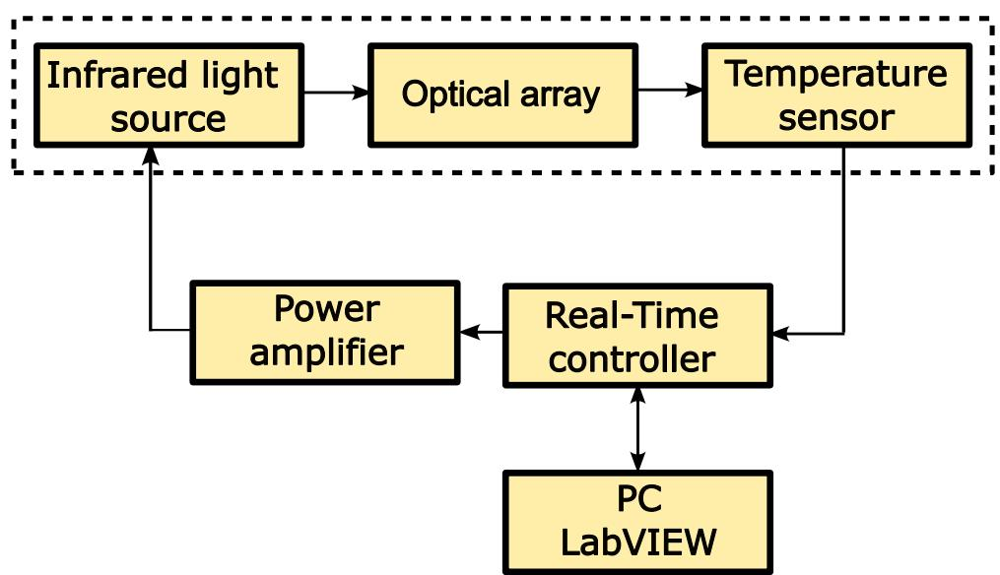  
Figure 3. Block diagram of the temperature control system for infrared heating processes.

Table 1. List of the main components, and their characteristics, used in the prototype.
<table><tr><td>Component</td><td>Model/Type</td><td>Main parameters</td></tr><tr><td>Halogen lamp</td><td>64635 HLX, MR16</td><td>150 W, 15 V, quartz halogen gold reflector lamp.</td></tr><tr><td>Collimating lens</td><td>Aspheric lens (SiO₂)</td><td>Focal length = 40 mm, diameter = 50 mm, uncoated surface. Transmission &gt; 90% in 400–2500 nm range.</td></tr><tr><td>Field lens</td><td>Biconvex lens (SiO₂)</td><td>Focal length = 50 mm, diameter = 50 mm, uncoated surface. Transmission &gt; 90% in 400–2500 nm range.</td></tr><tr><td>Electronic Component</td><td>BGA package</td><td>6 × 5 mm PCB-mounted device, lead-free solder joints; reflow profile temper- ature range: 150–245 °C.</td></tr><tr><td>Control platform</td><td>NI cRIO-9074</td><td>Real-Time controller from Natinal Instruments, 8 slots, CPU 400 MHz, 128 MB DRAM.</td></tr><tr><td>Temperature acquisition module</td><td>NI9211</td><td>4-Ch ± 80 mV, 14 S/s, 24-Bit TC and Diff AI</td></tr><tr><td>Analog signal generation module</td><td>NI9263</td><td>4 AO, ± 10 V, 16 Bit, 100 kS/s/ch Simultaneous</td></tr><tr><td>Temperature sensor</td><td>Type J Thermocouple -210 to 750 C</td><td></td></tr><tr><td>Power driver</td><td>Home made</td><td>Input ±10 V, gain 3.5, output ±35V @ 10 A.</td></tr></table>

To ensure precise temperature control during the reflow process, a thermocouple was placed in direct contact with the BGA to monitor the thermal profile. This setup was essential to guarantee that the lead-free solder balls reached their melting point, without exceeding the maximum temperature specified in the reflow profile.

The contact between the thermocouple and the BGA device is depicted in the upper right section ofthe figure 2.

The thermocouple was interfaced with a real-time controller NI cRIO-9074. The control algorithm is implemented on the hardware platform using the LabVIEW software. The control signal was sent to a power amplifier as part of a closed-loop system. This amplifier, in turn, regulated the power supply to the infrared light source responsible for heating the system, ensuring precise and stable thermal conditions throughout the process. The block diagram shown in figure 3 illustrates the main components ofthe infrared heating control system. It visually represents the signal flow, including the temperature sensing, real-time control, power amplification, and actuation stages. Also, table 1 presents a list of the main components that form the prototype, their model and parameters, with the objective ofbeing reproducible.

This prototype was implemented to manage and ensure the four main stages of the reflow temperature profile, shown in figure 4, which are as follows.

• Preheating stage. The temperature increases linearly until it reaches the pre-reflow temperature (soaking stage).

• Soaking stage. The temperature is maintained constant to ensure uniform heat distribution and the integrity of the component, preventing thermal stress.

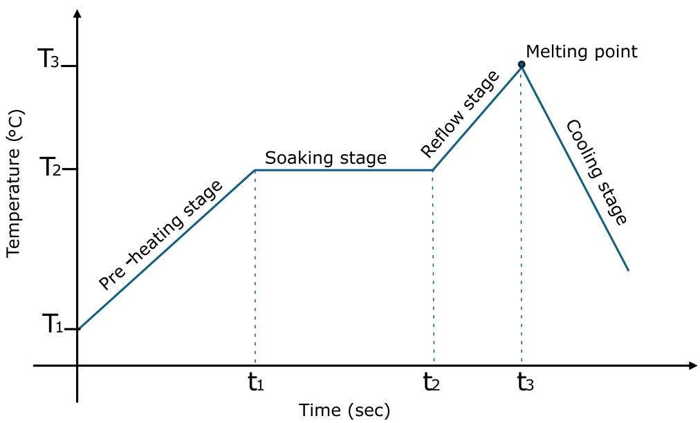  
Figure 4. Typical temperature profile in soldering processes.

• Reflow stage. The system rapidly increases the temperature to the maximum level required for the specific solder alloy, reaching its melting point quickly.

• Cooling stage. Once the peak temperature is reached, the system initiates a cooling process to solidify the solder alloy while minimizing thermal shock.

Following this reflow profile is essential to preserve electronic devices’ structural integrity and reliability.

## 3. Modeling and parameter identification

## 3.1. Infrared heating mechanism

In the proposed system, the temperature rise originates from the absorption of infrared radiation emitted by the quartz–halogen lamp. The radiative output ofthe source depends strongly on its operating temperature and follows the Stefan–Boltzmann law, $P { = } { \epsilon } { \sigma } A T ^ { 4 }$ , where ε is the emissivity, σ is the Stefan–Boltzmann constant, and A is the emitting area. For the BGA device, the infrared radiation is predominantly absorbed at the exposed metallic regions and at the surfaces ofthe solder spheres. Due to the high thermal conductivity ofthe materials and the small characteristic dimensions ofthe solder balls, the absorbed heat is rapidly redistributed within the volume. As a result, the temperature field becomes nearly uniform after a short transient period, which supports the use of a lumped-capacitance thermal model, as discussed in the following subsection.

For context, broader discussions on infrared reflow soldering, such as those presented in Chapter 2 of[24], focus primarily on IR oven configurations, emitter technologies, and temperature-logging practices used in large-area industrial reflow systems. Although such analyses provide a useful general framework for understanding IR-based heating, they differ from the highly localized and optically focused QTH configuration employed in this prototype. In our case, the small thermal mass ofthe BGA device and the confined irradiation spot justify the simplified lumped-capacitance model adopted here, which captures the dominant thermal dynamics observed experimentally.

## 3.2. Thermal modeling (lumped element)

To describe the temperature evolution during infrared heating, a lumped-capacitance energy balance is employed, assuming a spatially uniform temperature within the heated region. This approximation is appropriate for small and thermally conductive bodies, such as the BGA and solder region, for which the Biot number $( B i = h L _ { c } / k )$ remains below 0.1 [25, 26].

Under this assumption, the thermal dynamics satisfy

$$
m c _ { p } \frac { d T ( t ) } { d t } = q _ { \mathrm { i n } } ( t ) - h A ( T ( t ) - T _ { \infty } ) ,\tag{) 1}
$$

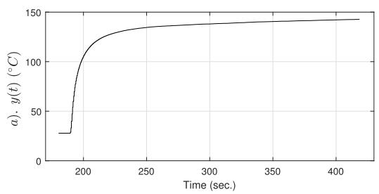

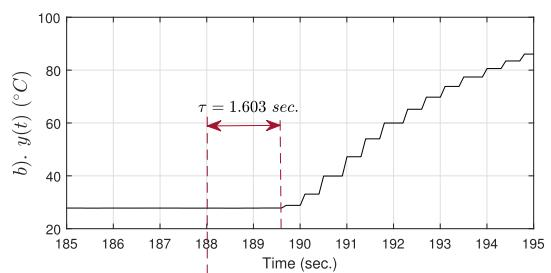

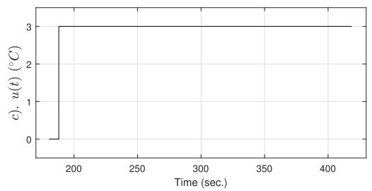

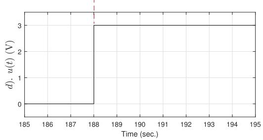  
Figure 5. Experimental results obtained for the identification ofthe system’s dynamic model. Figure (a) shows the measured temperature y(t) and figure (c) depicts the control input u(t), while figures (b) and (d) illustrate the presence of a time delay τ.

where m and $c _ { p }$ denote the effective mass and specific heat ofthe heated region, $q _ { \mathrm { i n } } ( t )$ the absorbed radiative power, and $i \bar { A ( T - T _ { \infty } ) }$ the combined convective and radiative heat exchange with the environment at temperature $T _ { \infty } .$

Assuming a nearly constant input power $q _ { \mathrm { i n } }$ during the heating interval, the solution to (1) is

$$
T ( t ) = T _ { \infty } + ( T _ { 0 } - T _ { \infty } ) e ^ { - t / \tau _ { \mathrm { t h } } } , \qquad \tau _ { \mathrm { t h } } = \frac { m c _ { p } } { h A } ,\tag{) 2}
$$

where $\tau _ { \mathrm { t h } }$ is the thermal time constant. This parameter indicates the rate at which the temperature approaches its steady-state value: after one $\tau _ { \mathrm { t h } } ,$ the output reaches approximately 63% ofthe final temperature.

## 3.3. System modeling based on experiments

The system’s dynamic model is now derived from experimental data. The experiment involves applying a step signal to the input and identifying the model based on the system’s response. Figure 5(a) presents the system’s response to the step input shown in figure 5(c). The input signal has an amplitude of3 V, and the output exhibits behavior characteristic ofa first-order system, as stated in the previous subsection. However, a closer examination at the beginning ofthe experiment, as shown in figures 5(b) and (d), reveals a delay of approximately 1.603 seconds. Using the System Identification Toolbox in MATLAB, we derive the following transfer function

$$
F ( s ) = { \frac { b } { s + a } } e ^ { - \tau s } ,\tag{) 3}
$$

where $a = 0 . 0 9 4 3 3 9 , b = 4 . 4 8 3 8$ , and $\tau = 1 . 6 0 3$ . The validation ofthe model (3) is presented in figure $^ { 6 , }$ demonstrating that the model closely approximates the actual system. While some discrepancies are observed, the ADRC control structure is inherently robust, and we expect it to compensate for these differences effectively.

As is well known, various polynomial approximations exist for the term $e ^ { - \tau s }$ , one of the most common being the Padé approximation. Its first-order representation is given by

$$
e ^ { - \tau s } = \frac { 2 - \tau s } { 2 + \tau s } ,\tag{) 4}
$$

substituting it in the transfer function (3) results in

$$
F ( s ) \approx \frac { - b s + \frac { 2 b } { \tau } } { s ^ { 2 } + \frac { a \tau + 2 } { \tau } s + \frac { 2 a } { \tau } } ,\tag{)5}
$$

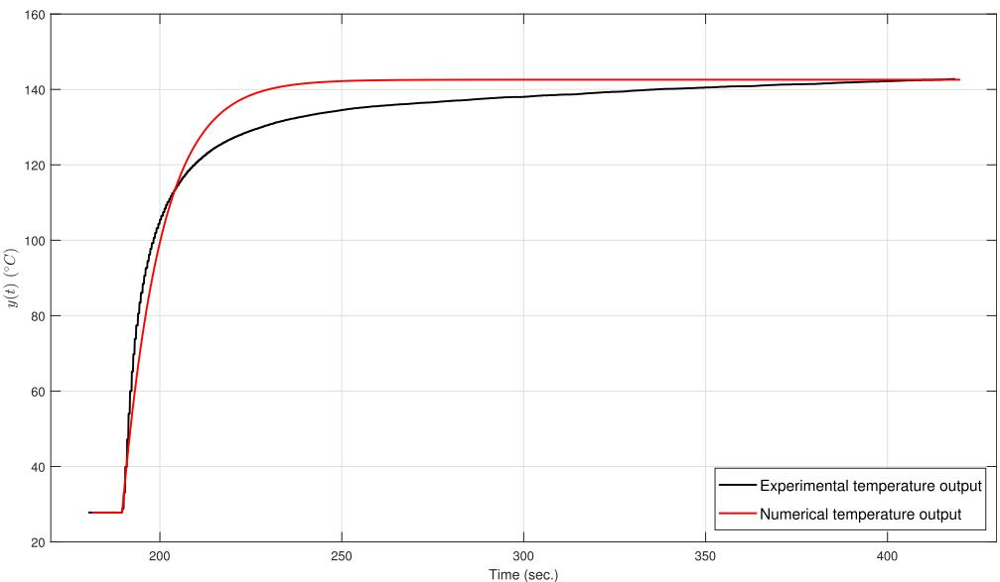  
Figure 6. Comparison between experimental temperature output, black line, and numerical temperature output, red line, responses.

whose state space representation is

$$
\begin{array} { r c l } { { \dot { x } _ { 1 } ( t ) ~ = ~ - { \displaystyle \frac { 2 a } { \tau } } x _ { 2 } ( t ) + { \displaystyle \frac { 2 b } { \tau } } u ( t ) , } } \\ { { \dot { x } _ { 2 } ( t ) ~ = ~ x _ { 1 } ( t ) - { \displaystyle \frac { a \tau + 2 } { \tau } } x _ { 2 } ( t ) - b u ( t ) , } } \\ { { \dot { y } ~ = ~ x _ { 2 } ( t ) . } } \end{array}\tag{)6}
$$

This system has a zero on the right-hand side of the complex plane, classifying it as a non-minimum phase system. Additionally, it can be observed that the dynamics of the output, x2(t), are influenced by another artificial state variable, $x _ { 1 } ( t )$ , which can be considered an external disturbance. Therefore, the simplest approximation of the system (3) given by

$$
\begin{array} { l } { \dot { { \boldsymbol x } } ( t ) = - a { \boldsymbol x } ( t ) + b { \boldsymbol u } ( t ) + { \boldsymbol \gamma } ( \cdot ) , } \\ { { \boldsymbol y } ( t ) = { \boldsymbol x } ( t ) , } \end{array}\tag{)7}
$$

will be used in this work. The term $\gamma ( \cdot )$ represents the delay as an external disturbance, it is assumed that it satisfies $| \gamma ( \cdot ) | < \delta _ { 0 }$ and $| \dot { \gamma } ( \cdot ) | < \delta _ { 1 }$ , where $\delta _ { 0 }$ and $\delta _ { 1 }$ are constants. The experimentally measured time constant, obtained from the 63% rise criterion in figure $5 ( \mathrm { a } )$ after compensating the input delay, shows close agreement with the identified value $\tau _ { \mathrm { t h } } = 1 / a = 1 0 . 6 1 s ,$ , confirming the validity ofthe thermal model and its parameters.

It is worth noting that the thermocouple in direct contact with the solder surface introduces a small dynamic lag due to its finite thermal mass and thermal contact resistance. Because the sensor is located on the component surface rather than exactly at the focal point ofthe infrared beam, a slight spatial temperature offset may occur during rapid transients. These effects slightly damp and delay the measured response but do not alter the dominant first-order thermal behavior of the system.

## 4. Design and implementation ofthe ADRC control strategy

The control objective is to design a control input u(t) such that

$$
\operatorname* { l i m } _ { t  \infty } | \gamma ( t ) - \gamma _ { r } ( t ) | = 0 ,\tag{8}
$$

where $\gamma _ { r } ( t )$ is a known reference signal with a constant derivative; ${ \dot { y } } _ { r } ( t ) = \rho = c t e$ . To solve the problem, define the error variables $e ( t ) = y ( t ) - y _ { r } ( r )$ , whose dynamics are given by

$$
\dot { e } ( t ) = - a e ( t ) - a y _ { r } ( t ) - \dot { y } _ { r } ( t ) + \gamma ( \cdot ) + b u ( t ) ,\tag{9}
$$

An ideal control u(t) is

$$
u ( t ) = \frac { 1 } { b } ( a y _ { r } ( t ) + \dot { y } _ { r } ( t ) - \gamma ( \cdot ) - k e ( t ) ) ,\tag{) 10}
$$

substituting (10) in (9) we have

$$
\dot { e } ( t ) = - ( a + k ) e ( t ) ,\tag{11}
$$

choosing an adequate value for $k ,$ we obtain that the origin of the error space is a global, exponentially stable equilibrium point, and the control problem is solved. However, because the term γ(t) is unknown, the control (10) cannot be implemented. We propose a robust observer to estimate these terms in the next section.

## 4.1. Extended observer to estimate disturbances

The disturbance γ( · ) is not measurable, so we will estimate it using an extended state observer. Consider that the plant is given for the equation (7), the extended state observer proposed is

$$
\dot { \hat { x } } ( t ) = - a \hat { x } ( t ) + b u ( t ) + c _ { 1 } ( \gamma ( t ) - \hat { \gamma } ( t ) ) + w ( t ) ,\tag{12}
$$

$$
\begin{array} { r c l } { { \dot { w } ( t ) ~ = ~ c _ { 2 } ( y ( t ) - \hat { y } ( t ) ) + c _ { 3 } s i g n ( y ( t ) - \hat { y } ( t ) ) , } } & { { } } \\ { { \hat { y } ( t ) ~ = ~ \hat { x } . } } & { { } } \end{array}\tag{)13}
$$

Define the error variable $\boldsymbol { \epsilon } ( t ) = \boldsymbol { x } ( t ) - \hat { \boldsymbol { x } } ( t )$ , whose dynamics are given by

$$
\begin{array} { r c l } { \dot { \epsilon } ( t ) } & { = } & { \gamma ( \cdot ) - \left( c _ { 1 } + a \right) \epsilon ( t ) - w ( t ) , } \\ { \dot { w } ( t ) } & { = } & { c _ { 2 } \epsilon ( t ) + c _ { 3 } s i g n ( \epsilon ( t ) ) . } \end{array}
$$

Now, making the change of variables $\eta _ { 1 } ( t ) = \epsilon ( t )$ and $\eta _ { 2 } ( t ) = \gamma ( \cdot ) - ( c _ { 1 } + a ) \epsilon ( t ) - w ( t )$ , we obtain

$$
\begin{array} { l } { { \dot { \eta } } _ { 1 } ( t ) = \eta _ { 2 } ( t ) , } \\ { { \dot { \eta } } _ { 2 } ( t ) = - c _ { 2 } \eta _ { 1 } ( t ) - ( c _ { 1 } + a ) \eta _ { 2 } ( t ) - c _ { 3 } s i g n ( \eta _ { 1 } ( t ) ) + { \dot { \gamma } } ( \cdot ) . } \end{array}\tag{)14}
$$

Define the matrix A as

$$
A = { \left[ \begin{array} { l l } { 0 } & { 1 } \\ { - c _ { 2 } } & { - ( c _ { 1 } + a ) } \end{array} \right] } ,\tag{) 15}
$$

and the matrix $P ;$ which is the solution ofthe Lyapunov equation $A ^ { T } P + P A = - I \mathrm { f o r t h i s m a t r i x }$

$$
P = { \left[ \begin{array} { l l } { p _ { 1 1 } } & { p _ { 1 2 } } \\ { p _ { 1 2 } } & { p _ { 2 2 } } \end{array} \right] } ,\tag{) 16}
$$

and because $( \cdot ) | < \delta _ { 1 }$ we can apply theorem 1 proposed in [27].

Theorem 1. For system (14) if

$$
c _ { 3 } > 2 \lambda _ { \operatorname* { m a x } } ( P ) \sqrt { \frac { \lambda _ { \operatorname* { m a x } } ( P ) } { \lambda _ { \operatorname* { m i n } } ( P ) } } \left( \frac { c _ { 2 } \delta _ { 1 } } { \sigma } \right)\tag{) 17}
$$

for some $\theta < \rho < I ,$ , the origin $( \mathfrak { \eta } _ { 1 } ( \mathrm { t } ) = 0 , \mathfrak { \eta } _ { 2 } ( \mathrm { t } ) = 0 )$ is a globally asymptotically stable equilibrium point in the Lyapunov sense.

Also, system (14) has a discontinuity surface in $\eta _ { 1 } ( t ) = 0$ , and the term $c _ { 3 } s i g n ( \eta _ { 1 } ( t ) )$ produces a second-order sliding mode, i.e., the equivalent control appears until the second time derivative of the function defining the discontinuity surface

$$
\ddot { \eta } _ { 1 } ( t ) = - c _ { 2 } \eta _ { 1 } ( t ) - ( c _ { 1 } + a ) \eta _ { 2 } ( t ) - u _ { e q } ( \cdot ) + \dot { \gamma } ( \cdot ) = 0 ,\tag{18}
$$

which implies that $\epsilon ( t ) = w = 0$ , therefore, the equivalent control ${ u _ { e q } ( \cdot ) }$ is given by

$$
\begin{array} { r } { u _ { e q } ( \cdot ) = \dot { \gamma } ( \cdot ) , } \end{array}\tag{19}
$$

then

$$
w ( t ) = \gamma ( \cdot ) .\tag{20}
$$

Finally, the control signal (10) takes the form

$$
u ( t ) = \frac { 1 } { b } ( a y _ { r } ( t ) + \dot { y } _ { r } ( t ) - w ( t ) - k e ( t ) ) ,\tag{) 21}
$$

## 4.2. Stability analysis

It is important to highlight that the observer’s performance is independent ofthe control input. Due to its robustness and convergence properties, the separation principle can be applied [27].

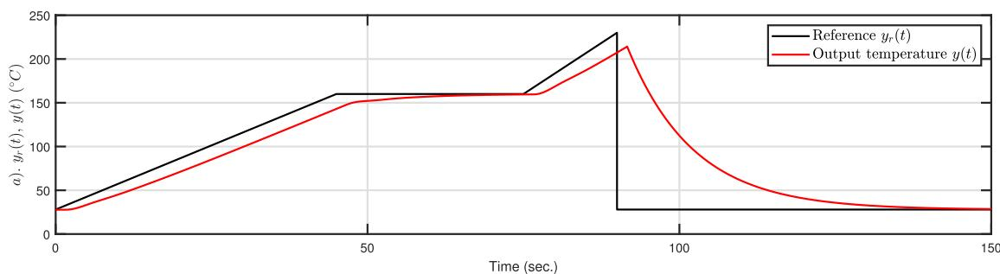

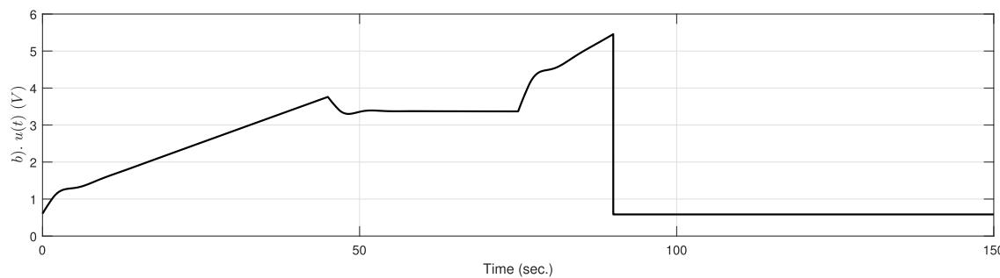  
Figure 7. Simulation results. Performance ofthe closed-loop system using a PID controller for tracking a typical reference signal y (t) in the soldering process. Figure (a) shows the comparison between the reference $\gamma _ { r } ( t )$ and the measured output y(t), while figure (b) presents the corresponding control signal u(t).

By substituting (21) into (9), we obtain

$$
\dot { e } ( t ) = - ( a + k ) e ( t ) + \gamma ( \cdot ) - w ( t ) ,\tag{22}
$$

which ideally satisfies

$$
\operatorname* { l i m } _ { t  \infty } w ( t ) = \gamma ( \cdot ) .\tag{23}
$$

Thus, $\gamma ( \cdot ) - w ( t )$ can be considered a vanishing disturbance. Ifit meets the linear growth bound established in [28], the origin becomes an asymptotically stable equilibrium point. However, in practice, the best achievable condition is

$$
\operatorname* { l i m } _ { t \to \infty } | \gamma ( \cdot ) - w ( t ) | \leqslant \epsilon .\tag{24}
$$

Based on the results concerning non-vanishing disturbances, the system trajectories converge to a small neighborhood ofthe origin. As a result, the system output remains close to the reference.

## 5. Performance analysis ofthe closed-loop system

This section provides a performance comparison between the classical PID controller and the ADRC controller, both numerically and experimentally, to illustrate the proposed controller’s effectiveness. The PID controller is the most used in industrial processes, including those with delays. Therefore, it is a reference for comparing the proposed controller based on ADRC. All simulations were made on LabVIEW using a fixed-step Euler solver with 0.001 seconds ofstep time, and the experiments were conducted on the NI cRIO-9074 Real-Time platform.

## 5.1. Numerical simulation results

The classical PID controller form was applied, given by

$$
u ( t ) = k _ { p } e ( t ) + k _ { i } \int e ( t ) d t + k _ { d } \frac { d e ( t ) } { d t } ,\tag{) 25}
$$

and we used auto-tuning algorithms to select the values for the gains $k _ { p } , k _ { i } ,$ and $k _ { d } .$ . Figure 7 shows the closedloop performance with $k _ { p } = 0 . 0 5 0 9 9 , k _ { i } = 0 . 0 0 3 6 1$ , and $k _ { d } = 0 . 1 2 0 2 8 8$ . As we can see, the output (red line) does not oscillate; however, there is a significant error most of the time, about $1 7 ^ { \circ } \mathrm { C }$ in the first stage of the reference signal, black line, and $2 2 ^ { \circ } \mathrm { C }$ in the highest value of the reference. These errors are too significant for soldering processes. On the other hand, the control input u(t) stays between 0 and 10 volts, which is the operating range of our power stage.

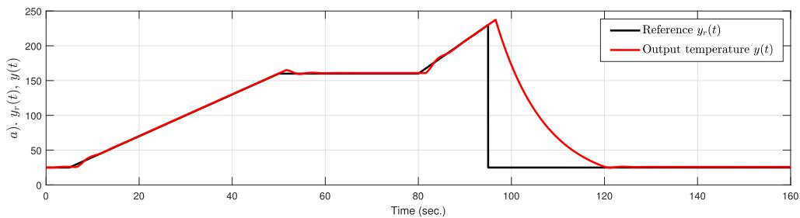

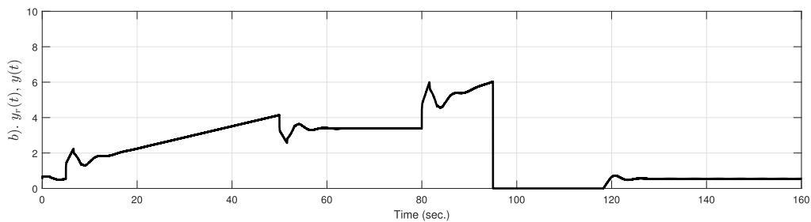  
Figure 8. Numerical results. Performance ofthe closed-loop system using the ADRC controller for tracking a typical reference signal y (t) in the soldering process. Figure (a) shows the reference y (t) and the system output y(t), while figure (b) presents the corresponding control signal u(t).

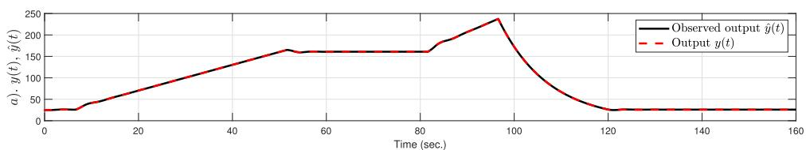

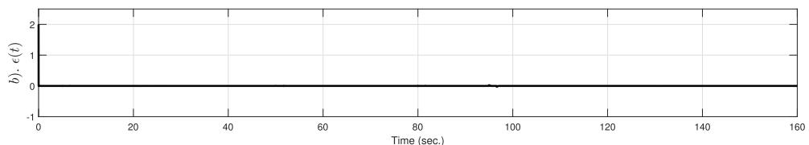

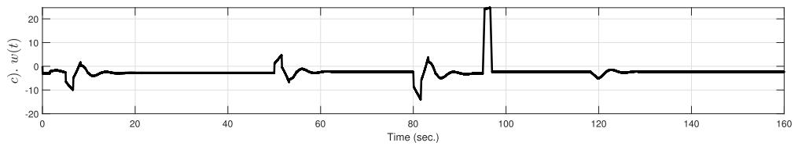  
Figure 9. Numerical results. Performance ofthe robust observer for the identification ofthe disturbance w(t). Figure (a) shows the observed output yˆ(t) and the measured output y(t), Figure (b) presents the observation error ε(t), and figure (c) depicts the estimated disturbance ω(t).

For the ADRC controller case, see figure 8, the observer gains were set to $c _ { 1 } = 2 0 0 , c _ { 2 } = 5 0$ , and $c _ { 3 } = 7 0$ , while the controller gain was $k = 0 . 5 .$ . In this scenario, the steady-state error is nearly eliminated; however, there is an overshoot in the maximum reference temperature of approximately $1 0 ^ { \circ } \mathrm { C }$ . Figure 9 shows the observer’s performance, which operates close to the ideal performance. This indicates that the perturbation w(t) is accurately estimated, making it reliable for compensation within the plant.

In conclusion, the ADRC structure performs better than the PID controller under a numerical simulation context.

## 5.2. Experimental results

For the experiments, because when we used the simulation gains the tracking error was significant, the gains of the PID controller were re-tuned to achieve improved performance, resulting in the values $k _ { p } = 0 . 5 , k _ { i } = 0 . 2$ and $k _ { d } = 0 . 2$ . The closed-loop performance is shown in figure 10, where oscillations can be observed in the output, red line, at the initial phase ofthe reference signal, black line. Although the steady-state error initially decreases, it subsequently increases. The error at the maximum temperature is approximately $2 0 ^ { \circ } \mathrm { C }$ Additionally, the control input exhibits significant oscillations at the beginning of the experiment.

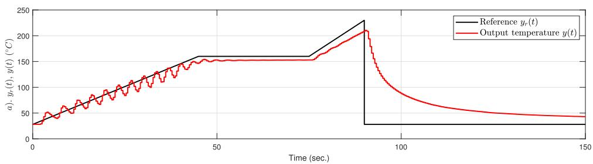

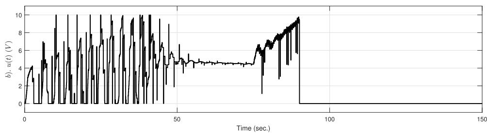  
Figure 10. Experimental results ofthe closed-loop system using a PID controller. Figure (a) shows the reference signal y (t) and the measured output y(t), while figure (b) presents the corresponding control signal u(t).

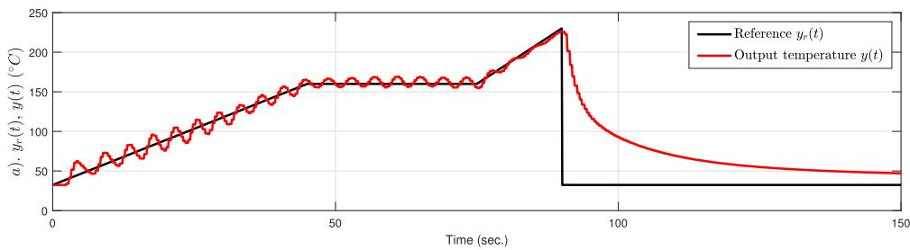

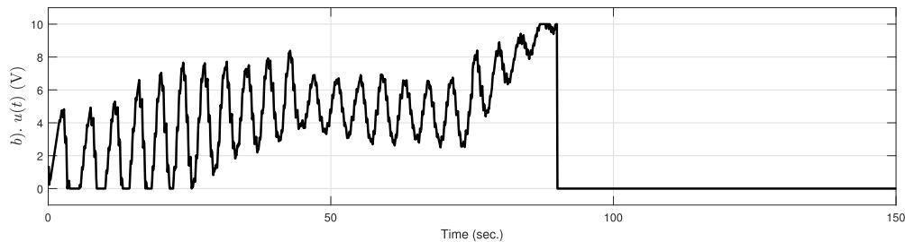  
Figure 11. Experimental results ofthe closed-loop system using the ADRC controller. Figure (a) shows the reference signal y (t) and the measured output y(t), while figure (b) presents the corresponding control signal u(t).

For the case where the ADRC controller is applied, the observer’s parameters do not change, but the controller gain is changed to $k = 0 . 9$ to improve performance. Figure 11 shows the experimental results, where we can see that the output presents oscillations almost all the time, but the average is close to the reference signal; a significant result is that the error at the maximum temperature is small, about $4 ^ { \circ } \mathrm { C } .$ Finally, the control signal constantly presents oscillations, but they have a lower frequency than the PID case.

The oscillations observed with both controllers are typical in systems with delays, which do not pose issues in soldering processes. The key performance criterion is achieving the maximum temperature at the end of the reference. Thus, we conclude that the ADRC controller outperforms the PID controller without requiring a complex plant model.

Now, to assess the overall performance of both controllers from the energy efficiency perspective, the control efficiency index was evaluated $( I A E T _ { e f f } )$ , defined as the ratio between the Integral of Time-weighted Absolute Error (ITAE) and the total control effort (Eu), given by

Table 2. Comparison between different performance indices obtained for the PID and ADRC controllers.
<table><tr><td>Controller</td><td>ITAE</td><td> $E _ { u }$ </td><td> $I T A E _ { e f f }$ </td></tr><tr><td>PID</td><td>3.0042e5</td><td>2.427e3</td><td>123.74</td></tr><tr><td>ADRC</td><td>2.7470e5</td><td>2.529e3</td><td>108.6206</td></tr></table>

$$
I T A E _ { e f f } = \frac { I T A E } { E _ { u } }\tag{) 26}
$$

where

$$
I T A E = T _ { s } ^ { 2 } \sum _ { k = 1 } ^ { N } k | y _ { r } ( k ) - y ( k ) | ,\tag{27}
$$

$$
E _ { u } = \sum _ { k = 1 } ^ { N } u ( k ) ^ { 2 } ,\tag{28}
$$

where Nis the total number ofsamples in the experiments.

This index quantifies the controller’s ability to reduce the tracking error with respect to the energy applied by the actuator, thus providing a measure ofdynamic control efficiency; lower values ofthis index indicate a more efficient control action, i.e., better tracking performance for a given control energy expenditure.

As shown in table 2, the ADRC exhibits a lower value of the control efficiency index (108.62) compared to the PID controller (123.74), corresponding to an improvement of approximately 12.2%. This result demonstrates that the ADRC achieves a more accurate temperature tracking per unit of control energy, indicating a superior balance between error reduction and actuator effort.

## 6. Application example: localized BGA rework using the proposed system

The prototype developed in this work enabled precise heating control, allowing the reproduction of temperature reflow profiles typically used in lead-free soldering processes for Surface-Mount Devices (SMDs). To demonstrate a practical application of the system, a localized heating process was carried out on a Ball Grid Array (BGA) component with damaged solder balls. Although this example does not represent a validation test, it illustrates how the prototype can be employed for the rework or recovery ofdefective electronic components by applying a confined thermal profile consistent with industrial reflow standards.

Figure 12 shows the BGA device exhibiting several damaged solder balls, highlighted in red, resulting from improper component handling. Such deformation, commonly appearing as semi-flattened or irregularly shaped solder balls, is a recurrent failure mode in manufacturing, typically caused by excessive surface tension during placement or mechanical stress in handling equipment. Components with this type ofdefect are often discarded, increasing material waste and production costs.

A localized reflow procedure was carried out using the proposed infrared heating and control system following the standard lead-free reflow temperature profile. The heating cycle consisted ofa preheat phase up to approximately $1 5 0 ^ { \circ } \mathrm { C }$ , a soak region near $1 8 0 ^ { \circ } \mathrm { C } ,$ and a peak of244 ${ } ^ { \circ } \dot { \mathbf { C } } \pm 2 { } ^ { \circ } \dot { \mathbf { C } }$ with a time-above-liquids (TAL) of58 s. Once the lead-free solder alloy reached its melting point, surface tension forces acted to restore the spherical geometry ofthe solder balls. In the molten phase, surface tension becomes the dominant force minimizing surface energy, while the cohesive and elastic properties of the alloy promote a rapid self-reformation of the solder balls. The resulting re-flowed component is shown in figure 13, where the solder joints recovered their regular, uniform spherical shape.

This demonstration highlights the feasibility of using the proposed opto-mechatronic infrared system for localized rework and defect recovery in SMD assemblies. Although similar reflow could be achieved through conventional heating, the proposed approach confines thermal energy to the target area, preventing exposure ofthe entire PCB and thus enabling efficient, selective repair.

From a sustainability standpoint, the capability to restore damaged solder joints allows the reuse ofcomponents that would otherwise be discarded due to terminal deformation, reducing electronic waste and production losses. Future work will include mechanical reliability tests (e.g., shear testing, cross-sectioning, and x-ray inspection) to assess the strength and uniformity ofthe repaired joints, ensuring that they meet industrial soldering standards.

This application example illustrates the potential of the developed infrared soldering system for selective BGA rework and component recovery. The optical confinement, combined with closed-loop thermal control, enables localized reflow of lead-free solder joints, supporting more sustainable and energy-efficient practices in electronic manufacturing and maintenance.

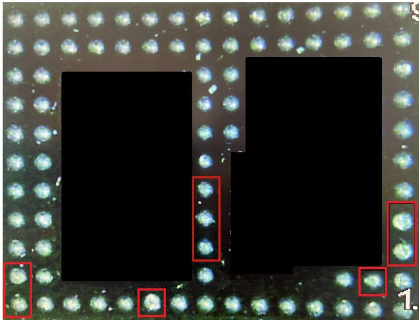  
Figure 12. BGA device with damaged solder balls.

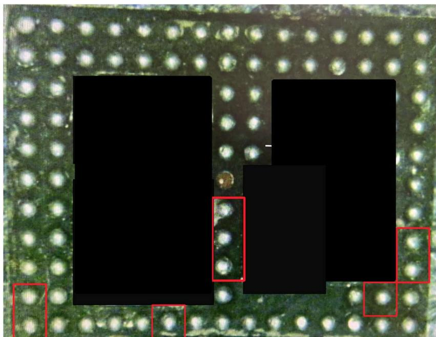  
Figure 13. BGA device after thermal processing, with repaired solder balls.

## 7. Conclusion

This study demonstrates that the Active Disturbance Rejection Control (ADRC) structure can effectively address the tracking problem in systems with time delay at the control input, without requiring any polynomial approximation of the delay. The proposed approach is conceptually simple yet powerful: the delay effect is treated as an external disturbance, leveraging the main strength ofADRC—its capability to estimate and compensate for disturbances and model uncertainties in real time.

Although the numerical simulations achieved better accuracy than the experimental results, the experimental outcomes still confirm that the ADRC-based closed-loop system outperforms the conventional PID controller. The superior performance ofADRC can be attributed to its active estimation ofunmodeled dynamics and external disturbances within the thermal process.

While ADRC produces a slightly more variable control signal, the trade-offbetween tracking precision and control effort is clearly more favorable than that ofthe PID controller. In practical terms, ADRC achieves a temperature response that more closely follows the desired thermal profile while requiring proportionally less control energy, therebydemonstrating higher overall control efficiency in infrared-based temperature regulation.

Furthermore, the application ofADRC in the proposed prototype shows potential for improving industrial soldering processes, offering a pathway toward reduced energy consumption and minimized electronic circuit waste.

## Data availability statement

All data that support the findings of this study are included within the article (and any supplementary files).

## Author contributions

R Citlalli Anguiano Cotaaa 0000-0003-1087-293X

Conceptualization (equal), Formal analysis (equal), Investigation (equal)

David I Rosas Almeidaaa 0000-0002-7906-7405

Conceptualization (equal), Formal analysis (equal), Investigation (equal), Methodology (equal), Software (equal)

J Rigoberto Herrera Garcíaaa 0000-0003-4897-8270

Writing – review & editing (equal), Investigation (equal)

## References

[1] Strauss R 1998 SMTsolderinghandbook (Elsevier)

[2] Lee N C 2002 Reflow soldering processes (Newnes)

[3] Gannamani R and Pecht M 1996 IEEE Transactions on Components, Packaging, and Manufacturing Technology: Part A 19 194–201

[4] Wenger T, Schletterer P and Reichenberger M 2025 Flex. Print. Electron. 10 1–13

[5] Anguiano C, Félix M, Medel A, Bravo M, Salazar D and Márquez H 2013 Opt. Express 21 23851–65

[6] Lanin V, Emel’yanov V and Petukhov I 2024 Surf. Eng. Appl. Electrochem. 60 374–407

[7] Vandevelde B 2011 Excessive warpage oflarge packages during reflow soldering The ELFNETBook on Failure Mechanisms, Testing Methods, and Quality Issues ofLead-Free Solder Interconnects (Springer) pp 283–96

[8] Dušek K and Váňa T 2011 Study of temperature profiles of the infrared continuous furnace Proceedings of the 2011 34th International Spring Seminar on Electronics Technology (ISSE) (IEEE) pp 188–91

[9] Sarvar F and Conway P P 2002 IEEE Transactions on Components, Packaging, and Manufacturing Technology: Part C 21 126–33

[10] Inoue M and Koyanagawa T 2005 Thermal simulation for predicting substrate temperature during reflow soldering process Proceedings Electronic Components and Technology, 2005. ECTC’05 (IEEE) pp 1021–6

[11] Lam T L 2020 IEEE Access 9 123566–74

[12] Gu K and Niculescu S I 2003 J. Dyn. Sys., Meas., Control 125 158–65

[13] Richard J P 1998 Some trends and tools for the study oftime-delay systems CESA’98, 2nd Conf. IMACS-IEEE conference on Computational Engineeringin Systems Applications pp 27–43

[14] Deng Y, Léchappé V, Moulay E, Chen Z, Liang B, Plestan F and Han Q L 2022 Int. J. Syst. Sci. 53 2496–534

[15] Korupu V L and Muthukumarasamy M 2022 Chem. Prod. Process Model. 17 701–32

[16] Glader C, Högnäs G, Mäkilä P and Toivonen H 1991 Int. J. Control 53 369–90

[17] Wei Y, Hu Y, Dai Y and Wang Y 2016 Int. J. ControlAutom. Syst. 14 181–7

[18] Ranjan S, Sharma A and Chaudhary P 2014 An effective temperature controller system using pid mechanism Innovative Applications ofComputational Intelligence on Power, Energy and Controls with their impacton Humanity (CIPECH) (IEEE) pp 182–5

[19] Phan V D, Nguyen X H, Dinh V N, Dang T S, Le V C, Ho S P, Ta H C, Duong D T and Mai T A 2024 Electronics 13 342

[20] Liang H, Sun B, Huang B, Li Y and Yang C 2024 IEEE Trans. Autom. Sci. Eng. 22 5627–36

[21] Arkun Y, Canney W M, Hollett J and Morari M 1986 Ind. Eng. Chem. Process Des. Dev. 25 102–8

[22] Wu Z, He T, Li D, Xue Y, Sun L and Sun L 2019 Control Eng. Pract. 83 83–97

[23] Hou G, Gong L, Wang M, Yu X, Yang Z and Mou X 2022 ISA Trans. 122 357–70

[24] Illés B, Krammer O and Geczy A 2020 Reflow Soldering: Apparatus and Heat Transfer Processes (Elsevier)

[25] Incropera F P, DeWitt D P, Bergman T L and Lavine A S 2007 Fundamentals of Heat and Mass Transfer 6th edn (Wiley) printed in the United States ofAmerica

[26] Holman J P 2010 Heat Transfer 10th ed McGraw-Hill Series in Mechanical Engineering(McGraw-Hill Education) includes index

[27] Rosas Almeida D I, Alvarez J and Fridman L 2007 International Journal of Robust and Nonlinear Control: IFAC-Affiliated Journal 17 842–61

[28] Khalil H 2002 Nonlinear Systems Pearson Education (Prentice Hall)