# Comparative Effectiveness of Infrared Heat Sources for Mounting and Dismounting Electronic Modules

V. L. Lanin\* and A. I. Lappo

Belarusian State University of Informatics and Radioelectronics, Minsk, 220013 Republic of Belarus

\*e-mail: vlanin@bsuir.by

Received July 9, 2015; in final form, September 18, 2015

Abstract⎯efficiency of short- and medium-wave infrared (IR) heat sources used to mount and dismount electronic modules is assessed. The analysis of the models of thermal fields shows that for KGM 30/300 hal ogen IR lamps, the heating nonuniformity for a printed circuit board is 45–55°С, and for the casings of electronic components, the temperature varies from 90 to 100°С. For an Elstein SHTS/4 ceramic IR heater, the heating nonuniformity for a printed circuit board is 8–13°С, the temperature of SMD component casings differs from temperature of the the printed circuit board: in BGA by 28–32°С, in QFP by $2 4 { - } 2 6 ^ { \circ } \mathrm { C }$ , and in SMD by $5 { - } 2 0 ^ { \circ } \mathrm { C }$ . The application of medium-wave ceramic infrared sources makes it possible to attain a higher heating uniformity in the working area and ensure an optimal temperature profile when mounting and dismounting surface-mounted electronic components.

Keywords: infrared radiation, heat sources, mounting, dismounting, electronic modules

DOI: 10.3103/S106837551704010X

## INTRODUCTION

When applying infrared sources, it is possible to perform local heating when mounting electronic modules, to decrease the heating time of a workpiece, and to reduce the risk of damage to electronic components. IR radiation heating has a number of advantages; however, they depend on the right choice of heat source and structure of the IR heating device. At present, two kinds of IR heating are widely used in technological processes: local focused and precise diffused. Depending on particular conditions, they use reflectors of various geometry that form a thermal field in the heating area [1].

The IR joint brazing procedure, which has a number of advantages, such as [2] a high rate and selective action of heating and the ability to control the thermal profile, calls for further development to improve the quality of mounting and dismounting of surface components in electronic densely packed modules. For the right choice of IR heat sources, one should analyze the thermal fields of heated bodies and estimate the influence of spacing between a heater and a printed circuit board on the heating uniformity and rate [3].

Today, local IR heating is the best method [4]. It uses a focused infrared radiation beam only in the brazing joints. In this case, printed circuit underboard heating to prevent its deformation is a mandatory procedure. The IR ceramic heaters maintain a stable temperature due to a high heating temperature and slow response that is of great importance for leadless brazing. The radiators which help to attain a high temperature in a minimum of time are used at the IR soldering stations.

A right choice of a heat source is the main factor which guarantees the quality of brazed joints of surface mounted components in the process of mounting and safety of a work-piece under repair when a damaged component is being dismounted. Applying IR sources it is possible to carry-out local heating, to reduce the time of heating a work-piece under repair, and to decrease the risk of damage to the electronic component.

The aim of the work is to assess the effectiveness of short- and medium-wave infrared heat sources used for mounting and dismounting the electronic modules, as well as to optimize temperature profiles of heating of the electronic surface–mounted components.

## SIMULATION OF THERMAL FIELDS OF INFRARED SOURCES

The spectral radiation rate I depends on temperature T, wavelength λ, and spectral emissivity of the radiator [5]:

$$
I _ { \lambda } = \mathfrak { E } _ { \lambda } C _ { 1 } \lambda ^ { - 5 } ( e ^ { C _ { 2 } / \lambda T } - 1 ) ^ { - 1 } ,\tag{1}
$$

where $C _ { 1 } , C _ { 2 }$ are the Planck constants, 3.74 mW/kV m and 0.1439 m ${ \mathrm { K } } ; { \varepsilon _ { \lambda } }$ is the reflection coefficient of the radiator.

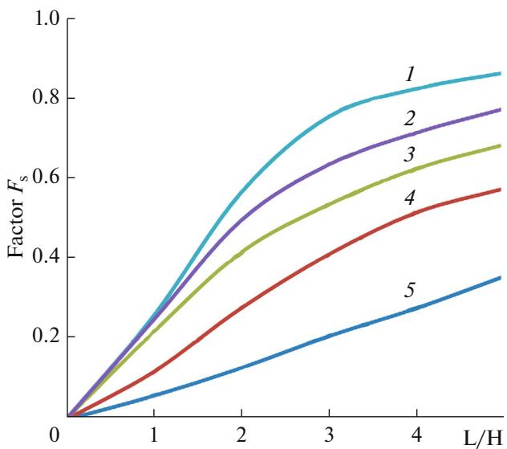  
Fig. 1. Factor $F _ { \mathrm { s } }$ versus source–surface spacings and dimensions of the heating areas: (1) between small source and square area (Fig. 2a); (2) between linear source and rectangular area (Fig. 2b); (3–5) between rectangular source and rectangular area with dimensions of $\cdot _ { L } \times L , L \times$ 2L, and $L \times 5 L$ , respectively (Figs. 2c–2e).

The wavelength at which the blackbody radiation flux density reaches a maximum for this temperature is determined from Planck’s law by fulfillment of the condition of the maximum [6]:

$$
\frac { d E _ { \lambda } } { d \lambda } = \frac { d } { d \lambda } \left[ \frac { C _ { 1 } } { \lambda ^ { 5 } \left( e ^ { C _ { 2 } / \lambda T } - 1 \right) } \right] _ { T = \mathrm { c o n s t } } = 0 ,
$$

where $E _ { \lambda }$ is the blackbody radiation flux density at temperature T.

The solution to Eq. (2) gives the formula for the Wien displacement law:

$$
{ \lambda _ { \operatorname* { m a x } } } T = 2 . 8 9 8 \times 1 0 ^ { - 3 } { \mathrm { ~ m ~ K } } ,\tag{3}
$$

where $\lambda _ { \operatorname* { m a x } }$ is the wavelength at which the maximum of the spectral radiation flux density of a blackbody with temperature T is attained.

Thus, a higher radiator temperature leads to a shorter wavelength and, as a result, to an increase in thermal emission. According to the Stefan–Boltzmann law, the heat radiated from the unit area is determined as in [5]:

$$
Q = F _ { \mathrm { s } } \varepsilon \sigma S _ { \mathrm { h } } \left( T _ { \mathrm { h } } ^ { 4 } - { T _ { \mathrm { s } } ^ { 4 } } \right) ,\tag{4}
$$

where $F _ { \mathrm { s } }$ is the angular coefficient (it is chosen from Fig. 1 depending on the ratio of the heater’s dimensions and the brazing region (Fig. 2)), ε is the body emissivity; σ is the Stefan–Boltzmann constant, $S _ { \mathrm { h } }$ is the heating area, $T _ { \mathrm { h } }$ is the heater temperature, and $T _ { \mathrm { s } }$ is the heated surface temperature.

(2)

The finite element method, which makes it possible to construct models of systems with complicated configurations and irregular structures, was used to simulate the IR processes. For IR heating, only the integral (i.e., total) wavelength radiation is considered. The heat-radiating surfaces are given as absolutely black, absolutely white, or completely gray; thus, according to the Lambert law, their radiation is assumed as diffuse, i.e., with luminosity independent of the direction of radiation. The initial conditions are prescribed by the Flow Simulation Wizard module of the SolidWorks 2012 software system: system of measurement units, type of analysis, type of environment, default material, heat transfer parameters, values of the initial and environmental conditions, and accuracy with which systems can be modeled.

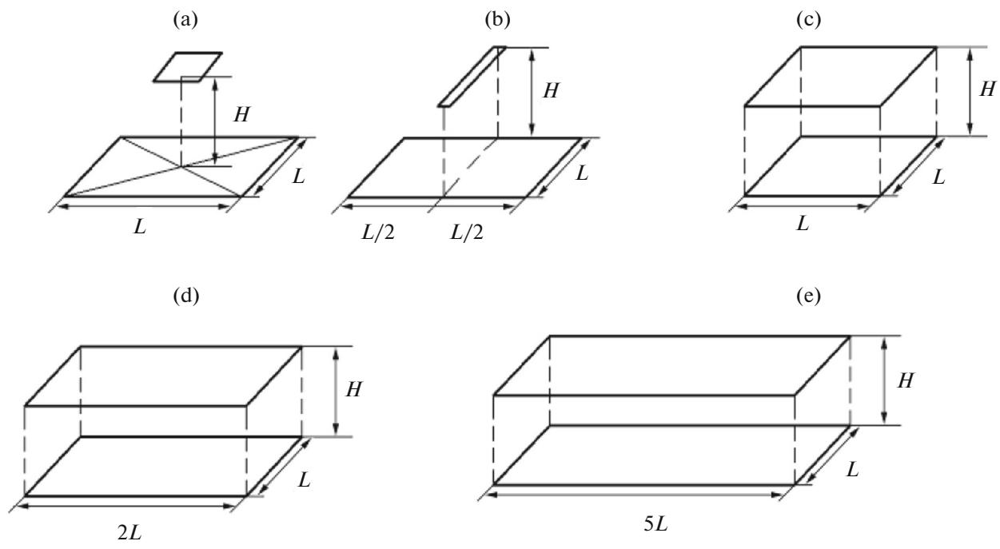  
Fig. 2. Position of heaters with respect to heating areas.

(a)  
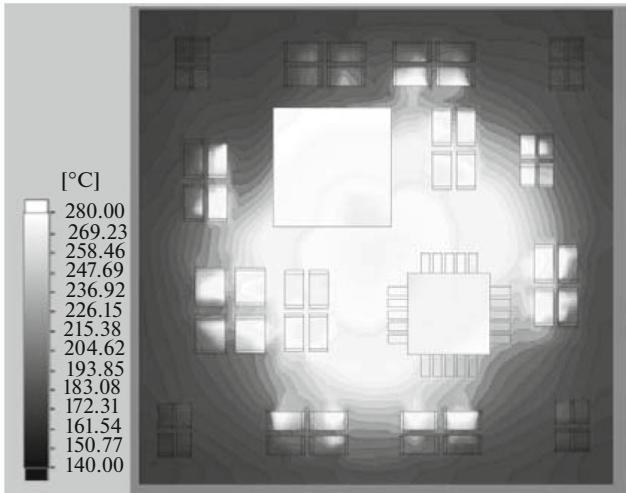

(b)  
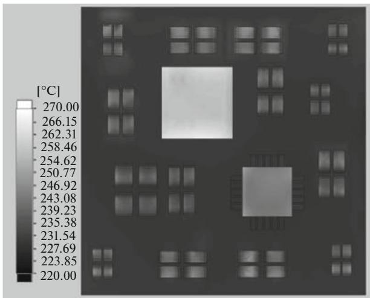  
Fig. 3. Thermal fields on electronic module surface: (a) KGM 30/300 halogen IR lamp, (b) Elstein SHTS/4 ceramic IR heater (simulation).

The parameters of radiating surfaces, radiation sources, and heat sources, such as the temperature of the radiating surface, as well as the material for each component in the module, are given by miscellaneous settings.

A four-layer printed circuit board with dimensions of 40 × 40 mm and mounted components in the BGA, QFP, and SMD 0805, 1206, 1210 casings was used as the model. The distance of the heating elements from the board was 20 mm. The thermal fields on the surface of the module with the surface-mounted components are the result of simulation [7].

Analysis of thermal fields show that for the KGM 30/300 halogen IR lamp (Fig. 3a), the nonuniformity of heating of the printed circuit board was $4 5 \mathrm { - } 5 5 ^ { \circ } \mathrm { C } .$ the main heating is concentrated in the center, where a temperature peak of 200–205°С is attained, while it is no more then $1 4 0 ^ { \circ } \mathrm { C }$ at the edges. The temperature nonuniformity is $9 0 { - } 1 0 0 ^ { \circ } \mathrm { C }$ on the casings of the electronic components. For the Elstein SHTS/4 ceramic IR heater (Fig. 3b), the nonuniformity of heating of the printed circuit board is $8 { - } 1 3 ^ { \circ } \mathrm { C }$ , the temperature of the casings of the surface–mounted components differs from the temperature of the printed circuit board: BGA by $2 8 { - } 3 2 ^ { \circ } \dot { \mathrm { C } }$ , QFP by $2 4 { - } 2 \bar { 6 } ^ { \circ } \mathrm { C }$ , and SMD by 5– $2 0 \mathrm { { } ^ { \circ } C }$

To optimize the IR heating parameters there was simulated the heating rate and distribution of thermal fields depending on the spacing between the heating element and the electronic module. The temperature–time dependences (Fig. 4) show that with an increase in distance from the electronic module, the heating rate becomes half as much per every 10 mm for the short-wavelength heaters (halogen IR lamp) and 50% lower for medium-wavelength heaters (ceramic heating element). At a distance of more than 20 mm, the IR heating becomes uniform and the temperature spread is no more than 3–5% for the components and 5–7% for the printed circuit board.

## EXPERIMENTAL

The studied IR heaters are built into a soldering station for mounting and dismounting surfacemounted components in different casings on a printed circuit board. The IR station consists of systems of top and bottom heating, cooling, control unification, and the indicator device. The cyclic application of two types of top heating units is provided in the design with the possibility of rapid change. The heaters are mounted so that their heating surface is over the brazing area. The bottom heater, designed for preheating the printed circuit board up to a temperature of 130– $1 7 0 ^ { \circ } \mathrm { C }$ to protect the mounted components and the printed circuit board from thermal shock, includes two KI 220–1000 halogen lamps, a reflector, and a heat-dissipating plate. The cooling system consists of three fans, with two placed on the casing surface to cool the brazed module and the top heater, and one fan inside the casing to cool the bottom heating unit. The microcontroller ensures the automatic test of the heating process and maintenance of the prescribed temperature profile that helps to improve the quality of brazing. The data on the heater work mode and the current temperature are printed on the liquid-crystal display (Fig. 5).

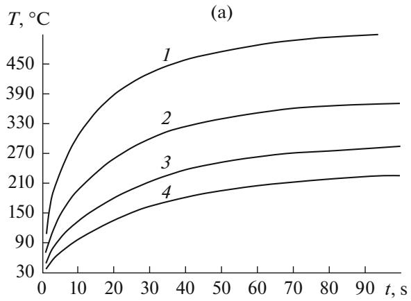

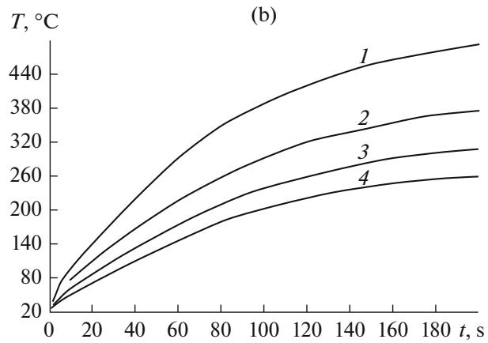  
Fig. 4. Temperature–time dependences: (a) KGM 30/300 halogen IR lamp, (b) Elstein SHTS/4 ceramic IR heater at a distance to the printed circuit board of (mm): (1) 10, (2) 20, (3) 30, and (4) 40.

The temperature was controlled by a thermoelectric converter (KhK, TKhK] type thermocouple) whose signal comes to the microcontroller through a dc amplifier based on an operational amplifier. The measured analog signal is transformed into binary form by a built-in 10-bit analog-to-digital converter. To minimize the measurement error, the analog signal of the thermocouple is measured 20 times a second, then the average value is calculated. The calculation algorithm is optimized for MSP430 family microcontrollers. With allowance for the calculated temperature, the electromagnetic relays that control the top and bottom heaters are regulated. The measured temperature, as well as the current states of the relays, are shown on a liquid-crystal display.

We have investigated the thermal profiles of IR brazing of SMD components for a bottom heating power of 1000 W using IR heaters in the near-IR region (0.7–1.5 μm) (KGM 30/300 halogen IR lamp) and in the medium region (2–10 μm) (Elstein SHTS/4 ceramic IR heater). An OVEN TRM210] regulator meter and a personal computer were used for automatic data processing.

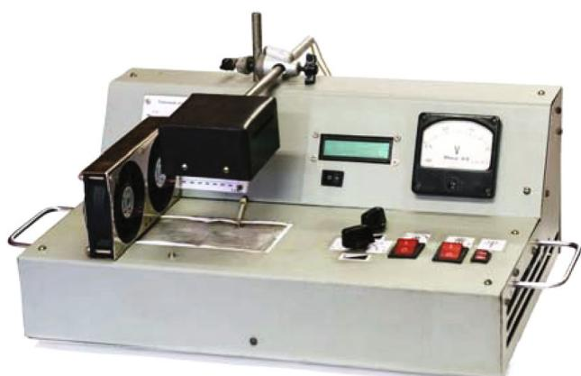  
Fig. 5. Setup for IR brazing with top medium-wave ceramic radiator.

## RESULTS AND DISCUSSION

Figure 6 shows thermal brazing profiles with the KGM 30/300 halogen IR lamp and the Elstein SHTS/4 ceramic IR heater. At the preheating stage, the shapes of the thermal profiles are close to each other. This is because at this stage, heating is performed only by the bottom heater, which did not change in the course of the experiment. For the halogen IR lamp, a higher heating rate (by 71–74%) is characteristic in comparison to ceramic heaters, which give grounds to choose this source as the main heating element in automated manufacturing lines with high productivity.

Analysis of the thermal brazing profiles of the BGA casings using the Elstein SHTS/4 IR heater (Fig. 7) with a spacing of 10 and 30 mm showed that with a threefold increase in spacing, the heating rate to the brazing temperature increases two to three times. The shape of the heating field isotherms for the halogen lamp (Fig. 8a) indicates a high nonuniformity of the brazing process when the peak heating rate $( 2 0 { - } 2 2 ^ { \circ } \mathrm { C } / \mathrm { s } )$ was recorded over an area up to $6 { - } 7$ mm in the X direction and 4–5 mm in the Y direction; then, 3–4 mm in the direction of the axes, the heating rate decreases to 13– $1 5 \mathrm { ^ \circ C / s }$ and then to $8 { - } 1 0 ^ { \circ } \mathrm { C } / \mathrm { s }$ at 4–5 mm.

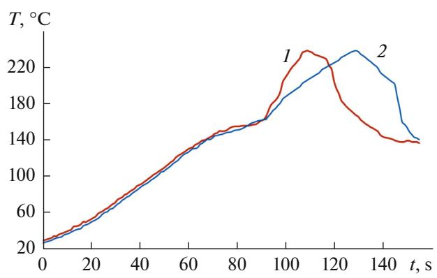  
Fig. 6. Thermal profiles of brazing with POS61 braze: (1) KGM 30/300 halogen IR lamp, (2) Elstein SHTS/4 ceramic IR heater.

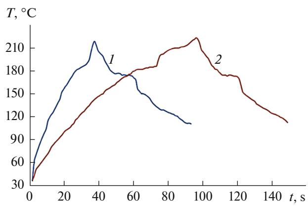  
Fig. 7. Thermal profiles of brazing with Elstein SHTS/4 ceramic IR heater, mm: (1) 10, (2) 20.

The ceramic IR heater (Fig. 8b) has a comparatively high uniformity of heating; the shapes of the thermal fields are symmetric and do not depend on the direction. The rate was $3 { - } 4 ^ { \circ } \mathrm { C } / \mathrm { s }$ at a distance of 25 mm from the center, at 30 mm it decreases to $2 { - } 3 ^ { \circ } \mathrm { C } / \mathrm { s }$ , and at 35 mm it decreases to $0 . 5 { - } 1 ^ { \circ } \mathrm { C } / \mathrm { s }$

According to the simulation results for the thermal fields of heaters in the near- and medium-IR region using SolidWorks 2012, the distributions of the heating nonuniformity for the printed circuit board and the casings of the mounted components were found: 34– 36% and 26–44% for the near-IR region, and 3–4% and 8–12% for the medium region, respectively.

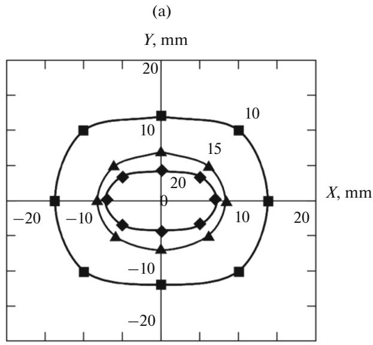

According to the simulation results, the best heating characteristics were obtained in the medium-IR region; the near-IR region only has the advantage of the heating rate; thus, the brazing temperature at a distance of 30 mm to the printed circuit board was attained in 30 s in comparison to 60 s for the mediumwavelength emitter. The optimal spacing between the module surface and the heating element should be in the range from 20 to 25 mm, at which the heating nonuniformity is 3–5% for the components and 5–7% for the printed circuit board.

The study of the temperature fields of the halogen lamp shows a high nonuniformity of the process when the highest heating rate $2 0 { - } 2 2 ^ { \circ } \mathrm { C } / \mathrm { s }$ is attained at a distance of $^ { 1 4 - 7 }$ mm from the center of the printed circuit module. The ceramic IR heater showed the same heating rate at a level of $3 { - } 4 ^ { \circ } \mathrm { C } / \mathrm { s }$ at a distance of 25 mm from the center, but in this case, the heating rate was reduced by 5–7 times in comparison with the halogen IR lamp.

During mounting of the surface-mounted components produced contact joints were, some of them with defects. The braze balls (spherical formations) are found near the contacts of transistors and capacitors. An incorrect selection of brazing modes and rapid evaporation of the solvent at the preheating stage may be the cause of the defects. On additional adjustment of the IR station, the surface-mounted components were remounted in different casings. When the brazed joints of the mounted components (Fig. 9) were viewed with a Carton NSWT-620.PFM-X microscope, it was that they conform to the IPC-A-610D standard.

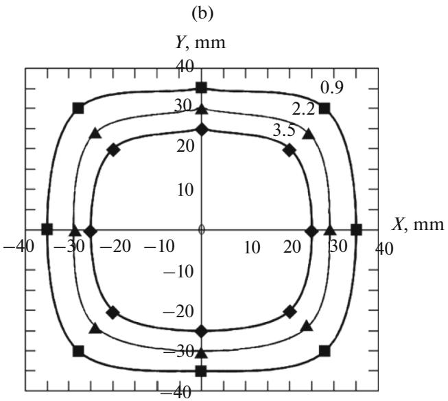  
Fig. 8. Thermal fields of IR heating rate, $^ { \circ } \mathbf { C } / \mathbf { s } \mathrm { : }$ (a) KGM 30/300; (b) Elstein SHTS/4.  
SURFACE ENGINEERING AND APPLIED ELECTROCHEMISTRY Vol. 53 No. 4 2017

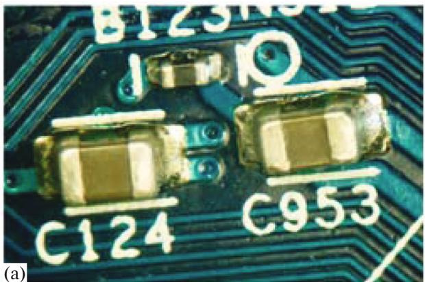

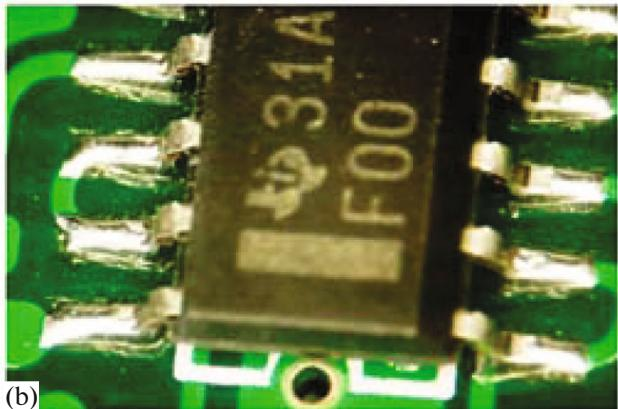  
Fig. 9. High-quality brazed joints: (a) SMD capacitors; (b) stripline microchip.

## CONCLUSIONS

Analysis of the thermal field models shows that for theKGM 30/300 halogen IR lamp, the nonuniformity of heating of a printed circuit board is $4 5 { - } 5 5 ^ { \circ } \mathrm { C } ,$ and on the casings of electronic components, the temperature nonuniformity is $9 0 { - } 1 0 0 ^ { \circ } \mathrm { C }$ . For the Elstein SHTS/4 ceramic IR heater, the nonuniformity of heating of the printed circuit board is $8 { - } 1 3 ^ { \circ } \mathrm { C }$ , and the temperature of the casings of the SMD components differs from the printed circuit board temperature: BGA by 28–32, QFP by 24–26, and SMD by $\bar { 5 } { - } 2 0 ^ { \circ } \mathrm { C }$

The shape of the experimental heating isotherms of the halogen lamp indicates the nonuniformity of thermal fields where the highest heating rate of $\dot { 2 } 0 ^ { \circ } \mathrm { C } / \mathrm { s }$ is concentrated over an area of $1 2 0 \mathrm { m m } ^ { 2 }$ . The ceramic IR heater has a higher heating uniformity; however, its application decreases by five to seven times the heating rate in comparison with the IR lamp, which is 3– $4 ^ { \circ } \mathrm { C } / \mathrm { s }$ Therefore, halogen IR lamps with a higher heating rate are the main heating elements in automated mounting lines with high productivity.

The use of medium-IR-range ceramic sources is optimal at IR stations designed for repairing workpieces with SMD components, since they require a high uniformity of heating of the workpiece surface during the mounting operation; due to the increase in the heating time, thermal stresses in the bulk of workpiece components are reduced.

## REFERENCES

1. Zvorykin, D.B., Otrazhatel’nye pechi infrakrasnogo nagreva (Reflective Infrared Heating Furnaces), Moscow: Mashinostroenie, 1985.

2. Lee, N.-C., Reflow Soldering Processes and Troubleshooting: SMT, BGA, CSP and Flip Chip Technologies, Boston: Newnes, 2002.

3. Anguiano, C., Felix, V., Salazar, D., and Marquez, H., Opt. Express., 2013, vol. 21, no. 20, pp. 23851–23855.

4. Lanin, V.L., Surf. Eng. Appl. Electrochem., 2007, vol. 43, no. 5, pp. 381–386.

5. Prakht, V.A., Dmitrievskii, V.A., and Sarapulov, F.N., Modelirovanie teplovykh i elektromagnitnykh protsessov v elektrotekhnicheskikh ustanovkakh (Modeling of Thermal and Electromagnetic Processes in Electrical Machines), Moscow: INFRA-M, 2005.

6. Norman, R.C., Stud. Mater. Thinking, 1986, no. 10, pp. 27–30.

7. Lanin, V.L., Lappo, A.I., Lavor, T.E., Tekhnol. Elektron. Prom., 2015, no. 3, pp. 60–62.

Translated by M. Myshkina