# Influence of heat flow direction on solder ball interfacial layer

∗ Alexandr Ot´ahal, Ivan Szendiuch

This paper deals with the research of an intermetallic layer of SAC305 solder balls soldered from three directions of the heat flow in the ball-attach process for BGA package. From the point of view of the heat flow direction, the samples were soldered by infrared heating. The heat sources were placed on the top, bottom and both lateral sides of the BGA package. After the solder balls-attach process, a metallographic cross-section was performed, followed by selective etching to visualize the relief of the intermetallic layer. Images of the interfacial between the solder and solder pad were taken from the created samples, followed by measurement of the average thickness and root mean square roughness of the intermetallic layer. The results showed changes in the intermetallic layer. The largest thickness of the intermetallic layer was observed on samples soldered from the top and both sides. Soldering with the bottom infrared heater resulted to the smallest thickness of the intermetallic layer. The same trend was in the roughness of the IMC layer. The greatest roughness was found for samples soldered by the top and both side heaters. The top soldered samples exhibit the smallest roughness.

K e y w o r d s: BGA package, reflow soldering, infrared heater, heat flow direction, intermetallic interfacial layer

## 1 Introduction

Microelectronic packages have many diferent designs, each of which has certain advantages and disadvantages. Considering the soldering process and the consequent quality and reliability, there are certainly the biggest problems with the BGA and QFN and other similar packages. This is due to the increased number of solder pads as well as their smaller dimensions and pitch. This work is focused on the ball-attach process, or re-balling process, for BGA packages with usage of solder ball preforms.

Reliable solder joints in BGA packages can be achieved by correctly selected factors entering the soldering process. For example, these factors included the compatibility of the materials, the appropriate design of the package and of the printed circuit board, the temperature profile of the solder and many others. All these parameters are addressed in a large number of publications. One parameter in the researches is still neglected. This parameter is the direction of heat flow in the soldering process. In this publication, its importance is solved from the point of view of the process of ball-attach process, or reballing process, on the BGA packages with focus on the research of the intermetallic layer, more precisely its thickness and roughness. The thickness and roughness of the intermetallic layer in the process of the ball-attach/reballing must be ensured as small as it can be because $\mathrm { ( C u , N i ) _ { 6 } S n _ { 5 } }$ and (Ni, Cu)3Sn4 increase with each further process of reflow [1, 2]. After inadequate soldering of a BGA package on a PCB, the reliability of the resulting joint due to the thickness of the intermetallic layers can be reduced. The ball-attach and reballing processes influence the final solder joint of BGA package. This is the reason why this research could help to ensure better reliability and durability of BGA solder joint.

## 2 Theory

During the soldering process, a large number of factors influence the quality of the solder joint. If we focus on the intermetallic layer and the intermetallic compounds for the SAC305 soldering alloy, some fundamental parameters influencing their formation and growth have been identified. In the first phase of the soldering process, nucleation is formed. The crystal nucleus is the basis for the crystal growth in the cooling phase. For the combination of SAC305/ENIG materials, their formation is dependent on the activation energy that is critical for the formation and growth of intermetallic layers. Creation of η phase $\mathrm { ( C u _ { 6 } S n _ { 5 } ) }$ is significantly faster than that of ǫ phase (Cu3Sn) due to the greater driving forces between the soldering surfaces/molten solder during the soldering process [3]. Similarly, formation of intermetallic layers composed of ternary compounds of Ni, Cu, Sn has a faster growth for $\mathrm { ( C u , N i ) _ { 6 } S n _ { 5 } }$ than for $( \mathrm { N i } , \mathrm { C u } ) _ { 3 } \mathrm { S n } _ { 4 } [ 4 , 5 ]$ The higher heat flow during the soldering process ensures faster intermetallic compound formation. Long-term exposure to higher temperatures, such as repeated exposure to the soldering process, causes an increase in the thickness of the intermetallic layers [1, 2]. The thickness mainly afects the mechanical strength of the joint, which results in a lower mechanical resistance after exceeding a certain IMC thickness [6, 7]. As a result, it is necessary to protect the soldered joint against excessive heat and exposure to the multiple soldering process. However, one parameter has not been fully explored yet, namely the direction of the heat flow in the soldering process. The direction of heat flow can also be one of the influences significantly afecting the structure and properties of the resulting soldered joint. This is confirmed by Wang and Panton who described the reduction in the number of voids in solder balls for diferent directions of heat flow and cooling [8]. Another research described the influence of the temperature gradient directly on the thickness of the intermetallic layer (Cu6Sn5 , Cu3Sn). The thickness of the intermetallic layer was smaller at the hot end and larger at the cold end due to the thermomigration of the solder alloy elements [9]. Based on these publications, a hypothesis on the influence of the heat flow direction on the spherical soldered joint structure was established.

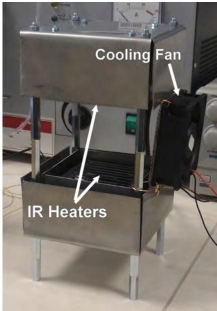  
Fig. 1. Soldering station “Power Tower” with two infrared heaters and a cooling fan

## 3 Experiments

ceramic infrared heaters (IR Heaters) embedded in stainless steel covers which are placed in a horizontal position opposite each other. The soldering station was used to ensure the heating directions for the soldering process. In order to assess the impact of the heat flow direction on the intermetallic layer of the solder balls, three cases of position of the infrared heaters were determined. The first case was determined by supplying heat only from the bottom heater – bottom IR, Fig. 2(a). The second case was heating by the top heater – top IR, Fig. 2(b). The third case was with both infrared heaters – both IR, Fig. 2(c). The soldering station was also equipped with a fan 80 × 80 mm for cooling.

All cases of the position of infrared heaters and their thermal efects are shown in Fig. 2.

The most important part of the experiment was the Power Tower soldering station, which is shown in Fig. 1. The soldering station was created from two 80 × 80 mm

The assembled dummy BGA samples were ball-attached using the Power Tower soldering station. The soldering profiles were optimized according to the SAC305 solder balls and solder flux SMF-08 manufacturer (NeVo, Shenmao Technology Inc.). The main criterion for the design of the soldering profiles was the unification of the basic parameters for all three directions of heating, as shown in Fig. 3. The melting temperature is marked by the dashed line. The temperature was measured with a K-type thermocouple at the top of the BGA dummy. The position of the thermocouple was chosen purposely to simulate the usual selective soldering process practice, where a feedback temperature sensor is placed on the top of the package or the PCB. The temperature during soldering was controlled by a PID controller.

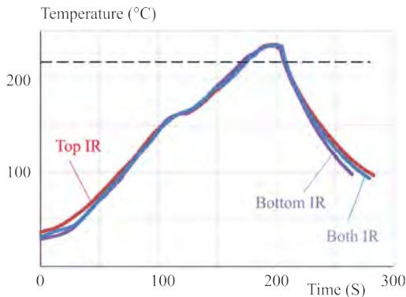

## 3.1 Equipment and reflow soldering

Fig. 3. Temperature profiles for all three cases of reflow soldering

Basic parameters of the temperature profile, Fig. 3, relevant to the formation and growth of intermetallic com-

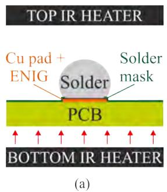

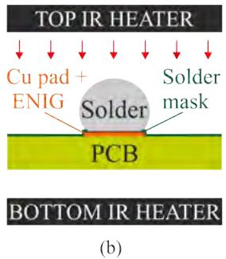

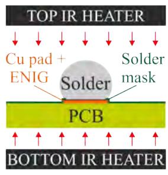  
(c)  
Fig. 2. Principal illustration of the position of infrared heaters during soldering: (a) – bottom IR, (b) – top IR, and (c) both IR

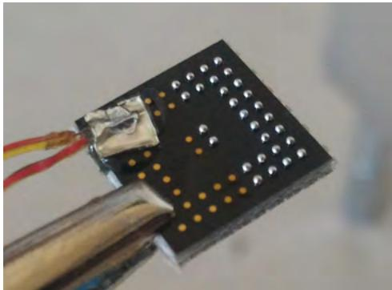

Fig. 4. Sample of dummy BGA with solder balls assembled for soldering process  
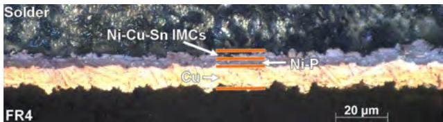  
Fig. 5. Interfacial of solder-solder pad for bottom IR samples

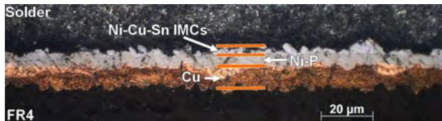

Fig. 6. Interfacial of solder-solder pad for top IR samples  
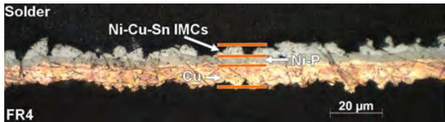  
Fig. 7. Interfacial of solder-solder pad for both IR samples

Table 1. Parameters of temperature profile
<table><tr><td>Parameter</td><td>Unit</td><td>Value</td></tr><tr><td>Ramp up rate to peak temperature</td><td> $^ { \circ } \mathrm { C } / \mathrm { s }$ </td><td>1.2</td></tr><tr><td>Maximum temperature</td><td> $^ \circ \mathrm { C }$ </td><td>235</td></tr><tr><td>Cooling</td><td> $^ { \circ } \mathrm { C } / \mathrm { s }$ </td><td>4</td></tr><tr><td>Time above liquidus</td><td>S</td><td>30</td></tr><tr><td>Heating factor</td><td> $\mathrm { ~ s ~ } ^ { \circ } \mathrm { C }$ </td><td>308</td></tr></table>

pounds are summarized in Tab. 1. In addition to the basic parameters of the temperature profile, the heating factor $\left( Q _ { \eta } \right)$ was calculated. This parameter has been determined for comparability with previous and future research. The heating factor was calculated using the expression [10]

$$
Q _ { \eta } = \int _ { t _ { 2 } } ^ { t _ { 1 } } { \bigl ( } T ( t _ { 1 } ) - T _ { m } { \bigr ) } \mathrm { d } t\tag{1}
$$

where $t _ { 1 }$ is time of beginning of integration, $t _ { 2 }$ is time of end of integration, $T ( t _ { 1 } )$ is temperature and $T _ { \mathrm { m } }$ is the melting temperature of the solder alloy (SAC305). The value of the heating factor of the reflow soldering profile used for this research was $3 0 8 \mathrm { s } ^ { \circ } \mathrm { C }$

The BGA samples $\left( \mathrm { F i g . 4 } \right)$ , the so-called dummy BGA, has been designed to be resembled to the BGA package as far as possible with its parameters in relation to the PCBs used in the manufacturing process. The recommendation was based on the IPC-7351B standard. The dummy BGA was made of base material FR4 with a black solder mask to provide better absorption of infrared radiation from the heating elements during the soldering process. Furthermore its surface was more rough and matt than the commonly used green solder mask. Dummy BGA dimensions were $1 1 \times 1 1 \times 1 . 5$ mm. The soldering pads were designed with a diameter of $4 0 0 \mu \mathrm { m }$ , with respect to the used $5 0 0 \mu \mathrm { m }$ solder balls, and with the ENIG (electroless nickel – immersion gold) surface finish.

The samples were embedded in resin and then metallographic cross-sections were made. After the cross-section process, selective etching was followed to highlight the interface between the solder and the solder pad, intermetallic layer. Selective etching was performed according to IPC-TM-650, 2.1.1 Microsectioning, Manual and Semi or Automatic Method. A solution of 94 % $\mathrm { C _ { 5 } H _ { 5 } O H }$ , 4 % $\mathrm { H N 0 _ { 3 } }$ and 2 % HC1 was used for selective etching. The process was run at room temperature.

## 4 Analysis of intermetallic layer

After the cross-sections were processed, optical micrographs of the samples were taken in the region of the interfacial between the solder and solder pads. Subsequently, computer image analysis was performed using software ImageJ for determination of the thickness of the intermetallic layer and its roughness. First, the mean surface level (MSL) was determined, which is the average value of the IMCs layer thickness using the area of the intermetallic layer A and its length L [11]

$$
M S L = { \frac { A } { L } } .\tag{2}
$$

From the MSL value, roughness was calculated with the unevenness correction of the solder pad layer, which was the nickel layer on copper. The correction was important for more accurate results, as the following formula for calculating the efective surface roughness is applicable to the measured layers with a planar backing layer. The root mean square roughness was calculated according to the following equation [11, 12]

$$
R _ { \mathrm { r m s } } = { \sqrt { { \frac { 1 } { N } } \sum _ { i = 1 } ^ { N } Z _ { i } ^ { 2 } } }\tag{3}
$$

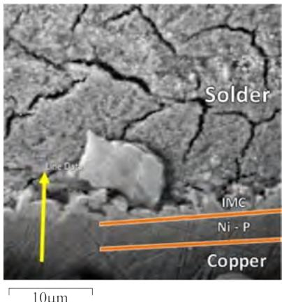  
Fig. 8. Scanned area by the method EDS/SEM (yellow arrow)

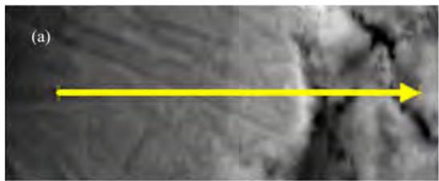

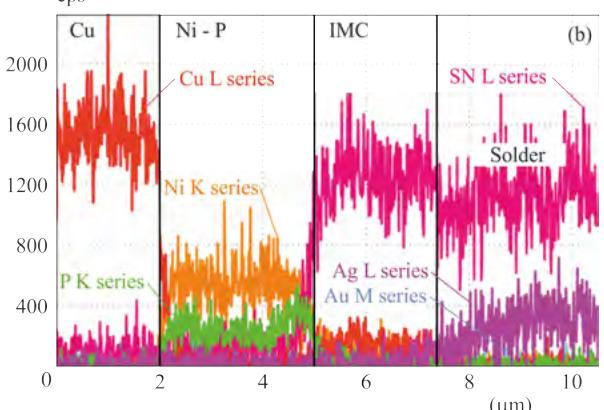  
Fig. 9. (a) – SEM micrograph and (b) – EDX line plot of interfacial layer between solder and solder pad

where N is the total number of measured values, i is the order of the measured value and $Z _ { i }$ is the thickness of the intermetallic inequality measured from the MSL.

These equations were chosen because of the exact value of the surface roughness in the description of the intermetallic layers.

## 5 Results

In Figs. 5, 6 and 7 from [19], the intermetallic interfaces for Bottom IR, Top IR and Both IR samples are presented. In addition to the copper layer and the IMC layer, the nickel-phosphorus layer can also be observed. Diferent thicknesses and roughness of the intermetallic layer can be determined from the images, which will be further investigated by the calculations in this paper.

For verification of the composition of the intermetallic layer, elemental analysis was performed using the energy dispersion spectroscopy (EDS) method integrated in the Tescan MIRA II electron microscope. The scanned area is shown in Fig. 8 marked by a yellow arrow.

Results of EDS analysis are shown in Fig. 9. The yellow arrow in Fig. 8 is identical to the arrow on the SEM image in Fig. 9(a) and shows the x-axis analysis direction, thus 0 is equal to the start of arrow and 10.5 is equal to end of the arrow. Figure 9(b) shows the distribution and representation of copper, nickel, phosphorus and tin elements in the intermetallic layer at the interface between the solder and the copper surface. Also individual layers are marked (solder pad – Cu, nickel and phosphorus (ENIG) – Ni-P, intermetallic layer – IMC and solder).

The main part of this research was the determination of the mean surface level and the root mean square roughness of the intermetallic layer. The graphical dependence of the thickness of the intermetallic layer for all three cases of infrared emitters is shown in Fig. 10. The results show the smallest thickness for samples soldered only by the bottom infrared heater, ie 1.641 µm. The Both IR samples showed the thickness of the intermetallic layer 2.573 µm, which was closer to the intermetallic layer thickness of the Top IR samples. The largest thickness (2.715 µm) was measured for the Top IR samples.

The root mean square roughness of the intermetallic layer is shown in Fig. 11. The smallest roughness values (0.901 µm) was achieved for Bottom IR samples which confirms the micrographs shown in Figs. 5, 6 and 7. Also for the Top IR samples and Both IR samples, optical microscopy inspections were confirmed. Top IR samples had the IMC layer roughness of 1.296 µm and in third case, for, Both IR samples had an average value of roughness 1.628 µm.

## 6 Discussion

The results of the solder-copper interface analysis showed diferent values in terms of the thickness of the intermetallic layer and its roughness. One of the basic parameters that could influence the test results was the soldering profile. For exact verification of the correct settings of the temperature profiles, a heating factor calculation was used to help optimize the soldering profile from the point of view of reliability control, repeatability, soldering process and quality of the resulting soldered joint [2, 13–15].

The diferent thickness of the intermetallic layer was partly caused by the position of the feedback thermocouple for controlling the temperature profile. The thermocouple was attached on the top of the sample. The parameters of the soldering profiles for all three cases are identical, but the heat flow intensity rate was influenced by the position of the infrared heaters and position of feedback thermocouple. The solder balls were heated directly using the top infrared heater (both IR and top IR).

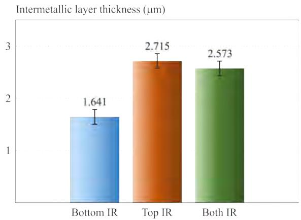  
Fig. 10. Thickness of intermetallic layer for all three cases of position of infrared heaters(bottom IR, top IR and both IR)

Whereas, when the bottom infrared heater was used, the solder balls were heated only through Dummy BGA.

Another factor which could influence the thickness and mainly the roughness of the intermetallic layer was the flow of the liquid solder due to the thermal gradient. The moving inside the melted solder (Marangoni efect, natural convection etc.) contributes to a certain extent to the growth of intermetallic crystals and their spalling [16–18]. In [19], the influence of the direction of heat flow on the crystallographic orientation of solder balls SAC305 for soldering on the Dummy BGA case was determined, namely the creation of more nuclei with diferent crystallographic orientations for soldering from the top side and both sides at the same time (upper and lower heating). Research in [20] describes the phenomenon, when the application of the DC electric current to the drop of the tin solder placed on the copper surface afected the wettability and formation of the intermetallic layer. It was caused by a combination of Marangoni flow and electromigration phenomena. However, the ratio between Marangoni efect and natural convection and the intermetallic phase reaction is not known. Further research is needed in this area.

The main factor afecting the intermetallic layer thickness seems to be thermomigration in the molten solder. A diferent thermal gradient inside the solder ball during soldering causes migration of Cu and Sn elements. Cu migrates toward the warmer end and Sn turns to the end colder. For this reason, probably, Bottom IR samples had a narrower intermetallic layer than both IR and top IR samples [9].

The results of intermetallic layer roughness measurement corresponded to the known phenomenon. Roughness is directly related to the thickness of the intermetallic layer, as described in [21]. The influence of the moving of the melted solder on the roughness of the intermetallic layer should be investigated in further research.

## 7 Conclusion

Findings of this work were as follows:

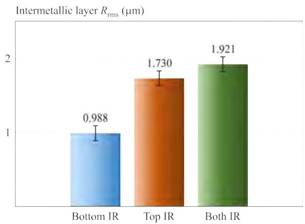  
Fig. 11. Roughness of intermetallic layers for all three cases of position of infrared heaters(bottom IR, top IR and both IR)

• The location of the temperature sensor is essential. The amount of supplied heat during the soldering process from the point of view of the heat source position (from the bottom, from the top and from both sides) is decisive for the ball-attach process of solder preforms. The measured temperature does not correspond to the supplied heat because the amount of heat energy is not the same for formation of intermetallic layers.

The intermetallic layer exhibits diferent thicknesses for solder balls attached by heat flow from three different directions – from the bottom, from the top and from the both sides. The smallest intermetallic layer thickness was observed for bottom IR samples. Due to the verification of the statistical significance of the results for the top IR heater and the both IR heaters a similar thickness of intermetallic layer can be considered.

The average quadratic deviation of the root mean square roughness of the intermetallic layer also shows marked changes. The bottom IR samples had the smallest roughness, compared with the samples soldered by the top infrared heater (top IR) and the two heaters simultaneously (both IR).

In the context of our previous research published at EMPC 2017 [19] it can be hypothesized that intermetallic layers are partly influenced by movements of the melted solder due to diferent concentration and the temperature gradients.

## Acknowledgements

The article was supported by the IGA project FEKT-S-17-3934 under title “Utilization of novel findings in micro and nanotechnologies for complex electronic circuits and sensor applications”. Thanks also to company NeVo (Shenmao Technology Inc.) as a supplier of soldering materials for this work.

## References

[1] V. Wirth, K. Rendl and F. Steiner, “Efect of Multiple Reflow Cycles on Intermetallic Compound Creation”, 38th Inter-

national Spring Seminar on Electronics Technology (ISSE) Hungary (Eger), 2015, pp. 226–230.

[2] D. Buˇsek, K. Duˇsek and O. Renza, “Study of Temperature Profile Influence on Intermetallic Growth”, 40th International Spring Seminar on Electronics Technology, Bulgaria (Sofia), 2017, pp. 1–4.

[3] M. S. Park and R. Arr´oyave, “Concurrent Nucleation, Formation and Growth of Two Intermetallic Compounds (Cu6Sn5 and Cu3Sn ) during the Early Stages of Lead-Free Soldering”, Acta Materialia vol. 60, 2012, pp. 923–934.

[4] M. L. Huang and F. Yang, “Solder Size Efect on Early Stage Interfacial Intermetallic Compound Evolution Wetting Reaction of Sn3.0Ag0.5Cu/ENEPIG Joints”, Journal of Materials Science and Technology vol. 31, 2015, pp. 252–256.

[5] C. E. Ho, R. Y. Tsai, Y. L. Lin and C. R. Kao, “Efect of Cu concentration on the reactions between Sn-Ag-Cu Solders and Ni”, Journal of Electronic Materials vol. 31, no. 6, 2002, pp. 584–590.

[6] R. Pandher and A. Pachamuthu, “Efect of Multiple Reflow Cycles on Solder Joint Formation and Reliability”, SMTA International Conference 2010, pp. 444–449.

[7] J. F. J. M. Caers, X. J. Zhao, E. H. Wong, S. K. W. Seah, C. S. Selvanayagam, W. Driel, N. Owens, M. Leoni, L. C. Tan, P. L. Eu, Yi-Shao Lai and Chang-Lin Yeh, “A Study of Crack Propagation in Pb-Free Solder Joints”, Electronics Packaging Manufacturing vol. 33, no.2, Apr 2010, pp. 84–90.

[8] D. Wang and R. L. Panton, “Efect of Reversing Heat Flux Direction During Reflow on Void Formation High-Lead Solder Bumps”, Journal of Electronic Packaging vol. 127, no.4, 2005, pp. 440–445.

[9] N. Zhao, Y. Zhong, M. L. Huang, H. T. Ma and W. Dong, “Growth Kinetics of Cu6Sn5 Intermetallic Compound at Liquid-Solid Interfaces Cu/Sn/Cu Interconnects under Temperature Gradient”, Scientific Reports vol. 5, 2015.

[10] B. Tao, Y. Wu, H. Ding and Y. L. Xiong, “A Quantitative Method of Reliability Estimation for Surface Mount Solder Joints based on Heating Factor Qη ” Microelectronics Reliability vol. 46, 2006, pp. 864–872.

[11] T. An and F. Qin, “Relationship between the Intermetallic Compounds Growth and the Microcracking Behavior of Lead-Free Solder Joints”, Journal of Electronic Packaging vol. 138, no. 1, 2015.

[12] D. Q. Yu and L. Wang, “The Growth and Roughness Evolution of Intermetallic Compounds of Sn-Ag-Cu/Cu Interface during Soldering Reaction”, Journal ofAlloys and Compounds vol. 458, no.1-2, 2008, pp. 542–547.

[13] J. G. Gao, Y. P. Wu and H. Ding, “Optimization of a Reflow Soldering Process based on the Heating Factor”, Soldering & Surface Mount Technology vol. 19, no. 1, 2007, pp. 28–33.

[14] P. Vesel´y, E. Horynov´a, J. Star´y, D. Buˇsek, K. Duˇsek, V. Zahradn´ık, M. Plaˇcek, P. Mach, M. Kuˇc´ırek, V. Jeˇzek and M.

Dosedla, “Solder Joint Quality Evaluation based on Heating Factor”, Circuit World vol. 44, no.1, 2018, pp. 37–44.

[15] O. Krammer and M. Nagy, “Reliability Comparison of Infrared and Vapour Phase Soldering”, 18th International Symposium for Design and Technology Electronic Packaging (SIITME) 2012, pp. 49–52.

[16] Y. C. Sohn, Jin-Yu, S. K. Kang, D. Y. Shih and T. Y. Lee, “Spalling of Intermetallic Compounds during the Reaction between Solders and Electroless Ni-P Metallization”, Journal of Materials Research vol. 19, 2004, pp. 2428–2436.

[17] Y. Okano, N. Audet, S. Dost and S. Kunikata, “Efect of Liquid Shape on Flow Velocity Induced by Marangoni Convection a Floating Half-Zone System”, Journal ofCrystal Growth vol. 204, no. 1-2, 1999, pp. 243–246.

[18] T. Hurtony, P. Gordon and B. Balogh, “Formation and Distribution of Sn-Cu IMC Lead-Free Soldering Process Induced by Laser Heating”, Micro and Nanosystems vol. 2, no. 3, pp. 178–184.

[19] A. Ot´ahal, J. Somer and I. Szendiuch, “Influence of Heating Direction on BGA Solder Balls Structure”, 21st European Microelectronics and Packaging Conference (EMPC) & Exhibition, 2017 pp. 1–4.

[20] Yan Gu, Ping Shen, Nan-Nan Yang and Kang-Zhan Cao, “Effects of Direct Current on the Wetting Behavior and Interfacial Morphology between Molten Sn and Cu Substrate”, Journal of Alloys and Compounds vol. 586, 2014, pp. 80–86.

[21] A. S. Zuruzi, S. K. Lahiri, P. Burman and K. S. Siow, “Correlation between Intermetallic Thickness and Roughness During Solder Reflow”, Journal of Electronic Materials vol. 30, 2001, pp. 997–1000.

Received 26 June 2018

Alexandr Ot´ahal was born in Brno in 1986. He is currently a PhD student in the Department of Microelectronics at the Faculty of Electrical Engineering and Communication Technology, Brno University of Technology. The topic of his PhD thesis is “Optimization of Factors Influencing the Process of Soldering of Modern Electronic Packages”. The main areas of interest are the quality and reliability of the solder ball joints and the soldering process of BGA packages.

Ivan Szendiuch (born in Brno in 1944) graduated in electronics from the Faculty of Electrical Engineering, Technical University in Brno. In 1968 he started working for Tesla Lanskroun, where he joined the research project on hybrid integrated circuits technology. In 1986 he received PhD degree in hybrid microelectronics. In 1990 he was appointed associate professor at the Technical University in Brno, Faculty of Electronic Engineering and Computer Science. In 2007, he was awarded Fellow IMAPS in San Jose.