Article

# Investigations of Infrared Desktop Reflow Oven with FPCB Substrate during Reflow Soldering Process

Muhammad Iqbal Ahmad 1,2, Mohd Sharizal Abdul Aziz 1,\* , Mohd Zulkifly Abdullah 1 , Mohd Arif Anuar Mohd Salleh 3, Mohammad Hafifi Hafiz Ishak 4, Wan Rahiman 5 and Marcin Nabiałek 6

1 School of Mechanical Engineering, Engineering Campus, Universiti Sains Malaysia, Nibong Tebal 14300, Penang, Malaysia; iqbal.a@umk.edu.my (M.I.A.); mezul@usm.my (M.Z.A.)

2 Faculty of Bioengineering and Technology, Jeli Campus, Universiti Malaysia Kelantan, Jeli 17600, Kelantan, Malaysia

3 Center of Excellence Geopolymer and Green Technology (CEGeoGTech), Universiti Malaysia Perlis (UniMAP), Kangar 01000, Perlis, Malaysia; arifanuar@unimap.edu.my

4 School of Aerospace Engineering, Engineering Campus, Nibong Tebal 14300, Penang, Malaysia; mhafifihafiz@usm.my

5 School of Electrical and Electronic Engineering, Engineering Campus, Universiti Sains Malaysia, Nibong Tebal 14300, Penang, Malaysia; wanrahiman@usm.my

6 Department of Physics, Faculty of Production Engineering and Materials Technology, Czestochowa University of Technology, 42-200 Czestochowa, Poland; nabialek.marcin@wip.pcz.pl Czestochowa University of Technology, 42-200 Czestochowa, Poland; nabialek.marcin@wip.pcz.pl

Correspondence: msharizal@usm.my

Citation: Ahmad, M.I.; Abdul Aziz, M.S.; Abdullah, M.Z.; Salleh, M.A.A.M.; Ishak, M.H.H.; Rahiman, W.; Nabiałek, M. Investigations of Infrared Desktop Reflow Oven with FPCB Substrate during Reflow Soldering Process. Metals 2021, 11, 1155. https://doi.org/10.3390/ met11081155

Academic Editors: Diego Celentano and Javier S. Blázquez Gámez

Received: 23 May 2021   
Accepted: 17 July 2021   
Published: 21 July 2021

Publisher’s Note: MDPI stays neutral with regard to jurisdictional claims in published maps and institutional affiliations.

Copyright: © 2021 by the authors. Licensee MDPI, Basel, Switzerland. This article is an open access article distributed under the terms and conditions of the Creative Commons Attribution (CC BY) license (https:// creativecommons.org/licenses/by/ 4.0/).

Abstract: This paper presents the study of infrared (IR) reflow oven characteristics for suitable operating conditions of the flexible printed circuit board (FPCB) in the reflow soldering process. A computer-based model that imitates a real-time oven was developed with practical boundary conditions. Since the radiation effect is dominant in the reflow process, a discrete ordinate (DO) model was selected to simulate the effect. The experimental work acts as a benchmark and the reflow profile was set to follow the standards of JSTD-020E. The simulation of the model has a great consensus between the experimental data. It was found that the temperature distribution was inhomogeneous along with the phases. The FPCB surface also has a higher surface temperature than oven air during the operating reflow profile. An in-depth study using the simulation approach reveals that the temperature distribution of the desktop reflow oven is dependent on several factors, namely fan speed, FPCB position, and FPCB thickness. The rotational fan generates an unsteady flow that induces inhomogeneous temperature at different positions in the reflow oven cavity. The results are useful for studying further improvements to achieve temperature uniformity within the oven chamber.

Keywords: surface mount technology; FPCB; reflow soldering; computational fluid dynamics

## 1. Introduction

Industrialists and researchers have diverted their focus towards miniaturization of electronic appliances over the last decade. Electronic appliances, such as smartphones, electronic gadgets, and control systems available in the market are expected to meet challenging consumer demands, wherein the hardware plays a role enabling complicated functions as effective interfaces and durable components [1]. However, enhancing their reliability has remained an evolving challenge owing to the manufacturing processes [2]. In addition to the printing and placement of components in the reflow soldering process, the heat source is considered as one of the crucial steps in the processes [3]. An understanding of the thermal reflow profile is essential to control the soldering process and its process parameters, which will help in improving the performance of the solder, that is, it would be possible to influence the microstructure of the solder joint microstructure, increase the thickness of the intermetallic compound [4] and improve the shear force it can sustain [5].

Vapour phase soldering (VPS) is an established method of reflow soldering. The method utilizes the effect of heat transfer from the condensation phase. The prepared assembly of the board is immersed in the vapour space for condensation to take place [6]. Illés et al. [7] initially developed a model of this method and successfully investigated the effect on the solder assembly. The study found that the immersion of the board was able to alter the vapour space and control the shapes of the thermal profile of VPS. Another study by Illés et al. [8] explored the method of using a low vapour pressure or concentration. It was observed that a low concentration could reduce the number of gas voids in the solder joints. Géczy et al. [9] used an explicit model to imitate the VPS to resolve the issue of film-wise condensation heat transfer based on the Nusselt theory. Multiple case studies attempted to offer a practical approach to viewing the problem. However, most of the studies focused on the static condensate layer, which had low accuracy. Therefore, Illés et al. considered a dynamic condensate layer in the VPS process [10]. The formation and motion of the layer and convective temperature transport effect were required for the dynamic approximation.

Another widely used but not often scientifically investigated method employed a radiation reflow oven. This method used the principle of heatwave transfer to heat the PCB assembly. The oven with a medium or long wave was generated by an infrared (IR) emitter panel or quartz heater that was placed on the top or bottom of the oven space [11]. The existing literature on the heat transfer in the soldering process can be classified based on radiation and forced convection. Park et al. [12] simulated the radiation using the discrete ordinates (DO) model to include the thermal radiation in the oven cavity. Meanwhile, Verboven et al. [13] suggested the surface to surface (S2S) model to investigate the heat transfer in a pilot plant oven. Chhanwal et al. [14] compared the previous two models with a discrete transfer radiation model (DTRM). Based on the diversity of the findings, tthe DO model was chosen to be compared with the experimental data throughout the study. Lau et al. [15] claimed that the DO model was suitable for the case study with a localized heat source, such as using the IR. In regard to the numerical approach, the DO also poses the advantages of moderate computational cost in tetrahedral angular discretization with modest use of memory. Son and Sin [16] initially proposed adding air $( \mathrm { i . e . , }$ forced convection) into the soldering process through the porous panel heater to dampen the temperature fluctuations in the IR oven. However, the study was restricted to 2D model soldering processes. Verboven et al. [17] expanded the work to analyse the 3D model in a combination of natural and forced convection regimes. The proposed regime, as suggested, was able to maintain the uniformity of heat transfer and reduction of moisture accumulated inside the oven. As highlighted by Khatir et al. [18], the radiation was the predominant mode of heat transfer during lower velocities of airflow, and contrarily, at a higher velocity, the heat transfer was forced convection.

The FPCB is a promising technology as it is a soft feature film, flexible and lightweight. It is also referred to as an alternative to the rigid printed circuit board (RPCB) for electronic applications. The FPCB offers a potent of space-efficient design, enhances the inside system presence, and reduces weight and installation cost [19,20]. The FPCB is designed with different materials to carry unique properties that improve the thermal, chemical and mechanical properties. The most commonly used materials in the FPCB is plastic, which uses a medium-based mechanism to provide flexibility and mechanical integrity [21]. Another possible material includes the group of polymer foils. Polyethylene naphthalate (PEN), polyester (PET), or polyimide (PI) are the most used polymer foils in the FPCB. These materials have different properties, such as a high Young’s modulus (E) and glass transition temperature $( \mathrm { T _ { g } } )$ , resulting in different design properties of the FPCB. For example, Gang et al. [22] found that the $\mathrm { T _ { g } }$ of the PEN, PET, and PI were 78,123, and $3 0 0 ^ { \circ } \mathrm { C }$ , respectively. So far, several electronic devices have adopted the coupling between RPCB and FPCB. For example, Yoon et al. [23] applied the thermo-compression bonding method to bind these two boards. The authors had successfully determined the optimum bonding conditions, i.e., force, time, and temperature. Another study by Yoon et al. [24], analysed the effect of the bonding method on joint reliability using a high-temperature storage test. For a temperature of $1 2 5 ^ { \circ } \mathrm { C } ,$ the interfaces formed in PCB joints were observed to experience a change in the failure mode from a polyimide-electrode failure to brittle IMC failure. On the other hand, Lee et al. [25] employed ultrasonic vibration to bind the electrodes. The electrodes were able to be bonded without any adhesive at a low temperature and time.

An in-depth understanding of the reflow oven with FPCB is required to facilitate the manufacturer to control the reflow profile during the soldering process. An associated study by Lau and Abdullah [15] performed analytical research on the thermal effect and focused on the FR-4 material assembly using the DO model to study the heating behavior of the heating source. The study highlighted that PCB near edges and corners were the first to be heated. Another study by Lau et al. [26] applied a grey-based Taguchi method to optimize the process. The Taguchi method determined the optimal parameters to be considered to reduce solder joint defects. Yamane et al. [27] redesigned the hot air blowing unit of the oven by altering the layout of the hot air panel. The authors claimed that it could increase the heating ability wherein infrared and fan convection were used as the heating elements. This study can be regarded as the work continued after the optimization of the reflow oven process, as pioneered by Najib et al. [28]. The authors successfully simulated the process for different reflow settings and were able to determine the overheat of the RPCB. The study, however, did not consider the FPCB and optimum positioning in the oven, which is of main interest in the current research.

This paper is devoted to formulating the numerical representation of the desktop reflow oven with the use of FPCB substrates subjected to the reflow soldering process. The operating temperature setting was set following JSTD 020E, as a concerning aspect before conducting the soldering process analysis. The RNG k-epsilon (RNGKE) and DO radiation models were used to model the airflow and radiation effect in the reflow process, respectively. The simulation data was then validated with the experimental temperature profile. The understanding of the oven chamber temperature and substrate thermal properties facilitated the control of thermal reflow profiling at a stationary position in the desktop oven.

## 2. Numerical Approach

## 2.1. Governing Equations

To investigate the effect of IR heater heat flux and the airflow of the 3D reflow oven on thermal characteristics, numerical and experimental methods were conducted. The simulation model was validated before further analysis inside the oven chamber was carried out. The numerical approach was based on the finite volume method (FVM), the main framework in this reflow simulation, and was employed by using the ANSYS Fluent software (ANSYS Inc., Canonsburg, PA, USA). The fluid in this study, i.e., the air that flows inside the oven, is assumed incompressible. The governing equations explain that the single-phase fluid flow model follows the conservation of mass and momentum. The software used the Cartesian spatial coordinates in the differential control volume; it was written in non-dimensional form to solve the following domains [29].

The continuity equation is used to describe the transport of any quantity that is valid with incompressible flows. In a single-phase with an incompressible fluid, the continuity equation can be written as below

$$
{ \frac { \partial \rho u _ { i } } { \partial x _ { i } } } = 0\tag{1}
$$

where $u _ { i }$ reflects the velocity component in the $x _ { i }$ direction $( \mathrm { f o r } i = 1 , 2 ,$ , and 3 are referred to $x , y$ and z-axes).

The conservation of momentum describes the collision between the particles. By neglecting buoyance terms, the equation can be described as follows

$$
\frac { \partial } { \partial t } ( \rho u _ { i } ) + \frac { \partial } { \partial x _ { j } } \big ( \rho u _ { i } u _ { j } \big ) = - \frac { \partial P } { \partial x _ { i } } + \frac { \partial \tau _ { i j } } { \partial x _ { j } } + \rho g _ { i } b + F _ { i }\tag{2}
$$

where $\rho$ is the fluid density, $P$ is the static pressure, $g$ is the gravitational acceleration $( \mathrm { i . e . }$ $9 . 8 1 \mathrm { m } \mathrm { / s } ^ { 2 } ) ,$ $u _ { i }$ is the velocity component, $\tau _ { i j }$ is the viscous stress tensor, and F is external body force in the ith direction.

Considering thermal energy in the oven space, the energy equation can be derived as Equation (3),

$$
\frac { \partial } { \partial t } \big ( \rho C _ { p } T \big ) + \frac { \partial } { \partial x _ { i } } \big ( \rho u _ { i } C _ { p } T \big ) = - \frac { \partial } { \partial x _ { i } } + \frac { \partial } { \partial x _ { j } } \bigg ( \lambda \frac { \partial T } { \partial x _ { i } } \bigg ) + S _ { h }\tag{3}
$$

where $C _ { p } , T ,$ and λ denotes the specific heat, temperature, and thermal conductivity of the hot air, respectively. The source terms from the IR heat flux and the explained radiation are included in the energy equation.

The radiation that sources from the IR heater generates heat with unsteady temperatures throughout the oven chamber. The DO model was selected to describe the radiative heat transfer that occurred. The DO model was considered to solve changes in the radiative intensity (∂I) in associated Cartesian spatial coordinates $( \partial _ { x i } )$ [30]. Thus, the transient radiative transport equation (RTE) for the emitting-absorbing-scattering medium is written as in Equation (4) and is coupled with Equation (3) for the solution.

$$
\frac { \partial I } { \partial _ { { x } _ { i } } } = - ( \alpha + \sigma _ { s } ) I ( { r } . { s } ) + \alpha { n } ^ { 2 } \frac { \sigma { T } ^ { 4 } } { \pi } + \frac { \sigma _ { s } } { 4 \pi } \int _ { 0 } ^ { 4 \pi } I ( { r } . { s } ) \Phi \big ( { s } . { s } ^ { \prime } \big ) d { \Omega } ^ { \prime }\tag{4}
$$

where the terms in the right side of the equal sign are meant for local absorption, emitting, and scattering transport mechanisms for radiation intensity. The radiation intensity (I) in the direction vector (r.s) is dependent on the two parameters, absorption (α) and scattering coefficients $( \sigma _ { \mathrm { { s } } } )$

The intensity could increase due to the in-scattering of surface emission of the IR lamp heater. T is the local temperature and $\sigma$ is the Stefan-Boltzmann constant $( 5 . 6 7 2 \times 1 0 ^ { - 8 } \mathrm { W / m } ^ { 2 } \mathrm { K } ^ { 4 } )$ . Hence, the DO model was considered to be suitable for desktop reflow oven for the soldering process with a localized heat source.

The proportional airflow in the oven space is directive vertically from the fan cage corresponding to the rotational centrifugal fan and becomes turbulent as a result of the interaction of flow circulation with the walls. As per the nature of the flow described above, the Re obtained is in the turbulent regime. Therefore, the turbulent CFD codes, the RNG k-epsilon (RNG KE) model is selected by considering swirl dominated flow which consists of two transport equations as follows:

$$
\frac { \partial } { \partial t } ( \rho k ) + \frac { \partial } { \partial x _ { i } } ( \rho k u _ { i } ) = \frac { \partial } { \partial x _ { j } } \left[ \left( u + \frac { u _ { t } } { \sigma _ { k } } \right) \frac { \partial } { \partial x _ { j } } \right] + G _ { k } - \rho \varepsilon\tag{5}
$$

$$
\frac { \partial } { \partial t } ( \rho \varepsilon ) + \frac { \partial } { \partial x _ { i } } ( \rho \varepsilon u _ { i } ) = \frac { \partial } { \partial x _ { j } } \left[ \left( u + \frac { u _ { t } } { \sigma _ { \varepsilon } } \right) \frac { \partial \varepsilon } { \partial x _ { j } } \right] + C _ { 1 \varepsilon } \frac { \varepsilon } { k } ( G _ { k } + C _ { 3 \varepsilon } G _ { b } ) - C _ { 2 \varepsilon } \rho \frac { \varepsilon ^ { 2 } } { k } - R _ { \varepsilon }\tag{6}
$$

where $G _ { k }$ is the turbulent production term due to mean velocity gradients, and the negative term refers to energy dissipation. In the RNGKE, the swirling flow is accounted for by appropriately modifying the turbulent viscosity using the additional representation as follows:

$$
\mu _ { t } = \mu _ { t 0 } f \biggl ( \alpha _ { s } , \Omega , \frac { k } { \varepsilon } \biggr )\tag{7}
$$

where $\mu _ { t 0 }$ is the value of turbulent viscosity calculated without the swirl modification. The swirl constant, $\alpha _ { s } = 0 . 0 7$ and the closure constants, $C _ { 1 \varepsilon } = 1 . 4 2 , C _ { 2 \varepsilon } = 1 . 6 8$ , are the parameter

values used in the model. The air properties are defined according to the ideal gas equation,� and the calculation for the density $( \rho )$ are as follows

$$
\rho = { \frac { R } { T } }\tag{8}
$$

where R is the specific gas constant, and T is the temperature.The 3D assembly of the fluid domain was modelled

## 2.2. Fluid Domain Modellingtated the actual oven wi

The 3D assembly of the fluid domain was modelled using Design Modeller in ANSYS substrate of dimensions (50 × 50) mm was deducted from the domain as dep Workbench v.18 (ANSYS Inc, Canonsburg, PA, USA). The half oven geometry that imitatedFigure 1. The asymmetrical plane for the half geometry was chosen to save compu the actual oven with dimensions of $( 3 1 0 \times 1 9 5 \times 1 9 0 )$ mm was generated, and the solid substrate of dimensionsడ௨ డ் $( 5 0 \times 5 0 )$ mm was deducted from the domain as depicted in Figure 1. The asymmetrical plane for the half geometry was chosen to save computationalడ௫ డ௫ . In FLUENT (Fluent Inc, New York, NY, USA), an incompressible, t time, where the temperature gradient and velocity of air across the plane are minimal,set, and a turbulent viscous model were used. The following boundary conditio $\begin{array} { r } { { \frac { \partial u } { \partial x } } = { \frac { \partial T } { \partial x } } = 0 . } \end{array}$ . In FLUENT (Fluent Inc, New York, NY, USA), an incompressible, transientsed on the simulation: set, and a turbulent viscous model were used. The following boundary conditions wereAt the fan: Modelled using a rotational wall function with rotational motion specified based on the simulation:

At the fan: Modelled using a rotational wall function with rotational motion in ANSYS FLUENT with a defined rotational speed of the fan that was measured experimentally using SKF TKRT 10 tachometers (SKKF, Stockholm, Sweden), at an average angular velocity value of 150 rad/s in the negative y-axis direction.Infrared heaters: The heater acted as a hea

Infrared heaters: The heater acted as a heat source with a polynomial heat flux profilewas recorded during the experiment. The flux was calculated based on the and was recorded during the experiment. The flux was calculated based on the surfacearea and average power. Each heater lamp produced power of 100 W with its surf area and average power. Each heater lamp produced power of 100 W with its surface areaof 0.017 m2. Based on this information, each of the lamps generates a symmetrica ofap $0 . 0 1 7 \mathrm { m } ^ { 2 }$ . Based on this information, each of the lamps generates a symmetrical flux oftely 5400 W/m2. Then, the user-defined function code (UDF) of polynom approximately 5400 $\mathrm { { } } W / \mathrm { { m } } ^ { 2 }$ . Then, the user-defined function code (UDF) of polynomial heat flux was set at the outer surface of the heater lamp in FLUENT.

At the outlets: A group of outlets located at the bottom oven was defined as pressure outlet boundaries. The operating condition of the outlet was set at an atmospheric pressure condition of 1 atm.sure condition of

At the wall: The oven wall and PCB were defined with an emissivity value of 0.1 [31]At the wall: The oven wall and PCB were defined with an emissivity value of and 0.9 [32], respectively. A no-slip condition was applied for the walls.and 0.9 [32], respectively. A no-slip condition was applied for the

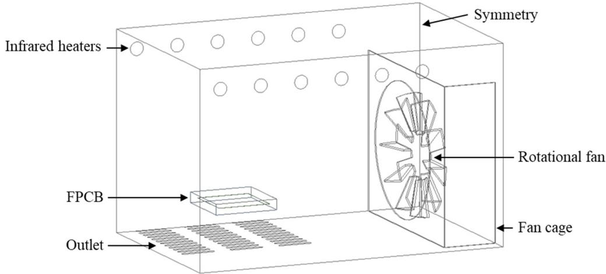  
Figure 1. Overall view of the 3D model of the oven with FPCB.

A commercialized solid substrate was used with the chosen substrate and formed as a single-sided type, comprised of a single polyimide and copper layer, with an overall thickness of 53 µm [33]. The thermal properties assigned for the FPCB are presented in Table 1. The heating unit from the IR heater lamps was mounted on the top side, wherein the FPCB substrate was placed inside a steel cage positioned 46 mm above the outlet region. For the numerical solver, the Semi-Implicit Method (SIMPLE) algorithm [34–36] scheme was used to solve the coupling velocity and pressure. A convergence of mass flow was set to $1 0 ^ { - 3 }$ , meanwhile energy and do-intensity criteria were set to $1 0 ^ { - 6 }$ . All of the setup made was used the second-order upwind scheme to achieve high accuracy.

Table 1. Mechanical and thermal properties of the FPCB.
<table><tr><td>Type of Properties</td><td>Parameter</td><td>Value</td></tr><tr><td>Mechanical</td><td>Density (kg/m³)</td><td>3839</td></tr><tr><td rowspan="3">Thermal</td><td>Thermal conductivity (W/mK)</td><td>0.3</td></tr><tr><td>Specific heat capacitance (J/kg K) Coefficient of thermal expansion</td><td>421</td></tr><tr><td>(ppm/K)</td><td>30</td></tr></table>

## 2.3. Grid Independency Test

Table 2 shows the results of the grid independency test for the fluid domains, respectively. The minimum error of the measured parameters, for example, temperature and deformation, was preferred for both domains. Among the models, Model 3 was used for further fluid domain analysis that demonstrated the saturation data was obtained at magnitude deviation error of less than 0.1% for the tested parameters with fixed execution time. A similar observation was reported by Ng et al. [37], and Khor et al. [38] that indicated that a discrepancy of 3% and below was acceptable for this study. Apart from that, the time step size of 0.005 s was chosen as an optimum time, which gives low computational cost with closest and realistic predictions.

Table 2. Grid independency test for the fluid domain.
<table><tr><td>Model</td><td>Elements</td><td>Temperature (K)</td><td>Difference (%)</td></tr><tr><td>1</td><td>479,270</td><td>525.2</td><td>0.57</td></tr><tr><td>2</td><td>535,276</td><td>524.4</td><td>0.42</td></tr><tr><td>3</td><td>674,521</td><td>522.7</td><td>0.09</td></tr><tr><td>4</td><td>801,301</td><td>521.7</td><td>0.10</td></tr><tr><td>5</td><td>1,024,285</td><td>522.2</td><td>-</td></tr></table>

## 2.4. Model Validations

Figure 2 depicts the evidence of the validation study for the fluid domain. From the figure, two validation methods were carried out for both domains, i.e., for the FPCB and air in the preheating phase (0\~60 s). The average data and error bars were computed on both domains from the repetitive experimental works. It is noticed that there was a slight gap between the oven air and the FPCB in the experimental and numerical approaches for reflow time above 30 s and onwards. This may due to radiant energy from the infrared heater with relative magnitudes that vary on heat absorption depending on the medium. Overall, the discrepancy between experiment and simulation approaches for the fluid domain was below 2% and indicated good agreement. Eventually, this mode validation can be exploited as an initial validation of the reflow process, for the results of numerical simulation, i.e., a predicted analysis. The experiment data of oven air temperature and FPCB surface temperature are shown in Appendix A.

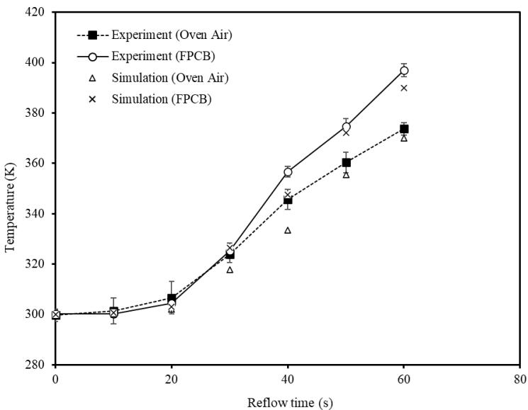  
gure 2. Comparison between experimental and simulation on fluid analysis. Figure 2. Comparison between experimental and simulation on fluid analysis.

## 3. Experimental Setupal Setup

## 3.1. Desktop Reflow Ovenflow Oven

Figure 3a shows the inner components of the oven. It was equipped with an infraredws the inner components of the oven. It was equipped with an infrared Figure 3a shows the inner components of the oven. It was equipped with an infrared heating lamp and a circulating fan to enable the recirculation of air internally. Thermaland a circulating fan to enable the recirculation of air internally. Thermal eating lamp and a circulating fan to enable the recirculation of air internally. Thermal profiling for the soldering was applied to the FPCB used in the study. The oven chamberhe soldering was applied to the FPCB used in the study. The oven chamber rofiling for the soldering was applied to the FPCB used in the study. The oven chamber was equipped with the two steel fans with a blade thickness of 2 mm and a diameter of with the two steel fans with a blade thickness of 2 mm and a diameter of as equipped with the two steel fans with a blade thickness of 2 mm and a diameter of 115 mm, and a group of series outlet slots. Since the fan is centrifugal type, radial flow isa group of series outlet slots. Since the fan is centrifugal type, radial flow is 5 mm, and a group of series outlet slots. Since the fan is centrifugal type, radial flow is dominated towards the upper radiation lamp, despite forcing the flow to a cage. The heatwards the upper radiation lamp, despite forcing the flow to a cage. The heat ominated towards the upper radiation lamp, despite forcing the flow to a cage. The heat sources were generated from six inline infrared heater lamps, which were made of glassgenerated from six inline infrared heater lamps, which were made of glass urces were generated from six inline infrarwith an outer surface diameter of 12.8 mm.surface diameter of 12.8 mm.

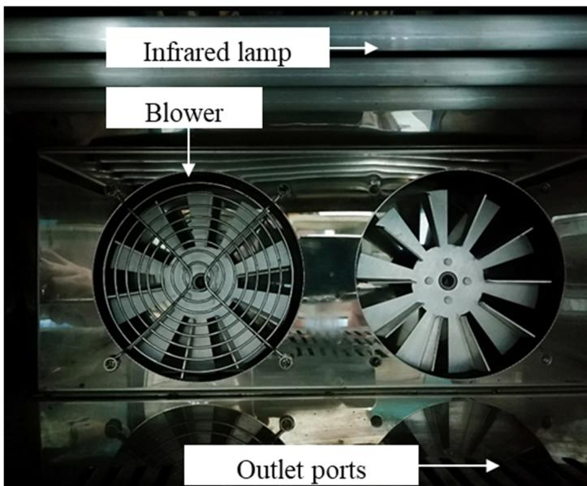  
Figure 3. Cont.  
(a)

(b)(b  
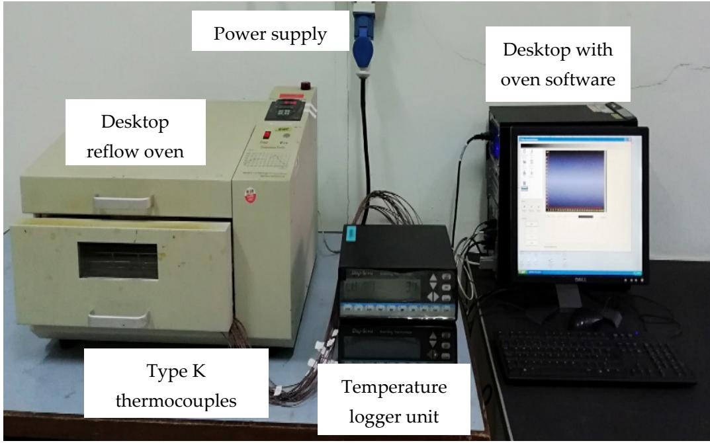  
Figure 3. (a) Inner components and (b) overall setup of the desktop reflow oven.Figure 3. (a) Inner components and (b) overall setup of the desktop reflow oven.Figure 3. (a) Inner components and (b) overall setup of the desktop reflow ove

The experimental setup is shown in Figure 3b. A series of thermocouples were usedThe experimental setup is shown in Figure 3b. A series of thermocouples were to measure the temperature at a particular location for verification purposes. These ther-used to measure the temperature at a particular location for verification purposes. These mocouples were connected to the data logger unit for the data to be sent to the oven soft-thermocouples were connected to the data logger unit for the data to be sent to the oven ware. Figure 4 provides the schematic diagram of the experimental setup. A data acquisi-software. Figure 4 provides the schematic diagram of the experimental setup. A data tion software, Reflow Center 1.03E (Madell Technology, Ontario, CA, USA), linked to theacquisition software, Reflow Center 1.03E (Madell Technology, Ontario, CA, USA), linked desktop oven, was utilized. In the software, a proportional-integral-derivative (PID) con-to the desktop oven, was utilized. In the software, a proportional-integral-derivative (PID) controller was also used to keep the temperature inside the oven chamber at the desired during thermal profiling. The oven heating system was modulated to operate an on andlevel during thermal profiling. The oven heating system was modulated to operate an on and off-cycle for maintaining at relative temperatures.

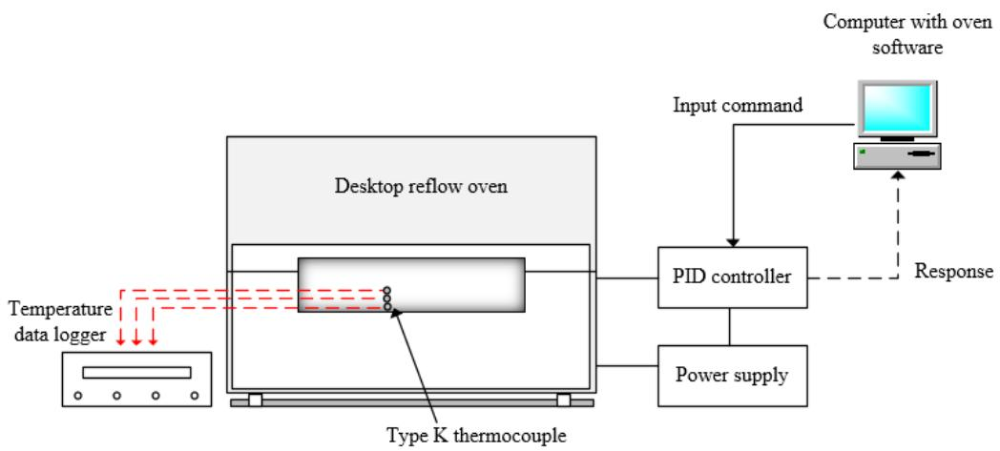  
Figure 4. Schematic diagram of the desktop reflow oveFigure 4. Schematic diagram of the desktop reflow oven.

In this experiment, reflow profiling was based on the JEDEC JSTD-020E standards [28] presented as in Figure 5. The profile consists of four sections, namely preheating, soaking, reflow, and cooling. Timeframes of 60\~120 s and 60\~150 s are the recommended durations for the soaking and soldering phases, respectively. Meanwhile, a temperature ranging between $2 0 0 { \sim } 2 2 0 ~ ^ { \circ } C$ is the peak temperature setting for the SAC solder material. At the reflow section, the temperature ramp-up rate and ramp-down rate used were less than9 of 22 $3 ^ { \circ } \mathrm { C } / \mathrm { s }$ and $6 ^ { \circ } C / \mathsf { s }$ , respectively.

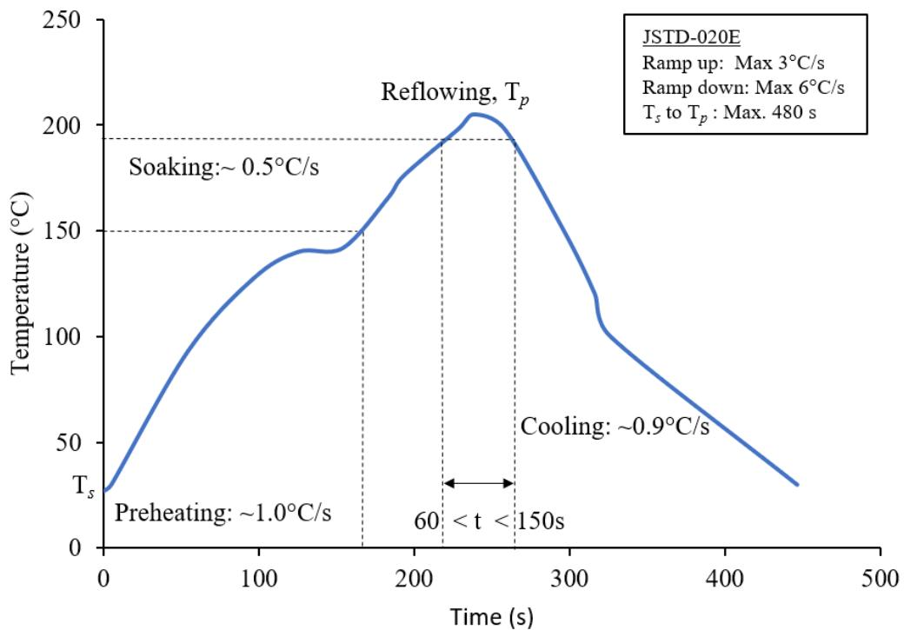  
Figure 5. Thermal profile setting in the reflow oven.Figure 5. Thermal profile setting in the reflow oven.

## 3.2. Oven Chamber Temperature

The uniformity of temperature in the desktop reflow oven chamber was determined based on the recorded temperatures. The experiment was designed similar to the set up used to investigate the thermal distribution inside the reflow oven cavity, based on the reflow soldering process temperature setting. The initial temperature of the oven chamber was controlled and maintained within the range of $2 5 { \sim } 2 8 ~ ^ { \circ } C$ before the commencement of the reflow soldering process.

For measurement of the intrinsic temperature of the bulk air temperature throughout the cavity, K-type thermocouples (TC) wire $( \pm 2 . 2 ^ { \circ } \mathrm { C } )$ , 100 cm in length with a sheath diameter of 1.5 mm, and temperature logger unit (±0.1%), were used. Figure 6 shows the experimental setup, with the thermocouples were in an array in the middle position on each column to stabilize the undesired fluctuation from the edge or corner region. A total of 60 thermocouples wires were used in the steel cage, only at one side due to the symmetrical cavity owing to the infrared wave creating non-uniform heating. The measurement was taken at one reference position and repeated with a maximum temperature deviation of 5%, followed by a total number of thermocouples that were used. The data were recorded viation of 5%, followed by a total number of thermocouples that were used. The data were for an interval of 4 s using Digi Sense Scanning Thermometer instruments (Cole-Palmer, recorded for an interval of 4 s using Digi Sense Scanning ThVernon Hills, IL, USA)), followed by temperature analysis.

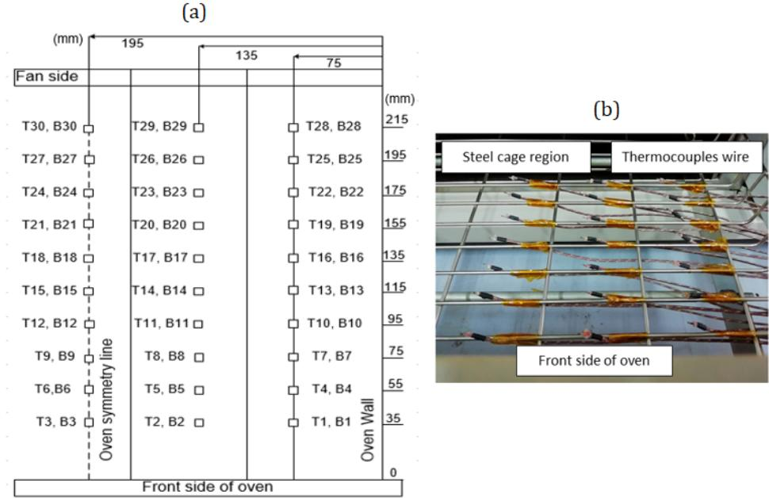  
Figure 6. (a) Layout of the placement locations of the thermocouple in the oven steel cage regioFigure 6. (a) Layout of the placement locations of the thermocouple in the oven steel cage region andFigure 6. (a) Layout of the placement locations of the thermocouple in the oven steel cage region and (b) its actual i(b) its actual image.

## 3.3. Temperature Measurement on FPCB Test Board3.3. Temperature Measurement on FPCB Test Boar

Temperature measurements were conducted on the FPCB surface. The tested FPCBsTemperature measurements were conducted on the FPCB surface. The tested FPCBs were placed at two specific positions, one at the front region (75 mm from the front side)were placed at two specific positions, one at the front region (75 mm from the front side) and one at the back region (135 mm from front side). The FPCB was attached to the testand one at the back region (135 mm from front side). The FPCB was attached to the test vehicle together and was fixed using Kapton Tape at all edges. Then, type K thermocouplevehicle together and was fixed using Kapton Tape at all edges. Then, type K thermocouple wires were used, which were attached using aluminium tape (5 × 5) mm, while anotherwires were used, which were attached using aluminium tape (5 × 5) mm, while another Kapton tape of a bigger size (20 × 10) mm was used as a cover (to have a secure connectionKapton tape of a bigger size (20 × 10) mm was used as a cover (to have a secure connection between thermocouple bead and FPCB tested surface), as shown in Figure 7. The 0.5 mmbetween thermocouple bead and FPCB tested surface), as shown in Figure 7. The 0.5 mm bead diameter thermocouple was used at identical points on the FPCB surface to measurebead diameter thermocouple was used at identical points on the FPCB surface to measure the temperature changes by running the thermal profile setting. For each FPCB position,the temperature changes by running the thermal profile setting. For each FPCB position, average values were considered, owing the latter distance effects to the oven heating. Then,average values were considered, owing the latter distance effects to the oven heating. the logged values were computed and compared with the simulation data.Then, the logged values were computed and compared with the simulatio

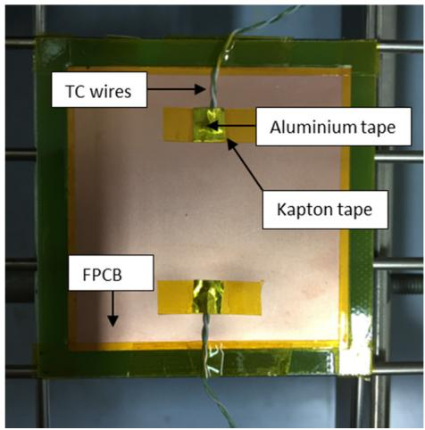  
(a(a)

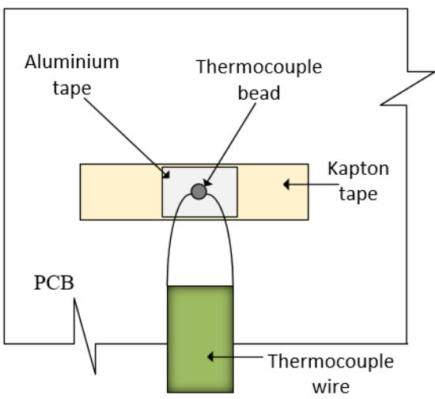  
(b(b)  
Figure 7. Figure 7. (a) Actual locations of the thermocouples and (b) attachment method of thermocouples on the surface.(a) Actual locations of the thermocouples and (b) attachment method of thermocouples on the surface.

## 3.4. FPCB Tensile Test

In the tensile test, a single-sided type purchased FPCB was used; it consisted of a single layer of polyimide and a single copper layer with an overall thickness of 0.053 mm. The test was carried out according to the standard ASTM D368 (ASTM International, 2003), for evaluation for compliance with plastic tensile properties. The experiments were repeated four (4) times and were carefully recorded, and the average values were computed using the defined procedure. A universal testing machine (INSTRON model type 3367, Instron, Norwood, MA, USA) was used to evaluate Young’s Modulus (E) and yield strength (σ) of the FPCB at the tested speed of 50 mm/min with the trial samples. The plot of the stress-strain curve will be further discussed in the next section.

## 4. Results

## 4.1. Oven Chamber Temperature Distributions4.1. Oven Chamber Temperature Distribut

## 4.1.1. Temperature Distribution of Reflow Oven4.1.1. Temperature Distribution of Reflow O

Figure Fig $_ { 8 \mathbf { a } , \mathbf { c } }$ show the experimentally obtained temperature profile for thea,c show the experimentally obtained temperature profile for the $1 4 0 ~ ^ { \circ } \mathrm { C } ,$ $1 8 0 ^ { \circ } \mathrm { C }$ andand $2 0 7 ^ { \circ } \mathrm { C } ,$ preheating, soaking, and reflow phases, respectively. It was observedpreheating, soaking, and reflow phases, respectively. It was observed that the temperature distribution of the oven chamber was nonhomogeneous along withthe temperature distribution of the oven chamber was nonhomogeneous along with the setting phase. With regard to the plane, the temperature of the upper plane was foundsetting phase. With regard to the plane, the temperature of the upper plane was foun to be higher than the lower plane. The increasing trend was also observed for the variousbe higher than the lower plane. The increasing trend was also observed for the vari phases. This could be attributed to the close proximity of the board to the infrared heaterphases. This could be attributed to the close proximity of the board to the infrared he as it is placed on top of the oven cavity.as it is placed on top of the oven ca

(a)  
Upper plane (T1-T30)  
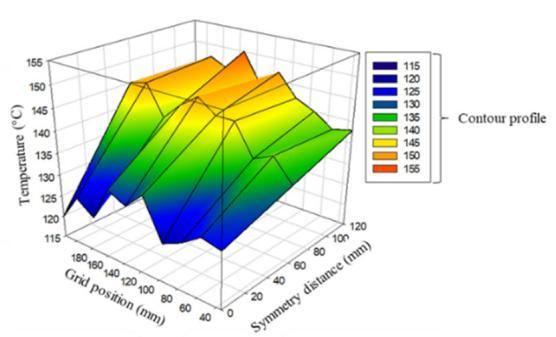

Lower plane (B1-B30)  
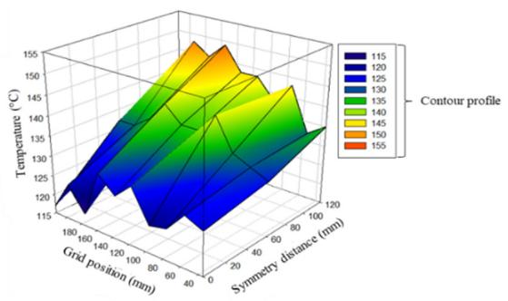

(b)  
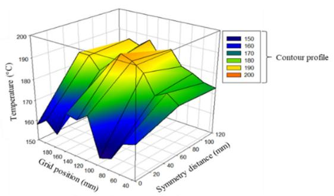  
Figure 8. Cont.

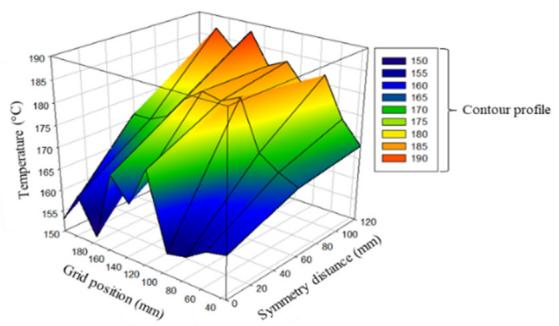

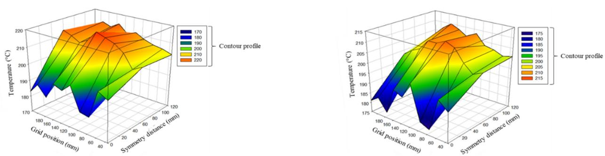

(c)  
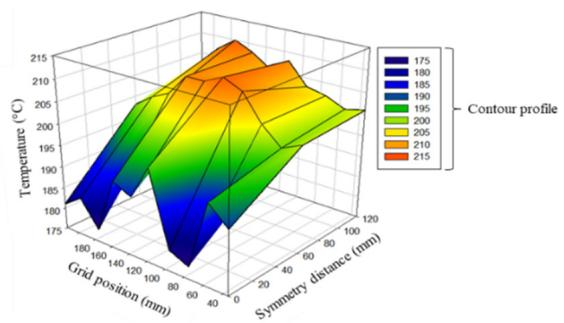  
Figure 8. A heated air temperature profile during the reflow soldering process phase in the desktop reflow oven. (a) Mea sured at preheating phase $( 1 4 0 ^ { \circ } \mathrm { C } ) ;$ (b) Measured at soaking phase $( 1 8 0 ^ { \circ } \mathrm { C } ) ;$ (c) Measured at reflow phase $( 2 0 7 ^ { \circ } \mathrm { C } )$

From the figures, two notable phenomena in the process were deduced; i.e., the temperature exceeding and lowering from the set profile value. The deviation of exceeding temperature was observed at the oven chamber center closer to the fan region, whereas the lower temperature occurred at the symmetry region of the oven cavity. The average difference between the set and observed values was between $5 { \sim } 1 3 ~ ^ { \circ } \mathrm { C }$ for the exceeding temperature and about $2 0 { \sim } 3 0 ~ ^ { \circ } C$ for the lowered temperature. This implies that under the same reflow soldering condition, the heat distribution in the oven chamber at the symmetry region (0 mm) was 1.2 times lower than that of the center and back regions of the oven cavity.

The remarkable temperature difference is attributed to the speed of the circulating fan, as reported by Najib et al. [28]. Contrarily, at the back end region, which is very close to the circulating fan, also suffered temperature deviations, owing to the backflow effect that occurred due to the rotation of the fan blade [39]. The extreme ambient temperature could cause damage to the PCB and promote the increase of IMC thickness in the solder joint, and thereby, reduce the solder joint strength. However, lower temperatures might joint, and thereby, reduce the solder joint strength. However, lower temperatures minduce unbaked solder joints. The experimental results of the oven chamber temperature induce unbaked solder joints. The experimental results of the oven chamber temperadistribution are beneficial for endorsing an acceptable profile setting for the reflow soldering distributprocess [40].

## 4.1.2. Temperature Contour

.1.2. Temperature Contour Figure 9a shows the temperature contour in the y-axis. The observation indicates Figure 9a shows the temperature contour in the y-axis. The observation indicates that the center oven has a higher temperature while the lower temperature was measured the center oven has a higher temperature while the lower temperature was measureat the symmetry region (0 mm). The difference of values from the center area with the the symmetry region (0 mm). The difference of values from the center area with the ssymmetry region phenomenon was also observed in Figure 8, wherein the heat flow along metry region phenomenon was also observed in Figure 8, wherein the heat flow alongthe symmetry plane was restricted due to fan cage wall with the exchange of two sides of symthe fan.

an. The simulation also revealed that the spatial temperature obtained was almost similar at the middle portion towards the fan cage, except for the region near the wall and symmetry region. The air circulation from the middle region towards the fan cage assists the temperature distribution in this region, while partially hot air exits through the outlet, to the ambient temperature. In the front region, the recirculation of hot air enables the homogenization of the temperature. In contrast, the outlet design and fan cage walls lead to severe non-homogeneity, which was reflected in the symmetry region. It was also observed that higher discharges of the hot air exit the outlet in the symmetry region compared to other regions. This explained the lower temperature distributions on the symmetry region toward the fan cage, as depicted in Figure 10c.

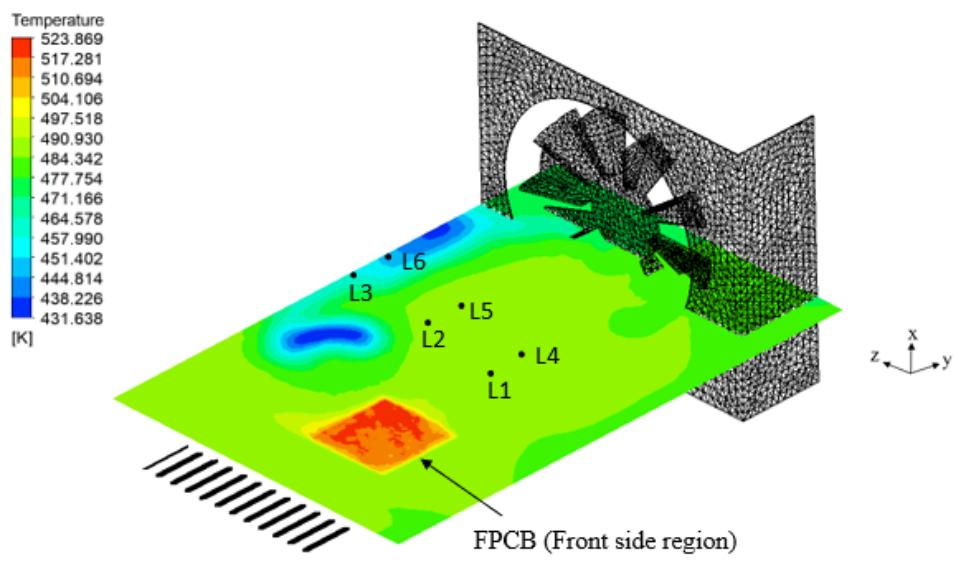

(a)  
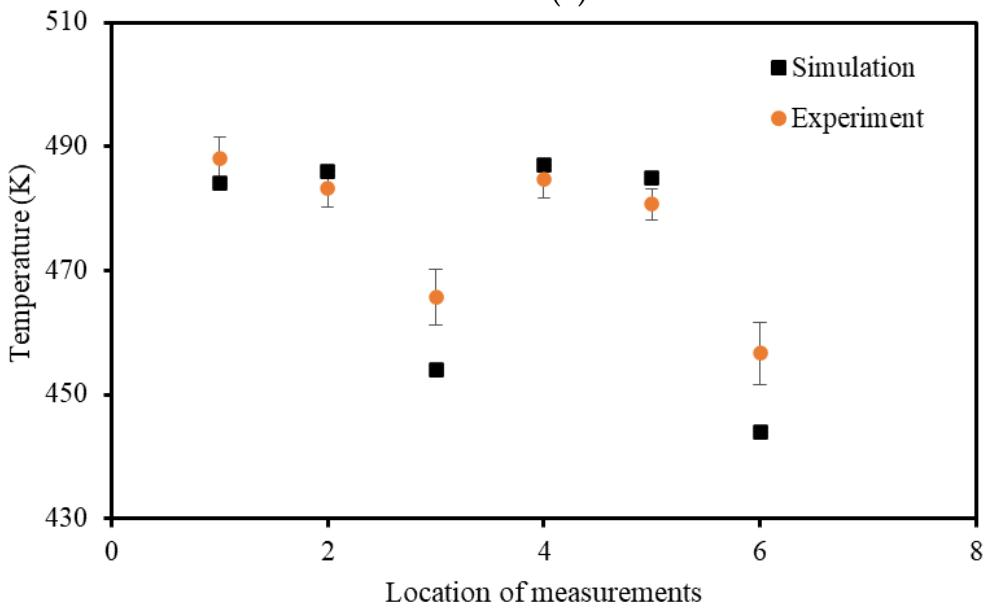  
(b)  
Figure 9. Comparison of simulation and experiment approaches during the reflow pFigure 9. Comparison of simulation and experiment approaches during the reflow phase: (a) temperature distribution based on the simulation model, (b) validation of temperature perature distribution based on the simulation model, (b) validation of temperature measurement at at L1\~L6 at the L1\~L6 at the z-axis.

The validation results of the experiment and simulation approaches are presented in Figure 9b. Six similar locations were considered for the temperature measurement in the lar at the middle portion towards the fan cage, except for the region nearexperimental work and simulation model. From six locations, L1 and L6 showed the lowest symmetry region. The air circulation from the middle region towards the fatemperature with an average temperature difference of up to 40 K. Their respective cooling the temperature distribution in this region, while partially hot air exits throuareas could lead to low FPCB temperature distributions and subsequently attribute to nonwetting of the solder during the reflow process phase, as found by Pstru´s et al. [41]. The hot air circulation can be explained by the velocity vector illustrated clearly in Figure 11.

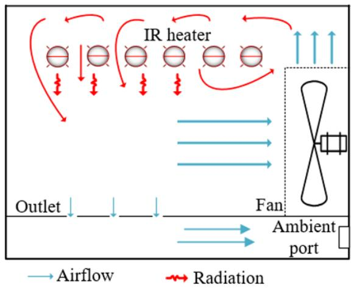  
(a)

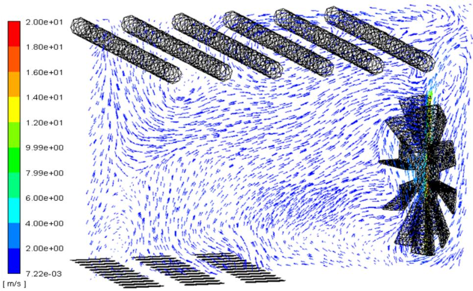  
(b)

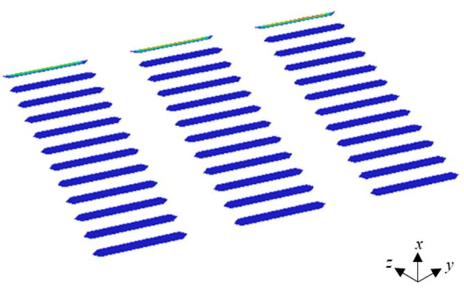  
(c)  
Figure 10. (a) Flow mechanism, (b) velocity vector and (c) zoomed outlet region in tFigure 10. (a) Flow mechanism, (b) velocity vector and (c) zoomed outlet region in the oven.

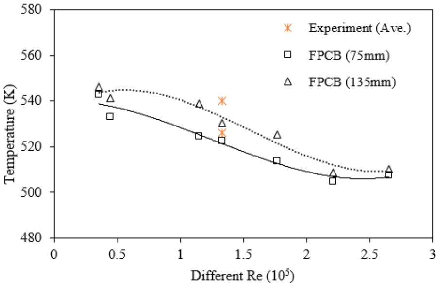  
Figure 11. Temperature of FPCB at different Re and positions.

Figure 10a shows the radiation and inhomogeneous flow mechanism of air in the oven. From the figure, the velocity vector of flow describes the forced circulation of hot air in the middle region to travel back to the fan shaft. The suction force from the fan directs the airflow towards the fan cage. The perpendicular air flow generated from the rotating blades will force the flow into the heater space, where the air gets heated up using the IR heater. Instead of forced convective flow from the propeller fan, the temperature distribution was enabled by the radiative heat transfer in the oven chamber during the reflow soldering process. The illustration in Figure 10b, shows the velocity vector from a plane view of the airflow in the oven.

Overall, the FPCB temperature would experience a higher temperature of 40\~50 K due to radiation as can be seen in Figure 10a. The radiation has a significant effect on the temperature at the studied fan speed configurations. The combination of forced convection and radiation in this oven system fostered less power consumption for the oven operating with a lower temperature setting, to aid the melting during the reflow process phase of the applied Pb-free solder alloy. By neglecting the radiation, FPCB would have a lower board-level temperature due to non-uniform heat distribution compared to the ambient. A similar finding on overshoot temperature was reported by Zhang et al. [42].

## ient. A similar finding on overshoot tem4.2. Effect of Fan Speed and PCB Placement

The numerical approach was utilized to study the effect of fan speed and PCB placement on the temperature distribution in the oven. As discussed by Mirade et al. [43], the The numerical approach was utilized to study the effect of fan speed and PCB place-homogeneity of the temperature distribution could be influenced by several parameters, ment on the temperature distribution in the oven. As discussed by Mirade et al. [43], the namely fan speed, temperature profile settings, and oven design. The effect of fan speed omogeneity of the temperature distribution could be influenced by several parameters, on the airflow was investigated based on the Re number, as in Equation (9). The calculated amely fan speed, temperature pRe for the experimental data was $1 . 3 3 \times 1 0 ^ { 5 }$ gs, and oven design. The effect of fan speed , denoting turbulent flow across the chamber.

e airflow was investigated based on the Re number, as in Equation (9). The calculated Figure 11 shows the temperature of FPCB for different Reynolds numbers. The Re for the experimental data was 1.33 × 105, denoting turbulent flow across the chamber. investigation on the effect was carried out for Re numbers ranging from low to high, i.e., Ffrom $0 . 4 3 \times 1 0 ^ { 5 } { \sim } 2 . 0 5 \times 1 0 ^ { 5 }$ mperature of FPCB for different Reynolds numbers. The in-. At low Re, the temperature of the FPCBs experienced high estigation on the effect was carried out for Re numbers ranging from low to high, i.e., surface temperature of more than 540 K. The result suggested the dominant existence of rom 0.43 ×105\~2.05 × 105. At low Re, the temperature of the FPCBs experienced high sur-radiative heat transfer rather than the forced-convection by the circulating fan. At a Re of $1 . 3 3 \times 1 0 ^ { 5 }$ rature of more than 540 K. The result suggested the dominant existence of ra-, the turbulent flow regimes started to have small temperature changes in their diative heat transfer rather than the forced-convection by the circulating farespective FPCBs, until they reached a maximum Re with a deviation of 5%.

$$
R e = \frac { \rho D ^ { 2 } n } { \mu }\tag{9}
$$

where D and n are the diameter of the rotating fan and the speed (RPM), respectively.

The placement of FPCB on the steel cage is expected to promote suitable reflow soldering without resulting in excessive surface temperature. Figure 12 reveals that the FPCBs at the front (i.e., 75 mm) and back (i.e., 135 mm) positions have different temperatures. The back position of the FPCB, which is placed near the fan cage, has a higher surface temperature, as witnessed in Figure 12. The peak temperature at the back position deviated slightly from the oven setting. This finding aligns with the velocity vector in Figure 10b, which shows the circulation of heat flow in the middle area towards the back end until the fan cage. Rapid circulation creates vortices near the fan cage, hence would increase the temperature of the surface FPCB at the back position. The peak temperature of the FPCB was targeted to be in the range of 523\~533 K and can be achieved by adjusting the Re by merely altering the position in the oven chamber with a circulating fan. For Re of 1.33 × 105, the front position from the front oven (middle region) was desirable to achieve the targeted temperature. This phenomenon is comparable with the finding of Najib et al. [24], where the tested FR-4 PCB attained 542 K, which was 40 K above the oven setting. The back position of the FPCB is not recommended as it significantly leads to other electronic component failure during the reflow soldering process.

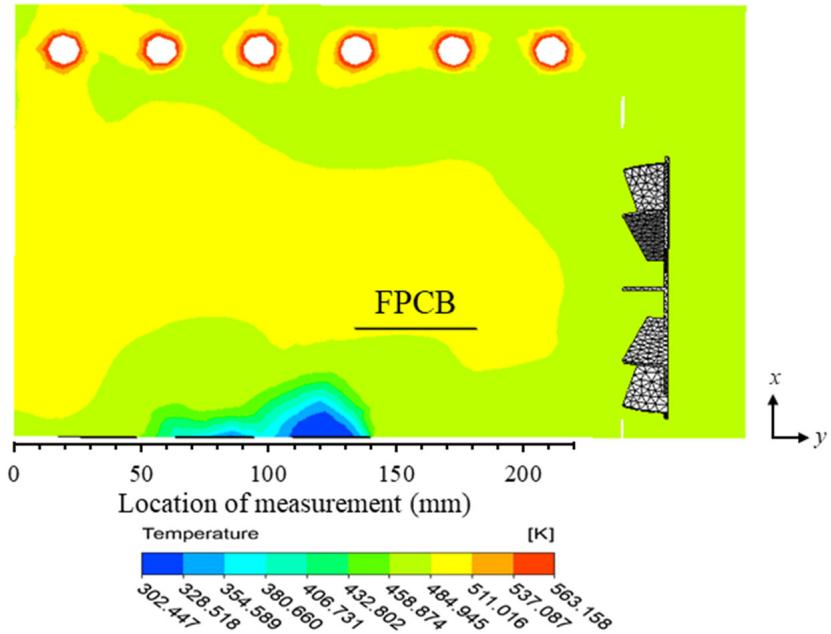  
e 12. Temperature contour of the middle region with FPCB in the back position. Figure 12. Temperature contour of the middle region with FPCB in the back position.

## 4.3. Material Properties

Figure 13 shows the stress–strain curve of the FPCB tensile test subjected to average computed data. A commonly employed relationship is based on the elastic region at low strain of the tested FPCB. At 0.2% offsetting in a linear region, a yield strength of the FPCB was obtained at 85 MPa. Subsequently, the yield strength commences the plastic deformation behavior, where the FPCB material permanently changes, which is undesirable in terms of the reliability. In this study, the calculated Young’s modulus from the elastic region was 5.3 ± 0.8 GPa. Overall, the Young’s modulus values were generally in agreement with the result obtained by Pan and Vatanporast [44].

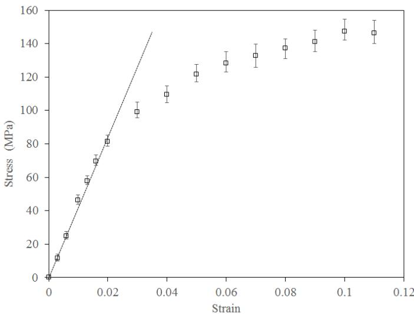  
Figure 13. Stress-strain curve of FPCB for reflow.

## 4.4. Effect of Different FPCB Thickness

Table 3 shows the temperature difference for different FPCB thicknesses measured Table 3 shows the temperature difference for different FPCB thicknesses measured from the simulation analysis. From the table, a very thin FPCB of 25 µm exhibits the lowest temperature difference (i.e., center of front and backside region) compared to other thicknesses. This occurrence is most likely due to the capability of the thin FPCB to release esses. This occurrence is most likely due to the capability of theheat on the surface faster at the conducted fan speed, Re of $1 . 3 3 \times 1 0 ^ { 5 }$ to release heat . This finding on the surface faster at the conducted fan speed, Re of 1.33 × 10 . This finding supports the supports the deformation on the thin FPCB created curvature, which reduces the surface deformation on the thin FPCB created curvature, which reduces the surface pressure pressure (pressure different from the oven pressure); hence it promotes the airflow for (pressure different from the oven pressure); hence it promotes the airflow for better heat better heat dispersion [33]. It is usable for similar tested thicknesses; however, there is dispersion [33]. It is usable for similar tested thicknesses; however, there is no such linear no such linear temperature difference correlation on other tested FPCB thicknesses, as emperature difference correlation on other tested FPCB thicknesses, as 75 µm has the 75 µm has the highest temperature difference and is followed by 125 µm. In addition, ighest temperature difference and is followed by 125 µm. In addition, the temperature the temperature difference of FPCB with 100 and 125 µm thicknesses is due to lower difference of FPCB with 100 and 125 µm thicknesses is due to lower thermal conductivity thermal conductivity between the upper and bottom FPCB. Hence, it has less difference between the upper and bottom FPCB. Hence, it has less difference in temperature, as wit-in temperature, as witnessed by low deformation behavior with low bulk air velocity to nessed by low deformation behavior with low bulk air velocity to promote the tempera-promote the temperature difference. Moreover, the thermal diffusivity also played a main ure difference. Moreover, the thermal diffusivity also played a main role in the tempera-role in the temperature difference of the PCB [45]. Better thermal diffusivity enhances the ure difference of the PCB [45]. Better thermal diffusivity enhances the heat transfer, hence heat transfer, hence reduces the temperature of the PCB surfaces. The FPCB fixture [46] is reduces the temperature of the PCB surfaces. The FPCB fixture [46] is important to mini-important to minimize the unintended warpage, which may affect the convection, infrared mize the unintended warpage, which may affect the convection, infrared absorption with absorption with minor shadowing or angle alteration. The use of the FPCB fixture could minor shadowing or angle alteration. The use of the FPCB fixture could compensate for compensate for the longer drawn temperature effect during the soldering process. The he longer drawn temperature effect during the soldering process. The result also suggests result also suggests that an appropriate stiffness of the FPCB is between 40 to 100 µm in hat an appropriate stiffness of the FPCB is between 40 to 100 µm in order to be able with-order to be able withstand the applied thermal load and will have a lower temperature tand the applied thermal load and will have a lower temperature difference. It also noted difference. It also noted that deformations on the FPCB surface are more sensitive towards hat deformations on the FPCB surface are more sensitive towards the thickness of the the thickness of the FPCB rather than the temperature difference for similar reflow oven FPCB rasetting.

Table 3. Temperature difference for different FPCB thicknesses.Table 3. Temperature difference for different FPCB thicknesses.
<table><tr><td>FPCB Thickness (μm)</td><td>Temperature Difference (K)</td></tr><tr><td>25</td><td>1.37</td></tr><tr><td>53</td><td>6.45</td></tr><tr><td>75</td><td>11.61</td></tr><tr><td>100</td><td>3.01</td></tr><tr><td>125</td><td>7.31</td></tr></table>

## 4.5. Selection of Oven Region for Reflow Soldering Process4.5. Selection of Oven Region for Reflow Soldering Proce

The assessment of oven chamber temperature using a series of thermocouples re-The assessment of oven chamber temperature using a series of thermocouples re vealed an inhomogeneous temperature distribution throughout the heating process, whichvealed an inhomogeneous temperature distribution throughout the heating proces might favor the unbaked soldering phenomenon. The flow and thermal effects were thewhich might favor the unbaked soldering phenomenon. The flow and thermal effec crucial findings that confirmed that the lower thickness of the FPCB promoted good heatwere the crucial findings that confirmed that the lower thickness of the FPCB promote absorption and dispersion. The test results were also in agreement that the FPCB wasgood heat absorption and dispersion. The test results were also in agreement that th able to run near to the current JSTD profile setting for further soldering analysis. TheFPCB was able to run near to the current JSTD profile setting for further soldering anal temperature difference was between 5 to 7 K at a Re of $1 . 3 3 \times 1 0 ^ { 5 }$ . Further analysis of the5 effect of the optimal position is highlighted with a red rectangular area in Figure 14. Theof the effect of the optimal position is highlighted with a red rectangular area in Figure 1 oven temperature setting was maintained, as mentioned earlier, as per JSTD. Meanwhile, the peak temperature of FPCB is recommended to be maintained below 543 K to have the von Mises stress below the elastic region. Mounting the board fixed at all four edge positions also ensured the uniform shape and kept it under an acceptable range; hence it could be another way to place the FPCB for the reflow soldering process.

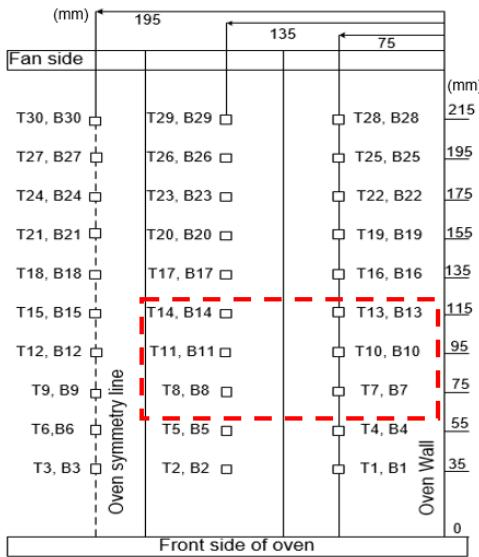  
Figure 14. Positioning of FPCB on the steel cage in the desktop reflow oveFigure 14. Positioning of FPCB on the steel cage in the desktop reflow oven.

## 5. Conclusions

The thermal investigation of the desktop reflow oven with the computational model was formulated and experimentally validated in this study. Both experimental and numerical approaches demonstrated a good agreement in the temperature test. It is revealed that the inhomogeneous temperature throughout the heating process, which potent to have unbaked soldering phenomenon. Further study using the numerical approach uncovered three interesting findings in the reflow oven. Firstly, the assessment of oven chamber temperature revealed the inhomogeneous temperature in the symmetry of the oven, wherein the temperature was 1.2 times lower than that of other portions within the oven. Secondly, it was inferred that the fan greatly affects the temperature distribution in the oven. This lead to radiation flow being the dominant effect as compared to forced convection flow at low speed. Thirdly, the FPCB exhibited good heat absorption and dispersion at lower thickness compared to the thicker one, due to its thin nature. Notably, the study also suggests that the FPCB thickness should be in the range of 40 to 100 µm to preserve the suitable temperature differences. The study also determined the optimum location of the FPCB, which potentially avoids unbaked soldering phenomena, thereby mitigating the crack issue. In conclusion, the outcomes of this study can provide a guideline to process mitigating the crack issue. In conclusion, the outcomes of this study can provide a guidengineer and researchers with desired flow and heat uniformity performance. Moreover, this study is expected to be extended on the investigation of the FPCB by using the other types of reflow oven such as convection, pure infrared (IR), and IR with convection oven.

Author Contributions: Conceptualisation, M.Z.A.; methodology, M.I.A.; writing–original draft preparation, M.S.A.A.; writing–review and editing, M.I.A., M.A.A.M.S. and M.N.; visualization, M.H.H.I., W.R. and M.N.; supervision, M.S.A.A.; project administration, M.I.A. and M.Z.A. All authors have read and agreed to the published version of the manuscript.

Funding: The work is financially supported by Ministry of Higher Education under the Fundamental Research Grant Scheme, FRGS (203/PMEKANIK/6071489). The authors would also like to thank Universiti Sains Malaysia and Celestica Malaysia Sdn. Bhd. for providing technical support. The authors would like to extend their gratitude to the Department of Physics, Cz˛estochowa University of Technology, Cz ˛estochowa, Poland.

Data Availability Statement: Not applicable.

Conflicts of Interest: The authors declare no conflict of interest.

## Appendix A

Table A1. Experimental data of oven air temperature (K) in Figure 2.
<table><tr><td>Time (s)</td><td>Trial 1</td><td>Trial 2</td><td>Trial 3</td><td>MEAN</td><td>STD DEV</td></tr><tr><td>0</td><td>300</td><td>302</td><td>297</td><td>300</td><td>2.5166</td></tr><tr><td>10</td><td>300</td><td>307</td><td>297</td><td>301</td><td>5.1316</td></tr><tr><td>20</td><td>307</td><td>313</td><td>300</td><td>307</td><td>6.5064</td></tr><tr><td>30</td><td>322</td><td>328</td><td>322</td><td>324</td><td>3.4641</td></tr><tr><td>40</td><td>345</td><td>350</td><td>342</td><td>346</td><td>4.0415</td></tr><tr><td>50</td><td>357</td><td>365</td><td>359</td><td>360</td><td>4.1633</td></tr><tr><td>60</td><td>374</td><td>376</td><td>371</td><td>374</td><td>2.5166</td></tr></table>

Table A2. Experimental data on FPCB surface temperature (K) in Figure 2.
<table><tr><td>Time (s)</td><td>Trial 1</td><td>Trial 2</td><td>Trial 3</td><td>MEAN</td><td>STD DEV</td></tr><tr><td>0</td><td>300</td><td>302</td><td>299</td><td>300.3333</td><td>1.5275</td></tr><tr><td>10</td><td>300</td><td>302</td><td>299</td><td>300.3333</td><td>1.5275</td></tr><tr><td>20</td><td>304</td><td>306</td><td>303</td><td>304.3333</td><td>1.5275</td></tr><tr><td>30</td><td>322</td><td>328</td><td>326</td><td>325.3333</td><td>3.0551</td></tr><tr><td>40</td><td>355</td><td>359</td><td>356</td><td>356.6667</td><td>2.0817</td></tr><tr><td>50</td><td>372</td><td>378</td><td>374</td><td>374.6667</td><td>3.0551</td></tr><tr><td>60</td><td>395</td><td>400</td><td>396</td><td>397.0000</td><td>2.6458</td></tr></table>

Table A3. Experimental data of temperature measurement at L1\~L6 at the z-axis in Figure 9b.
<table><tr><td>Locations</td><td>Trial 1</td><td>Trial 2</td><td>Trial 3</td><td>MEAN</td><td>STDEV</td></tr><tr><td>L1</td><td>487</td><td>492</td><td>485</td><td>488.0000</td><td>3.6056</td></tr><tr><td>L2</td><td>484</td><td>486</td><td>480</td><td>483.3333</td><td>3.0551</td></tr><tr><td>L3</td><td>466</td><td>461</td><td>470</td><td>465.6667</td><td>4.5092</td></tr><tr><td>L4</td><td>484</td><td>482</td><td>488</td><td>484.6667</td><td>3.0551</td></tr><tr><td>L5</td><td>481</td><td>483</td><td>478</td><td>480.6667</td><td>2.5166</td></tr><tr><td>L6</td><td>456</td><td>452</td><td>462</td><td>456.6667</td><td>5.0332</td></tr></table>

Table A4. Experimental data of stress–strain curve of FPCB for reflow inn Figure 13.
<table><tr><td rowspan="2">Tensile Strain, (mm/mm)</td><td colspan="4">Tensile Stress, (MPa)</td><td rowspan="2">MEAN</td><td rowspan="2">STDEV</td></tr><tr><td>Trial 1</td><td>Trial 2</td><td>Trial 3</td><td>Trial 4</td></tr><tr><td>0</td><td>0</td><td>0</td><td>0</td><td>0</td><td>0</td><td>0</td></tr><tr><td>0.003</td><td>15.436</td><td>12.136</td><td>10.865</td><td>8.749</td><td>11.501</td><td>2.799</td></tr><tr><td>0.006</td><td>27.726</td><td>25.371</td><td>23.912</td><td>21.347</td><td>24.642</td><td>2.672</td></tr><tr><td>0.010</td><td>48.413</td><td>46.865</td><td>43.215</td><td>45.427</td><td>46.865</td><td>2.669</td></tr><tr><td>0.013</td><td>60.523</td><td>58.668</td><td>57.187</td><td>55.341</td><td>57.928</td><td>2.200</td></tr><tr><td>0.016</td><td>74.451</td><td>71.159</td><td>68.032</td><td>67.205</td><td>69.596</td><td>3.299</td></tr><tr><td>0.020</td><td>86.324</td><td>83.421</td><td>79.126</td><td>78.456</td><td>81.274</td><td>3.716</td></tr><tr><td>0.030</td><td>104.897</td><td>100.942</td><td>96.889</td><td>91.161</td><td>98.916</td><td>5.869</td></tr><tr><td>0.040</td><td>113.783</td><td>112.257</td><td>106.472</td><td>102.952</td><td>109.365</td><td>5.046</td></tr><tr><td>0.050</td><td>126.214</td><td>125.758</td><td>117.414</td><td>115.211</td><td>121.586</td><td>5.660</td></tr><tr><td>0.060</td><td>136.211</td><td>131.076</td><td>125.34</td><td>119.127</td><td>128.208</td><td>7.364</td></tr><tr><td>0.070</td><td>139.729</td><td>136.881</td><td>128.613</td><td>125.34</td><td>132.747</td><td>6.776</td></tr><tr><td>0.080</td><td>144.158</td><td>142.349</td><td>132.371</td><td>131.216</td><td>137.360</td><td>6.674</td></tr><tr><td>0.090</td><td>148.774</td><td>145.213</td><td>137.076</td><td>134.859</td><td>141.145</td><td>6.592</td></tr><tr><td>0.100</td><td>156.951</td><td>151.758</td><td>143.043</td><td>140.927</td><td>147.401</td><td>7.499</td></tr><tr><td>0.110</td><td>154.389</td><td>151.128</td><td>141.201</td><td>139.128</td><td>146.165</td><td>7.440</td></tr></table>

## References

1. Rudajevová, A.; Dušek, K. Influence of manufacturing mechanical and thermal histories on dimensional stabilities of FR4 Laminate and FR4/Cu-plated holes. Materials 2018, 11, 2114. [CrossRef]

2. Nothdurft, P.; Riess, G.; Kern, W. Copper/epoxy joints in printed circuit boards: Manufacturing and interfacial failure mechanisms. Materials 2019, 12, 550. [CrossRef]

3. Cheng, S.; Huang, C.M.; Pecht, M. A review of lead-free solders for electronics applications. Microelectron. Reliab. 2017, 75, 77–95. [CrossRef]

4. Pan, J.; Chou, T.C.; Bath, J.; Willie, D.; Toleno, B.J. Effects of reflow profile and thermal conditioning on intermetallic compound thickness for SnAgCu soldered joints. Solder. Surf. Mt. Technol. 2009, 21, 32–37. [CrossRef]

5. Wang, X.; Li, X.; Pan, K.; Zhou, B.; Jiang, T. Effect of reflow profile parameters on shear performance of Sn3.0Ag0.5Cu/Cu solder joint. In Proceedings of the 2014 10th International Conference on Reliability, Maintainability and Safety (ICRMS), Guangzhou, China, 6–8 August 2014; pp. 691–693. [CrossRef]

6. Bassi, M. Estimation of the vapor pressure of PFPEs by TGA. Thermochim. Acta 2011, 521, 197–201. [CrossRef]

7. Illés, B.; Géczy, A. Investigating the dynamic changes of the vapour concentration in a Vapour Phase Soldering oven by simplified condensation modelling. Appl. Therm. Eng. 2013, 59, 94–100. [CrossRef]

8. Illés, B.; Skwarek, A.; Géczy, A.; Krammer, O.; Bušek, D. Numerical modelling of the heat and mass transport processes in a vacuum vapour phase soldering system. Int. J. Heat Mass Transf. 2017, 114, 613–620. [CrossRef]

9. Géczy, A.; Illés, B.; Illyefalvi-Vitéz, Z. Modeling method of heat transfer during Vapour Phase Soldering based on filmwise condensation theory. Int. J. Heat Mass Transf. 2013, 67, 1145–1150. [CrossRef]

10. Illés, B.; Géczy, A. Numerical simulation of condensate layer formation during vapour phase soldering. Appl. Therm. Eng. 2014, 70, 421–429. [CrossRef]

11. Yu, H.; Kivilathti, J. CFD modelling of the flow field inside a reflow oven. Solder. Surf. Mt. Technol. 2002, 14, 38–44. [CrossRef]

12. Park, S.H.; Kim, Y.H.; Kim, Y.S.; Park, Y.G.; Ha, M.Y. Numerical study on the effect of different hole locations in the fan case on the thermal performance inside a gas oven range. Appl. Therm. Eng. 2018, 137, 123–133. [CrossRef]

13. Verboven, P.; Scheerlinck, N.; De Baerdemaeker, J.; Nicolaï, B.M. Computational Fluid Dynamics modelling and validation of the temperature distribution in a forced convection oven. J. Food Eng. 2000, 43, 61–73. [CrossRef]

14. Chhanwal, N.; Anishaparvin, A.; Indrani, D.; Raghavarao, K.S.M.S.; Anandharamakrishnan, C. Computational fluid dynamics (CFD) modeling of an electrical heating oven for bread-baking process. J. Food Eng. 2010, 100, 452–460. [CrossRef]

15. Lau, C.-S.; Abdullah, M.Z. Simulation investigations on fluid/structure interaction in the feflow soldering process of board-level BGA packaging. Int. J. Comput. Theory Eng. 2013, 5, 645–649. [CrossRef]

16. Son, Y.S.; Shin, J.Y. Thermal response of electronic assemblies during forced convection-infrared reflow soldering in an oven with air injection. Int. J. Ser. B Fluids Therm. Eng. 2006, 48, 865–873. [CrossRef]

17. Verboven, P.; Datta, A.K.; Anh, N.T.; Scheerlinck, N.; Nicolä, B.M. Computation of airflow effects on heat and mass transfer in a microwave oven. J. Food Eng. 2003, 59, 181–190. [CrossRef]

18. Khatir, Z.; Paton, J.; Thompson, H.; Kapur, N.; Toropov, V.; Lawes, M.; Kirk, D. Computational fluid dynamics (CFD) investigation of air flow and temperature distribution in a small scale bread-baking oven. Appl. Energy 2012, 89, 89–96. [CrossRef]

19. Aizawa, T.; Okagawa, K.; Kashani, M. Application of magnetic pulse welding technique for flexible printed circuit boards (FPCB) lap joints. J. Mater. Process. Technol. 2013, 213, 1095–1102. [CrossRef]

20. Shin, D.; Lee, J.; Chung, Y.; Sohn, H. Laser cutting process for FPCB. In Proceedings of the 2008 International Conference on Smart Manufacturing Application, Goyangi, Korea, 9–11 April 2008; pp. 357–362. [CrossRef]

21. Gao, F.; Takemoto, T.; Nishikawa, H. Effects of Co and Ni Addition on Reactive Diffusion between Sn-3.5Ag Solder and Cu during Soldering and Annealing. Mater. Sci. Eng. A 2006, 420, 39–46. [CrossRef]

22. Liu, J.; Ni, H.; Wang, Z.; Yang, S.; Zhou, W. Colorless and Transparent High—Temperature-Resistant Polymer Optical Films— Current Status and Potential Applications in Optoelectronic Fabrications. In Optoelectronics—Materials and Devices; InTechOpen: London, UK, 2015; pp. 58–80. [CrossRef]

23. Yoon, J.W.; Lee, J.G.; Lee, J.B.; Noh, B.I.; Jung, S.B. Thermo-compression bonding of electrodes between FPCB and RPCB by using Pb-free solders. J. Mater. Sci. Mater. Electron. 2012, 23, 41–47. [CrossRef]

24. Yoon, J.W.; Ko, M.K.; Noh, B.I.; Jung, S.B. Joint reliability evaluation of thermo-compression bonded FPCB/RPCB joints under high temperature storage test. Microelectron. Reliab. 2013, 53, 2036–2042. [CrossRef]

25. Lee, D.Y.; Kwon, C.; Pak, H.K. Reliability of Cu-Cu direct interconnections using ultrasonic bonding process between RPCB and FPCB. Proc. Symp. Ultrason. Electron. 2014, 32, 590–593.

26. Lau, C.S.; Abdullah, M.Z.; Khor, C.Y. Optimization of the Reflow Soldering Process with Multiple Quality Characteristics in Ball Grid Array Packaging by Using the Grey-Based Taguchi Method. Microelectron. Int. 2013, 3, 151–168. [CrossRef]

27. Yamane, M.; Orita, N.; Miyazaki, K.; Zhou, W. Development of new model reflow oven for lead-free soldering. Furukawa Rev. 2004, 26, 31–36.

28. Najib, A.M.; Abdullah, M.Z.; Khor, C.Y.; Saad, A.A. Experimental and numerical investigation of 3D gas flow temperature field in infrared heating reflow oven with circulating fan. Int. J. Heat Mass Transf. 2015, 87, 49–58. [CrossRef]

29. Zhou, E.; Bayazitoglu, Y. Developing laminar natural convection of power law fluids in vertical open ended channel. Int. J. Heat Mass Transf. 2019, 128, 354–362. [CrossRef]

30. Smolka, J.; Bulinski, Z.; Nowak, A.J. The experimental validation of a CFD model for a heating oven with natural air circulation. Appl. Therm. Eng. 2013, 54, 387–398. [CrossRef]

31. Grinyaev, K.V.; Ditenberg, I.A.; Smirnov, I.V.; Tyumentsev, A.N.; Tsverova, A.S.; Chernov, V.M. ASM Ready Reference: Thermal Properties ofMetals; ASM International: Geauga County, OH, USA, 2013.

32. Svasta, P.; Simion-Zanescu, D.; Ionescu, R. Components’ emissivity in reflow soldering process. In Proceedings of the 2004 54th Electronic Components and Technology Conference (IEEE Cat. No.04CH37546), Las Vegas, NV, USA, 4 June 2004; pp. 1921–1924. [CrossRef]

33. Lim, C.H.; Abdullah, M.Z.; Azid, I.A.; Khor, C.Y. Heat transfer enhancement by flexible printed circuit board’s deformation. Int. Commun. Heat Mass Transf. 2017, 84, 86–93. [CrossRef]

34. Abdul Aziz, M.S.; Abdullah, M.Z.; Khor, C.Y.; Che Ani, F. Influence of pin offset in PCB through-hole during wave soldering process: CFD modeling approach. Int. Commun. Heat Mass Transf. 2013, 48, 116–123. [CrossRef]

35. Abdul Aziz, M.S.; Abdullah, M.Z.; Khor, C.Y.; Jalar, A.; Che Ani, F. CFD modeling of pin shape effects on capillary flow during wave soldering. Int. J. Heat Mass Transf. 2014, 72, 400–410. [CrossRef]

36. Khor, C.Y.; Abdullah, M.Z.; Lau, C.S.; Leong, W.C.; Abdul Aziz, M.S. Influence of solder bump arrangements on molded IC encapsulation. Microelectron. Reliab. 2014, 54, 796–807. [CrossRef]

37. Ng, F.C.; Abas, A.; Ishak, M.H.H.; Abdullah, M.Z.; Aziz, A. Effect of thermocapillary action in the underfill encapsulation of multi-stack ball grid array. Microelectron. Reliab. 2016, 66, 143–160. [CrossRef]

38. Khor, C.Y.; Abdullah, M.Z. Analysis of fluid/structure interaction: Influence of silicon chip thickness in moulded packaging. Microelectron. Reliab. 2013, 53, 334–347. [CrossRef]

39. Vlaminck, V.; Pearson, J.E.; Bader, S.D.; Hoffmann, A. Dependence of spin-pumping spin Hall effect measurements on layer thicknesses and stacking order. Phys. Rev. B Condens. Matter Mater. Phys. 2013, 88, 1–8. [CrossRef]

40. Qi, H.; Osterman, M.; Pecht, M. Modeling of combined temperature cycling and vibration loading on PBGA solder joints using an incremental damage superposition approach. IEEE Trans. Adv. Packag. 2008, 31, 463–472. [CrossRef]

41. Pstru´s, J.; Fima, P.; Gancarz, T. Wetting of Cu and Al by Sn-Zn and Zn-Al eutectic alloys. J. Mater. Eng. Perform. 2012, 21, 606–613. [CrossRef]

42. Zhang, Z.; Park, S.B.; Darbha, K.; Master, R.N. Impact of usage conditions on solder joint fatigue life. In Proceedings of the 2010 60th Electronic Components and Technology Conference (ECTC), Las Vegas, NV, USA, 1–4 June 2010; pp. 14–19. [CrossRef]

43. Mirade, P.S.; Daudin, J.D.; Ducept, F.; Trystram, G.; Clément, J. Characterization and CFD modelling of air temperature and velocity profiles in an industrial biscuit baking tunnel oven. Food Res. Int. 2004, 37, 1031–1039. [CrossRef]

44. Pan, F.; Vatanporast, R. Reliability analysis for the design of a multi-layer flexible board. In Proceedings of the Proceedings Electronic Components and Technology, Lake Buena Vista, FL, USA, 31 May–3 June 2005. [CrossRef]

45. Straubinger, D.; Bozsóki, I.; Bušek, D.; Illés, B.; Géczy, A. Modelling of temperature distribution along PCB thickness in different substrates during reflow. Circuit World 2019, 46, 85–92. [CrossRef]

46. Géczy, A.; Bátorfi, R.; Széles, G.; Luhály, Á.; Ruszinkó, M.; Berényi, R. Vapour phase soldering on flexible printed circuit boards. In Proceedings of the 2014 IEEE 20th International Symposium for Design and Technology in Electronic Packaging (SIITME), Bucharest, Romania, 23–26 October 2014; pp. 69–74.