Original research article

# The effect of variable irradiation mask in Focused Infrared Light Soldering Systems for electronic components

Citlalli Anguiano a,\*, Kiyoshi Natzu a, Marco F´elix a, Ivan ´ Olaf Hernandez-Fuentes´ a, Rigoberto Herrera a, Noemí Lizarraga´ a, Marlene Zamora a, David Salazar b, Heriberto Marquez´ b

Facultad de Ingeniería Campus Mexicali, Universidad Aut´onoma de Baja California UABC, SN Benito Juarez ´ Boulevard, Ex-Ejido Coahuila, 21900 Mexicali, Baja California, Mexico

b Centro de Investigaci´on Científica y de Educaci´on Superior de Ensenada, Ensenada, Baja California, Mexico

## A R T I C L E I N F O

Keywords:   
Focused infrared light   
Variable irradiation mas   
Soldering system   
SMT   
Incoherent light

## A B S T R A C T

The surface mount technology (SMT) has allowed to include more electronic components with different shapes and sizes on printed circuit boards (PCB), improving the storage capabilities, transmission rates, and data processing; also, some optical elements have been incorporated in their composition. Therefore, an evolution in the methods and processes of non-contact soldering is required to adhere the elements without damaging them. In the present paper is presented the irradiance analysis when a Variable Irradiation Mask (VIM) is inserted in the output of a focused infrared soldering system (FILSS) to obtain a different light distribution, which can be compared with the thermal distribution obtained in the electronic component that is being analyzed, a Ball Grid Array (BGA) in this case. The results of irradiance in the simulation are congruent with thermal distribution obtained experimentally in the study area of the target’s surface. It is observed that at the borders with the VIM, 50% of the total intensity of the maximum ´ termal distribution is obtained. The soldering quality in the electronic component can be correlated with the thermal distribution and irradiance in this system.

## 1. Introduction

The electronics industry trend is to incorporate optical modules, filters, photodetectors, and fibers in electronic components to increase the speed of data transmission within integrated circuits (IC) and improve communication by increasing the bandwidth of the systems [1–12].

Previously, the predominant technology in the electronics industry was the Through Hole Technology (THT); however, this technology requires to pierce the electronic components to place them on the Printed Circuit Board (PCB), obtaining robust and bulky systems. Due to this, only one side of the board could be used. In this technology, the data transmission rate relied on the components used, which resulted in a limited number of pins [13].

Later, the Surface Mount Technology (SMT) emerged to change how the electronic Integrated Circuit (IC) components were placed on the PCB, allowing us to use both sides. This change in the technology provided the consumer with compact systems with a higher processing rate due to the increment in the number of pins and alternative distribution on the IC [13] being the Ball Grid Array one of the more popular IC SMT used in telecommunications systems where the distribution of the pins is under the IC components [13]. Some examples of their applications are Field Programmable Gate Array (FPGA), microprocessors, Digital Signal Processor (DSP), among others. Nonetheless, the demand for electronic technology continues rising, keeping electronic components changing to increase density of IC components. Industry is currently trying to integrate optical components in electronic devices, achieving higher data rate transmission and bandwidth due to the use of light inside the components and improving communication with the outside world; this technology is called: Optics on Board [1–12].

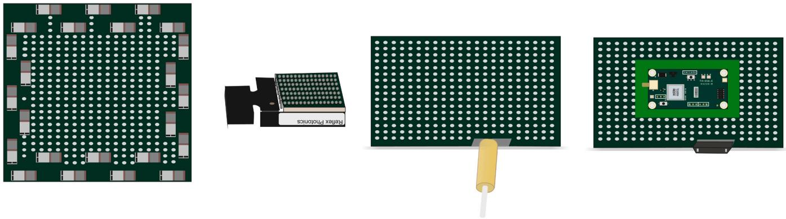  
Fig. 1 . Different BGA components with photonic and semiconductor materials.

This new emerging technology addresses photonic components within the PCB to increase signaling speed, being an essential combination due to the use of IC and PCB semiconductor photonic components and becoming one of the most important semiconductor materials for its mechanical characteristics and temperature durability in each of the components. Due to the combination of photonics and semiconductor materials, the heat distribution in the new components could be different along the integrated circuit. [14–16] Fig. 1 shows the different shapes and distribution pads of BGA´s used with photonics and semiconductor materials.

As previously stated, it is necessary to improve methods for soldering new technology with optical and electronic components within a limited area and following the reflow soldering process. This process consists of four stages: pre-heat, soak, reflow and cooling. Pre-heat and soak stages maintain temperatures below $\mathrm { T } < 2 1 7 ^ { \circ } \mathrm { C } ,$ to prevent a thermal shock in the component. On the other hand, to obtain solid to liquid changes in the lead-free solder paste in the reflow stage, temperatures between $2 1 7 ^ { \circ } \mathsf { C } \le \mathrm { T } \le 2 6 0 ^ { \circ } \mathsf { C }$ are used. In the cooling stage, is applied a decrement temperature.

An experimental study in a previously informed work shows four optical configurations proposed for soldering BGA devices [17–19]. It showed an analysis of irradiance and infrared thermography. The results provided a uniform distribution point in the BGA and the SMT components’ temperature values. However, the light and heat distribution in the previous proposed optical setups covers the entire BGA area, being these parameters different for the new photonic SMT components.

In the present work, we analyzed the effect of Variable Irradiance Mask in a Focused Infrared Light Soldering System to obtain a specific size and shape irradiance and heat distribution of the proposed method to solder the photonic SMT components with a limited area.

## 1.1. Proposed method

The proposed method to solder photonic SMT components with limited area consists of a Variable Irradiance Mask (VIM) placed between Focused Infrared Light Soldering System (FILSS) and the target to solder, to obtain a specific light and thermal distribution area on photonic SMT devices as shown Fig. 2.

For the FILSS, a Quartz Tungsten Halogen (QTH) lamp with an elliptical gold reflector is used as an Infrared (IR) source with a wide wavelength range from UV to IR. The optical setup used in the FILSS is based on an imaging homogenizer system.

Because SMT components are placed over the PCB and are soldered by thermal conduction, care must be taken not to place any element that presses the component in any direction, as this can cause component misalignment. For this reason, two cases were analyzed for the proposed method. The first one was when the VIM is relatively placed at short distance (Dz1) to the target without touching the SMT component, and the second one was when the VIM is placed at long distance (Dz2) from the target. A different apperture of VIM in the x-axis is needed to maintain it closer to the work area (Dx1) and (Dx2), respectively.

In Fig. 3(a) ray trace shows both cases analyzed for the proposed method using VIM in FILSS to solder photonic SMT components.

## 2. Thermal distribution of SMT components in the IC

Misalignment and cold solder can produce an impaired functionality of the entire system where the SMT component is located, so the temperature and the heat transfer generated by the solder system must be uniform and reach the molten point of the alloy [20] to obtain good solder joints in the SMT components over the PCB.

So, the ways to analyze how these kinds of soldering systems work, such as FILSS, are by heat transfer, infrared radiation, and conduction.

For FILSS, the heat transfer by radiation is obtained from Eq. (1) [19]:

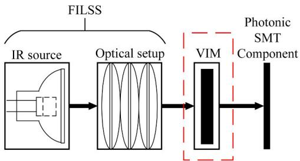  
Fig. 2. The proposed method to solder photonic SMT components.

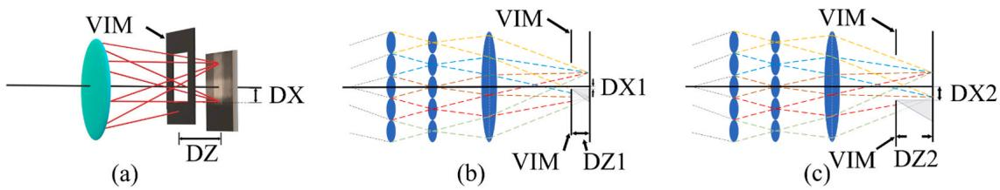  
Fig. 3. (a) Ray trace for the proposed method to solder photonic SMT components (b) VIM placed at short distance to the target, (c) VIM placed a long distance from the target.

$$
Q _ { I R } = V * \varepsilon _ { s } * \Gamma _ { i } * \Gamma _ { O E } * \alpha _ { S M T } * \sigma * ( T _ { S } ^ { 4 } - T _ { S M T } ^ { 4 } )\tag{1}
$$

where $Q _ { I R }$ is the heat transfer in ${ \mathsf { W } } / { \mathsf { c m } } ^ { 2 } ,$ V is the geometric view factor of the system $( 0 - 1 ) , \mathcal { E } _ { S }$ is emissivity of the IR source $( 0 - 1 ) ,  { \boldsymbol { { T } } } _ { i }$ is the internal transmission of optical elements $( 0 - 1 ) , \ : T _ { O E }$ is the cumulative transmission coefficient values at the multiple glass-air interfaces of the optical elements $( 0 - 1 ) , \alpha _ { S M T }$ is the absorptivity of the SMT component (0−1), σ is the Stefan Boltzmann constant $( 5 . 6 7 \times 1 0 ^ { - 1 2 } \mathrm { W } / \mathrm { c m } ^ { 2 } / ^ { \circ } \mathrm { K } ^ { 4 } ) , T _ { S } ^ { 4 }$ and $T _ { S M T } ^ { 4 }$ are the temperatures of the lamp and SMT component respectively.

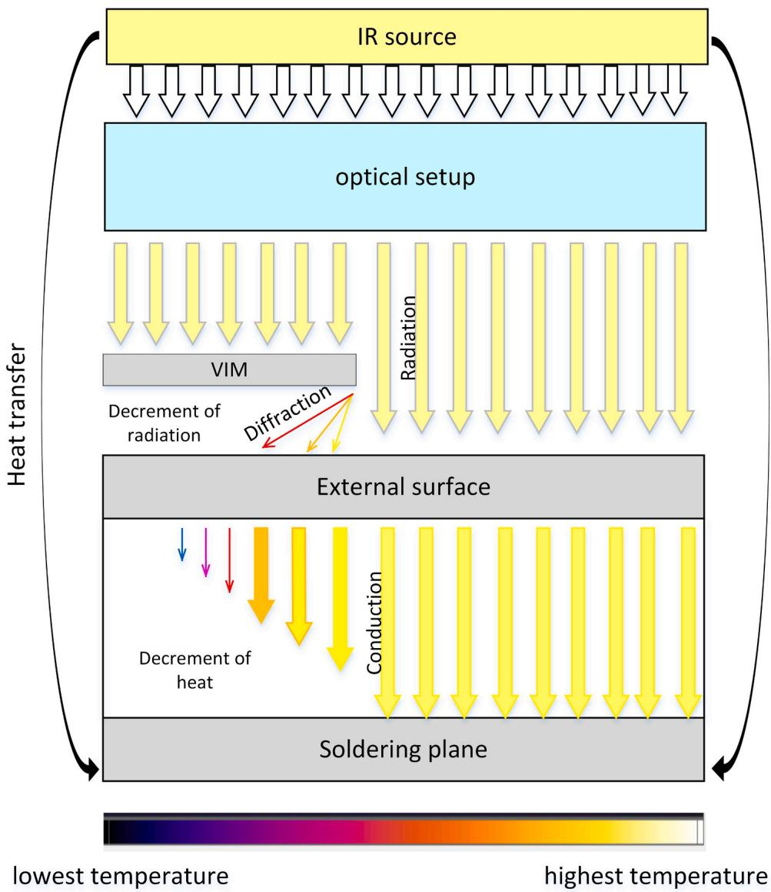  
Fig. 4. Heat transfer in the proposed method for FILSS.

On the other hand, the heat transfer by conduction is obtained from Eq. (2) [19]:

$$
Q _ { C } = K * A { \frac { ( T _ { 1 } - T _ { 2 } ) } { \Delta x } }\tag{2}
$$

Where $Q _ { C }$ is the heat transfer by conduction in W, A is the cross-sectional area in $\mathrm { c m } ^ { 2 } { \mathrm { . } }$ , K is the thermal conductivity in $\mathbf { W } / { \mathrm { c m - } ^ { \circ } } \mathbf { C } , T _ { 1 }$ and $T _ { 2 }$ are the temperatures ${ \mathrm { i n } } \ { } ^ { \circ } \mathrm { C } ,$ at the top of the SMT component and the bottom of the SMT component, respectively, and Δx is the bulk material thickness.

In the proposed method, the infrared radiation is emitted by an incandescent lamp, producing infrared light that passes through the optical elements used for FILSS, then strikes the VIM and finally reaches the SMT component. Then heat transfer by conduction occurs in the SMT component, so heat radiation passes through the entire SMT component.

The function of VIM is delimited by the area of infrared radiation that will reach the SMT component, obtaining a decrement of radiation on the external surface, which allows a decrease of heat by conduction in the SMT component as shown Fig. 4.

Since an incandescent lamp is used as an infrared source and the VIM has a straight edge design in the proposed method, diffraction effect in a straight edge with incoherent light is analyzed. In this case, a diffraction pattern is generated due to the waves’ superposition, and some rays travel in a chaotic way entering at different angles to the area where the VIM is delimiting.

The intensity obtained by diffraction in straight edge with incoherent light is given by Eq. (3):

$$
I _ { ( r ) } = \frac { 1 } { 2 } + \frac { 1 } { \pi } S i _ { ( r ) } - \frac { ( 1 - \cos ( r ) ) } { r }\tag{3}
$$

Where $\mathbf { r } = 2 \mathbf { a } \pi \mathbf { y } / ( 1 + \mathbf { m } ) \lambda \mathbf { i }$ f is the diameter of the entrance pupil (effective aperture), m is the magnification of the optical system, λ is the wavelength, $f$ is the focal length, $y$ is the position of the straight edge, and Si(r) is the sine integral function.[21].

The intensity distribution of diffraction in straight edge with incoherent light is shown in ${ \mathrm { F i g . } } 5 ,$ where zero position in the straight edge is approximately 50% of the total intensity. [21–24].

This decrement of 50% in intensity due to the diffraction in straight causes a decrement of heat transfer by radiation in the proposed method, turning the intensity obtained of $\operatorname { E q } . \ ( 3 )$ , in a view factor $\mathrm { v }$ used in Eq. (1), obtaining a proposed total heat transfer as shows Eq. (4):

$$
Q _ { T I R } = \Sigma Q _ { D I R } + Q _ { I R }\tag{4}
$$

QTIR is the total heat transfer by radiation arrived in the external surface, QDIR is the cumulative decrement of heat transfer by radiation obtained from VIM as diffraction, and QIR is the heat transfer from the direct radiation from FILSS.

In the same way, the proposed total heat transfer obtained by conduction in the SMT component is given by Eq. (5):

$$
{ \mathcal { Q } } _ { T C } = \Sigma { \mathcal { Q } } _ { D C } + { \mathcal { Q } } _ { C }\tag{5}
$$

where QTC is the total heat transfer by conduction, QDC is the cumulative decrement of heat transfer by conduction obtained from VIM as diffraction, and QC is the heat transfer by direct conduction obtained from FILSS. In this analysis, the heat coming from the surroundings of the SMT component is not taken into consideration.

## 3. Simulations and experimental procedure

The simulations of irradiance of the proposed method were realized in Zemax software using the non-sequential mode. The source designed was an elliptical reflector, simulated as an elliptical mirror and a filament as a source with 69.8 W of optical power [25]. UV Fused Silica and B270 glass were used in lenses of the optical setup, due to its low coefficient of thermal expansion and its good optical qualities, with an excellent window in the ultraviolet, visible to near-infrared regions. Between the Focused Infrared Light Soldering System (FILSS) and the external surface or target (detector), a Variable Irradiance Mask (VIM) was placed as a light blocking element to obtain a specific area light distribution.

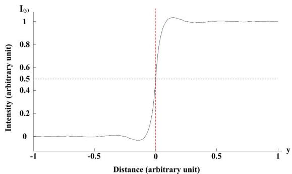  
Fig. 5. Diffraction intensity distribution graph in straight edge with incoherent light.

For the experimental procedure, FILSS was mounted on an optical table. The source used is a Tungsten-Halogen Lamp with spectral emission between UV to IR radiation. Different lenses were used for simulations and experimental procedures for FILSS with VIM. The lenses used were in an uncoated UV-grade fused silica and B270 glass. A thermography camera was used to measure the thermal distribution at the target of FILSS with a VIM placed between the last lens and the target. The reflux profile was used for the entire procedure [13].

For simulation and experimental procedures, a relocation of the light block in the x-axis is needed to maintain a specific working area, which is modified for the distance between elements. The following condition for the relocation of the light blocks is obtained for 10 mm of separation in z-axis from the target, it is necessary a relocation of approximately 2 mm in the x-axis from the optical axis. These relocations are applied only in a range of dimensions from 20 mm to 30 mm used in the target.

## 4. Results and analysis

The optical setup with an imaging homogenizer system FILSS creates a uniform irradiance at the entire target. When a VIM is placed in the system, a specific light and thermal distribution area are obtained in the target detectors at the output of the optical setup. Then two cases are analyzed: in the first one, VIM is placed at 20 mm from the target, and in the second case, VIM is placed at 30 mm from the target.

Fig. 6 shows the spotlight and irradiance distribution obtained by Zemax simulation from shorter and long distances from the target using FILSS with VIM. Fig. 6(a) shows the spotlight distribution, and 6 (c) is the irradiance obtained from the light profile distribution at 20 mm on the z-axis from the target and 2 mm from the x-axis. Fig. 6(b) observed the spotlight distribution, and 6(d) shows the irradiance distribution when the VIM is placed at 30 mm from the target in the z-axis and 4 mm from the x-axis. Fig. 6(c) shows spatial light distribution area with higher intensity. On the other hand, when the place of VIM is changed to a long distance from the target in FILSS, a more expanded area is obtained, as shown in Fig. 6(d). VIM position in Fig. 6 represents the location of this at Dx and Dz for each case.

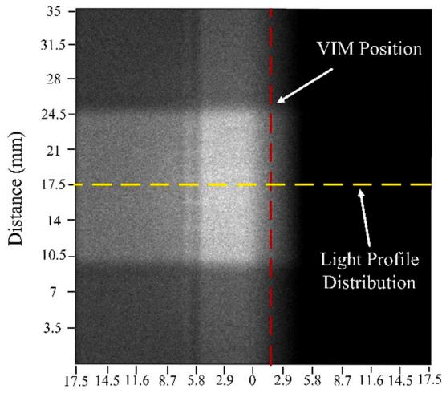

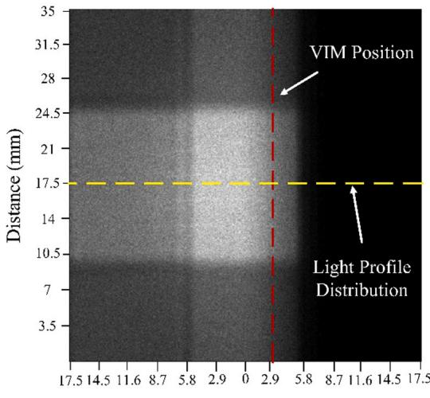

(a)  
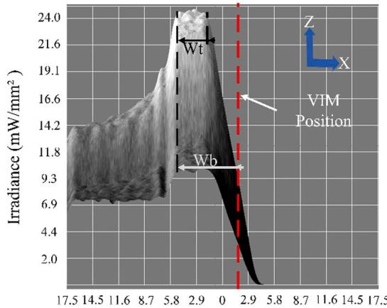  
Distance (mm)  
(c)

(b)  
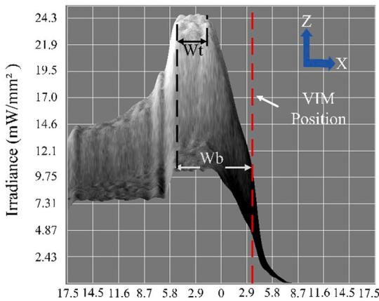  
Distance (mm)  
(d)  
Fig. 6. Spotlight and Irradiance distribution obtained in simulations at the detector in Zemax. (a) spotlight with VIM placed at a short distance from the target, (b) spotlight with VIM placed at a long distance from the target, (c) irradiance distribution for VIM placed at a short distance from the target, (d) irradiance distribution for VIM placed at a long distance from the target.

In Table 1 is shown the measurements obtained in the spotlight using Zemax for FILSS with VIM placed at short and with VIM placed at a long distance from the target of 35 × 35 mm.

In Table 1 is observed a peak irradiance and top width for VIM placed at short and long distances with results approximately in the same range. The top width in both cases represents 9.64% of the area arrived at the target of $3 5 \times 3 5 \ : \mathrm { m m }$ . However, the main difference is the bottom width (Wb) of the spotlight obtained. The Wb for VIM placed at a short distance is 6.375 mm, representing an increment of 8.27% about Wt. This Wb represents 18.21% of the area arriving by the spotlight for a VIM placed at a short distance (20 mm) from the target. Wb obtained for VIM placed at a long distance is 8.625 mm, representing an increment of 5.225 mm, 15% regarding Wt. This Wb represents 24.64% of the area arriving by the spotlight for a VIM placed at a long distance (30 mm) from the target.

Due to VIM in FILSS, approximately half of the light’s total intensity arrived at a specific target area, as shown in Table 1 for the bottom irradiance.

A thermography camera allows obtaining the thermal IC distribution in the SMT. The highest and lower temperatures in the BGA of 35mmx35mm are showed and the effect of VIM in temperature distribution. Fig. 7(a) is showed the thermal distribution for VIM placed at a short distance from the BGA, at 20 mm, and Fig. 7(b) the VIM placed at a long distance from the BGA, at 30 mm.

The thermal distribution in Fig. 7 showed the same behavior found in the irradiance distribution. In both images, the top width (Wt) is 6 mm approximately, 15.6% of the BGA area of 35 mm. Peak temperatures reach $1 6 3 ~ ^ { \circ } \mathrm { C }$ when the VIM is short from the BGA and 170.11 ◦C when it is at a long distance. Table 2 shows the measurements of width and temperatures obtained in BGA for FILSS with VIM.

Table 2 shows the VIM at a short distance from the target, with approximate Wb at 13.75 mm, representing an increment of 23.4% in the BGA area concerning Wt and a temperature reached of $1 4 2 . 5 \ ^ { \circ } \mathrm { C } .$ . For VIM at a long distance from the BGA, Wb is 15.5 mm, an increment of 28.4% of the BGA area concerning Wt, with a temperature reached of $1 4 3 . 7 8 ^ { \circ } \mathrm { C }$

The results obtained are like what we expected if we assume a direct relationship between irradiance and temperature, where 50% of the temperature will be in the VIM position as irradiance case.

The peak temperatures obtained in FILSS with VIM are in the pre-reflow zone range, reaching between $1 6 3 ~ ^ { \circ } \mathrm { C }$ to $1 7 0 . 1 1 ^ { \circ } \mathrm { C } .$ For higher peak reflow temperatures in this system, it is necessary to add an AR coating to each boundary in the optical elements of FILSS, as was previously mentioned in [19]. When used AR coating to the FILSS optical elements, this increment in temperature allows an increment until 40% in temperature, reaching $2 2 8 . 2 ^ { \circ } \mathrm { C }$ to $2 3 8 . 1 \ ^ { \circ } \mathrm { C } ,$ , making it be in the reflow zone, and achieving a good soldering process.

On the other hand, even if FILSS with VIM uses AR films, temperatures are insufficient at the specific VIM location to achieve the soldering process due to these maintain $\mathrm { T } \approx 2 0 0 ^ { \circ } \mathrm { C }$ , temperatures used in the pre-heat, and soak zone in the reflow process.

## 5. Conclusion

Thermal and irradiance distribution at the surface area of a BGA Photonic SMT component were analyzed to determine the reach of the output beam of Focused Infrared Light Soldering System (FILSS) with a Variable Irradiance Mask (VIM) placed at a short and a long distance from the BGA. The results of irradiance distribution in simulation in Zemax are in good agreement with results obtained experimentally at the surface area of the target

A peak irradiance and top width of the spotlight for a short and a long-distance, 20 mm and 30 mm, respectively, were obtained, with similar results between cases. The main difference between cases is the bottom width in the spotlight.

When the VIM is short and long distance from the component, the thermal distribution at the BGA surface is analyzed. An increment of temperature in the obstructed area from the VIM at a long distance can be due to a higher amount of rays arriving at the area. Unlike when the VIM is placed at a short distance, the density of incident rays and temperature decreases.

A peak temperature of $1 6 3 ~ ^ { \circ } \mathrm { C }$ is obtained in FILSS with VIM at a short distance from the BGA, while $1 7 0 . 1 1 ^ { \circ } \mathrm { C }$ is long.

Applying AR coatings to the optical element’s boundary is necessary to increase the temperatures between $2 2 8 . 2 ^ { \circ } \mathrm { C }$ to $2 3 8 . 1 \ ^ { \circ } \mathrm { C } ,$ enough temperatures to be in the reflow stage and obtain a good soldering process.

The temperature of $1 4 2 . 5 ^ { \circ } \mathrm { C }$ for a short distance and $1 4 3 . 7 8 ^ { \circ } \mathrm { C }$ for a long distance is reached at the VIM position. Both

Table 1  
Measurement for FILSS with VIM in Zemax.
<table><tr><td></td><td>VIM placed at a short distance</td><td>VIM placed at a long distance</td></tr><tr><td>Peak irradiance</td><td>24.46 mW/mm²</td><td>24.39 mW/mm²</td></tr><tr><td>Top Width (Wt)</td><td>3.375 mm</td><td>3.4 mm</td></tr><tr><td>Bottom Width (Wb)</td><td>6.375 mm</td><td>8.625 mm</td></tr><tr><td>Bottom irradiance</td><td>11.08 mW/mm²</td><td>10.75 mW/mm²</td></tr></table>

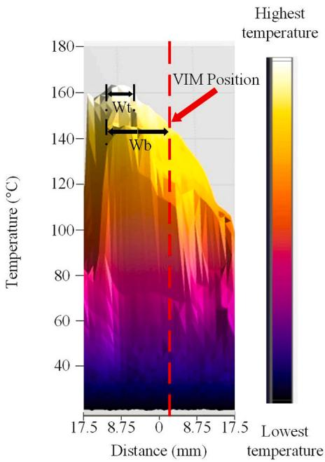  
(a)

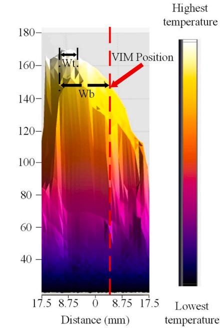  
(b)  
Fig. 7. Thermal distribution obtained with thermography camera (a) VIM placed at a short distance from the BGA (b) VIM placed at a long distance from the BGA.

Table 2  
Measurements in BGA using FILSS with VIM.
<table><tr><td></td><td>VIM placed at a short distance</td><td>VIM placed at a long distance</td></tr><tr><td>Peak temperature</td><td>163℃</td><td>170.11℃</td></tr><tr><td>Top Width (Wt)</td><td>6 mm</td><td>6 mm</td></tr><tr><td>Bottom Width (Wb)</td><td>13.75 mm</td><td>15.5 mm</td></tr><tr><td>Bottom temperature</td><td>142.5℃</td><td> $1 4 3 . 7 8 ^ { \circ } \mathrm { C }$ </td></tr></table>

temperatures represent 50% of the total temperature measure in the BGA.

The effect of VIM in irradiance and heat values, obtaining 50% of the total intensity, was significant how this affects the temperatures achieved in the photonic component directly to obtain a correct component soldering process.

This work can provide helpful information like the relationship between irradiance and thermal distribution to develop new soldering systems using Variable Irradiance Mask considering different positions in the light trajectory and the effect of incoherent diffraction due to VIM to solder electronic components.

## Funding

This project was partially supported by "PRODEP" Mexico with ID: UABC-CA-312. This research did not receive any specific grant from funding agencies in the public, commercial, or not-for-profit sectors.

## Declaration of Competing Interest

The authors declare that they have no known competing financial interests or personal relationships that could have appeared to influence the work reported in this paper.

## References

[1] C. Doerr, J. Heanue, L. Chen, R. Aroca, S. Azemati, G. Ali, G. McBrien, Li Chen, B. Guan, H. Zhang, X. Zhang, T. Nielsen, H. Mezghani, M. Mihnev, C. Yung, M. Xu, “Silicon Photonics Coherent Transceiver in a Ball-Grid Array Package,” Optical Fiber Communication Conference, Los Angeles, California United States, ISBN: 978–1-943580–24-8, 2017.

[2] Patrick Dumais, Dominic J. Goodwill, Mohammad Kiaei, Dritan Celo, Jia Jiang, Chunshu Zhang, Fei Zhao, Xin Tu, Chunhui Zhang, Shengyong Yan, Jifang He, Ming Li, Wanyuan Liu, Yuming Wei, Dongyu Geng, Hamid Mehrvar, Eric Bernier, “Silicon Photonic Switch Subsystem with 900 Monolithically Integrated

Calibration Photodiodes and 64-Fiber Package,” Optical Fiber Communication Conference, Los Angeles, California United States, ISBN: 978–1-943580–23-1, 2017.

[3] Fuad E. Doany, Benjamin G. Lee, Daniel M. Kuchta, Alexander V. Rylyakov, Christian Baks, Christopher Jahnes, Frank Libsch, Clint L. Schow, Terabit/Sec VCSEL-based 48-channel optical module based on holey CMOS transceiver IC, J. Light. Technol. 31 (4) (2013) 672–680.

[4] Y.P. Zhang, X.J. Li, T.Y. Phang, A study of dual-mode bandpass filter integrated in BGA package for single-chip RF transceivers, IEEE Trans. Adv. Packag. 29 (2) (2006) 354–358, https://doi.org/10.1109/TADVP.2006.873135.

[5] L. Zimmermann, H. Schroder, ¨ P. Dumon, W. Bogaerts, T. Tekin, “Epixpack - advanced smart packaging solutions for silicon photonics,” in: Proceedings of the 14th European Conference on Integrated Optics (ECIO), Eindhoven, The Netherlands, paper WeB2, 33–36, 2008.

[6] L. Zimmermann, T. Tekin, H. Schroder, ¨ P. Dumon, W. Bogaerts, How to bring nanophotonics to application– silicon photonics packaging, IEEE LEOS Newsl. (2008) 4–14.

[7] C. Kopp, S. Bernab´e, B.B. Bakir, J.M. Fideli, R. Orobtchouk, F. Schrank, H. Porte, L. Zimmermann, T. Tekin, Silicon photonic circuits: on-CMOS integration, fiber optical coupling, and packaging, Grenoble 17 (3) (2010) 498–509.

[8] D. Vermeulen, S. Selvaraja, P. Verheyen, G. Lepage, W. Bogaerts, P. Absil, D. Van, Thourhout, G. Roelkens, High-efficiency fiber-to-chip grating couplers realized using an advanced CMOS-compatible silicon-on-insulator platform, Opt. Express 18 (2010) 18278–18283.

[9] Sing H. Lee, Y.C. Lee, Optoelectronic packaging for optical interconnects, Opt. Photonics 17 (1) (2006) 40–45.

[10] S. Bernab´e, C. Kopp, L. Lombard, J.-M. Fedeli, Microelectronic like Packaging for Silicon Photonics: A 10 Gbps Multi-chip-module Optical Receiver based on Ge on-Si Photodiode, ESTC, Berlin, Germany, 2010, pp. 1–5.

[11] P. De Dobbelaere, B. Analui, E. Balmater, D. Guckenberger, M. Harrison, R. Koumans, D. Kucharski, Y. Liang, G. Masini, A. Mekis, S. Mirsaidi, A. Narasimha, M. Peterson, T. Pinguet, D. Rines, V. Sadagopan, S. Sahni, T.J. Sleboda, Y. Wang, B. Welch, J. Witzens, J. Yao, S. Abdalla, S. Gloeckner, G. Capellini Demonstration of first WDM CMOS Photonics Transceiver with Monolithically Integrated Photo-detectors, presented at ECOC Tu.3.C.1Paper 2008 Brussels, Belgium.

[12] B. Jalali, S. Fathpour, Silicon photonics, IEEE J. Light. Technol. 24 (12) (2006) 4600–4615.

[13] R. Strauss, SMT Soldering Handbook, Newnes, 1998.

[14] J. Punch, Thermal challenges in Photonic Integrated Circuits 1/6-6/62012. 13th International Thermal, Mechanical and Multi-Physics Simulation and Experiments in Microelectronics and Microsystems 2012 Cascais, doi: 10.1109/ESimE.2012.6191810.

[15] M.B.J. van Rijn, M.K. Smit, M. Spiegelberg, S. Paredes, "Heat sinking of highly integrated photonic and electronic circuits," Abstract from 22nd Annual Symposium of the IEEE Photonics Society Benelux Chapter, Delft, Netherlands, 2017.

[16] X. Wang and S. Mookherjea, "Fast circuit modeling of heat transfer in photonic integrated circuits," in Conference on Lasers and Electro-Optics, OSA Technica Digest (online) Optical Society of America, paper JW2A.141, 2017.

[17] C. Anguiano, M. F´elix, A. Medel, D. Salazar, H. M´arquez, "Heating capacity analysis of a focused infrared light soldering system," in: Proceedings of Conference on IEEE Industrial Electronics Society, Institute of Electrical and Electronics Engineers, Melbourne, 2136–2140, 2011.

[18] M. F´elix, C. Anguiano, A. Medel, M. Bravo, D. Salazar, H. M´arquez, Y.J. Chacon, "Infrared thermography of integrated circuits heated by focused IR light soldering system", Conference of Latin America Optics and Photonics, Optical Society of America, paper LTC4.3, 2012.

[19] C. Anguiano, M. F´elix, A. Medel, M. Bravo, D. Salazar, H. Marquez, ´ Study of heating capacity of focused IR light soldering systems, Opt. Express 21 (20) (2013) 23851–23865.

[20] P. Svasta, D. Simion-Zanescu C. Willi, "Thermal conductivity influence in SMT reflow soldering process," in: Proceedings of the 52nd Electronic Components and Technology Conference 2002. (Cat. No.02CH37345), San Diego, CA, USA, 1613–1616, 2002.

[21] P.S. Considine, Effects of coherence on imaging systems, J. Opt. Soc. Am. 56 (8) (1966) 1001–1009.

[22] M.N. Wernick, G.M. Morris, Effect of spatial coherence on knife-edge measurements of detector modulation transfer function, Appl. Opt. 33 (25) (1994) 5906–5913.

[23] B.M. Watrasiewicz, Theoretical calculations of images of straight edges in partially coherent illumination, Opt. Acta.: Int. J. Opt. 12 (4) (1965) 391–400, https:// doi.org/10.1080/713817950.

[24] J.W. Goodman, ISBN 0-07-024254-2, Introd. Fourier Opt., 1996, pp. 154–160.

[25] M. Felix, A. Medel, H. Marquez, ´ D. Salazar, C. Anguiano, “QTH lamp optical output power analysis for SMT components’ infrared light soldering systems,” in: Proceedings of the 40th Annual Conference of the IEEE Industrial Electronics Society, DOI: 〈10.1109/IECON.2014.7048836〉 (2014).