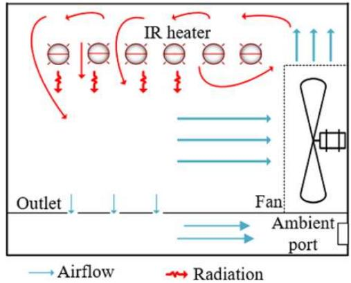
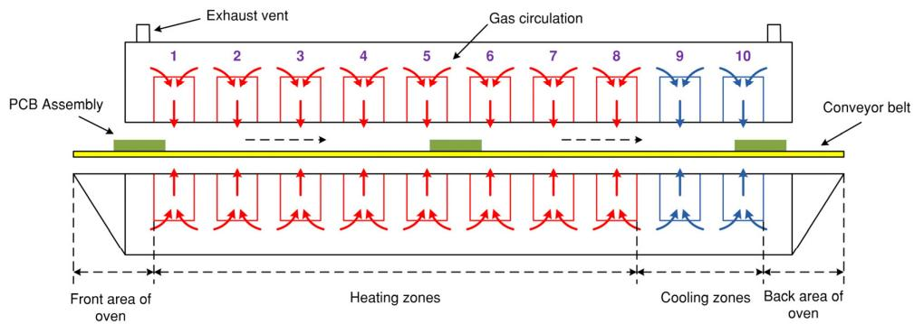
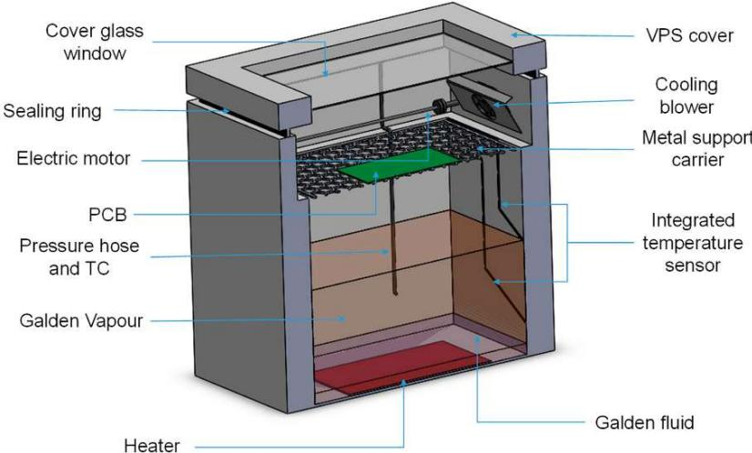

Review

# Overview of Different Approaches in Numerical Modelling of Reflow Soldering Applications

István Bozsóki 1,\*, Attila Géczy 1 and Balázs Illés 1,2

1 Department of Electronics Technology, Budapest University of Technology and Economics, 1111 Budapest, Hungary; geczy.attila@vik.bme.hu (A.G.); illes.balazs@vik.bme.hu (B.I.)

2 LTCC Technology and Printed Electronics Research Group, Łukasiewicz Research Network—Institute of Microelectronics and Photonics, 30-701 Kraków, Poland

\* Correspondence: istv.bozsoki@gmail.com

Abstract: This paper gives a review of different applications in the numerical modelling of reflow soldering technology from recent years. The focus was on detailing the different process types, the physical background, and related mathematical models. Reflow soldering is the main connection technology of surface mounting. Firstly, the solder in paste form is stencil-printed onto the solder pads of the applied substrate, and then surface mounted devices are placed onto the solder deposits. Finally, the whole assembly is heated over the melting temperature of the solder alloy, which melts and forms solder joints. Surface mounting technology needs a low defect rate which is determined by process parameters, material properties, and the printed circuit board design. Accompanying the experiment and measurement, the identification and elimination of root causes can be effectively improved with numerical modelling, which also grants details to such physical mechanisms that are not even conventionally measurable. This paper is dealing with the following topics from the modelling point of view: an introduction of the different reflow technologies; a brief introduction of primary partial differential equations and calculation procedures; heat transfer mechanisms and thermomechanical stresses; and a brief summary of the results of selected studies. A short overview is also given about soft computing methods applied in reflow process optimisation.

Citation: Bozsóki, I.; Géczy, A.; Illés, B. Overview of Different Approaches in Numerical Modelling of Reflow Soldering Applications. Energies 2023, 16, 5856. https://doi.org/10.3390/ en16165856

Academic Editors: Byoung Kuk Lee and Abu-Siada Ahmed

Received: 31 May 2023   
Revised: 22 July 2023   
Accepted: 3 August 2023   
Published: 8 August 2023

Copyright: © 2023 by the authors. Licensee MDPI, Basel, Switzerland. This article is an open access article distributed under the terms and conditions of the Creative Commons Attribution (CC BY) license (https:// creativecommons.org/licenses/by/ 4.0/).

Keywords: reflow soldering technology; numerical modelling; thermomechanical stress; heat transfer; machine learning

## 1. Introduction

Reflow soldering is the main connection technology of surface mount technology (SMT). Firstly, the solder in paste form is stencil-printed onto the solder pads of the printed circuit board (PCB), and then surface mounted devices (SMDs) are placed. Finally, the assembly is heated over the melting temperature of the solder alloy, which melts and forms solder joints. The solder paste contains flux which activates at 100–150 ◦C, cleaning the solder pads of oxides and residues and allowing solder joints to form. Distinguished by heat transfer methods, the most commonly used reflow methods are infrared (IR), the soldering, forced convection (FC), and vapour phase soldering (VPS) [1,2].

Laser reflow soldering systems usually use $\mathrm { C O } _ { 2 }$ or Nd:YAG sources applying a focused and continuous illumination. However, various gas, solid-state, and diode lasers even in pulsed mode were found to be applicable for soldering. Component leads and the solder paste are heated by the absorbed light’s energy. The process, depending on laser power and material properties, may take from a few milliseconds to a few tenths of a second. It is a suitable option for dense packaging and heat sensitive devices as the heat affects only the area of the formed joint [1,3].

IR ovens apply infrared thermal emitters with a wavelength regime between near (\~1 µm) and far (\~1000 µm) infrared. Like laser heating, energy is gained not only on the surface of the solder paste, but in the volume as well, like that of VPS and FC ovens. The penetrating IR radiation can be reflected between the solder particles and achieve even heating. IR reflow represents a non-equilibrium heating process where the heat source is significantly hotter than the target. The heating gradient of the assembly isits absorption properties, the distance between the radiation source and th determined by its absorption properties, the distance between the radiation source and theemission power, and the physical properties of the surrounding medium. assembly, the emission power, and the physical properties of the surrounding medium. The uniformity and intensity of heating can be improved by an airflow in the heating chamber (Figure 1) [1,2].

  
Figure 1. Flow and radiation mechanism in a convectiveFigure 1. Flow and radiation mechanism in a convective IR oven [4].

FC ovens utilise forced convection heating with multiple (from 4 up to 14) temperaturecontrolled zones (which are usually distinguished to preheating, soak, peak, and cooling) connected with a conveyor system (Figure 2). Convection heat transfer is realised by the cooling) connected with a conveyor system (Figure 2). Convection heat tramoving molecules of the heated gas (usually air or inert gas). The process needs a high- by the moving molecules of the heated gas (usually air or inert gas). The volume gas flow to provide efficient heating. To achieve this, the gas is usually moved by high-volume gas flow to provide eficient heating. To achieve this, thethe ventilation of fans. Flow velocity and gas temperature are controlled, and the heated sample reaches a temperature identical to the heat source, rendering FC an equilibrium process [1,2].

  
Figure 2. Conveyor-based forced convection reflow soldering system [5]. The arrows represent Figure 2. Conveyor-based forced convection reflow soldering system [5]. The arrows represent heating (red) and cooling (blue) gas circulation in the numbered zones.heating (red) and cooling (blue) gas circulation in the numbered zones.

VPS is based on transient filmwise condensation. A heat transfer fluid is evaporatedVPS is based on transient filmwise condensation. A heat transfer fluid is evaporated to make a dense vapour space in a closed tank. The assembly is immersed in the vapourto make a dense vapour space in a closed tank. The assembly is immersed in the vapour Figure 2. Conveyor-based forced convection reflow soldering system [5]. The arrospace, and condensation occurs on the surface of the assembly (Figure 3). A condensatespace, and condensation occurs on the surface of the assembly (Figure 3). A condensate heating (red) and cooling (blue) gas circulation in the numbered zones. film forms, which transfers the latent heat of the phase change. This provides the energyfilm forms, which transfers the latent heat of the phase change. This provides the energy for reflow in the solder paste. In more advanced systems vapour generation is controlledfor reflow in the solder paste. In more advanced systems vapour generation is controlled by temperature and pressure measurement [6]. The VPS method ensures the most uni-by temperature and pressure measurement [6]. The VPS method ensures the most uniform form heating with a high heating gradient where the maximum temperature is limited asheating with a high heating gradient where the maximum temperature is limited as the the boiling point of the fluid (equilibrium process). The presence of a condensed film layerboiling point of the fluid (equilibrium process). The presence of a condensed film layer space, and condensation occurs on the surface of the assembly (Figure 3)also keeps the oxygen out, preventing oxidation during reflow. Until the early 2000s, thealso keeps the oxygen out, preventing oxidation during reflow. Until the early 2000s, the spreading of the VPS method was blocked by the lack of environmentally friendly heat transfer fluids (only the hazardous fluorocarbon fluids were available). The development of inert and environmentally friendly perfluoropolyether fluids (Galden liquids) made theof inert and environmentally friendly perfluoropolyether fluids (Galden liquids) made th VPS technology a proper alternative for the microelectronics industry [1,2].VPS technology a proper alternative for the microelectronics industry [1,2]

  
Figure 3. Vapour phase soldering chamber [6].

Due to having the highest productivity rate, the conveyor-type FC ovens are the mosDue to having the highest productivity rate, the conveyor-type FC ovens are the most frequently used for reflow soldering in electronics manufacturing, and the available studfrequently used for reflow soldering in electronics manufacturing, and the available studies ies have focused mostly on this type of reflow method. However, with the technologicahave focused mostly on this type of reflow method. However, with the technological shift to lead-free products and their increased use in power electronics, the spread of VPshift to lead-free products and their increased use in power electronics, the spread of technology began to expand due to its comparable or beĴer quality and energy-savingVPS technology began to expand due to its comparable or better quality and energyaspects. saving aspects.

The successful implementation of the reflow process depends on a low defect rate. InThe successful implementation of the reflow process depends on a low defect rate. general, the root causes of defects can be found in the material properties or in the processIn general, the root causes of defects can be found in the material properties or in the parameters, which depends on the applied reflow method and the PCB design [1]. Theprocess parameters, which depends on the applied reflow method and the PCB design [1]. identification and elimination of these causes is a necessity in troubleshooting the reflowThe identification and elimination of these causes is a necessity in troubleshooting the soldering procedure. The traditional way of solution, addressing the problems heuristireflow soldering procedure. The traditional way of solution, addressing the problems cally by experimenting with parameter optimisation, can be considerably improved bheuristically by experimenting with parameter optimisation, can be considerably improved numerical modelling. It is a proven and flexible tool that potentially ensures a deep unby numerical modelling. It is a proven and flexible tool that potentially ensures a deep derstanding of interesting phenomena which are not or hardly measurable due to thunderstanding of interesting phenomena which are not or hardly measurable due to the harsh environment and closed/isolated nature of reflow ovens.harsh environment and closed/isolated nature of reflow ovens.

## 2. Basics of Numerical Calculation Methods

## 2.1. Partial Differental Equations (PDEs)

Partial Diferental Equations (PDEs) Mathematical physics is based on the linear and non-linear PDEs. Various chemical, Mathematical physics is based on the linear and non-linear PDEs. Various chemical,physical, and biological mechanisms can be modelled by connecting and solving the related physical, and biological mechanisms can be modelled by connecting and solving the rePDEs in a proper way, depending on the level of complexity and abstraction [7]. The next sections summarise the basic equations used for continuum media which are usually applied in the modelling of reflow soldering and associated problems.

The Fourier heat equation describes temperature gradient-driven heat conduction [8,9]:

$$
\rho \cdot c \cdot { \frac { \partial T } { \partial t } } = \nabla \cdot ( \lambda \cdot \nabla T ) - \rho \cdot c \cdot \underline { { v } } \cdot \nabla T + Q\tag{1}
$$

� ⋅ � ⋅where c is the specific heat capacity $[ \mathrm { J } / ( \mathrm { k g } { \cdot } \mathrm { K } ) ] , \rho$ − � ⋅ � ⋅ � ⋅ ∇�is the density $[ \mathrm { k g } / \mathrm { m } ^ { 3 } ] ,$ (1), λ is the tensor of spatial thermal conductivity $[ { \mathrm { W } } / ( { \mathrm { m } } { \cdot } { \mathrm { K } } ) ] ,$ , t is the time $[ \mathrm { s } ] , T$ is the temperature [K], and ∇ is where c is the specific heat capacity [J/(kg·K)], ρ is the density [kg/m ], λ is the tensor othe nabla operator. The convective term is needed if there is flow in the medium, where $\underline { v }$ patial thermal conductivityis the flow velocity vector $[ \mathrm { m } / \mathrm { s } ]$ ·K)], t is the time [s], T is the temperature [K], and ∇ i (see Equation (4)). Either a volumetric heat source Q $[ \mathrm { W } / \mathrm { m } ^ { 3 } ]$ a operator. The convor a surface heat flux $[ { \cal W } / { \bf m } ^ { 2 } ]$ m is needed if there is flow in the medium, where  can represent the heating as a boundary condition.

The Fickian diffusion equation describes concentration gradient-driven Brownian mass transfer. Moisture content determination in electronic packages is one of its major applications [10,11]:

$$
\frac { \partial C } { \partial t } = \nabla \cdot \left( \pmb { D } \cdot \nabla C \right) - \underline { { v } } \cdot \nabla C\tag{2}
$$

where D is the tensor of diffusion coefficient $[ \mathrm { m } ^ { 2 } / \mathrm { s } ]$ and C is the concentration $[ \mathbf { k g } / \mathbf { m } ^ { 3 } ]$ In case of flow, the advection term is needed. The basic form of Equation (2) may not be sufficient for all cases. For example, the concentration field can be discontinuous at material interfaces. Another problem is the variable saturation level that can induce mass transport within the material. A solution to these issues is variable normalisation and an additional source term that is proportional to the saturation changes [12]:

$$
\frac { \partial w } { \partial t } = \nabla \cdot \left( \pmb { D } \cdot \nabla w \right) - \frac { w } { C _ { s a t } } \cdot \frac { \partial C _ { s a t } } { \partial t }\tag{3}
$$

where w [-] is wetness or fractional saturation as $w = C / C _ { s a t }$ and $C _ { s a t }$ is the saturated concentration level. Saturation at the surfaces $( w = 1 )$ can be used as a boundary condition with dry interior as an initial state to calculate absorption, while completely dry surfaces $( w = 0 )$ can be used for desorption. It is known that hydrophobic material contents, such as the silicon chip in the plastic package, can hinder the rate of desorption [13]. Both D and $C _ { s a t }$ express a major increase, with temperature usually described by the Arrhenius equation as ${ \cal D } ( T ) = { \cal D } _ { 0 } { \cdot } e x p { \left( - E _ { a } / ( R { \cdot } T ) \right) }$ , where D is the given variable, $D _ { 0 }$ is a constant, $E _ { a }$ is the activation energy, and R is the universal gas constant. The diffusion coefficient could also depend on the local concentration [14].

The classical Navier–Stokes equation describes the viscous flow of incompressible fluids (gas or liquid) [11]:

$$
- \frac { 1 } { \rho } \cdot \nabla p = \frac { \partial \underline { { v } } } { \partial t } + \underline { { v } } \cdot \nabla \underline { { v } } - \frac { \mu } { \rho } \cdot \nabla ^ { 2 } \underline { { v } } - \underline { { f } }\tag{4}
$$

where v is the flow velocity vector $[ \mathbf { m } / \mathbf { s } ] , p$ is the pressure $[ \mathrm { P a } ] , \mu$ is the dynamic viscosity $[ \mathrm { k g } / ( \mathrm { m } { \cdot } \mathrm { s } ) ]$ , andfis the force [N/kg] that acts on the fluid. The diffusion and heat equations can be coupled with the Navier–Stokes equation as stated in Equations (1) and (2).

Thermal expansion-induced mechanical stress can be described by the equations of linear thermoelasticity [15,16]. Generally, the elastic wave equation deals with mechanical stress propagation. However, because the inertia term is negligible during the heating processes in most cases, assuming static force equilibrium in each time-step is enough for the modelling of electronic assemblies [17,18]. It is given by:

$$
\nabla \cdot { \boldsymbol { \sigma } } + { \underline { { F } } } = \underline { { 0 } }\tag{5}
$$

where F vector is the volumetric source $[ \mathrm { N } / \mathrm { m } ^ { 3 } ]$ (as gravity force) and $\sigma$ is the Cauchy stress tensor [Pa]. Thermal expansion due to elevated temperature and hygroscopic swelling due to local moisture concentration act as an additional inelastic component to the elastic strain (general Hooke’s law):

$$
\varepsilon = S : \sigma + \alpha \cdot ( T - T _ { 0 } ) + \beta \cdot ( C - C _ { 0 } )\tag{6}
$$

where S is the tensor of compliance $[ \mathrm { P a } ^ { - 1 } ] ,$ ε is the tensor of total strain [-], α is the tensor of thermal expansion coefficient $\operatorname { ( C T E ) } [ \mathrm { K } ^ { - 1 } ] , \beta$ is the tensor of moisture expansion coefficient (CME) $[ \mathrm { m } ^ { \frac { \bullet } { 3 } } / \mathrm { k g } ] , T _ { 0 }$ is the initial temperature, and $C _ { 0 }$ is the reference level. Material deformation due to local total strain is given by the displacement vector. Assuming only small deformations, the expression is:

$$
\pmb { \varepsilon } = \frac { 1 } { 2 } \Big ( \nabla \underline { { u } } + \left( \nabla \underline { { u } } \right) ^ { T } \Big )\tag{7}
$$

where u is the displacement vector [m]. Equations (5)–(7) can be solved for the displacement field if the mechanical restrictions, temperature profile, and boundary forces are known. As the temperature evolves, stresses and strains can be deducted from the displacement field, adding incrementally in each time step. The temperature profile can be directly prescribed throughout the structure or calculated by the heat equation. In most cases the initial condition is a stress-free reference state (above the solidus temperature for solder material, above the glass-transition temperature for plastics, or room temperature for relaxed material). Plastic flow (yielding) is an important non-linear extension of the basic model that describes plastic deformation used to calculate residual stresses [17,19]. Both plastic and elastic behaviour can work with the viscous rate-dependent stress–strain relation. The stress tensor’s scalar invariant, which is related to the distortion strain energy, is important for the prediction of material failures. This is von Mises stress (effective stress), which is usually applied in mechanical analysis to find locations sensitive to cracking or yielding [20]. It can be calculated from the components of the stress tensor as [17]:

$$
\sigma _ { V M } = \sqrt { \frac { \left( \sigma _ { 1 1 } - \sigma _ { 2 2 } \right) ^ { 2 } + \left( \sigma _ { 2 2 } - \sigma _ { 3 3 } \right) ^ { 2 } + \left( \sigma _ { 3 3 } - \sigma _ { 1 1 } \right) ^ { 2 } + 6 ( \sigma _ { 1 2 } + \sigma _ { 2 3 } + \sigma _ { 3 1 } ) } { 2 } }\tag{8}
$$

where $\sigma _ { V M }$ [Pa] is the von Mises equivalent stress. Finally, crack propagation and delamination can be analysed by adding fracture mechanics [21,22]. In this case, a small crack is placed in the investigated structure, which can amplify the mechanical stress. Within the linear elastic model, the stress is analytically singular at the crack tip, but finite around it, and decreases with distance. Finite strain, stress, and displacement fields are numerically approximated at the crack area. According to these fields, the cracking mode-mixity (involving tension and in- and anti-plane shear) and total energy release rate $[ \mathrm { J } / \mathrm { m } ^ { 2 } ]$ can be calculated. The energy release rate describes the dissipated energy per unit crack surface assuming crack growth. If this value is greater than a mode-mixity dependent limit (fracture toughness), then the crack will increase.

## 2.2. Numerical Solution Methods

It is often hard or even impossible for convoluted problems to reach analytic solutions using the PDEs above. With the fast calculation capability of modern computers, complex models can be analysed by numerical methods. The finite element method (FEM) and the finite difference method (FDM) are the two main approaches. However, the finite volume method (FVM), which is mostly applied in fluid dynamics for more stable solutions in certain problems, is also available in modern simulator platforms. These methods are universally capable of discretising the investigated issue in time and space using various techniques. FDM replaces the differential operators with finite difference ones that are based on the Taylor series approximation of a given order, realised on a finite difference grid [7,10]. Compared to FEM, the FDM forms are relatively easy to derive and program, especially when multiple PDEs need to be coupled. It is a very flexible way to try out and modify the model during development. On the contrary, it is difficult to handle nonrectangular geometry, and fine grid resolution is needed to achieve solutions with low error. FEM divides the investigated geometry into discrete and not overlapping subdomains (called “elements”), resulting in a mesh in this way. The elements can contain several nodes with continuous weight parameters and shape functions. The shape functions’ weighted summa provides the approximated solution over an element. The weighting parameters are determined by forcing the weighted residual error towards zero over the model domain—the so-called Galerkin method [23,24]. Finite element formulation based on the weak form of PDEs can reduce the order of differentiation, thus making the linear shape function applicable for second-order equations. FEM (as well as FVM) can handle complex geometry, and an accurate solution is achievable with a lower element number than the FDM grid resolution, because the approximation capability also heavily depends on the order of shape function. On the other hand, the preparation of the element equations is much more demanding mathematically. Both FDM and FEM result in a huge system of algebraic equations (full explicit, full implicit, or partially between) that must be solved once for steady-state problems or in each discretised time-step for a transient case. A generally used technique to reduce the algebraic system is structural reduction by cutting the model along symmetry axes with appropriate boundary conditions. Using either method, when the numerical formulation is stable (the errors are attenuated during time steps) and consistent with the exact PDE (the errors are decreased by refining the time step, spatial mesh, or grid) the results will converge to the true solution of the problem. Besides pure maths, the accuracy of a simulation heavily depends on the level of abstraction and accuracy of material properties. When these are not given by the manufacturer or not easily measurable, one must rely on material databases with an often limited data set or even tweak the applied values in the possible range. The goal is always to achieve adequate accuracy and prediction capability to grant the applicability of the model for a given purpose. This can be decided by validation using measurement directly or indirectly, also relying on modelling experience and engineering judgement.

Several computational FEM/FVM platforms (non-exhaustive list) with advanced graphical interface and specialised modules for engineering purposes are available commercially, such as Abaqus, ADINA, ANSYS, and Comsol. Open-source alternatives such as Elmer, FreeFEM, or OpenFOAM are also accessible.

## 3. Heat Transfer Methods

This section presents the process modelling approaches, focusing on the heat transfer aspects of the different reflow methods. Heat transfer capability is a major attribution of reflow ovens, characterising the heating power and its distribution that can be added to the sample. The very nature of the transfer process is determined by the method of heating, as detailed earlier. Heating efficiency and homogeneity have a crucial impact on solder joint reliability. Inhomogeneous temperature distribution can lead to various soldering failures. Accordingly, a good number of experimental and numerical investigations deal with heat transfer, temperature distribution, and gas flow characterisation.

## 3.1. Laser Soldering Process

Because of the focused laser source, the heat is localised during laser soldering, so the body of the component is not exposed to the thermal load. The heat from the laser beam is usually modelled as a spatially Gaussian distribution. A volumetric source term can be generated by the Lambert–Beer absorption law. Assuming $I ( x , y , t )$ is the heat flux $[ \mathrm { W } / \mathrm { m } ^ { 2 } ]$ on the surface from the laser beam, the source term can be written by differentiating along the depth as:

$$
Q = \alpha \cdot I ( x , y , t ) \cdot e ^ { - \alpha \cdot z }\tag{9}
$$

where x and y [m] give the surface, α is the absorption coefficient $[ \mathbf { m } ^ { - 1 } ] ,$ , and z is the perpendicular depth [m].

The laser beam can also be applied from the side or even through the PCB or the SMD component, if they are transparent at the applied wavelength. This arrangement was applied to flip-chips on 0.8 mm thick silver-on-glass substrates with 100 µm spot diameter using continuous Ar+ laser source in [25]. 3D FEM model was developed to analyse the thermal distribution. It was confirmed that the area loaded by the heat was restricted to the solder paste and the solder pad.

Solder joint reliability can be affected by the intermetallic compound (IMC), for example, $( \mathrm { C u } , \mathrm { N i } ) _ { \times } S \mathrm { n } _ { 5 }$ and $\mathbf { A g } _ { 3 } \mathbf { S n } ,$ which forms between the solder pad (base Cu and/or Ni plating) and the melted solder. Though the presence of an IMC is necessary to guarantee joint formation, its excessive growth can result in brittle characteristics. This was investigated with a 3D FEM model for Sn-Cu and SnAgCu-Cu interphases [26,27]. An infrared pulsed laser was applied with multiple-scanning speeds and a 25 µm spot size. The heat equation was coupled with the Navier–Stokes equation to study heat transfer in the melted solder. The latent heat of phase change was part of the calculation as an effective heat capacity. The dominant Cu mass transfer was modelled as diffusion, also coupled to the melted flow. The conclusion was that the SAC solder alloy with a lower melting temperature (compared to pure Sn) had an enhanced convective component, meaning a higher temperature, flow velocity, and diffusion rate compared to the Sn solder.

The effect of laser process parameters on the temperature distribution and thermal stress of an SAC solder joint were investigated with 3D FEM in [28]. The results revealed that the temperature, stress, and deformation of the joint were proportional to laser power and soldering time span. A relation was also found between the temperature distribution and microstructure of the joint verified by cross section inspection and micro-Vickers hardness measurement. A high soldering temperature due to increased power and duration results in more refined joint microstructure with increased hardness.

## 3.2. Infrared Soldering

A complex study using 3D FVM for an IR reflow oven with forced convection aid was presented in [4,29]. Turbulent flows may cause numerical instability, which was avoided by time averaging by using the Reynolds averaged Navier–Stokes (RANS) equations with K-epsilon (or one of the similar) methods. The discrete ordinates (DO) method was used to solve the general radiative transfer which controls the local emission, absorption, and scattering phenomena. The temperature rise caused by locally absorbed energy was described by the heat equation. The results showed that the temperature of the assembly increased by $4 0 { - } 5 0 ~ ^ { \circ } \mathrm { C }$ in the case of radiation compared to convection heating only. In addition, the radiation heat transfer was the dominant heat source with a lower fan speed and less turbulent flow.

## 3.3. Forced Convection Soldering

In the case of forced convection reflow soldering, Newton’s law describes the heat transfer to the surface from the heating fluid (gas or liquid). The heating power P [W] is calculated as [2,9]:

$$
P = h \cdot A \cdot ( T _ { F } - T _ { S } )\tag{10}
$$

where $h$ is the heat transfer coefficient $[ { \cal W } / ( { \bf m } ^ { 2 } { \cdot } { \bf K } ) ] ,$ A is the heated area $[ \mathbf { m } ^ { 2 } ] , T _ { F }$ is the undisturbed fluid temperature far from the surface, and $T _ { S }$ is the surface temperature. It is a convenient method to limit the mathematical model without calculating the whole temperature and velocity field of the fluid around the heated surface. Equation (10) can be rewritten as the heat equation’s convective boundary condition, which provides the heat flux $[ { \cal W } / { \bf m } ^ { 2 } ]$ at the surface [9]:

$$
\underline { { n } } \cdot \left( \lambda \cdot \nabla T \right) = h \cdot \left( T _ { F } - T _ { S } \right)\tag{11}
$$

where n is the unit length normal vector in the outward direction. Similar boundary conditions can be applied for the diffusion equation with ambient concentration and mass transfer coefficient. When a considerable IR effect is presented in a forced convection oven, then the heat flux is addressed as surface-to-surface thermal radiation. In the case of opaque, grey, and diffuse surfaces it gives [9]:

$$
\underline { { \boldsymbol { n } } } \cdot ( \lambda \cdot \nabla T ) = \frac { 1 } { A _ { S } } \cdot \frac { \boldsymbol { \sigma } \cdot \left( \boldsymbol { T _ { H } } ^ { 4 } - \boldsymbol { T _ { S } } ^ { 4 } \right) } { \frac { 1 - \varepsilon _ { H } } { A _ { H } \cdot \varepsilon _ { H } } + \frac { 1 } { A _ { H } \cdot F _ { H S } } + \frac { 1 - \varepsilon _ { S } } { A _ { S } \cdot \varepsilon _ { S } } }\tag{12}
$$

where σ $[ \mathrm { W } / ( \mathrm { m } ^ { 2 } { \cdot } \mathrm { K } ^ { 4 } ) ]$ is the Stefan–Boltzmann constant, ε [-] is the emissivity, $H$ subscript and $S$ subscript denote the heater and target surfaces, and $F _ { H S } \left[ - \right]$ is the view factor from the heater to the target surface. Also note that ${ \cal A } _ { H } { \cdot } F _ { H S } = { \cal A } _ { S } { \cdot } F _ { S H }$ according to the reciprocity relation. Between multiple surfaces the radiation is considered as a space resistance network [9].

When the heated body acts as a concentrated thermal mass with approximately uniform temperature distribution inside, we obtain lumped modelling. For this case, small Biot numbers are recommended (as $B i < 0 . 1 )$ . This is the ratio of convection at the surface and conduction inside the body as $B i = ( h \cdot L _ { c } ) / \lambda$ , where $L _ { c }$ is the characteristic length defined as the ratio of the volume and the heated surface area. The temperature transient of a specific body (with convective heating) is given by [2,9]:

$$
c \cdot m \cdot { \frac { d T } { d t } } = h \cdot A \cdot ( T _ { F } - T )\tag{13}
$$

where T is the body temperature and m [kg] is the mass of the body. The main advantage of this simplification is that Equation (13) is easier to solve either analytically or numerically for T if h is known, or inversely. This is applicable to thermocouples to determine the h value according to the temperature data of the transient changes. The heat transfer coefficient heavily depends on the flow properties and is often approximately known. An explicit formula or analytic Nusselt type solution exists only for some simple cases. Not only can measurements determine the h value, but numerical simulations can also help in this matter. During forced convection reflow, we can assume that h values obtained with sensor data can be applied for the PCBAs (PCB assembly) as well, or more specifically on the components, while flow perturbation by the sensors is minimal. However, complex models combining heat conduction with fluid flow revealed several cases where the measured values need to be corrected.

Reference [30] introduced a simplified modelling technique for the conveyor-type FC reflow station with multiple temperature zones. The populated PCBA was modelled as a 2D thermal RC network that renders thermal masses to each temperature nodes and thermal resistances between them (analogue to the FDM approach). This simplification was justified by Biot number analysis. Both thermal radiation and convective heat source were defined for each node. Another simplified approach to determine the temperature of the heated sample applying the lumped model with FDM was presented in [31].

A complex conveyor-type oven model was presented in [32]. With the application of a 3D FEM model, minimum and maximum temperature levels were determined on a PCBA, where the board was heated by radiation and convection at the same time. For gas flow a heat transfer coefficient was presented with an experiment-based function.

A forced convection oven with a nozzle-matrix blower system and a conveyor line is presented in [2]. The 3D characteristic of the heat transfer coefficient was calculated from measured temperature data at multiple points using the lumped model. Gas flow was approximated with a RANS type model and two-dimensional FVM. The effect of SMCs on the flow was investigated. Flat packages (such as BGA—ball grid array—or QFP—quad flat pack) have no considerable effect on the flow; however, bulky components (such as an electrolytic capacitor) can alter it locally, causing turbulence that decreases the velocity of the flow and consequently the coefficient of heat transfer.

Combined 3D gas flow and thermal simulation was carried out in [33] using FVM and FEM. Detailed heat transfer coefficient map was determined on a populated board travelling through the FC oven. The shadowing effect between large components and the vortices generated by the movement of the board resulted in decreased heat transfer capability in certain areas. It was concluded that a lower conveyor speed improved temperature uniformity, but at the risk of overheating.

The complex simulation approach for the FC oven was also utilised in [34] with 3D FVM. The thermal behaviour of a populated FR4 PCB assembly with high complexity and small component size during reflow was analysed. The total space of convection with the inlets was modelled while the PCBA travelled through the conveyor. Nitrogen was used as the convection fluid, and the RANS model was chosen to handle turbulence flow. They found the maximal temperature difference appeared across the long PCB edge in the travelling direction and only minor differences perpendicularly along the short edge.

## 3.4. Vapour Phase Soldering

The VPS method is suited with the harshest process zone, which complicates any measurement. The thermal behaviour of the heated sample itself is considered as an inseparable aspect from the process. Condensate layer forming heavily depends on the geometry, wetting, and surface temperature development. Layer forming also consumes vapour, causing fluctuations in vapour concentration that affects heat transfer efficiency. Consequently, proper data cannot be obtained from a sensor. The sensing unit should be positioned into the sample, and then the thermal transient must be recorded, so that the heat transfer coefficient can be obtained with a solution of an inverse heat transfer problem, based on the heat flux calculation at the boundaries.

Thermal transients of FR4 substrate were investigated in vapour phase soldering [2] using FDM. The substrates were assumed as concentrated thermal masses. In this case, the coefficient of heat transfer referred to the heat transfer across the condensate that is formed during VPS. The heat transfer coefficient formulas for filmwise condensation were built upon the original theory of Nusselt.

A more detailed 3D FDM simulation of vapour condensation on bare PCB substrates with varied thermal properties was also introduced in [2]. The temperature changes in the oven were governed by the heat equation. Evaporation generated concentration difference and mass transport, described by the diffusion. The latent heat of condensed vapour was introduced to the filmwise condensate, and then the heat was conducted to the body surface through the liquid as an inherent heat flux. The condensation of the heat transfer fluid was driven by a custom dew point model that was validated by measurement. The vapour consumption caused significant mass diffusion to compensate the mass loss. The Navier–Stokes equation was used to describe the laminar flow of the condensed layer. This way, the heat transfer coefficient showed a sudden decrease within the first two seconds, followed by a slower increase until the end of the process, and the rate was highly dependent on the substrate material. A correlation between the thermal diffusivity of the samples and the heat transfer coefficient was shown, indicating a larger coefficient at larger thermal diffusivities.

A solution method to the inverse heat conduction for the distributed system during vapour phase soldering was introduced in [35], along with 3D component level temperature analysis. A surface mounted polymer capacitor was modelled with a fast FDM scheme. The temperature transient was measured in a bore at the centre of the component during an insertion into the vapour phase soldering oven; eventually, the recorded data were the key to calculating the heat transfer coefficient. As stated by the described complex approach, a quick decrease in heat transfer coefficient was followed by a moderate increment in the values, which was inversely proportional to the thickness of the liquid layer. It was also concluded that the PCB could hold a thicker liquid layer than the component.

## 4. Thermomechanical Simulation

This section presents modelling approaches focusing on thermomechanical stress during the reflow process. Thermomechanical stress, or simply thermal stress, is a wellknown issue in microelectronics packaging durability. Temporal and spatial temperature gradient acting with different coefficients of thermal expansion in a composite structure result in different thermal expansions or contractions throughout the volume. Thermal stresses occur when any of these are constrained externally or internally. The board level analysis deals with the large-scale deformation of the assembly. At the component level, the mechanical stresses are investigated in the joints due to a CTE mismatch between the board and the component. Internal component stresses also studied were caused by thermal expansion accompanied by hygroscopic effects due to moisture content. Additionally, vapour pressure build-up in small cracks can lead to rapid crack growth during the reflow process. To reduce computational requirements, thermomechanical modelling approaches often omit transient stresses caused by non-uniform temperature distribution and prescribe the temperature uniformly in the structure following a standard reflow profile.

## 4.1. Analysis on Board Level

Warpage (out-of-plane deformation) along the boards was the focus of nonlinear programming in [36], during reflow soldering. The amorphous resin-based laminates underwent glass transition during heating, which decreased their elasticity and increased the thermal expansion coefficient. Two things affected the problem: the CTE mismatch between the prepreg layers and the copper and gravity are the root causes of warpage along the surface of PCBs. The theory of multi-layer laminated plates was used in the study to obtain the curvature at the lateral central point of the PCB. As concluded, additional dummy copper patterns and increased resin layer thickness can prevent the deformation rate at the cost of a larger weight and volume and a modification of the routing design. A similar warpage prediction study was presented in [37] based on the same multi-layer plate theory approach. Each layer was treated as a composite copper-epoxy material using the rule of mixtures with volume fractions, which is a common approximation method [38].

Gravity usually has a minor effect on thicker, smaller panels and a negligible effect on microelectronic components. However, the decreased bending stiffness of thin panels may cause reliability problems due to the additional mechanical stress during reflow. Large PCB arrays with 0.6 mm thickness, moving on a transition rail, were applied for deformation analysis due to gravitational forces in [39]. The prepreg and copper layers were modelled as linear elastic composite using volume fractions.

Warpage analysis of double-sided FR4 printed circuit boards and panelised PCB arrays were the focus of a study in [40] to determine the optimal router tab and array fixture design. A 3D FEM model was considered with large packages with a high pad count that exerted enough constraint after joint formation to affect the total warpage. All material models were linear elastic, including glass transition and orthotropic CTE. The model was validated via warpage measurement using the optical Shadow Moiré technique.

Another study [41] investigated a microwave SiP (system-in-package) module with ceramic substrates. QFN (quad flat no-lead) and QFP packages with other passive components were mounted on two levels of ceramic substrates interconnected with nickel-cobalt ferrous alloy (Kovar) columns. The module itself was mounted on FR4 PCB. Through 3D FEM simulation, warpage and stress variation were analysed during the reflow process. The viscoplastic Anand model was applied to the SAC solder balls. The results showed increasing warpage with the increase in maximum reached temperatures. The effective and residual stresses reached their maximum in the solder ball roots at the outermost diagonal corners.

Warpage was predicted at the board level with 3D FEM during FC reflow with an IR component in [5]. The layered PCB was populated with larger packages such as BGA using simplified models. Heat conduction was coupled with thermal stress calculation including glass transition. Convective and radiative boundary conditions were combined as heat transfer. The convective part was determined from Nusselt-type theory. The warpage increased with rising temperature and reached its maximum at the peak temperature. Besides ambient temperature and conveyor speed, the thickness of the board had the greatest impact on warpage percentage.

Warpage of PCB equipped with dual in-line memory module (DIMM) socket was experimentally studied and modelled in [42] at different thermal loads. The deformation caused by CTE difference between the socket and the PCB was calculated with 3D FEM using simplified linear elastic models, where the board and the socket were treated as composites. The elastic properties and CTE values of the materials were determined by in situ measurement and bending tests. An analytic solution was also proposed based on the beam bending theory.

Warpage and residual stresses induced during reflow soldering were investigated in an insulated gate bipolar transistor (IGBT) power module in [43]. These modules contain a thick copper base substrate, and thin direct bonded copper (DBC) plates are soldered onto it. DBC plates have a ceramic core, and the copper layer is patterned. The components are mounted and wire bonded onto the DBC plates, while the base substrate could be equipped with a massive heat sink from the other side. This structure ensures effective cooling for high-power current switching. These modules require a specialised reflow technique that uses a controlled hot surface to transfer heat to the substrate by direct contact. A vacuum is applied in the closed chamber above the liquidus temperature to eliminate solder voids. Predicting residual warpage is crucial to achieve excellent heat sink contact. A 3D FEM model was built including material plasticity and viscoplastic solder behaviour. The maximum stress (residual and effective) appeared in the ceramic plates due to the CTE mismatch compared to the copper substrate. It was found that deformation and stress can be safely reduced by decreasing the thickness of the ceramic plates or applying pre-warped copper substrates. This model was extended in [44] by changing to a coated AlSiC metal matrix composite substrate to decrease CTE difference. Temperature-dependent material properties and the effect of latent heat during phase change were also included.

## 4.2. Component Level Analysis

The diffusion of moisture in polymer materials in the case of improper storage may cause a “popcorn” cracking effect in the package. This means that there is a vapour pressure build-up during heat transfer in reflow ovens, causing a crack in the plastic body of the electronic component. Interfacial delamination is usually observable in such cases between the encapsulant material and lead frame in the package structure. Delamination originates from small voids or defects in material interfaces that arise during manufacture and are able to grow due to thermal stress. This complex phenomenon was modelled in [45]. A two-dimensional thin QFP package model with leadframe, epoxy moulding compound (EMC), and silicon die was investigated. A 2D FEM approach was applied in the study. The 0.2 mm long delamination interface was placed between the frame and EMC. Transient temperature, moisture concentration, and vapour pressure were the focus of the calculations. These parameters were then coupled to the stress field. The total energy release rate was determined based on the so-called “modified virtual crack closure” (MVCCT) technique. The results revealed that EMC material with a lower elastic modulus contained lower thermal stress. Similarly, lower CME and diffusion coefficient resulted in decreased hygrostress.

A similar 2D bi-material crack analysis in thin QFP packages was presented in [46], where a 0.5 mm crack was placed between the die pad and EMC. It was observed that the energy release rate and moisture concentration were found to be higher in packages with lower height. Furthermore, thermal strain due to CTE mismatch only contributed to 40–50% of the total energy release rate. This percentage increased with package thickness.

Bi-material crack analysis with moisture diffusion was further elaborated in [47] with 2D FEM model of a two-level stacked die package, including two silicon dies, moulding compound, die attach adhesive and epoxy substrate. The MVCCT was applied to analyse pre-made cracks at potential delamination interfaces at the die/die attach and die/moulding compound on both levels. The vapour pressure inside acted along the outward normal direction of the crack surfaces, proportionally to the local moisture content and the saturated water vapour pressure. According to the results, the energy release rates at the bottom die were larger than on the top level and increased with crack length. The growth trend became more significant at the peak temperature, indicating the significance of vapour pressure for larger cracks. Shear was found to be the dominant mode around the crack tip, originating from a CTE and CME mismatch.

Crack analysis was performed at the interface of the copper/copper-epoxy layers in the metal leads of a multi-layer ceramic capacitor using 3D FEM in [48]. Crack propagation from the initial micro voids was simulated as uneven thermal expansion between adjacent layers as tension load, which could lead to delamination. The theory was validated with a cross-section inspection of micro cracks and voids at the interface using a scanning electron microscope. The model was refined further by adding the effect of hygrostress due to moisture diffusion in [49].

Residual strain and warpage were investigated in plastic BGA packages during reflow and thermal cycling in [50]. A combination of Shadow Moiré measurement and 3D FEM simulation was applied, with a glass transition effect in the EMC material. It was shown that the residual strain increased with the glass transition temperature. The approach was improved further in [51] with temperature dependent CTE and viscoplastic SAC solder ball material. The heating was modelled with convective boundary conditions using prescribed heat transfer coefficients and ambient temperatures to emulate the reflow profile. The maximum convex warpage appeared during the first section of cooling, and its magnitude decreased for thicker PCBs.

Thermal stresses and warpage in the ball array of a BGA were analysed during cooling in [52,53]. A slow cooling rate may result in a large grain size and excessive intermetallic growth in solder joints, causing weak fatigue resistance. On the other hand, a fast cooling rate may lead to a high level of thermal stress causing internal cracking in the joint or bonding pad delamination. Influent gas flow (nitrogen) and the resulting coefficient of heat transfer were calculated on a coarsely detailed FR4 PCBA with RANS, applying a 3D FVM approach. The calculated board level thermal response was transferred to a more detailed sub-model to determine thermal stresses in the SAC solder joints with FEM. It was found that the inlet velocity affected the process the most. This was followed by the cooling temperature, conveyor speed, and PCB density. The maximal effective stress appeared at the roots of the bumps, where the board and the package substrate acted as constraints with different CTE values.

Thermal stresses and warpage in a mounted flip-chip were modelled in [54] with 3D FEM due to a CTE difference between the chip and the FR4 board. Only the cooling section was simulated considering the high temperature state before solidification as stress free. A constant heat transfer coefficient was used, and the result was convex warpage, because the FR4 contracted more than the silicon chip.

Internal stresses in a QFP component were investigated during reflow process in [55]. The most critical material interfaces in a QFP package are between the lead frame and the die attach, as well as between the silicon die and EMC. A 3D FEM approach was applied to a linear elastic model. The focus was on the interfaces between materials with detailed structural definition. It was shown that the maximum effective stress appeared in the interface between the die attach and the copper pad. This was the case in both constrained (joined with solder) and free configurations, although it was nearly tripled in the constrained one.

## 5. Other Modelling Examples Related to Reflow Soldering

The food industry also applies heat transfer processes based on forced convection and IR radiation ovens. Their model examples are very similar to the reflow models, using the same PDEs, source terms, and related boundary conditions to describe heat and additional/optional mass transport processes. Baking and drying ovens with IR heating and combined force convection effects were modelled with an FEM approach in [56–59]. The main difference between food industry examples and soldering applications is the dominant moisture evaporation. Moisture is released from the surface of the samples as mass flux that causes heat loss. In a heated porous medium the extensive flow of absorbed moisture may appear driven by a pressure gradient. For such cases the convection and advection terms should be added to the equations [59].

Stencil printing with pin-in-paste technology is one of the most crucial production steps related to the reflow process, as a major part of soldering failures can be attributed to it. Optimisation by numerical modelling also plays an important role in this field, as stated in recent works [60–63]. The effect of printing speed and force, squeegee geometry, paste viscosity, stencil aperture, and reflow profile were investigated.

## 6. Soft Computing Methods

Soft computing refers to computational techniques that approximate complex systems without relying on conventional (i.e., hard) mathematical models such as PDEs. The concept is based on learning from a large set of experimental data that contain the behavioural patterns to be approximated. Model building is adaptive and flexible process, although the resulted structure does not provide constructive insight of underlying physical principles. Genetic algorithm (GA) and artificial neural networks (ANNs) are the main, often combined machine learning techniques to realise non-linear approximation for process modelling [64,65]. ANN is a distributed numerical system, built as a network of simple non-linear processing units, with a large enough degree of freedom to universally approximate real-life system behaviour. The learning process is done by iterative error minimisation called training. The trained model can be used to inter- or extrapolate with smooth transition to such system responses that were not trained previously, even several orders of magnitudes faster than PDE based modelling. On the other hand, selecting and training the adequate type of ANN to a global optimum point is computational power and time demanding task, requiring empirical strategies. The GA is a robust heuristic optimisation algorithm inspired by natural selection. In each generation (iteration) the individuals (candidate solutions) are subjected to operators as mutation, crossover, and selection that based on a pre-defined fitness function. The algorithm terminates after a fixed number of generations or when a dedicated fitness level is reached [65].

An optimisation method for FC reflow profile was proposed in [66] combining back propagation neural network (BPNN) and GA in a hybrid framework. The data set was acquired by measurement. Input process parameters were the peak temperature for each zone, conveyor speed, and PCB density. The outputs were the predicted soak and peak temperatures of the PCB, the length of each stage, and the slope of cooling. GA was utilised to optimise the input parameters using the trained network to achieve prescribed outputs. This hybrid approach was further elaborated in [67] with a wider range of process variables. The hybrid AI method was compared with other common optimisation procedures and proven superior, with the lowest statistical error. GA was also applied to minimise IMC growth by finding optimal profile parameters in [68].

Stencil printing for pin-in-paste reflow application was studied using machine learning in [69]. The target volume of solder paste forced into the plated through-hole must be strictly maintained to avoid soldering defects. The ANN input parameters were the diameter of the plated hole and the printing speed. The output was the hole-filling ratio, which was investigated with X-ray. The training was carried out using experimental data measured on an FR4 board with multiple through-hole sizes and printing speed values.

Integration necessarily generates the shrinkage of component sizes and a demand for precise component placement machines. SMCs align themselves during reflow soldering, but the extent may depend on various factors including soldering method, original displacement, surface tension, and solder paste volume. The investigation presented in [70] dealt with predicting the self-alignment of 0603 size SMC resistors on FR4 using BPNN and an experimental data set. IR and VPS soldering were compared, and the latter shoved higher self-alignment ability caused by higher surface tension due to the more forceful heating. The input parameters for the network were the x-y offsets and the reflow method, while the outputs were the offsets after the soldering process. The machine learning approach was refined further in [71]. SMC resistors and capacitors in 0402, 0603, and 1005 sizes were examined with 48 input parameters categorised as component geometry, pad geometry, solder paste volume and placement, and component placement. Conventional, PDE based formulation of the self-alignment problem can be found in [72].

IMC compound morphology affects the mechanical behaviour and reliability of the solder joint. The morphology of the brittle intermetallic Cu6Sn5 was investigated in [27] during laser reflow soldering. Experimental work was performed with multiple power levels and scanning speeds. The transition between IMC morphologies depends on the interfacial temperature. 2D FEM analysis was performed to calculate the interface temperature for different combinations of scanning speed, the power of the laser, and SAC alloy composition. The data set generated by the FEM model was applied to train a BPNN to predict IMC morphology.

A data set generated by conventional numerical modelling was combined with machine learning techniques to optimise the reflow process in [73]. A 3D FEM model of an FC oven was considered with convective and radiative heat transfer coefficients. A multi-dimensional response surface was generated form the model outputs with different heat transfer coefficient and peak temperature values for each process zone. These values were optimised by travelling the response surface using a multi-objective genetic algorithm (MOGA). The generated data set was also used in [74,75]. The concept was to validate the physical model with less measurement and use it to generate a large data set to train ANN. A 3D fluid flow simulation with convective heating was built for a PCB with BGA packages. Small package features such as the Si die, Si vias, and the underfill were lumped together as a composite thermal mass. Validation was performed by temperature measurement using thermocouples. The training inputs were the material properties and the temperature profile of the zones. The outputs were the peak temperature and the time span above liquidus temperature for SAC solder balls. The trained system could accurately predict the temperature profiles of the solder joints with various oven settings. It was used to find the optimal reflow setting by evaluating tens of thousands of input data sets in seconds. The method was later extended with conveyor speed, PCB, and component size.

## 7. Discussion

The numerical modelling of different reflow soldering methods has a long history. Reviewing the former and recent results of this important area could show the needed research directions. The focus was on detailing the different process types, physical backgrounds, and related mathematical models. Furthermore, the summary could help the readers to find a starting point for their research. Table 1 presents a grouped summary of the selected articles that addressed the most relevant issues to reflow soldering.

According to these studies, several guidelines can be formulated to choose a direction of model building for given problems.

In the case of laser soldering, determining the heat-affected zone could be a major topic of interest. The heat and diffusion equations are well suited for realisation either by FDM or by FEM/FVM. Moreover, 2D modelling should be enough to obtain relevant information about the range that the spreading heat can reach during the given time span. Moreover, in recent years laser heating calculations including ablation have become dedicated routines in certain FEM/FVM simulators, coupling electromagnetic waves with heat transfer in solids. Laser soldering concentrates on a single or small number of joints, and thus the scope of modelling may include studying the detailed melting process, where the effect of latent heat on phase change should be included. This is also necessary when large surfaces are covered with solder paste and may alter the temperature of the surrounding area during phase change enough to affect warpage behaviour. When the flow of molten solder is present then it is advised that an FVM that can also handle heat conduction and diffusion all together is used.

Modelling infrared soldering requires coupling radiative heat transfer, forced gas flow, and heat conduction. The related DO and RANS models are usually included in current FEM/FVM solvers. When turbulent flow is present, FVM should be chosen for stable solution.

Table 1. Summary of selected articles.
<table><tr><td>Type of Modelling</td><td>Numerical Method</td><td>Reference</td></tr><tr><td>Laser soldering</td><td></td><td></td></tr><tr><td>temperature distribution, heat affected zone</td><td>3D FEM</td><td>[25]</td></tr><tr><td>temperature distribution, intermetallic diffusion</td><td>3D FEM</td><td>[26,27]</td></tr><tr><td>temperature distribution, mechanical stress</td><td>3D FEM</td><td>[28]</td></tr><tr><td>Infrared soldering</td><td></td><td></td></tr><tr><td>temperature distribution, gas flow, effect of oven structure</td><td>3D FVM</td><td>[4,29]</td></tr><tr><td>Forced convection soldering temperature distribution, reflow profile optimisation</td><td></td><td></td></tr><tr><td>temperature distribution, temperature gradient across</td><td>2D FDM/lumped</td><td>[30,31]</td></tr><tr><td>the board</td><td>3D FEM</td><td>[32]</td></tr><tr><td>gas flow, vortices caused by components temperature distribution, gas flow, heat transfer</td><td>2D FVM</td><td>[2]</td></tr><tr><td>coefficient map temperature distribution, gas flow, vortices above</td><td>3D FEM, FVM</td><td>[33]</td></tr><tr><td>populated board</td><td>3D FVM</td><td>[34]</td></tr><tr><td>Vapour phase soldering</td><td></td><td></td></tr><tr><td>temperature transient, FR4 laminate</td><td>FDM/lumped</td><td>[2]</td></tr><tr><td>temperature distribution, mass transport, condensate flow temperature distribution, polymer capacitor, inverse</td><td>3D FDM</td><td>[2]</td></tr><tr><td>heat conduction</td><td>3D FDM</td><td>[35]</td></tr><tr><td>Thermomechanical</td><td></td><td></td></tr><tr><td>board level warpage, multilayer PCB</td><td></td><td></td></tr><tr><td>board level warpage, thin board, effect of gravity</td><td>2D plate theory 3D FEM</td><td>[36,37]</td></tr><tr><td>board level warpage, large panel array with packages</td><td>3D FEM</td><td>[39]</td></tr><tr><td>module level warpage, SiP, stress in solder balls</td><td>3D FEM</td><td>[40]</td></tr><tr><td>board level warpage, large packages</td><td>3D FEM</td><td>[41]</td></tr><tr><td>board level warpage, DIMM socket</td><td>3D FEM</td><td>[5]</td></tr><tr><td>board level warpage, IGBT modules, residual warpage</td><td>3D FEM</td><td>[42]</td></tr><tr><td>component level delamination, QFP package, crack analysis</td><td>2D FEM</td><td>[43,44] [45,46]</td></tr><tr><td>component level delamination, stacked die package,</td><td>2D FEM</td><td></td></tr><tr><td>crack analysis component level delamination, ceramic capacitor,</td><td></td><td>[47]</td></tr><tr><td>crack analysis component level warpage, BGA package</td><td>3D FEM 3D FEM</td><td>[48,49]</td></tr><tr><td>component level warpage, gas flow simulation,</td><td>3D FVM</td><td>[50,51]</td></tr><tr><td>BGA package component level warpage, flip-chip package</td><td></td><td>[52,53]</td></tr><tr><td>component level warpage, QFP package</td><td>3D FEM 3D FEM</td><td>[54]</td></tr><tr><td></td><td></td><td>[55]</td></tr><tr><td>Other model types Reflow related oven models—infrared with forced</td><td></td><td></td></tr><tr><td>convection, food science</td><td>2D/3D FEM, FVM</td><td>[56-59]</td></tr><tr><td>Stencil printing and pin-in-paste models—effect of paste, stencil, and printing properties</td><td>2D/3D FVM</td><td>[60-63]</td></tr><tr><td>Soft computing methods—process prediction and optimisation</td><td>ANN, GA</td><td>[27,66–71,73–75]</td></tr></table>

A major group of forced convection studies emphasize process parameter optimisation. This purpose requires fast calculation, and the lumped model is often applied for this purpose. However, PCB assembly is to be approximated as lumped mass only, with a low heat transfer coefficient and uniform heating. Consequently, the set temperature will not accurately represent the temperature of the components and the solder pads. A more realistic approach is lumping along the thickness only, resulting in a 2D distributed plate, heated on its faces. Another problem is determining the convective heat transfer coefficient without additionally calculating the whole gas flow field and its temperature distribution. Wherever available, measurement is advised for this purpose, because explicit heat transfer coefficient formulas are limited to simple cases and may not be applicable without major error to a different set-up.

To our knowledge, there are currently no dedicated modules available in simulators to model the complex process of vapour phase soldering. The including and coupling of the equations must be achieved manually. VPS modelling applies heat conduction, diffusion, and fluid flow extended with custom models such as dew point calculation for the heat transfer fluid. Because the condensate layer flow is limited to laminar case, the whole process can be modelled even with FDM.

For mechanical and thermomechanical simulations FEM is the traditional approach. Thus, the most experience and available know-how are related to this method. Generally, temperature and stress fields can be calculated with the same mesh. However, because the strain and stress values are dependent on the gradient of the displacement, higher than the linear order shape function required for the displacement field. Aiming defect prediction and minimisation linear elasticity, even in 2D, could be adequate qualitatively and quantitatively for warpage and stress prediction for both board and package levels. The increased number of 3D studies is the result of accessible computation power and the intention of fine-tuned accuracy. However, including plastic flow is necessary for residual stress calculation because it can accumulate during multiple reflow sessions. Plastic flow and viscoplastic models are available in several structural mechanics solvers. The result of a linear elastic model is considered valid until the effective stress is kept below the typical yield strength of the material.

Crack analysis using fracture mechanics requires highly refined and structured mesh in the crack area and higher-order elements. To keep the resultant computation demand bounded, most of the studies apply the 2D abstraction of the given problem. According to the results, this approach is adequate for studying delamination issues in electronic packages. Fracture mechanics is one of the most complex and difficult extensions of continuum mechanics. It is advised to choose an FEM solver that applies dedicated routines or a complete module for such calculations.

After looking through the results of the past decade and beyond, several remarks can be made to improve future works. Major abstractions to simplify the numerical problem, such as lumped modelling, are not always justified rigorously, although for the application that the model serves it can be adequate. In such cases the limitations of the model should be outlined. Prescribed and uniform temperature distribution during thermomechanical stress calculation appears valid, with a slow temperature ramp. However, full transient temperature field calculation will be needed for reflow methods that produce high thermal loads, such as VPS. In its current form it is a relatively new technology among reflow ovens, and its application is less researched yet. More studies are needed for it to become as matured a process as FC reflow. Most thermal and thermomechanical simulations apply FC as a reflow method and study a small group of the most widespread component types. This is understandable because FC is the main reflow method, with straightforward process control for mass production, but unique problems could arise during the other reflow processes that apply different type of heat transfer. This could result in unique thermal transient and temperature gradients throughout the assembly structure causing different melting patterns of the deposited solder, different thermal expansion, and stress. Moreover, more attention should be provided to new types of packages and modules with increased levels of integration and complexity such as SiP. A higher level of integration means even more material interfaces that could fail during the reflow process.

## 8. Conclusions

In this paper we summarised the numerical modelling approaches of the reflow soldering techniques, highlighting the thermomechanical problems as well. We built upon our previous conference paper [76] and extended the overview to a wider range of topics and papers.

The coupled systems of PDEs enabled a strong foundation for the topic. With time, the complexity and size of the given models have been expanding with the growth of computational possibilities, including computational power and tools developed for simulation purposes. The elementary PDE systems were modified to improve compatibility with numerical methods. Experimental results were implemented to extend calculations with behaviours, which were neglected up until that point.

PDE-based numerical modelling is a proven solution method, but there is always room for advancement involving new principles. The time requirement of reflow profile optimisation for industrial in-line ovens is always crucial. Studies that aimed at this topic often used some degree of lumped modelling to provide fast calculation. However, with the involvement of fast-evolving machine learning methods, the PDE based model can keep its complexity. Solving numerical models, depending on complexity, may take from several seconds to days even, while trained ANNs typically produce results in real-time (an order of milliseconds). As for future research directions, the combination of these disciplines may achieve highly detailed models with fast evaluation. By training the ANN according to the PDE-based simulation results, a quantitative behavioural connection can be established between critical process parameters and outputs that could be used for fast optimisation. The combined method also satisfies the large pattern data requirement of proper training without disturbing the industrial process with multiple measurement sessions.

Author Contributions: Conceptualization: I.B., A.G. and B.I.; writing—original draft preparation: I.B.; writing—review and editing: A.G. and B.I. All authors have read and agreed to the published version of the manuscript.

Funding: The research reported in this paper has been partially supported by the National Research, Development and Innovation Office (NKFIH, Hungary) in the frame of project no. FK 132186 and by National Science Centre (NCN, Poland) in the frame of project no. 2022/47/B/ST5/00997.

Data Availability Statement: No new data were created or analysed in this study. Data sharing is not applicable to this article.

Conflicts of Interest: The authors declare no conflict of interest.

## Nomenclature

<table><tr><td colspan="2">Heat Equation and Related Expressions</td></tr><tr><td>ρ[kg/m³]</td><td>density</td></tr><tr><td>c[J/(kg·K)] t [s]</td><td>specific heat capacity</td></tr><tr><td>T [K]</td><td>time</td></tr><tr><td>λ[W/(m·K)]</td><td>temperature</td></tr><tr><td> $Q [ \mathsf { W } / \mathsf { m } ^ { 3 } ]$ </td><td>thermal conductivity tensor volumetric heat source term</td></tr><tr><td> $I ( x , y , t ) \left[ \mathrm { W } / \mathrm { m } ^ { 2 } \right]$ </td><td>optical intensity</td></tr><tr><td>α [m−1]</td><td>absorption coefficient</td></tr><tr><td> $h \left[ { \bf W } / ( { \bf m } ^ { 2 } { \cdot } { \bf K } ) \right]$ </td><td>heat transfer coefficient</td></tr><tr><td> $A [ \mathbf { m } ^ { 2 } ]$ </td><td>surface</td></tr><tr><td>ε [-]</td><td></td></tr><tr><td> $\sigma \left[ { \cal W } / ( { \bf m } ^ { 2 } { \cdot } { \bf K } ^ { 4 } ) \right]$ </td><td>emissivity</td></tr><tr><td>FHs [-]</td><td>Stefan-Boltzmann constant</td></tr><tr><td></td><td>view factor</td></tr><tr><td>m [kg]</td><td>mass</td></tr><tr><td>Diffusion Equation</td><td></td></tr><tr><td>C [kg/m³]</td><td>concentration</td></tr><tr><td>D [m2/s]</td><td>diffusion coefficient tensor</td></tr><tr><td>w [-]</td><td>wetness</td></tr></table>

<table><tr><td colspan="2">Navier-Stokes Equation</td></tr><tr><td> $p \left[ \mathrm { P a } \right]$ </td><td>pressure</td></tr><tr><td> $v [ \mathrm { m } / \mathrm { s } ]$ </td><td>flow velocity</td></tr><tr><td> $\mu \ : [ \mathrm { k g / ( m \cdot s ) } ]$ </td><td>dynamic viscosity</td></tr><tr><td> $f [ \mathrm { N } / \mathrm { k g } ]$ </td><td>force per unit mass</td></tr><tr><td>Thermomechanical equations</td><td></td></tr><tr><td> $\sigma \left[ \mathrm { P a } \right]$ </td><td>Cauchy stress tensor</td></tr><tr><td> $\underline { { F } } \ : [ \mathrm { N } / \mathrm { m } ^ { 3 } ]$ </td><td>volumetric force vector</td></tr><tr><td> $\varepsilon \left[ - \right]$ </td><td>total strain tensor</td></tr><tr><td> $s [ \mathrm { P a } ^ { - 1 } ]$ </td><td>compliance tensor</td></tr><tr><td> $\pmb { \alpha } [ \mathsf { K } ^ { - 1 } ]$ </td><td>thermal expansion coefficient tensor</td></tr><tr><td> $\beta \left[ \mathrm { m } ^ { 3 } / \mathrm { k g } \right]$ </td><td>moisture expansion coefficient tensor</td></tr><tr><td> $\underline { { u } } \ : [ \mathbf { m } ]$ </td><td>displacement vector</td></tr><tr><td> $\sigma _ { V M } \ [ \mathrm { P a } ]$ </td><td>von Mises equivalent stress</td></tr></table>

## References

1. Lee, N.-C. Reflow Soldering Processes and Troubleshooting: SMT, BGA, CSP and Flip Chip Technologies, 1st ed.; Newnes: Boston, MA, USA, 2002.

2. llés, B.; Krammer, O.; Géczy, A. Reflow Soldering: Apparatus and Heat Transfer Processes, 1st ed.; Elsevier: Amsterdam, The Netherlands, 2020.

3. Tian, Y.H.; Wang, C.Q. 12—Laser soldering. In Microjoining and Nanojoining; Zhou, Y., Ed.; Woodhead Publishing: Cambridge, UK, 2008.

4. Ahmad, M.I.; Aziz, M.S.A.; Abdullah, M.Z.; Salleh, M.A.A.M.; Ishak, M.H.H.; Rahiman, W.; Nabiałek, M. Investigations of Infrared Desktop Reflow oven with FPCB Substrate during Reflow Soldering Process. Metals 2021, 11, 1155. [CrossRef]

Guo, Y.; Liu, M.; Yin, M.; Yan, Y. Reliability Sensibility Analysis of the PCB Assembly concerning Warpage during the Reflow Soldering Process. Mathematics 2022, 10, 3055. [CrossRef]

6. Alaya, M.A.; Illés, B.; Bušek, D.; Géczy, A. Validation of Heat-Level Vapor Phase Soldering Process and Workspace Leakage Detection with Applied Pressure Sensors. Appl. Sci. 2021, 11, 1755. [CrossRef]

7. Morton, K.W.; Mayers, D.F. Numerical Solution of Partial Differential Equations, 2nd ed.; Cambridge University Press: Cambridge, UK, 2005.

8. Özi¸sik, M.N. Heat Conduction; John Wiley & Sons: Hoboken, NJ, USA, 1993.

9. Çengel, Y.A.; Ghajar, A.J. Heat and Mass Transfer: Fundamentals & Applications; McGraw-Hill: New York, NY, USA, 2015.

10. Lapidus, L.; Pinder, G.F. Numerical Solution of Partial Differential Equations in Science and Engineering; John Wiley & Sons: Hoboken, NJ, USA, 1999.

11. Reddy, J.N. An Introduction to Continuum Mechanics, 2nd ed.; Cambridge University Press: Cambridge, UK, 2013.

12. Wang, J.; Liu, R.; Liu, D.; Park, S. Advancement in simulating moisture diffusion in electronic packages under dynamic thermal loading conditions. Microelectron. Reliab. 2017, 73, 42–53. [CrossRef]

13. Heng, E.; Abdullah, M.Z. Influence of moisture concentration and hydrophobic material on induced stress in FCBGA package under reflow. Solder. Surf. Mt. Technol. 2022, 34, 103–115. [CrossRef]

14. Jang, C.; Han, B.; Yoon, S. Comprehensive Moisture Diffusion Characteristics of Epoxy Molding Compounds over Solder Reflow Process Temperature. IEEE Trans. Compon. Packag. Technol. 2010, 33, 809–818. [CrossRef]

15. Hsu, T.-R. The Finite Element Method in Thermomechanics, 1st ed.; Allen & Unwin, Inc.: London, UK, 1986.

16. Noda, N.; Hetnarski, R.B.; Tanigawa, Y. Thermal Stresses, 2nd ed.; Taylor & Francis: Abingdon, UK, 2003.

17. Lau, J.H. Thermal Stress and Strain in Microelectronics Packaging, 1st ed.; Van Nostrand Reinhold: New York, NY, USA, 1993.

18. Zhang, G.Q.; Van Driel, W.D.; Fan, X.J. Mechanics of Microelectronics, Solid Mechanics and Its Applications Volume 141, 1st ed.; Springer: Cham, Switzerland, 2006.

19. Chen, W.F.; Han, D.J. Plasticity for Structural Engineers, 1st ed.; Springer: Cham, Switzerland, 1988.

20. Christensen, R.M. The Theory of Materials Failure, 1st ed.; Oxford University Press: Oxford, UK, 2013.

21. Tay, A.A.O. Analysis of Reliability of IC Packages Using the Fracture Mechanics Approach. In Micro- and Opto-Electronic Materials and Structures: Physics, Mechanics, Design, Reliability, Packaging; Suhir, E., Lee, Y.C., Wong, C.P., Eds.; Springer: Boston, MA, USA, 2007.

22. Banks-Sills, L. Interface Fracture and Delaminations in Composite Materials, 1st ed.; Springer: Cham, Switzerland, 2018.

23. Pepper, D.W.; Heinrich, H.C. The Finite Element Method, 3rd ed.; CRC Press: Boca Raton, FL, USA, 2017.

24. Lewis, R.W.; Nithiarasu, P.; Seetharamu, K.N. Fundamentals of the Finite Element Methodfor Heat and Fluid Flow, 1st ed.; John Wiley & Sons Ltd.: Hoboken, NJ, USA, 2004.

25. Kordás, K.; Pap, A.E.; Tóth, G.; Pudas, M.; Jääskeläinen, J.; Uusimäki, A.; Vähäkangas, J. Laser soldering of flip-chips. Opt. Lasers Eng. 2006, 44, 112–121. [CrossRef]

26. Kunwar, A.; Shang, S.; Råback, P.; Wang, Y.; Givernaud, J.; Chen, J.; Ma, H.; Song, X.; Zhao, N. Heat and mass transfer effects of laser soldering on growth behavior of interfacial intermetallic compounds in Sn/Cu and Sn-3.5Ag0.5/Cu joints. Microelectron. Reliab. 2018, 80, 55–67. [CrossRef]

27. Kunwar, A.; An, L.; Liu, J.; Shang, S.; Råback, P.; Ma, H.; Song, X. A data-driven framework to predict the morphology of interfacial Cu6Sn5 IMC in SAC/Cu system during laser soldering. J. Mater. Sci. Technol. 2020, 50, 115–127. [CrossRef]

28. Yang, Z.; Li, L.; Chen, W.; Jiang, X.; Liu, Y. Numerical and experimental study on laser soldering process of SnAgCu lead-free solder. Mater. Chem. Phys. 2021, 273, 125046. [CrossRef]

29. Najib, A.M.; Abdullah, M.Z.; Khor, C.Y.; Saad, A.A. Experimental and numerical investigation of 3D gas flow temperature field in infrared heating reflow oven with circulating fan. Int. J. Heat Mass Transf. 2015, 87, 49–58. [CrossRef]

30. Whalley, D.C. A simplified reflow soldering process model. J. Mater. Process. Technol. 2004, 150, 134–144. [CrossRef]

31. Li, B.-Y.; Lin, S.-Y.; Chen, L.-S.; Zhao, M.-Y. Temperature Curve of Reflow Furnace Based on Newton’s Law of Cooling. Symmetry 2023, 15, 661. [CrossRef]

32. Inoue, M.; Koyanagawa, T. Thermal Simulation for Predicting Substrate Temperature during Reflow Soldering Process. In Proceedings of the Electronic Components and Technology Conference, Lake Buena Vista, FL, USA, 31 May–3 June 2005; Volume 1, pp. 1021–1026. [CrossRef]

33. Lau, C.-S.; Abdullah, M.Z. Three-dimensional thermal investigations at board level in a reflow oven using thermal-coupling method. Solder. Surf. Mt. Technol. 2012, 24, 167–182. [CrossRef]

34. Deng, S.-S.; Hwang, S.-J.; Lee, H.-H. Temperature prediction for system in package assembly during the reflow soldering process. Int. J. Heat Mass Transf. 2016, 98, 1–9. [CrossRef]

35. Bozsóki, I.; Illés, B.; Géczy, A. Compact numerical modelling of transient condensate layer formation on small components during vapour phase soldering. Int. Commun. Heat Mass Transf. 2022, 135, 106071. [CrossRef]

36. Nakagawa, Y.; Yokoyama, R. Optimum design of printed circuit board to reduce deformation in reflow process by a global optimization method. Mater. Des. 2012, 33, 164–174. [CrossRef]

37. Tan, W.; Ume, I.C. Application of Lamination Theory to Study Warpage Across PWB and PWBA During Convective Reflow Process. IEEE Trans. Compon. Packag. Manuf. Technol. 2012, 2, 217–223. [CrossRef]

38. Daniel, I.M.; Ishai, O. Engineering Mechanics of Composite Materials, 2nd ed.; Oxford University Press: Oxford, UK, 2006.

39. Chung, S.; Oh, S.; Lee, T.; Park, M. Thermo-mechanical Analyses of Printed Board Assembly during Reflow Process for Warpage Prediction. In Proceedings of the 15th International Conference on Thermal, Mechanical and Mulit-Physics Simulation and Experiments in Microelectronics and Microsystems (EuroSimE), Ghent, Belgium, 7–9 April 2014; pp. 1–5. [CrossRef]

40. Lau, C.-S.; Tan, Y.C.; Lee, C.K. A Numerical Technique to Evaluate Warpage Behavior of Double Sided Rigid-Flex Board Assemblies during Reflow Soldering Process. In Proceedings of the IEEE 70th Electronic Components and Technology Conference (ECTC), Orlando, FL, USA, 3–30 June 2020; pp. 554–560. [CrossRef]

41. Chen, C.; Hou, F.; Liu, F.; She, Q.; Cao, L.; Wan, L. Thermo-mechanical reliability analysis of a RF SiP module based on LTCC substrate. Microelectron. Reliab. 2017, 79, 38–47. [CrossRef]

42. Tsai, M.-Y.; Wang, Y.-W.; Lu, Y.-J.; Lu, T.-M.; Chung, S.-T. Measurements and Modelling of Thermally Induced Warpages of DIMM Socket Server PCB Assembly after Solder Reflow Processes. Materials 2023, 16, 3233. [CrossRef]

43. Zhou, Y.; Xu, L.; Liu, S. Optimization for warpage and residual stress due to reflow process in IGBT modules based on pre-warped substrate. Microelectron. Eng. 2015, 136, 63–70. [CrossRef]

44. Gao, S.; Wang, R.; Wang, H.; Kang, R. Warping model of high-power IGBT modules subjected to reflow soldering process. Int. J. Mech. Sci. 2023, 251, 108350. [CrossRef]

45. Guojun, H.; Rossi, R.; Jing-En, L.; Baraton, X. Interface delamination analysis of TQFP package during solder reflow. Microelectron. Reliab. 2010, 50, 1014–1020. [CrossRef]

46. Ho, S.L.; Tay, A.A.O. Moisture Diffusion Modeling and its Impact on Fracture Mechanics Parameters with regard to a PQFP. In Proceedings of the 12th International Conference on Thermal, Mechanical & Multi-Physics Simulation and Experiments in Microelectronics and Microsystems, Linz, Austria, 18–20 April 2011; pp. 1/8–8/8. [CrossRef]

47. Wang, J.; Niu, Y.; Shao, S.; Wang, H.; Xu, J.; Pham, V.; Park, S. A comprehensive solution for modeling moisture induced delamination in electronic packaging during solder reflow. Microelectron. Reliab. 2020, 112, 113791. [CrossRef]

48. Ng, F.C.; Abas, A.; Ramli, M.R.; Sharif, M.F.M.; Ani, F.C. Numerical modelling of the delamination in multi-layered ceramic capacitor during the thermal reflow process. Solder. Surf. Mt. Technol. 2023, 35, 166–174. [CrossRef]

49. Apalowo, R.K.; Abas, A.; Bachok, Z.; Sharif, M.F.M.; Ani, F.C.; Ramli, M.R.; bin Muhamed Mukhtar, M.A.F. Investigation of hygrothermally induced failures in multilayer ceramic capacitors during thermal reflow process. Microelectron. Reliab. 2023, 146, 115028. [CrossRef]

50. Tsai, M.Y.; Ting, C.W.; Huang, C.Y.; Lai, Y.-S. Determination of residual strains of the EMC in PBGA during manufacturing and IR solder reflow processes. Microelectron. Reliab. 2011, 51, 642–648. [CrossRef]

51. Xia, W.; Xiao, M.; Chen, Y.; Wu, F.; Liu, Z.; Fu, H. Thermal warpage analysis of PBGA mounted on PCB during reflow process by FEM and experimental measurement. Solder. Surf. Mt. Technol. 2014, 26, 162–171. [CrossRef]

52. Lau, C.-S.; Abdullah, M.Z. Computational fluid dynamic and thermal analysis for BGA assembly during forced convection reflow soldering process. Solder. Surf. Mt. Technol. 2012, 24, 77–91. [CrossRef]

53. Lau, C.-S.; Abdullah, M.Z.; Ani, F.C. Optimization modeling of the cooling stage of reflow soldering process for ball grid array package using the gray-based Taguchi method. Microelectron. Reliab. 2012, 52, 1143–1152. [CrossRef]

54. Addagarla, A.; Prasad, N.S. Finite element analysis of flip–chip on board (FCOB) assembly during reflow soldering process. Solder. Surf. Mt. Technol. 2012, 24, 92–99. [CrossRef]

55. Rovitto, M.; Morelli, A.; Passagrilli, C.; Villa, C.M. Dynamic Warpage Analysis of QFP Packages during Soldering Reflow Process and Thermal Cycle. In Proceedings of the IEEE 68th Electronic Components and Technology Conference (ECTC), San Diego, CA, USA, 29 May–1 June 2018; pp. 1893–1898. [CrossRef]

56. Ploteau, J.P.; Nicolas, V.; Glouannec, P. Numerical and experimental characterization of a batch bread baking oven. Appl. Therm. Eng. 2012, 48, 289–295. [CrossRef]

57. Onwude, D.I.; Hashim, N.; Abdan, K.; Janius, R.; Chen, G.; Kumar, C. Modelling of coupled heat and mass transfer for combined infrared and hot-air drying of sweet potato. J. Food Eng. 2018, 228, 12–24. [CrossRef]

58. Kokolj, U.; Škerget, L.; Ravnik, J. A numerical model of the shortbread baking process in a forced convection oven. Appl. Therm. Eng. 2016, 111, 1304–1311. [CrossRef]

59. Blikra, M.J.; Skipnes, D.; Feyissa, A.H. Model for heat and mass transport during cooking of cod loin in a convection oven. Food Control 2019, 102, 29–37. [CrossRef]

60. Amalu, E.H.; Lau, W.K.; Ekere, N.N.; Bhatti, R.S.; Mallik, S.; Otiaba, K.C.; Takyi, G. A study of SnAgCu solder paste transfer efficiency and effects of optimal reflow profile on solder deposits. Microelectron. Eng. 2011, 88, 1610–1617. [CrossRef]

61. Krammer, O. Finite volume modelling of stencil printing process. In Proceedings of the 2014 IEEE 20th International Symposium for Design and Technology in Electronic Packaging (SIITME), Bucharest, Romania, 23–26 October 2014; pp. 79–82. [CrossRef]

62. Krammer, O.; Dušek, K. Numerical investigation on the effect of the printing force and squeegee geometry on stencil printing. J. Manuf. Process. 2019, 45, 188–193. [CrossRef]

63. Al-Ma’aiteh, T.I.; Krammer, O.; Illés, B. Transient Numerical Modelling of the Pin-in-Paste Technology. Appl. Sci. 2021, 11, 4670. [CrossRef]

64. Kecman, V. Learning and Learning and Soft Computing: Support Vector Machines, Neural Networks, and Fuzzy Logic Models, 1st ed.; MIT Press: Cambridge, MA, USA, 2001.

65. Ruan, D. (Ed.) Intelligent Hybrid Systems: Fuzzy Logic, Neural Networks, and Genetic Algorithms; Kluwer Academic Publishers: Boston, MA, USA, 1997.

66. Cang, T.; Pan, E.S.; Zhang, M.X. Optimization Study of Reflow Soldering Profile for Surface Mount Technology. In Proceedings of the 2011 International Conference on Computer Science and Network Technology, Harbin, China, 24–26 December 2011; pp. 1772–1775. [CrossRef]

67. Tsai, T.-N. Thermal parameters optimization of a reflow soldering profile in printed circuit board assembly: A comparative study. Appl. Soft Comput. 2012, 12, 2601–2613. [CrossRef]

68. Jing, S.; Li, M.; Li, X.; Yin, P. Optimization of reflow soldering temperature curve based on genetic algorithm. Energy Rep. 2021, 7, 772–782. [CrossRef]

69. Martinek, P.; Krammer, O. Analysing machine learning techniques for predicting the hole-filling in pin-in-paste technology. Comput. Ind. Eng. 2019, 136, 187–194. [CrossRef]

70. Krammer, O.; Martinek, P.; Illes, B.; Jakab, L. Machine learning-based prediction of component self-alignment in vapour phase and infrared soldering. Solder. Surf. Mt. Technol. 2019, 31, 163–168. [CrossRef]

71. Parviziomran, I.; Cao, S.; Yang, H.; Park, S.; Won, D. Data-Driven Prediction Model of Components Shift during Reflow Process in Surface Mount Technology. Procedia Manuf. 2019, 38, 100–107. [CrossRef]

72. Najib, A.M.; Abdullah, M.Z.; Saad, A.A.; Samsudin, Z.; Ani, F.C. Numerical simulation of self-alignment of chip resistor components for different silver content during reflow soldering. Microelectron. Reliab. 2017, 79, 69–78. [CrossRef]

73. Yin, Y.; Zhou, H.; Chen, C. Model updating of a temperature field simulation of a printed circuit board assembly based on the Kriging model. Solder. Surf. Mt. Technol. 2021, 34, 45–57. [CrossRef]

74. Lai, Y.; Pan, K. An intelligent system for reflow oven temperature settings based on hybrid physics-machine learning model. Solder. Surf. Mt. Technol. 2022, 34, 266–276. [CrossRef]

75. Lai, Y.; Park, S. Reflow profiling with the aid of machine learning models, Reflow profiling with the aid of machine learning models. Solder. Surf. Mt. Technol. 2023, ahead-of-print. [CrossRef]

76. Bozsóki, I.; Géczy, A.; Illés, B. Numerical modelling approaches to current reflow soldering applications: A brief overview. In Proceedings of the 2023 46th International Spring Seminar on Electronics Technology (ISSE), Timisoara, Romania, 10–14 May 2023; pp. 1–6. [CrossRef]