# Proposal of intense pulsed light soldering process for improving the drop impact reliability of Sn–3.0Ag–0.5Cu ball grid array package

Kyung Deuk Min a, Eun Ha a, Sinyeob Lee b, Jae-Seon Hwang b, Taegyu Kang b, Jinho Joo a, Seung-Boo Jung a,\*

a School of Advanced Materials Science and Engineering, Sungkyunkwan University, 2066 Seobu-ro, Jangan-gu Suwon 16419, South Korea b Package Engineering Team, Test & System Package, Samsung Electronics, 158 Baebang-ro, Baebang-eup Asan 31489, South Korea

## A R T I C L E I N F O

Keywords:   
Microjoining   
Intense pulsed light soldering   
Ball grid array   
Mechanical properties   
Intermetallic compound   
Sn–3.0Ag–0.5Cu

## A B S T R A C T

Until now, electronic packages have been manufactured using the conventional convection reflow process. However, it is becoming challenging to apply the reflow process because it is time-consuming and produces thick intermetallic compounds (IMCs) at the joint interface. In addition, the reflow process consumes a lot of power because of the preheating required and the generation of waste heat, thereby interfering with carbon neutrality. To overcome these issues, the feasibility of intense pulsed light (IPL) radiation soldering for the ball grid array package assembly process was investigated in this study. A very thin IMC was formed at the IPL-soldered joint (IMC thickness = 1.2 μm) because of the short IPL process time. However, the IMC formed during the reflow process was 6.1 μm-thick. Thus, the drop impact reliability of the IPL-soldered joint (number of drops to failure = 277) substantially improved compared with that of the reflow-soldered joint (number of drops to failure = 103). In addition, the power consumption of the IPL radiation soldering process was 17.95 kWh, considerably lower than that of the conventional convection reflow process (29.50 kWh). Therefore, we suggest that IPL soldering has a high potential to reduce process time, IMC thickness (enhancing the drop impact reliability), and power consumption.

## 1. Introduction

As the demand for artificial intelligence, large-capacity servers, electric vehicles, and Internet of Things products continues to increase, there is a growing need for the development of the manufacturing processes for electronic packaging. During the manufacture of electronic packaging, the microjoining process plays a crucial role in ensuring the reliability and mass productivity of electronic products, as it is responsible for the electrical and mechanical interconnections between various electronic components [1,2]. For example, solid-state drive modules are made using the microjoining process of flash memory, dynamic random access memory, passive elements, power management integrated circuits, controllers, connectors, and printed circuit boards (PCBs). When this microjoining process is executed properly during the manufacturing stage, electronic products could be manufactured with excellent electrical and signal properties and improved yield and reliability. Among various microjoining methods, the soldering process has been widely used to manufacture electronic packages because of its excellent mass

productivity and reliability.

To date, the soldering process has been generally performed through the convection reflow process. As shown in Fig. 1(a), the principle of the reflow process is to melt the solder by transferring the heat generated from the quartz heater to the solder using a fan (convective heat transfer). Therefore, before the soldering process, a preheating process is required to heat the air atmosphere. In addition, because heat is not directly generated in the specimen, and convective heat transfers through a medium (air), it takes time to increase the temperature of the specimen. Accordingly, it takes \~5 min to melt the solder. Furthermore, because the reflow process utilizes convective heat, not all the heat is consumed to melt the solder, and some heat waste is generated, lowering the power efficiency. This waste heat causes low power efficiency. Additionally, space efficiency is very important in the manufacturing process. The length of the reflow equipment is 5–10 m and occupies a very large space, hindering the space efficiency of the clean room. As mentioned above, the disadvantages of reflow, such as the need for preheating, long process time, low power efficiency and space efficiency, are areas to be improved in the semiconductor manufacturing process. In particular, in recent years, it is necessary to reduce $\mathrm { C O _ { 2 } }$ emissions by saving the energy according to environmental pollution policies. The power consumption of reflow is 29.50 kWh [3], which accounts for a considerably high proportion of electronic package manufacturing. Energy-saving is crucial in manufacturing, enabling companies to comply with carbon pricing systems, such as carbon taxes, emission trading systems, or carbon border-adjustment tax [4]. In addition, space efficiency is crucial in the manufacturing process. The length of the reflow equipment is 5–10 m and occupies a vast space, hindering the space efficiency of the clean room. As mentioned above, the disadvantages of reflow, such as preheating, long process time, low power efficiency, and less space efficiency, should be overcome in semiconductor manufacturing process. In addition, the yield and reliability of electronic products are important factors in the manufacturing process. However, owing to the long reflow process time (300 s), thick intermetallic compounds (IMCs) are formed at the joint interfaces and are susceptible to impacts [5,6]. To increase the mechanical properties of solder joints, Hu et al. conducted research on forming thin IMC layers using ultrasonic energy [7]. Also, Wang et al. added Cu-CNTs to the solder to suppress the growth of IMC layers [8]. However, these methods have some drawbacks such as misalignment of the solder joint and increasing the manufacturing cost. Therefore, a new soldering technique that minimizes the IMC formation is essential to replace the conventional reflow soldering process. Thus, laser-assisted bonding has been recently suggested to overcome these problems associated with reflow soldering. However, a laser soldering machine is expensive, and the bonding area is small and limited by the laser beam size [9,10].

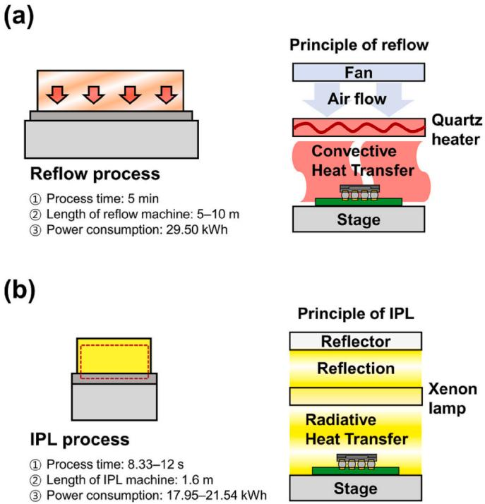  
Fig. 1. Schematic illustrations of the (a) reflow and (b) IPL soldering processes.

To solve these problems, herein, intense pulsed light (IPL) energy was used for soldering, as shown in Fig. 1(b). The principle of IPL soldering is to melt the solder by irradiating the specimen with multiwavelength light generated from a Xenon lamp. At this time, a reflector is installed to focus the upward light toward the stage, maximizing light utilization. Unlike reflow, the heat transfer method of IPL is radiation. When light is irradiated in the specimen, heat is generated directly from the specimen via a photothermal effect. Therefore, preheating is unnecessary, and rapid soldering is possible, resulting in high mass productivity. In addition, unlike reflow with convective heat transfer, less heat waste is generated, so the power efficiency of the IPL process is high. Therefore, reducing $\mathrm { C O } _ { 2 }$ emissions by saving power is possible compared to the reflow process. The length of the IPL equipment is 1.6 m, so the space efficiency is higher than that of reflow. In addition, unlike laser-assisted soldering with a small bonding area, the irradiation area of IPL soldering is wide at $2 0 \times 3 0 \mathrm { c m } ^ { 2 }$ , making it more suitable for mass production than laser-assisted bonding. Furthermore, because of the short soldering time, a thin IMC is formed at the solder joint, so the mechanical properties of the solder joint are high. Thus, IPL soldering can be an exceptional approach in terms of mass productivity, carbon neutrality, and high mechanical properties. The IPL process is the repeated irradiation of multiple wavelength lights in the form of pulses (Fig. 2). Single-pulse energy $( E _ { \mathrm { s i n g l e  p u l s e } } )$ can be controlled by charge voltage (V), peak current $\left( I _ { \mathrm { p e a k } } \right)$ , and pulse width (T) (Eq. (1)).

$$
E _ { s i n g l e p u l s e } = V I _ { p e a k } T\tag{1}
$$

where V shows the charge voltage, $I _ { p e a k }$ indicates the peak current, and T is a pulse width.

$$
E _ { t o t a l , p e r ~ u n i t ~ a r e a } = \frac { E _ { s i n g l e ~ p u l s e } } { I r r a d i a t i o n ~ a r e a } \times n\tag{2}
$$

n Total process time = f

(3)

$$
P _ { p e a k } = V I _ { p e a k }\tag{4}
$$

$$
P _ { a v g } = P _ { p e a k } T f\tag{5}
$$

The total IPL energy per unit area $( E _ { \mathrm { t o t a l , p e r ~ u n i t ~ a r e a } } )$ can be calculated using $E _ { \mathrm { s i n g l e \ p u l s e } ; }$ , number of IPL irradiations (n), and irradiation area $\left( \operatorname { E q . } \right.$ (2)). The total process time is calculated by dividing the number of IPL irradiations by the frequency (f). As shown in Eq. (4), the peak power $( P _ { p e a k } )$ can be controlled by charge voltage (V) and peak current $\begin{array} { r } { ( I _ { p e a k } ) . } \end{array}$ In addition, the average power $( P _ { a v g } )$ can be calculated using $P _ { p e a k } , T ,$ and f as indicated in Eq. (5).

Several studies have investigated the feasibility of photonic soldering on flexible substrates [11,12]. These studies focused on examining the feasibility of photonic soldering rather than the manufacturing processes. Additionally, the impact of frequency, pulse number, and pulse power on IPL soldering for Si die attachment with low-temperature solder has been investigated [9]. Another study formed solder balls for shear tests using an Sn–3.0Ag–0.5Cu (SAC305) solder with IPL energy. Through a comparison of the reflow and IPL soldering processes, the study observed that a thin IMC was formed when IPL soldering was employed [10]. Although several investigations have been reported, there has been no study on IPL soldering for real electronic packages, such as a ball grid array (BGA) package with the organic solderability preservative (OSP) surface finish. BGA package assembly has the benefits of low signal loss and high input/output counts compared with traditional wire bonding. Owing to miniaturization and the high integration of electronic products, the demand for BGA packages with high reliability has increased [13–15]. Here, using IPL energy, we focused on the BGA package assembly. When IPL was employed in the BGA soldering process, owing to the short process time, it was predicted that a thin IMC would be formed, leading to a highly reliable solder joint.

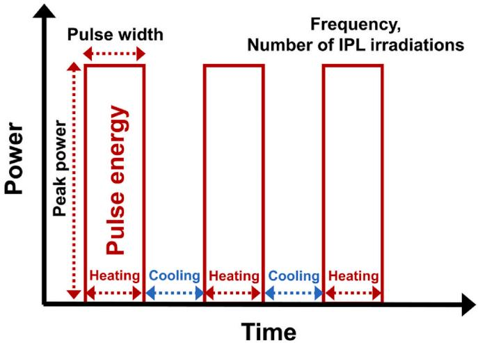  
Fig. 2. The IPL soldering process with various parameters.

## 2. Experimental procedure

We investigated the possibility of IPL soldering for the BGA package assembly under various IPL soldering conditions and compared the IPL process with the reflow process. An electroless nickel immersion gold surface finished BGA component (A-CABGA100–0.8 mm–10 mm-DC-LF-305, Practical Components, Inc., USA) and an OSP surface finished PCB were used. The body size and ball alignment of the BGA component were $1 0 \times 1 0 ~ \mathrm { m m } ^ { 2 } ~ \mathrm { a n d } ~ 1 0 \times 1 0 ,$ , respectively. The solder ball comprised a SAC305 alloy, and type-4 SAC305 solder paste (S3X58-KVH, Koki, Japan) (size = 25–38 μm) was used as a bonding material. The experimental soldering process is depicted as a flowchart in Fig. 3. The solder paste was printed through a metal mask (thickness = 0.1 mm) on the PCB, and the BGA component was placed on the printed pattern. During the IPL process, charge voltage and peak current were fixed at 1500 V and 1450.5 A, respectively. The IPL irradiation area was $2 0 \times 3 0 \mathrm { c m } ^ { 2 } . \mathrm { A }$ thermocouple system (GL220, Graphtec, Tokyo, Japan) was used to measure the temperatures of the BGA component under different IPL conditions. The minimum IPL solderable condition was 3 Hz, 2.75 ms, and n = 30. Under the minimum IPL solderable condition, the process time was 10 s, and the total energy per unit area was $2 9 9 . 2 J / { \mathrm { c m } } ^ { 2 } .$ . The IPL variables, including the pulse width, number of IPL irradiations, and frequency, were increased by 20 %, and the results were compared to observe the microstructure and shear force according to IPL variables. The conditions were as follows: minimum (3 Hz, 2.75 ms, and n = 30; $2 9 9 . 2 \ J / \mathrm { c m } _ { , } ^ { 2 }$ 17.95 kWh); 20 % increase in pulse width (3 Hz, 3.3 ms, and $\mathrm { n } = 3 0 ; 3 5 9 . 0 \mathrm { J } / \mathrm { c m } _ { , } ^ { 2 } 2 1 . 5 4 \mathrm { k W h } ) ;$ ; 20 % increase in the number of IPL irradiations (3 Hz, 2.75 ms, and $n = 3 6 ; 3 5 9 . 0 ~ \mathrm { J / c m } _ { , } ^ { 2 } 1 7 . 9 5 ~ \mathrm { k W h } ) ;$ and 20 % increase in frequency (3.6 Hz, 2.75 ms, and $\mathrm { n } = 3 0 ; 2 9 9 . 2 J / \mathrm { c m } _ { , } ^ { 2 }$ 21.54 kWh). They were labeled IPL1, IPL2, IPL3, and IPL4, respectively. A reflow-soldered joint was also formed using an IR 4 zone reflow machine (RF-430-N2, Japan Pulse Laboratory Co. Ltd., Japan). The reflow temperature condition was set to $1 5 0 ^ { \circ } \mathrm { C } / 1 7 0 ^ { \circ } \mathrm { C } / 2 3 0 ^ { \circ } \mathrm { C } / 2 5 0 ^ { \circ } \mathrm { C } .$ . The soldering conditions are summarized in Table 1(a). The microstructures and elemental mappings of the solder joints were investigated by fieldemission scanning electron microscopy (FE-SEM) and field-emission electron probe microanalyzer (FE-EPMA), respectively. The die shear test and nanoindentation were performed to analyze the mechanical properties of each solder joint.

Soldering conditions and their sample identification: (a) shear force and (b) the board-level drop impact test.
<table><tr><td colspan="6">(a)</td></tr><tr><td>Sample identification</td><td>Frequency (Hz)</td><td>Pulse width (ms)</td><td>Number of IPL irradiations (n)</td><td>Total energy (J/cm2)</td><td>Time (s)</td></tr><tr><td>IPL1</td><td>3</td><td>2.75</td><td>30</td><td>299.2</td><td>10</td></tr><tr><td>IPL2</td><td>3</td><td>3.3 (+20</td><td>30</td><td>359.0</td><td>10</td></tr><tr><td>IPL3</td><td>3</td><td>%) 2.75</td><td>36 (+20 %)</td><td>359.0</td><td>12</td></tr><tr><td>IPL4</td><td>3.6 (+20 %)</td><td>2.75</td><td>30</td><td>299.2</td><td>8.33</td></tr><tr><td>Reflow</td><td colspan="3">Peak temperature: 250 °C</td><td></td><td>300</td></tr><tr><td>(b)</td><td colspan="4"></td><td></td></tr><tr><td>Sample identification</td><td>Frequency (Hz)</td><td>Pulse width (ms)</td><td>Number of IPL irradiations (n)</td><td>Total energy (J/cm2)</td><td>Time (s)</td></tr><tr><td>IPL (n = 30)</td><td>3</td><td>2.75</td><td>30</td><td>299.2</td><td>10</td></tr><tr><td>IPL (n = 36)</td><td>3</td><td>2.75</td><td>36 (+20 %)</td><td>359.0</td><td>12</td></tr><tr><td>IPL (n = 42)</td><td>3</td><td>2.75</td><td>42 (+40 %)</td><td>418.8</td><td>14</td></tr><tr><td>IPL (n = 48)</td><td>3</td><td>2.75</td><td>48 (+60 %)</td><td>478.7</td><td>16</td></tr><tr><td>Reflow</td><td colspan="3">Peak temperature: 250 °C</td><td></td><td>300</td></tr></table>

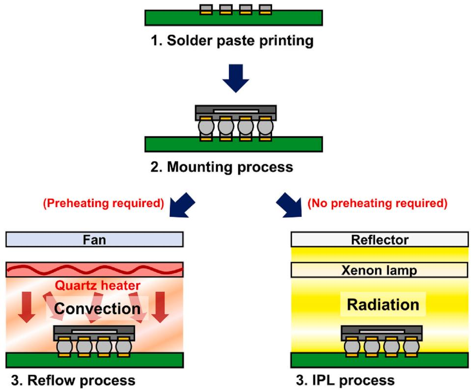  
Fig. 3. Flow chart of reflow and IPL soldering processes.

The IPL-soldered joints were fabricated by increasing the number of IPL irradiations by 20 % (3 Hz, 2.75 ms, and $n = 3 6 ; 3 5 9 . 0 \mathrm { J / c m } _ { , } ^ { 2 }$ 17.95 kWh); 40 % (3 Hz, 2.75 ms, and $n = 4 2 ; 4 1 8 . 8 \mathrm { ~ J } / \mathrm { c m } _ { , } ^ { 2 } 1 7 . 9 5 \mathrm { ~ k W h } ) ;$ ; and 60 % (3 Hz, 2.75 ms, and n = 48; 478.7 J/cm2, 17.95 kWh) from the minimum condition (3 Hz, 2.75 ms, and $n = 3 0 ;$ 299.2 J/cm2 17.95 kWh) to investigate the drop impact reliability with an increase in the IMC thickness. A reflow-soldered joint (peak temperature o $: 2 5 0 ^ { \circ } \mathrm { C } )$ was fabricated for comparison. The experimental conditions are summarized in Table 1(b). FE-SEM was employed to observe the top of the IMC after etching the solder matrix. The drop impact reliability of the BGA package was analyzed using the board-level drop impact test (peak acceleration: 1500 G, pulse duration: 0.5 ms). After the failure by drop impact, the crack at the interface between the BGA solder joint and PCB was analyzed by FE-SEM and EPMA to verify the crack mode.

## 3. Results and discussion

Fig. 2 shows the IPL irradiation in a power–time graph. When a pulse is irradiated, the BGA component is heated by pulse energy and cooled until the next pulse is irradiated. To increase the pulse energy, the pulse width or peak power can be increased, or the total pulse energy can be increased by increasing the number of IPL irradiations. To increase the temperature, it is also possible to reduce the cooling period between pulse irradiations by increasing the frequency.

Fig. 4 shows the temperature-rise graphs and the peak temperature of the BGA components under various IPL conditions. It is important to examine the temperature changes under each IPL condition since soldering requires a higher temperature than the melting point of the solder. As shown in Fig. 4(a), a comparative analysis was conducted with a 20 % increase in the pulse width, number of IPL irradiations, and frequency from the minimum IPL solderable condition (IPL1), respectively. The temperature gradually increased according to the pulse irradiation in IPL1 $( { 2 9 9 . 2 ~ \mathrm { J / c m } ^ { 2 } } ,$ , 10 s). Under IPL3 $( 3 5 9 . 0 J / \mathrm { c m } ^ { 2 } , 1 2 s )$ , where the number of IPL irradiations was increased to 36, the temperature increased. Under IPL2 $( 3 5 9 . 0 \ \mathrm { J / c m } ^ { 2 } ,$ , 10 s), since the pulse width was increased to 3.3 ms, the pulse energy increased by 20 $^ { \% , }$ and the temperature sharply rose. Moreover, under IPL4 (299.2 $\scriptstyle { { \mathrm { J / c m } } ^ { 2 } } ,$ 8.33 s), where the frequency was increased to 3.6 Hz, the temperature-rise pattern was similar to that of IPL2. Fig. 4(b) shows the temperaturerise patterns for conditions where the number of IPL irradiations was increased by 20 %, 40 %, and 60 % from the minimum solderable condition. Considering that all the IPL conditions of the four graphs had the same pulse width and frequency, the temperature-rise patterns were practically similar. As the number of IPL irradiations increased, the total pulse energy and temperature increased. Fig. 4(c) shows the peak temperatures of the BGA components under various IPL conditions. The peak temperature of IPL1 was $2 3 7 . 5 \ ^ { \circ } \mathrm { C } ,$ and the peak temperature of IPL3 was $2 5 5 . 5 \ ^ { \circ } \mathrm { C }$ as the number of IPL irradiations increased to 36. Under IPL2, the pulse width was increased to 3.3 ms, and the peak temperature was $2 6 7 . 9 ^ { \circ } \mathrm { C } .$ When the frequency was increased to 3.6 Hz (IPL4), the cooling time between the pulse irradiations decreased, and the peak temperature was $2 4 4 ^ { \circ } \mathrm { C } , 6 . 5 ^ { \circ } \mathrm { C }$ higher than that of IPL1. The total energy of IPL2 and IPL3 was the same, but the peak temperature of IPL2 was higher because the total cooling time of IPL2 was shorter than that of IPL3. Fig. 4(d) shows the peak temperature with an increase in the number of IPL irradiations. As the number of IPL irradiations increased, the peak temperature also increased. The temperature and time act as critical variables in IMC growth; therefore, it is necessary to simultaneously consider the peak temperature and time to control the IMC growth [16,17].

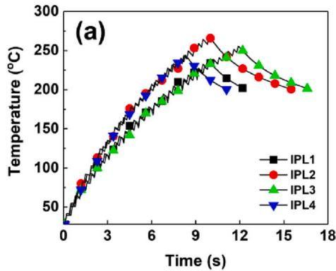

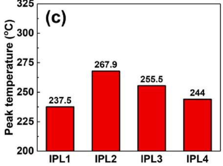

Fig. 5 shows the schematic diagram of the precipitation reaction (SAC305 solder) and the EPMA mapping of the SAC305 solder powder. The particles of the SAC305 solder paste had a composition of 96.5Sn–3.0Ag–0.5Cu. Sn generally reacts with Ag to form a fine Ag3Sn precipitate within the solder matrix, leading to precipitation strengthening during the reflow process. Thus, Ag3Sn precipitates significantly influence the mechanical properties of solder joints, such as shear strength or creep resistance. Several studies have been reported on the enhancement of the mechanical properties of solder joints based on the Ag3Sn precipitation. Studies have been conducted to disperse Ag3Sn by adding particles to the solder to form nucleation sites and control the Ag3Sn precipitation according to the cooling rate control [18–22]. Therefore, it is important to properly precipitate Ag3Sn to enhance the shear strength of the solder joint. The aforementioned phenomenon applies to a typical SAC305 solder joint formed using the reflow process. However, a distinct Ag distribution pattern was observed in the IPLsoldered joint (Fig. 6).

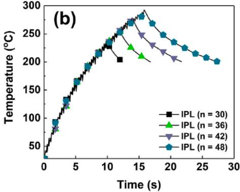

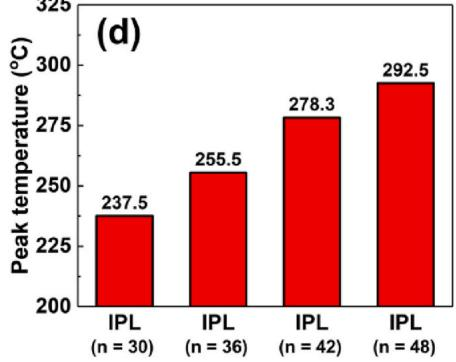  
Fig. 4. (a) Temperature-rise patterns under various IPL conditions, (b) temperature-rise patterns according to the increase in the number of IPL irradiations, (c) peak temperature under various IPL conditions, and (d) peak temperature with an increase in the number of IPL irradiations.

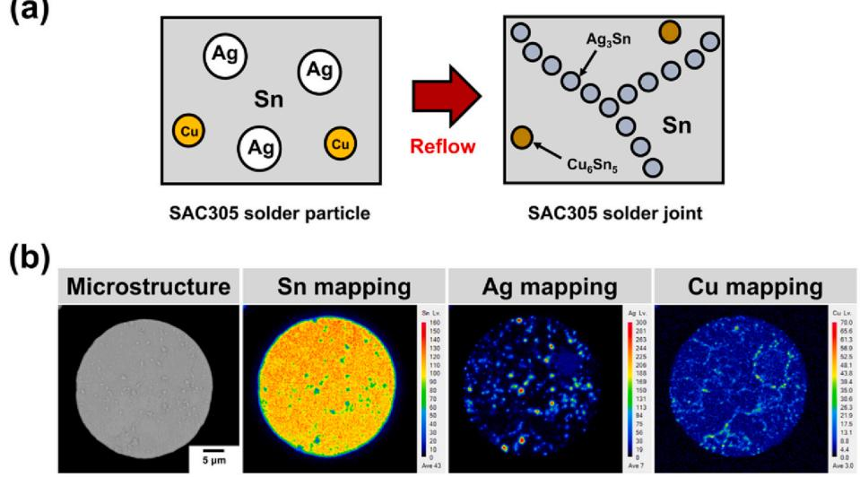  
Fig. 5. (a) Schematic diagram of the precipitation reaction (SAC305 solder) and (b) the EPMA mapping of SAC305 solder powder.

Fig. 6 shows the cross-sectional micrographs and Ag mappings of the BGA solder joints. Owing to the short process times (IPL1: 10 s, IPL4: 8.33 s) and insufficient energy (299.2 J/cm2), some Ag and Sn did not react under IPL1 and IPL4. Therefore, some unreacted Ag phases remained in the solder joints, leading to a low Ag3Sn precipitation degree. It was possible to melt and solidify the SAC305 solder under minimum IPL conditions, but the time and energy were insufficient to fully precipitate Ag3Sn. However, the energy was increased by 20 % (359.0 J/cm2) under IPL2 and IPL3, and Ag3Sn was precipitated without remaining Ag. Similarly, in the reflow-soldered joint, all the Ag precipitated as Ag3Sn [19,22].

Fig. 7 shows the cross-sectional micrographs and EPMA mappings (Cu and Sn) of the interface between the BGA solder joint and PCB. The IMC was formed by interdiffusion between the Cu electrode and SAC305 [23]. The IMC is a crucial element in soldering, but if it grows excessively, it becomes the primary factor in the deterioration of the mechanical properties, such as the drop impact reliability or the toughness of the solder joint [24–26]. During the reflow process, heat is transferred to the solder through a medium (nitrogen or air), and the process time is long. Thus, the interdiffusion between Cu and SAC305 occurs for a long time, forming a thick IMC (6.1 μm). However, the IPL radiation directly generated heat in the specimen, allowing rapid soldering. Thus, owing to the short IPL process time, the IMC of the IPLsoldered joint was thinner than that of the reflow-soldered joint. The

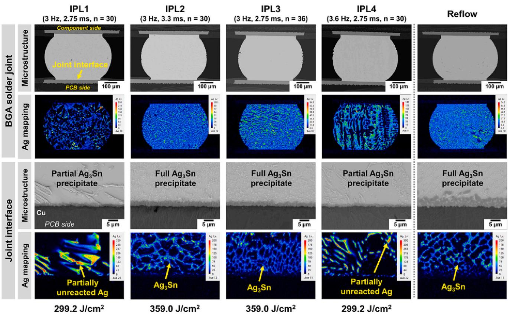  
Fig. 6. Cross-sectional micrographs and EPMA mappings (Ag) of BGA solder joints.

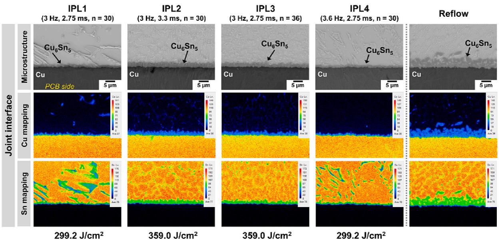  
Fig. 7. Highly magnified cross-sectional micrographs and EPMA mappings (Cu and Sn) of the interface between the BGA solder joint and the OSP surface finished PCB.

IMC thicknesses of IPL1 and IPL4, which had the minimum energy condition $( { 2 9 9 . 2 \ J / { \mathrm { c m } } ^ { 2 } } ) _ { \cdot }$ , were 1.2 and 1.5 μm, respectively. At an energy of 359.0 J/cm2, the IMC thicknesses of IPL2 and IPL3 were 2.5 and 2.1 μm, respectively.

Fig. 8 shows the schematic illustrations of the evaluation methods, mechanical properties (shear force, hardness), and IMC thickness of the solder joints. As shown in Fig. 6, the Ag3Sn precipitate did not fully form under IPL1 and IPL4 because of their short process times (10 and 8.33 s, respectively) and insufficient energy (299.2 J/cm2). Thus, the shear forces of IPL1 and IPL4 were low because of the low Ag3Sn precipitation strengthening effect. However, high shear forces were derived through the $\mathsf { A g } _ { 3 } \mathsf { S } \boldsymbol { \Pi }$ precipitation strengthening effect under IPL2, IPL3, and the reflow conditions, in which Ag Sn was fully precipitated [27,28]. In addition, when $\mathtt { A g 3 S n }$ was fully precipitated, a high hardness value was achieved, similar to the trend observed for the shear force. The nanoindentation results are shown in Fig. S1. The IMC thickness also exhibited a tendency similar to that of the Ag3Sn precipitation, and very thin IMCs (IPL1: 1.2 μm, IPL4: 1.5 μm) and slightly thick IMCs (IPL2: 2.5 μm, IPL3: 2.1 μm) were formed under low-energy (IPL1 and IPL4 = $\dot { 2 } 9 9 . 2 \ \mathrm { J / c m ^ { 2 } } )$ and high-energy conditions (IPL2 and IPL3 = 359.0 J/ cm2). Interestingly, the peak temperature shown in Fig. 4(c) and the IMC thickness shown in Fig. 8(c) were practically proportional. Thus, it was confirmed that the IMC thickness was controlled by the peak temperature of the IPL process. However, the IMC of the reflow-soldered joint was 6.1 μm-thick, which was considerably thicker than the IMCs of all the IPL-soldered joints. The aforementioned findings showed that a thin IMC would be formed if IPL soldering was employed.

(a)  
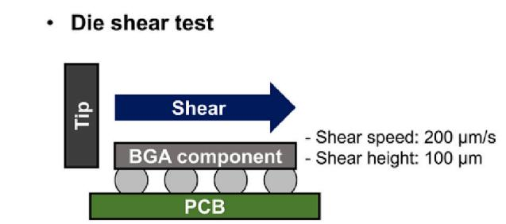

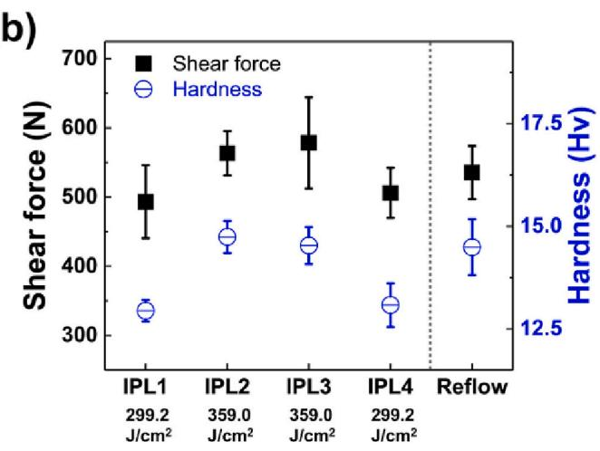

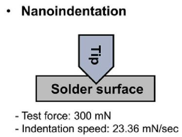

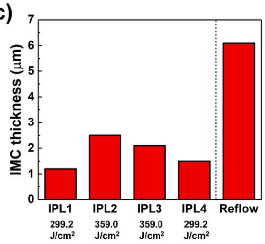  
Fig. 8. (a) Schematic illustrations of the die shear test and nanoindentation, (b) shear force and hardness of BGA solder joints, and (c) the IMC thickness of BGA solder joints.

The above experiment confirmed that the IMC thickness increased as the IPL energy increased. The IMC thickness had a large effect on the drop impact; therefore, the board-level drop impact test was conducted by increasing the IPL energy (number of IPL irradiations) by 20 %, 40 %, and 60 % from the minimum IPL condition. Prior to the board-level drop impact test, the top view of the IMC after etching out the solder matrix under various soldering conditions was observed by FE-SEM as shown in Fig. 9. The diameter of the IMC formed between the BGA solder joint and PCB coarsened as the number of IPL irradiations increased. In particular, the diameter of the IMC formed during the reflow process was significantly wider than that of the IMC formed during the IPL process [29,30].

Fig. 10(a) shows the relationship between the number of drops to failure and the IMC thickness. The IMC thickened from 1.2 to 4.7 μm with an increase in the number of IPL irradiations. The thickest IMC (6.1 μm) was observed at the reflow-soldered joint. The number of drops to failure and the IMC thickness were found to be inversely proportional because the thicker the IMC, the higher the brittleness [5,6,31]. Therefore, the number of drops to failure in the reflow-soldered joint was 103, but under the minimum IPL conditions, it increased to 277. Consequently, when IPL soldering was applied, the drop impact reliability of the BGA solder joint was up to 2.68 times that of the conventional reflow. In addition, the Weibull distribution, according to the board-level drop impact test, is shown. For each variable, the $\mathrm { R } ^ { \hat { 2 } }$ values exceeded 0.9, confirming high correlations. Fig. 10(b) shows the trend line between the number of drops to failure and the IMC thickness. The empirical equation between the number of drops to failure and the IMC thickness can be expressed as Eq. (6).

$$
y = - 3 6 . 1 7 3 x + 3 2 1 . 5 0 0\tag{6}
$$

where $y$ indicates the number of drops to failure, and x is the IMC

IPL (n = 30)  
IPL (n = 36)  
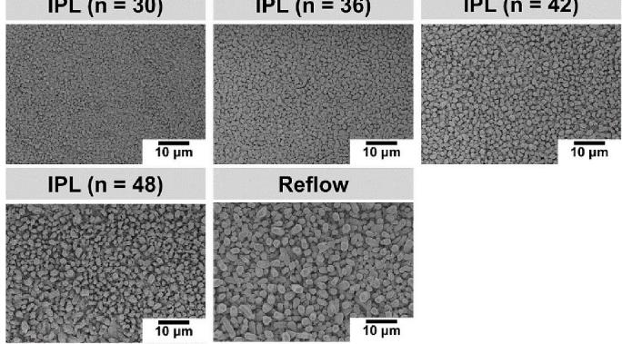  
Fig. 9. Top view of the IMC after etching out the solder matrix under various soldering conditions.

(a)  
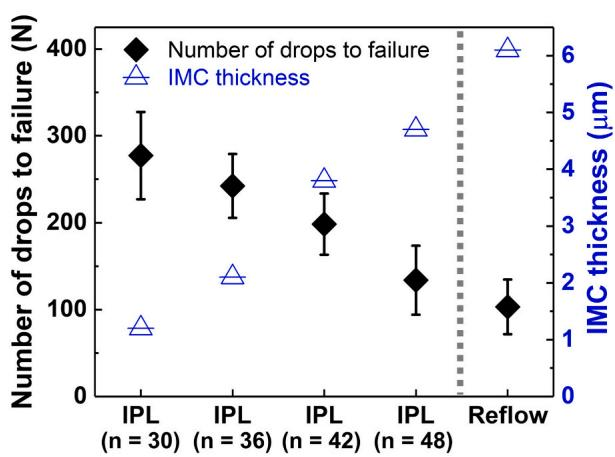

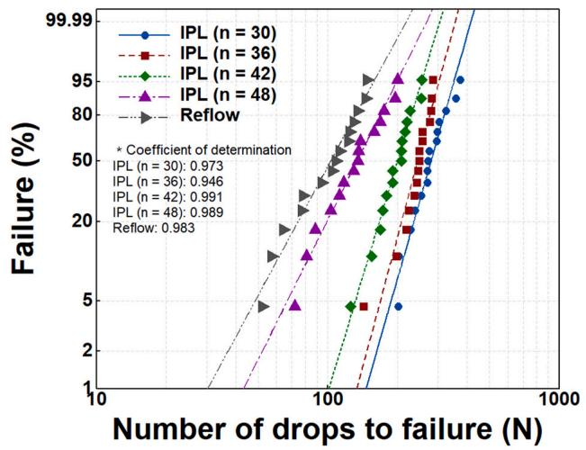

(b)  
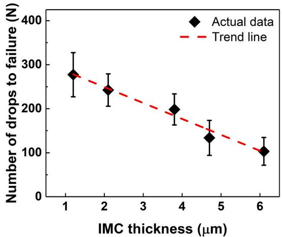  
Fig. 10. (a) Drop impact reliability with the IMC thickness of BGA solder joints and (b) the trend line between the number of drops to failure and the IMC thickness of BGA solder joints.

thickness. Using Eq. (6), the $\mathrm { R } ^ { 2 }$ value was calculated to be 0.973, showing a highly inverse proportional relationship between the number of drops to failure and the IMC thickness.

The crack morphologies were investigated after the board-level drop impact test as shown in Fig. 11. The crack occurred on the brittle IMC between the BGA solder joint and PCB. However, under the minimum condition $( n = 3 0 )$ , a thin IMC was formed (approximately 1.2 μm). Therefore, crack propagation mainly occurred in the IMC and was also partially propagated in the solder matrix. The cracks were propagated through the IMC under IPL (n = 36, 42, and 48) and reflow conditions. Figs. 10 and 11 confirm that the IMC thickness considerably affected the drop impact reliability. Therefore, the findings of this study conclusively revealed that the IPL soldering method (short process time, thin IMC) could enhance the drop impact reliability of the BGA package.

(a)  
(b)  
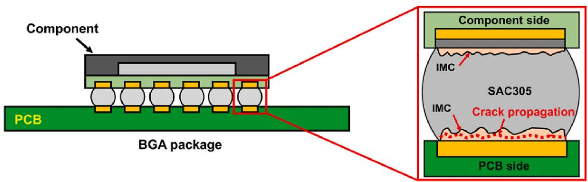

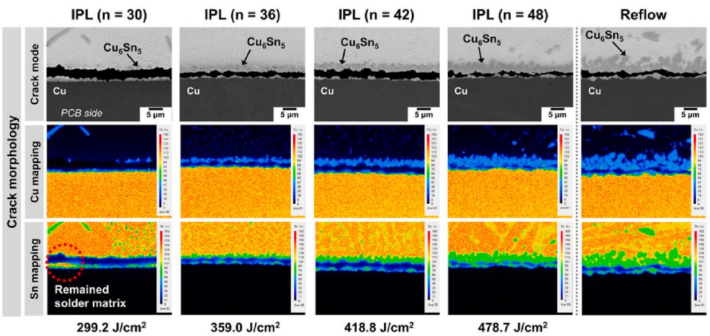  
Fig. 11. (a) Schematic diagram of crack propagation and (b) crack morphologies and EPMA mappings (Cu and Sn) of the interface between the BGA solder joint and the OSP surface finished PCB after the drops to failure.

The mechanical properties were greatly influenced by the IPL conditions, as confirmed by the experimental results. Thus, it is crucial to regulate the IPL conditions according to the environment in which the electronic product would be employed. For instance, for an electronic package that receives a lot of shear stress (e.g., a bendable package), it is vital to irradiate an IPL energy higher than the minimum IPL condition to increase the shear strength. Thereafter, the IMC is slightly thickened, but Ag3Sn is fully precipitated, and high shear strength is achieved through Ag3Sn precipitation strengthening [18–22]. However, there are cases where the drop impact reliability is more significant than the shear strength of products requiring extremely high drop impact resistance, for example, portable devices and automotive applications. In these cases, the IMC thickness of the solder joint can be controlled to be very thin by irradiating the IPL condition to a minimum. The drop impact reliability is very high because the IMC is very thin [5,6,31]. However, the shear strength is somewhat lowered because not all the Ag3Sn is precipitated. In conclusion, it is essential to control the IPL conditions considering the environment to which each electronic product would be exposed. In addition, by applying IPL radiation energy to the soldering process, less power is consumed, compared with the reflow process. This is because no preheating process is required for IPL soldering, and less waste heat is generated. Therefore, IPL soldering can contribute to the establishment of a carbon-neutral society. From a manufacturing point of view, IPL soldering (e.g., IPL4: 8.33 s) can provide many advantages, such as improved processing speed up to 36 times compared to reflow (300 s). In addition, since soldering was possible immediately without preheating, the process efficiency was high. Through these advantages, it was possible to increase mass productivity, and it was also confirmed that the space efficiency was high because the IPL equipment (1.6 m) was shorter than the reflow machine (5–10 m).

## 4. Conclusion

The feasibility of low power IPL soldering for BGA packages was investigated, and the microstructures and mechanical properties were compared with those of the conventional reflow process. A comparison between reflow and IPL soldering is summarized in Table 2. The peak temperature, precipitation degree of Ag3Sn, and shear force could be controlled by the IPL conditions. The IPL soldering process transferred heat by radiation; thus, soldering was possible in a considerably shorter time than that of the reflow process. Thus, a very thin IMC was formed at the IPL-soldered joint interface, and the drop impact reliability of the IPL-soldered joint was up to 2.68 times that of the reflow-soldered joint. Additionally, as the IPL soldering time is significantly shorter than the reflow time and IPL soldering does not require preheating, allowing high mass productivity. IPL soldering also offers environmental benefits, as it can reduce power consumption by up to 40 %, compared with the conventional reflow process, thereby reducing carbon emissions from the manufacturing process.

In conclusion, IPL soldering has the advantages of low power consumption, short process time (mass productivity), and high drop impact reliability. Therefore, we expect it to be widely used in carbonneutral soldering processes for electronic packages.

Table 2  
Comparison between reflow and IPL soldering.
<table><tr><td>Contents</td><td>Reflow</td><td>IPL soldering</td></tr><tr><td>Energy source</td><td>Quartz heater</td><td>Xenon lamp</td></tr><tr><td>Heat transfer type</td><td>Convection</td><td>Radiation</td></tr><tr><td>Time</td><td>300 s</td><td>8.33–16 s</td></tr><tr><td>Solder matrix</td><td>Sn, Ag3Sn</td><td>Sn, Ag3Sn, (Ag)</td></tr><tr><td>Shear force</td><td>535.57 N</td><td>493.23–578.30 N</td></tr><tr><td>IMC thickness</td><td>6.1 μm</td><td>1.2–4.7 μm</td></tr><tr><td>Drop impact reliability (Number of drops to failure)</td><td>103</td><td>133-277</td></tr></table>

## CRediT authorship contribution statement

Kyung Deuk Min: Conceptualization, Investigation, Writing original draft. Eun Ha: Resources, Data curation. Sinyeob Lee: Formal analysis. Jae-Seon Hwang: Validation. Taegyu Kang: Methodology. Jinho Joo: Supervision. Seung-Boo Jung: Supervision, Project administration.

## Declaration of competing interest

The authors declare that they have no known competing financial interests or personal relationships that could have appeared to influence the work reported in this paper.

## Acknowledgements

This work was conducted with the support of Samsung Electronics. This research was supported by the Basic Science Research Program through the National Research Foundation of Korea (NRF) funded by the Ministry of Education (No. 2019R1A6A1A03033215).

## Appendix A. Supplementary data

Supplementary data to this article can be found online at https://doi. org/10.1016/j.jmapro.2023.05.007.

## References

[1] Pu L, He Q, Yang Y, Zhao X, Hou Z, Tu KN, Liu Y. The microstructure and mechanical property of the high entropy alloy as a low temperature solder. In: 2019 IEEE 69th electronic components and technology conference (ECTC); 2019. p. 1716–21. https://doi.org/10.1109/ECTC.2019.00263.

[2] Zhang P, Xue S, Liu L, Wu J, Luo Q, Wang J. Microstructure and shear behaviour of sn-3.0Ag-0.5Cu composite solder pastes enhanced by epoxy resin. Polymers 2022; 14:5303. https://doi.org/10.3390/polym14235303.

[3] Sahasrabudhe S, Mokler S, Renavikar M, Sane S, Byrd K, Brigham E, Jin O, Goonetilleke P, Badwe N, Parupalli S. Low temperature solder - a breakthrough technology for surface mounted devices. In: 2018 IEEE 68th electronic components and technology conference (ECTC); 2018. p. 1455–64. https://doi.org/10.1109/ ECTC.2018.00222.

[4] Yi Y, Li J. The effect of governmental policies of carbon taxes and energy-saving subsidies on enterprise decisions in a two-echelon supply chain. J Clean Prod 2018; 181:675–91. https://doi.org/10.1016/j.jclepro.2018.01.188.

[5] Tatsumi H, Kaneshita S, Kida Y, Sato Y, Tsukamoto M, Nishikawa H. Highly efficient soldering of sn-ag-cu solder joints using blue laser. J Manuf Process 2022; 82:700–7. https://doi.org/10.1016/j.jmapro.2022.08.025.

[6] Lee DH, Jeong MS, Yoon JW. Comparative study of interfacial reaction and bonding property of laser- and reflow-soldered Sn–Ag–Cu/Cu joints. J Mater Sci Mater Electron 2022;33:7983–94. https://doi.org/10.1007/s10854-022-07948-w.

[7] Hu X, Xu H, Chen W, Jiang X. Effects of ultrasonic treatment on mechanical properties and microstructure evolution of the Cu/SAC305 solder joints. J Manuf Process 2021;64:648–54. https://doi.org/10.1016/j.jmapro.2021.01.045.

[8] Wang H, Hu X, Jiang X, Li Y. Interfacial reaction and shear strength of ultrasonically-assisted sn-ag-cu solder joint using composite flux. J Manuf Process 2021;62:291–301. https://doi.org/10.1016/j.jmapro.2020.12.020.

[9] Jung KH, Min KD, Lee CJ, Jeong H, Kim JH, Jung SB. Ultrafast photonic soldering with Sn–58Bi using intense pulsed light energy. Adv Eng Mater 2020;22:2000179. https://doi.org/10.1002/adem.20200017.

[10] Jang JH, Lee CJ, Hwang BU, Min KD, Kim JH, Jung SB. Microstructural evolution and mechanical properties of SAC305 with the intense pulsed light soldering process under high-temperature storage test. In: 2021 IEEE 71st electronic components and technology conference (ECTC); 2021. p. 2314–9. https://doi.org 10.1109/ECTC32696.2021.00362.

[11] Arutinov G, Hendriks R, Brand JVB. Photonic flash soldering on flex foils for flexible electronic systems. In: 2016 IEEE 66th electronic components and technology conference (ECTC); 2016. p. 95–100. https://doi.org/10.1109/ ECTC.2016.179.

[12] van den Ende DA, Hendriks R, Cauchois R, Groen WA. Large area photonic flash soldering of thin chips on flex foils for flexible electronic systems: in situ temperature measurements and thermal modelling. Electron Mater Lett 2014;10: 1175–83. https://doi.org/10.1007/s13391-014-4222-3.

[13] Depiver JA, Mallik S, Amalu EH. Effective solder for improved thermo-mechanical reliability of solder joints in a ball grid Array (BGA) soldered on printed circuit board (PCB). J Electron Mater 2021;50:263–82. https://doi.org/10.1007/s11664- 020-08525-9.

[14] Yang L, Zhang Q, Zhang Z. Effects of solder dimension on the interfacial shear strength and fracture behaviors of Cu/Sn–3Cu/Cu joints. Scr Mater 2012;67: 637–40. https://doi.org/10.1016/j.scriptamat.2012.07.024.

[15] Gu J, Lin J, Lei Y, Fu H. Experimental analysis of sn-3.0Ag-0.5Cu solder joint board-level drop/vibration impact failure models after thermal/isothermal cycling. Microelectron Reliab 2018;80:29–36. https://doi.org/10.1016/j. microrel.2017.10.014.

[16] Abdelhadi OM, Ladani L. IMC growth of sn-3.5Ag/Cu system: combined chemical reaction and diffusion mechanisms. J Alloys Compd 2012;537:87–99. https://doi. org/10.1016/j.jallcom.2012.04.068.

[17] Li X, Li F, Guo F, Shi Y. Effect of isothermal aging and thermal cycling on interfacial IMC growth and fracture behavior of SnAgCu/Cu joints. J Electron Mater 2011;40: 51–61. https://doi.org/10.1007/s11664-010-1401-3.

[18] Ma H, Qu L, Huang M, Gu L, Zhao N, Wang L. In-situ study on growth behavior of Ag3Sn in Sn–3.5Ag/Cu soldering reaction by synchrotron radiation real-time imaging technology. J Alloys Compd 2012;537:286–90. https://doi.org/10.1016/j. jallcom.2012.05.055.

[19] El-Daly A, Fawzy A, Mansour S, Younis M. Thermal analysis and mechanical properties of Sn–1.0Ag–0.5Cu solder alloy after modification with SiC nano-sized particles. J Mater Sci Mater Electron 2013;24:2976–88. https://doi.org/10.1007/ s10854-013-1200-8.

[20] Feng J, Xu DE, Tian Y, Mayer M. SAC305 solder reflow: identification of melting and solidification using in-process resistance monitoring. IEEE Trans Compon Packag Manuf Technol 2019;9:1623–31. https://doi.org/10.1109/ TCPMT.2019.2901651.

[21] Pietrikov´a A, Bednarˇcík J, Duriˇ ˇsin J. In situ investigation of SnAgCu solder alloy microstructure. J Alloys Compd 2011;509:1550–3. https://doi.org/10.1016/j. jallcom.2010.09.153.

[22] Shen J, Chan YC, Liu S. Growth mechanism of bulk Ag3Sn intermetallic compounds in Sn–Ag solder during solidification. Intermetallics 2008;16:1142–8. https://doi. org/10.1016/j.intermet.2008.06.016.

[23] Wang B, Li J, Gallagher A, Wrezel J, Towashirporn P, Zhao N. Drop impact reliability of Sn–1.0Ag–0.5Cu BGA interconnects with different mounting methods. Microelectron Reliab 2012;52:1475–82. https://doi.org/10.1016/j. microrel.2012.02.001.

[24] Jeong SW, Kim JH, Lee HM. Effect of cooling rate on growth of the intermetallic compound and fracture mode of near-eutectic sn-ag-Cu/Cu pad: before and after aging. J Electron Mater 2004;33:1530–44. https://doi.org/10.1007/s11664-004- 0095-9.

[25] Yang C, Song F, Lee SR. Impact of ni concentration on the intermetallic compound formation and brittle fracture strength of Sn–Cu–Ni (SCN) lead-free solder joints. Microelectron Reliab 2014;54:435–46. https://doi.org/10.1016/j. microrel.2013.10.005.

[26] Honarvar S, Nourani A, Karimi M. Effect of thermal treatment on fracture behavior of solder joints at various strain rates: comparison of cyclic and constant temperature. Eng Fail Anal 2021;128:105636. https://doi.org/10.1016/j. engfailanal.2021.105636.

[27] Chang SY, Jain CC, Chuang TH, Feng LP, Tsao LC. Effect of addition of TiO2 nanoparticles on the microstructure, microhardness and interfacial reactions of Sn3.5AgXCu solder. Mater Des 2011;32:4720–7. https://doi.org/10.1016/j. matdes.2011.06.044.

[28] Mukherjee S, Chauhan P, Osterman M, Dasgupta A, Pecht M. Mechanistic prediction of the effect of microstructural coarsening on creep response of SnAgCu solder joints. J Electron Mater 2016;45:3712–25. https://doi.org/10.1007/s11664- 016-4471-z.

[29] Ko YH, Lee JD, Yoon T, Lee CW, Kim TS. Controlling interfacial reactions and intermetallic compound growth at the Interface of a Lead-free solder joint with layer-by-layer transferred graphene. ACS Appl Mater Interfaces 2016;8:5679–86. https://doi.org/10.1021/acsami.5b11903.

[30] Kunwar A, An L, Liu J, Shang S, Råback P, Ma H, Song X. A data-driven framework to predict the morphology of interfacial Cu6Sn5 IMC in SAC/Cu system during laser soldering. J Mater Sci Technol 2020;50:115–27. https://doi.org/10.1016/j. jmst.2019.12.036.

[31] Xu L, Pang JHL. Effect of intermetallic and Kirkendall voids growth on board level drop reliability for SnAgCu lead-free BGA solder joint. In: 2006 IEEE 56th

electronic components and technology conference (ECTC); 2006. p. 275–82.   
https://doi.org/10.1109/ECTC.2006.1645659.