PAPER • OPEN ACCESS

# Reflow soldering for low-cost electronics using near-infrared LEDs

To cite this article: Thomas Wenger et al 2025 Flex. Print. Electron. 10 015006

View the article online for updates and enhancements.

## You may also like

Improvement in the heat dissipation ofmatrix LED headlamps for vehicles according to the thickness and thermal conductivity of thermal interface materials Dong Kyu Lee, Tae Kyoung Kim, Jae Min Lee et al.

Thermal property measurement of solderjoints fabricated by self-propagating exothermic reaction in Al/Ni multilayer film Shugo Miyake, Shunsuke Kanetsuki, Katsuya Morino et al.

Challenges in packaging of IR detectors -- technology of elastic electrical connections Marcin Myliwiec, Arkadiusz Lewandowski, Wojciech Wiatr et al.

# Flexible and Printed Electronics

PAPER

OPEN ACCESS

Thomas Wenger\* , Philipp Schletterer and Marcus Reichenberger

# Reflow soldering for low-cost electronics using near-infrared LEDs

RECEIVED 5 August 2024

Institute for Chemistry, Materials- and Product Development, Technische Hochschule Nürnberg Georg Simon Ohm, Nuremberg, Germany

REVISED 29 October 2024

ACCEPTED FOR PUBLICATION 31 January 2025

Original content from this work may be used under the terms of the Creative Commons Attribution 4.0 licence.

Any further distribution of this work must maintain attribution to the author(s) and the title of the work, journal citation and DOI.

PUBLISHED 11 February 2025

\* Author to whom any correspondence should be addressed.

E-mail: thomas.wenger@th-nuernberg.de, philipp.schletterer@th-nuernberg.de and marcus.reichenberger@th-nuernberg.de

Keywords: interconnection technology, soldering, flexible electronics, printed electronics, hybrid electronics

Supplementary material for this article is available online

## Abstract

Despite advances in soldering technology, the soldering of flexible, low-cost substrates such as polyethylene terephthalate (PET) remains a significant challenge, even when using low-temperature solders. This paper presents a novel approach to energy transfer that takes advantage of the varying absorption levels of materials in the near-infrared (NIR) spectrum to achieve selective heating of electronic assemblies. By combining the different absorption behaviours of bare PET and copper-clad PET with an irradiation concept that includes the use of NIR LEDs, it is possible to achieve a highly controlled and locally limited heating of the assemblies. An experimental soldering setup was utilised to identify the parameters that influence the process. The solder joints of the chip resistor components exhibited comparable microstructure and mechanical strength to those soldered by a convective method. The preliminary reliability tests demonstrated that the NIR soldering process produces high-quality solder joints. Further studies will address the remaining issues, such as solder beading and the soldering of more complex components and assemblies.

## 1. Introduction

The identification of a suitable interconnection technology for electronic components in surface mount technology (SMT) on flexible polymer substrates is becoming an increasingly prominent area of applied research and development, particularly considering the growing use of low-cost substrates as circuit carriers for flexible and printed hybrid electronics. An evaluation of current trends at IDTechEx indicates that inexpensive substrate materials will be found in an increasing number of applications over the coming years [1]. While high-temperature stable polyimide (PI) remains the predominant material in many fields of application, alternative substrate materials based on thermoplastic polyurethane, polyethylene terephthalate (PET) and paper will gain increasing usage in the future. In applications with the highest thermal loads and the longest service life requirements, such as those in the automotive and aerospace industries, PI will continue to be a widely used material in the coming years. Nevertheless, a common characteristic of inexpensive flexible circuit carriers is that they exhibit significantly reduced thermal stability in comparison to PI, among other factors. The use of corresponding substrates, such as copper-clad PET, as circuit carriers for SMT assemblies or printed electronics gives rise to the challenge of establishing contact with the electronic components. In this context, the development of innovative, material-friendly joining technologies with reduced thermal impact on low-cost substrates is of critical importance.

## 2. Background and motivation

In the field of electronics production, the most prevalent material bonding technologies rely on the simultaneous utilisation of atomic and molecular forces (adhesion and cohesion forces) to establish electrical, thermal and mechanical connections between the components. The most significant material bonding process in SMT remains soft soldering utilising Pbfree tin-based alloys. In recent years, the Sn96Ag4Cu solder (SAC alloy) family, which has a melting point of approximately $2 1 8 \ ^ { \circ } \mathrm { C } ,$ has become the dominant group of alloys worldwide [2, 3]. In SMT, mass reflow soldering processes with conveyor-type convection ovens are the most frequently applied [4]. The assemblies are printed with solder paste and subsequently subjected to a heating process, whereby the entire assembly is heated above the melting temperature of the respective alloy. This is achieved through the input of energy via forced convection or condensation.

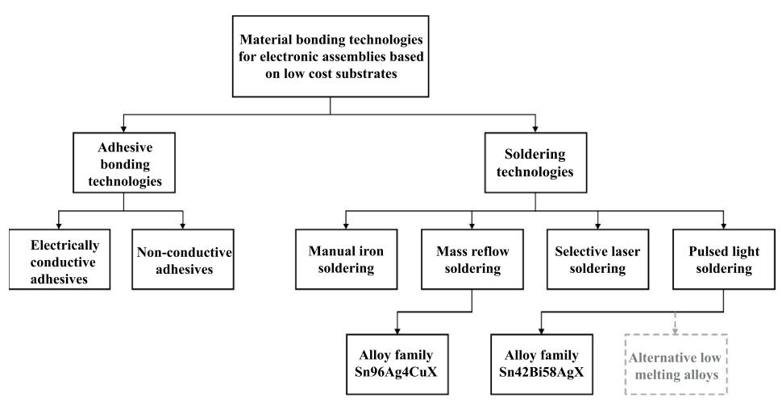  
Figure 1. Connection technologies currently used in low-cost electronics.

The maximum process temperatures for SAC alloys in reflow soldering range from 235 $^ \circ \mathrm { C }$ to $2 6 0 ~ ^ { \circ } \mathrm { C } ,$ depending on the specific assembly and soldering technology employed. Consequently, circuit carriers and all electronic components must be capable of withstanding the prevailing peak temperatures for a brief period, typically between 10 s and approximately 90 s, without sustaining damage or other impairment. The advantages of mass reflow soldering processes include high performance in terms of throughput and uniformity of heat transfer. Should there be a requirement to achieve lower process temperatures and more gentle heating of the bonding partners, several alternative options are available (figure 1).

In addition to the utilisation of low melting point solder in combination with mass soldering techniques, a range of alternative processes exist, such as selective solder joint heating and adhesive bonding. For flexible, low-cost electronics, the primary challenge is the restricted thermal load-bearing capacity of the base materials. The intended target substrates are typically derived from low-cost thermoplastic materials, such as PET. The dimensional stability of these materials is limited to 150 ◦C, which is below the melting point of SAC solders. An alternative that is considerably more suitable is the use of solders based, for example, on Sn42Bi57.6Ag0.4, which has a relatively narrow melting range of $1 3 7 ^ { \circ } \mathrm { C }$ to $1 4 2 ~ ^ { \circ } \mathrm { C }$ [5]. The reflow process conditions of approximately $1 6 0 ~ ^ { \circ } \mathrm { C }$ for these solders are only marginally above the usable range for low-cost film substrates. Nevertheless, mass reflow soldering at this temperature can still result in damage and deformation of the substrate and conductors.

In addition to the process temperature, the soldering time remains a significant factor in the context of low-cost electronics. To achieve the desired goals of enhanced design flexibility, simplified production processes, and reduced time to market, printed electronics are increasingly being considered as a potential replacement for copper-clad substrates. The combination of printed electronics with SMT results in the development of flexible hybrid electronics [6]. It has been demonstrated through research in this field that, in addition to low process temperatures, shorter soldering times are also advantageous for thin printed layers. When utilising silvercontaining inks, the conductor may undergo dissolution in the liquid solder [7–9]. A recent alternative methodology for addressing these challenges is intense pulsed light soldering. In this system, the assemblies are subjected to rapid heating by means of short, intense pulses from a xenon flash lamp. The objective is to achieve solder melting by exploiting the differences in material-dependent absorption before any damage is done to the substrate or conductor. The efficacy of this approach has been demonstrated in numerous publications [10–13]. However, the utilisation of xenon light only partially leverages material-dependent absorption, as the xenon spectrum also incorporates wavelengths that are more strongly absorbed by the substrates. A limitation of the emission spectrum to a range of 0.7 to 1.4 µm is achieved in [14] by using a near-infrared (NIR) radiation source. This approach also demonstrated promising soldering results on screen-printed silver structures.

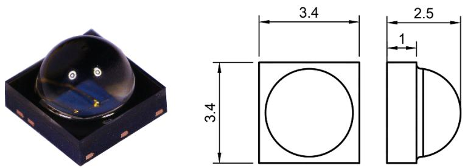  
Figure 2. Illustration with dimensions in mm of the selected NIR LED.

In conclusion, it is evident that the existing options for contacting electronic components on low-cost substrates have the potential for enhancement. Consequently, none of the joining technology alternatives has yet achieved a significant market share. This paper introduces a novel approach to the selective reflow soldering of single-sided lowcost substrates based on PET. NIR diodes emitting electromagnetic radiation within the range of 820 to 880 nm are capable ofproviding the requisite thermal energy for reflow soldering using low-melting solders belonging to the SnBi alloy family. In contrast to the approaches described in previous publications, the energy input occurs exclusively from the bottom of the assembly through the substrate material, thereby avoiding the issue ofsolder joint shading. The utilisation of individually controllable LEDs additionally enables layout-dependent, part-specific, locally selective and scalable irradiation. This approach allows for the omission ofunpopulated areas, thereby reducing the energy requirement and the probability of damage to heavily metallised surfaces. To this end, a basic laboratory configuration comprising a limited number of LEDs will be used to solder the initial test structures. The primary objective is to identify a selection ofpotentially suitable LEDs based on the findings of market research. Subsequently, a laboratory setup will be developed for the purpose of evaluating the process. The suitability of the materials used is evaluated through the measurement of their absorption properties. The solder joints produced via NIR diode soldering (NIDS) are subsequently characterised and compared with joints conventionally manufactured in a convection reflow oven.

## 3. Experimental

## 3.1. NIR-diodes

Given the lack of documented instances of soldering with NIR LEDs, it is necessary to identify alternative LEDs from other application fields that are suitable for this purpose. To this end, a comprehensive study was conducted, in which nine LEDs were selected from a total of136 pre-filtered products. The selection was based on an evaluation of the primary characteristics, namely package type and size, radiant intensity, and operating current. From this list, one product was selected for the initial experiments. The selected LED is a VSMA1085400 from the company Vishay. The LED has a beam intensity of 1.35 W $\mathrm { s r } ^ { - 1 }$ and a beam angle of $8 0 ^ { \circ }$ at a current of 1.5 A and a voltage of3.25 V [15]. An illustration ofthis LED type and its dimensions in mm is given in figure 2.

The selected LED was chosen based on its highest radiant intensity, with the objective of ensuring that the technical upper limit could be investigated. It should be noted that a reduction in power is still possible by regulating the current or applying pulsewidth modulation. High radiant intensity and the resulting irradiance on the underside of the copper metallisation is required to achieve sufficient heating of the conductor tracks. The heating of the tracks leads to the heating of the solder paste by conduction. The heating ofthe solder is therefore directly related to the radiant intensity via the absorption of the underside of the metallisation.

## 3.2. Substrates, components, solder paste and assembly

In all investigations, 0603 SMT chip resistors were used. The component metallisation is composed of pure tin over nickel. The flexible substrate is composed of a 100 µm thick PET film, an adhesive layer, and a copper conductor foil with a thickness of35 µm. Following the etching process, the layout is covered with an immersion $\mathrm { A g }$ coating, with a thickness of between 0.3 and 0.5 µm, to facilitate solderability. The layout selected for the investigation is a daisy chain configuration comprising six components in a row, as illustrated in figure 3. The solder paste used in this study was a low-melting point formulation, specifically MacDermid Alpha CVP 520 (Sn42Bi57.6Ag0.4). The test vehicles were manually printed with solder paste using a 100 µm thick stainless steel stencil. The apertures of the stencil were reduced by 10% in all dimensions. The components were placed semiautomatically with a POWATEC pick-and-place system. Following the placement ofthe components, one

Figure 3. Test layout with two chains of six 0603 chip resistors.

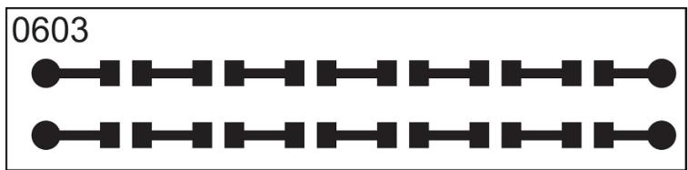

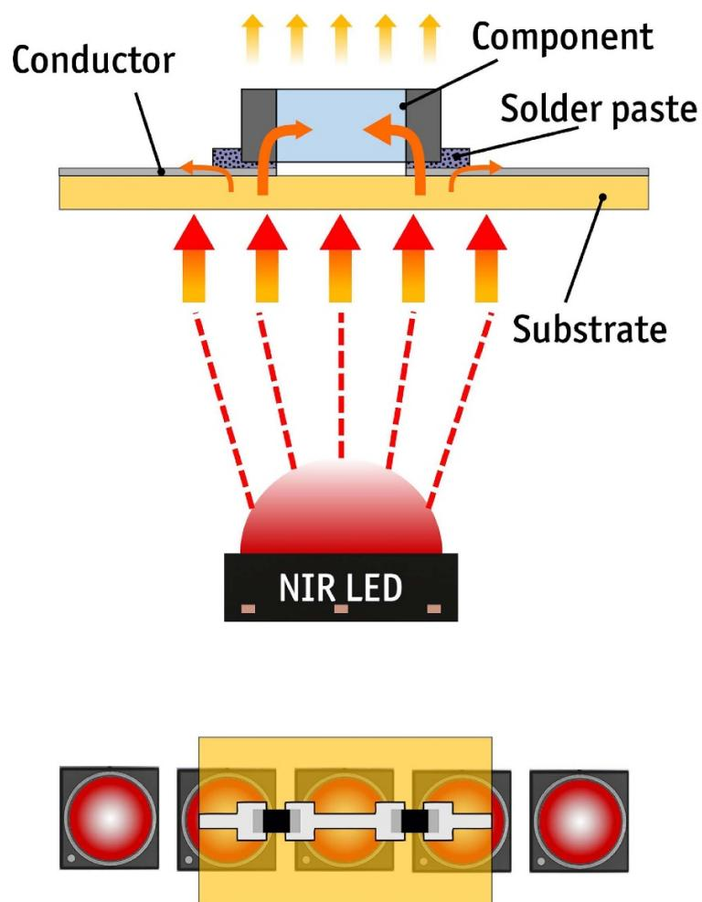  
Figure 4. Above: Working principle of the process with input and transfer of thermal energy; below: Positioning of the test vehicle above the LEDs (without substrate carrier).

half of the test vehicles was soldered in a forced convection reflow system (SMT 200 C) under normal atmospheric conditions. The second halfwas soldered using the NIDS laboratory setup, as described in the following section.

## 3.3. NIDS laboratory setup

To evaluate the suitability of the selected LED type as an energy source for reflow soldering, a laboratory setup for processing the aforementioned resistor chain was designed and built. The operational principle is pictured in figure 4. Two components were always soldered simultaneously.

The configuration incorporates a low NIRabsorbance carrier material (see figure 7), which offers mechanical support for the flexible test vehicle. Five LEDs (centre to centre distance 4 mm) are mounted on an insulated metal substrate (IMS) PCB underneath, which provide the requisite energy. The IMS is mounted on a heat sink with fins, which allows for passive cooling. The distance between the substrate support and the LEDs can be adjusted. The setup was operated with a constant current of 1.5 A, which corresponds to an electrical input power of approximately 25 W (max.) and a radiated power of 10 W (max.).

## 3.4. Absorption measurement

In order to guarantee that the highest possible energy is delivered to the solder joint, and that the carrier only experiences a slight increase in temperature, it is essential that the carrier material exhibits minimal absorption of NIR radiation. This principle also applies to the PET substrate. In regions lacking conductor patterns, minimal NIR absorption is desirable, whereas regions containing component pads should present a high level of absorption. Absorbance measurements were conducted using the Lambda 19 dualbeam UV–NIR spectrometer from Perkin Elmer. This instrument features a 60 mm integrating sphere with a measurement range of 200 to 2000 nm and a scanning speed of120 nm min−1. As the measuring device is unable to determine the absorption in a single measuring step, an alternative approach is required. This is achieved by determining the transmission and reflection of the material in two separate measurements, as illustrated in figure 5.

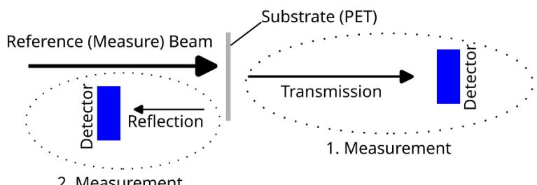  
2. Measurement  
Figure 5. Measuring principle and sequence of the absorption measurements.

Subsequently, the absorbance is calculated in accordance with formula (1). The advantage of this method is that it accounts for reflection, which is not included in the measurements presented in [14]

$$
\begin{array} { c } { { \mathrm { A b s o r p t i o n } = \mathrm { E m i t t e d ~ r a d i a t i o n } - \mathrm { T r a n s m i s s i o n } } } \\ { { \phantom { \mathrm { A b s o r p t i o n } = \mathrm { E m i t t e d ~ r a d i a t i o n } - \mathrm { T r a n s m i s s i o n } } } } \\ { { \phantom { \mathrm { A b s o r p t i o n } = \mathrm { E m m i t t e d ~ r a d i a t i o n } - \mathrm { G r a n s m i s s i o n } } } } \\  { \phantom { \mathrm { A b s m a l e n s m a l e n t i o n } - \mathrm { G r a n s m a l e n s m a l e n t i o n } } ( 1 } \end{array}\tag{1}
$$

## 3.5. Temperature measurement

To determine the temperature, a type K thermocouple was brought into contact with the solder joint, and the resulting temperature curve was recorded using a DATAPAQ DP5. It was accepted that an additional drain of thermal energy would occur via the thermocouple, given the difficulties associated with non-contact measurement methods. Infrared thermography necessitates the use of a known and constant emission coefficient. Due to the heterogeneous composition of the assembly, comprising a variety of materials including components, solder, conductor tracks and substrates, it is not possible to measure the temperature of each component simultaneously. The solder paste presents a particularly challenging case, as it transitions through three distinct states (paste, liquid, remelted) during the reflow process. Each of these states exhibits a unique emission coefficient, making it difficult to accurately measure the temperature. It is not feasible to coat the assembly to achieve a uniform emissivity, as this would result in alterations to the absorption properties. To determine the temperature curve within the convection oven, a type K thermocouple was attached in a similar manner.

Table 1. Possible fracture modes during shear testing.
<table><tr><td colspan="2">Code Description</td><td colspan="2">Code Description</td></tr><tr><td>1A</td><td>Component body</td><td>1B</td><td>Body-electrode</td></tr><tr><td>2</td><td>Component-solder interface</td><td>3</td><td>Solder</td></tr><tr><td>4</td><td>Solder-pad interface</td><td>5</td><td>Pad</td></tr></table>

## 3.6. Characterization and accelerated ageing

The mechanical solder joint strength was characterised by means ofdestructive shear force measurement in accordance with the standards set forth in DIN EN 62 137-1-2:2007 (shear tester XYZTech Condor Sigma Lite). A shear chisel with a width of 2 mm was utilised, moving at a height of 0.12 mm and at a speed of 0.15 mm $\mathbf { s } ^ { - \mathrm { 1 } }$ . Prior to shear testing, the flexible substrates were adhesively bonded to rigid FR-4 material using double-sided adhesive tape. In addition to the measured shear forces, the fracture codes (the way the test specimen fails) must also be considered when evaluating the results of shear tests. As shown in table 1, the six fracture codes serve to differentiate the locations of failure in the shear test. An awareness of the specific failure mode enables the formulation of conclusions regarding the impact of the soldering process and the joining partners on the measurement results. Further details may be found in the standard DIN EN 62 137-1-2:2007 [16].

Following the initial measurement of the samples, slow thermal cycling was conducted in a Binder MKF 56 climate chamber. The profile utilised is shown in figure 6. The temperature limits were set at $+ 8 0 ~ ^ { \circ } \mathrm { C }$ and $- 2 0 { } ^ { \circ } \mathrm { C } ,$ with a targeted dwell time of 15 min at each level, resulting in a total cycle time of approximately 90 min.

The heating and cooling gradients were set at a rate of 4 K min−1. The samples were subjected to 100 cycles. Subsequently, the shear strength was again measured following the ageing process. Furthermore, high-temperature storage at $1 0 0 ^ { \circ } \mathrm { C }$ for

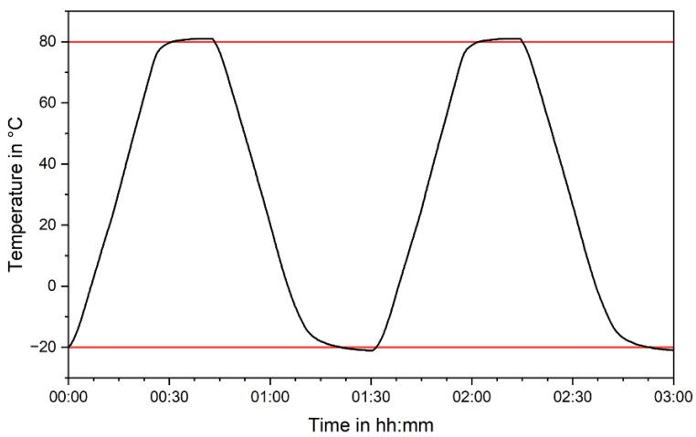  
Figure 6. Thermal cycling profile for accelerated aging with upper and lower temperature limit.

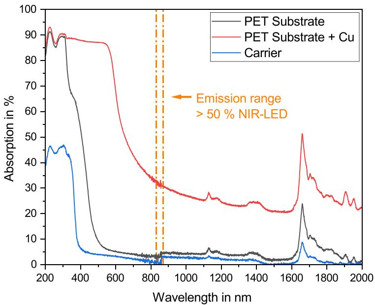  
Figure 7. Absorption spectra of the materials used in the irradiated area.

288 h was conducted to assess the impact of elevated temperatures on the microstructure of the solder joints.

## 4. Results and discussion

The following chapter is structured as follows. Initially, the two main influencing factors, namely NIR absorption and working distance, are discussed. This is followed by an overview of the resulting soldering profiles of convection soldering and NIDS. Subsequently, an evaluation and characterisation of the solder joints is conducted utilising microscope images, microsections and the measurement of shear forces before and after ageing.

## 4.1. Absorption

The results of the absorption measurement, as shown in figure 7, demonstrate a pronounced decline in absorption by the bare PET substrate and the carrier between 400 and 500 nm. At the dominant emission spectrum of the LED, spanning 830 to 870 nm, both materials exhibit minimal absorption, with a value below 5%. Cu clad PET exhibits an absorption of 32% in the emission spectrum of the LEDs at a peak wavelength of850 nm. This difference in absorption results in a considerably greater input of thermal energy in areas with metallisation. A slight increase in absorption can be observed for the substrate and the carrier at 860 nm due to an internal detector switch of the measuring device.

## 4.2. Irradiance distribution

The LED is evaluated with the aid of a goniometric system (SIG-400, Radiant Vision Systems) and the Light Tools Software by Synopsis, the objective being to ascertain the irradiance on the underside of the substrate. Based on the measurement of a single LED, the combined irradiance of several neighbouring LEDs can then be determined by superposition. In accordance with the formula (2), an irradiance of $E _ { e } = 8 4 \mathrm { m W } \mathrm { m m } ^ { - 2 }$ is to be anticipated when utilising the nominal radiant intensity of $I _ { F } = 1 . 3 5$ W $\mathrm { s r } ^ { - 1 }$ at a distance of $s = 4$ mm between the LED chip and the PET substrate. This equates to a distance of 1.5 mm between the top of the lens and the substrate. The observation point is situated in a central position above the LED.

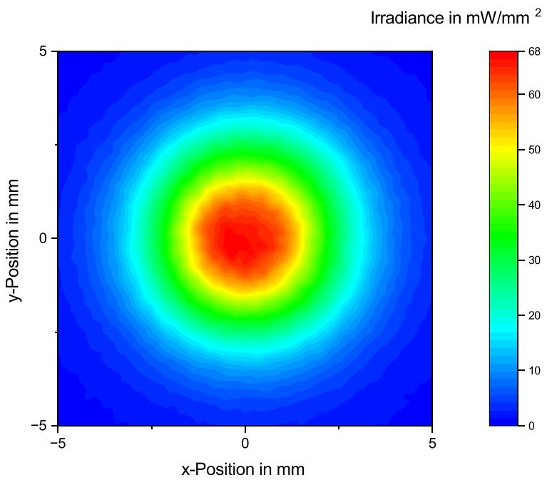  
Figure 8. Spatial distribution of the irradiance of a single LED at a distance of 1.5 mm.

$$
E _ { e } = \frac { I _ { F } } { s ^ { 2 } } .\tag{2}
$$

Prior to measurement, the LED was subjected to a burn-in period of three days to ensure that the results reflected the LED’s actual performance in real-world applications. The measurement of the LED results in the irradiance shown in figure 8.

As can be observed from the scale, the maximum irradiance of approximately 68 mW $\mathrm { m m } ^ { - 2 }$ is achieved at the centre. The observed value is only 81% of the calculated value, which can be attributed to the effects of burn-in and an elevated operating temperature due to waste heat.

By superimposing the measured values in a line of five LEDs with a centre to centre distance of 4 mm, it is possible to estimate the resulting irradiance for the entire LED line, as shown in figure 9. The irradiance attains a maximum value of approximately 86 $\mathrm { m } \mathrm { W } { \cdot } \mathrm { m m } ^ { - 2 }$ and exhibits a high degree of uniformity in the region encompassing the five LEDs. The ripple in this area is approximately 10% of the mean irradiance.

## 4.3. Influence of distance between LED and substrate

The available emitted power of the LEDs is limited and decreases in direct proportion to the square of the distance, thus underscoring the importance of maintaining optimal distance between the LEDs and the test vehicle. Given the narrow beam angle of the LEDs, a greater distance results in a more uniform distribution of irradiance, although it also leads to a reduction in the overall irradiance. Figure 10 illustrates the correlation between distance and the time required to melt a 0603 resistor solder joint, which is indicative of the energy transferred into the joint.

At a distance of 1 mm, the solder joint melts after 9 s of irradiation, while at a distance of 4 mm, a time of 30 s is required. This demonstrates that maintaining short distances is essential to achieve a short process time. While this enables highly localised irradiation, it also results in a slight decrease of uniformity.

## 4.4. Temperature profiles

Figure 11 illustrates exemplary temperature-time profiles for both processes. As can be observed, the NIDS process (distance between the top of the LED lens and substrate 1 mm, irradiation time 13 s) results in relatively high heating and cooling gradients, with a peak temperature of approximately $1 5 5 ^ { \circ } \mathrm { C }$ and a time above the liquidus (TAL) of 5 s. Conversely, convective soldering exhibits markedly lower gradients, with a peak temperature of $1 6 0 ~ ^ { \circ } \mathrm { C }$ and a TAL of approximately 60 s. The convection reflow profile aligns with the process windows recommended by the solder paste supplier.

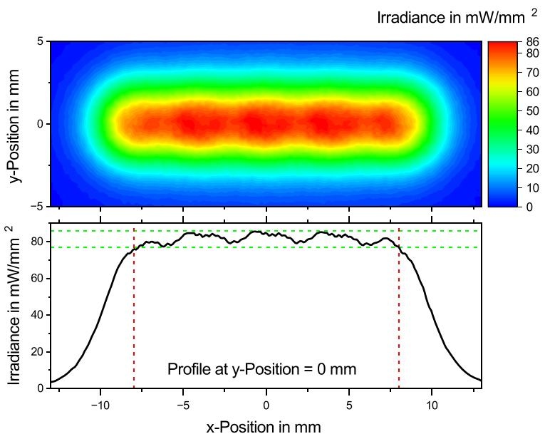  
Figure 9. Above: spatial distribution of the irradiance of the LED line at a distance of 1.5 mm; below: profile of the irradiance at y-position = 0 mm with the usable area between the centres of the outer LEDs and the ripple marked.

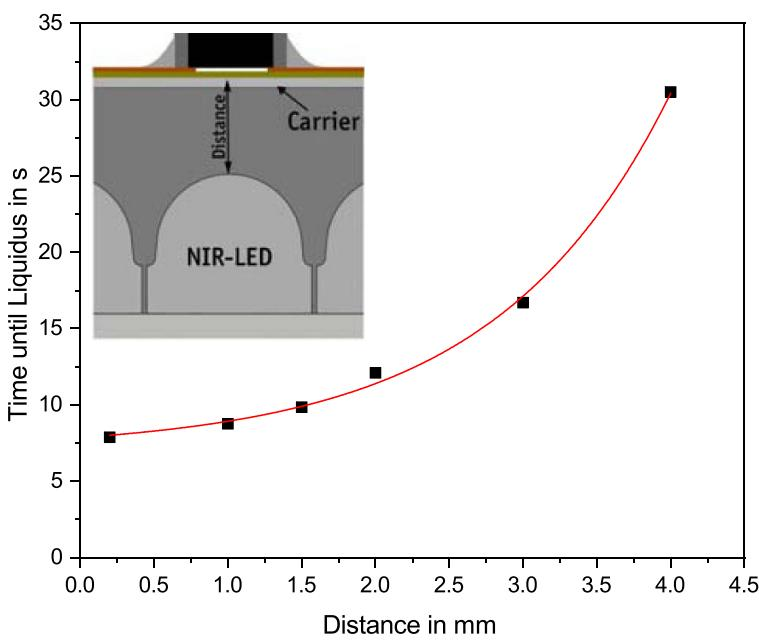  
Figure 10. Influence of the distance between the top of the LED lens and the test vehicle on the time until the solder melts.

## 4.5. Solder joints

Figure 12 presents a visual comparison of a convection soldered 0603 chip resistor and a NIDS soldered one. In both soldering processes, the solder showed good wetting of the metallisation of the PET substrate, as well as of the electrodes of the component. An increased number of solder balls was observed on the sides of the components soldered using the NIDS method. One potential explanation for this phenomenon is the markedly steep heating gradient, which impedes the evaporation of volatile compounds of the fluxing agent. An examination of the underside of the substrate revealed no discernible damage to the PET film or the adhesive layer. Given the small dimensions of the test vehicles, no appreciable differences in warping could be discerned between the convection soldering and NIDS methodes.

Despite the brief processing time and considerable temperature gradients, the NIDS solder joints exhibit minimal void formation, as illustrated in figure 13. The interconnections between the solder and the SMT component, as well as the solder and the PCB metallisation, demonstrate optimal wetting and the absence of any irregularities, such as inadequate heating that could result in graping.

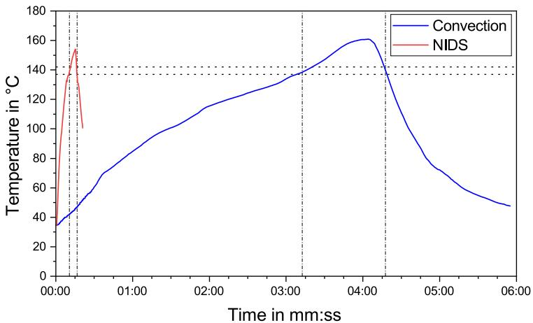  
Figure 11. Measured temperature profiles during convection soldering and NIDS with time above liquidus (melting range: 137 ◦C 142 ◦C).

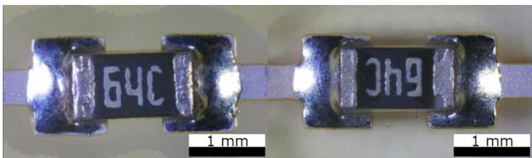  
Figure 12. Left: Convection soldered joint, right: NIDS soldered joint.

The interface between the solder and the metallisation was examined in greater detail using an optical microscope, scanning electron microscopy (SEM) and energy dispersive x-ray spectroscopy (EDX). Prior to any mechanical testing, microsections of the various soldered joints were subjected to analysis to ascertain any differences and similarities. It was anticipated that the extremely thin immersion Ag layer would be dissolved uniformly in the solder matrix. From a theoretical standpoint, the observed short TAL and rapid cooling for NIDS should result in a fine solder structure with a relatively narrow reaction zone between the copper and tin. Conversely, the relatively long TAL and slow cooling rate for convective soldering may result in the formation of a coarser solder structure and a broader reaction zone. The microsections of the two variants are presented in figure 14.

The initial solder joints are distinguished by a fine distribution of Bi and Sn crystals. The varying degrees of coarseness observed in the solder, dependent on the process variant, can be substantiated through analysis of the micrographs. In both instances, a thin Ag-containing layer was still evident at the Cu/solder interface following soldering (figure 15). This observation has been previously documented in the literature, albeit with significantly thicker sintered Ag metallisation or on bulk Ag for higher melting point lead-free solder alloys [17, 18]. It has been postulated that the layer may comprise Ag3Sn intermetallics, as evidenced by [11, 18]. It appears that Ag3Sn does not form a continuous layer with a dense structure in either of the two reflow processes.

## 4.6. High temperature storage—preliminary results

To gain further insight into the behaviour of the Ag layer over an extended time, the solder joints were subjected to solid stage ageing at 100 ◦C for 288 h. Subsequently, microsections were prepared and analysed using EDX. As illustrated in figure 16, the solder matrix undergoes a process of coarsening, resulting in the formation of large Bi and Sn phases. The Ag Sn layer is slightly more dispersed within the solder volume than previously described but remains predominantly present at the interface. In comparison to the initial structure of the interface, both samples developed a Sn–Cu intermetallic phase below the Ag intermetallics, which suggests that the Sn has diffused through the Ag3Sn layer.

## 4.7. Mechanical strength and preliminary results for thermal cycling behaviour

In addition to high-temperature storage, the solder joints were subjected to slow thermal cycling. Figure 17 illustrates a comparison of the shear forces of components soldered by convection and NIDS with a TAL of 5 s. The initial values are shown, as well as the values obtained after thermal cycling (100 cycles). A total of 24 components were included in the study for each soldering process variant and state. The initial mean shear value for convectively soldered joints was found to be 40.8 N, with a standard deviation of 3.1 N. The mean value for NIDS was 45.4 N, with a standard deviation of 5.6 N. An analysis of variance (ANOVA) was conducted based on these samples. Despite a significant discrepancy between the two mean values, the coefficient of determination $( R ^ { 2 } { \cdot }$ -value) is relatively low (0.19), indicating that there is no clear statistical evidence to suggest a genuine difference between the two variants. An examination of the failure modes reveals a discrepancy between the samples. While all 24 convectively soldered joints exhibit a failure in the solder joint (fracture code 3; see table 1), only 11/24 NIDS joints display this same fracture code. The remaining joints demonstrate a failure with code 5, indicating an adhesion failure between the substrate and pad during shear testing (table 2).

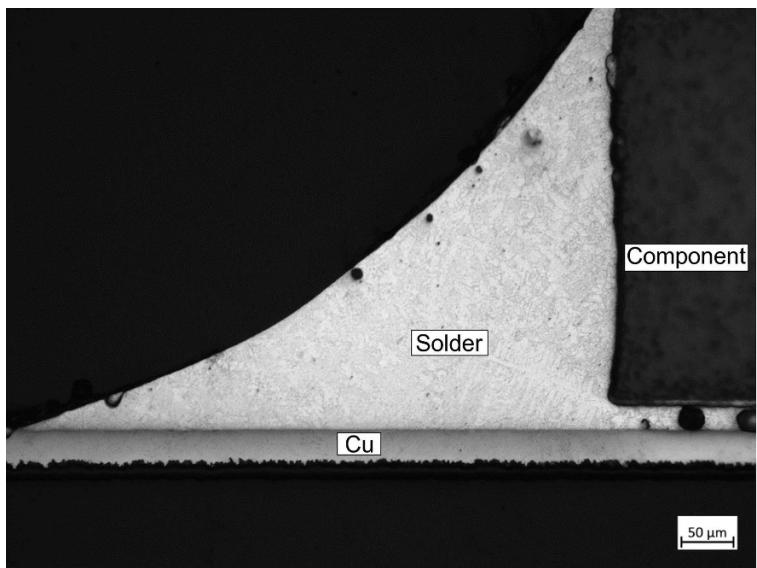  
Figure 13. Microsection of a NIDS soldered chip resistor.

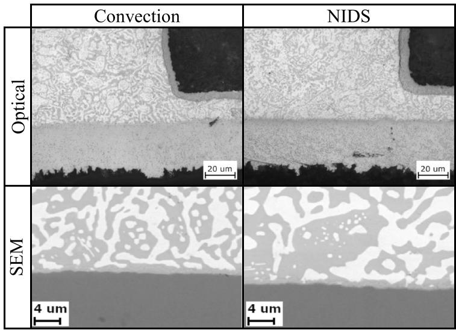  
Figure 14. Optical and SEM images of microsections of solder joints produced by convection soldering and NIDS.

Following thermal cycling, a marginal increase in mean values was observed exclusively in the case of convection soldered components. The mean shear value for these joints is 45.9 N, with a standard deviation of 5.0 N. In comparison, the NIDS remain at 44.9 N, with a standard deviation of 3.9 N. An ANOVA (confidence level 0.95) did not confirm a significant difference between the two soldering methods. The standard deviation demonstrates no statistically significant variation following the ageing process. For all 48 sheared solder joints, fracture code 3 (solder joint failure) was visually determined following thermal cycling, as shown in table 2.

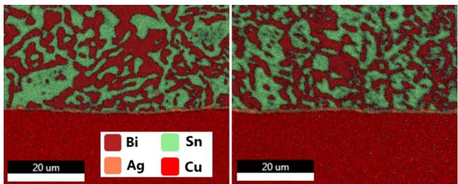  
Figure 15. EDX analysis of the interface between solder and Cu conductor with silver immersion after convection soldering (left) and NIDS (right).

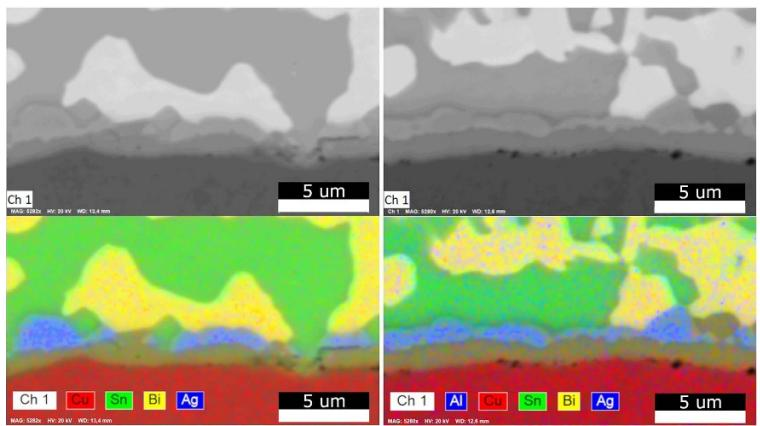  
Figure 16. SEM picture and EDX analysis of the interfaces after high temperature storage of convection soldered (left) and NIDS (right) joints.

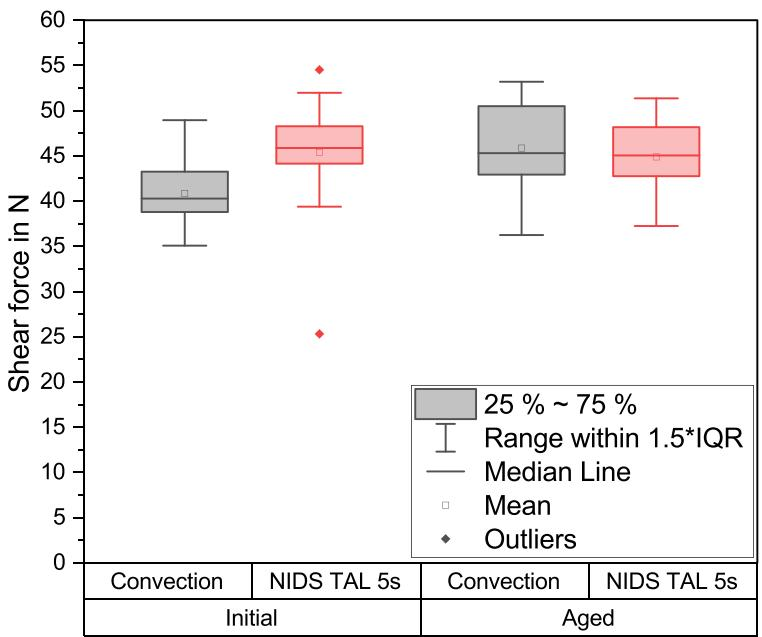  
Figure 17. Comparison of convection soldered and NIDS soldered chip resistors before and after thermal cycling.

Table 2. Fracture codes during shear testing (initial vs. aged).
<table><tr><td rowspan="2">Code</td><td colspan="2">Initial</td><td colspan="2">Aged</td></tr><tr><td>Convection</td><td>NIDS</td><td>Convection</td><td>NIDS</td></tr><tr><td>1A</td><td></td><td></td><td></td><td></td></tr><tr><td>1B</td><td>一</td><td>一</td><td>一</td><td>一</td></tr><tr><td>2</td><td>一 一</td><td>一 一</td><td>一 </td><td>一 一</td></tr><tr><td>3</td><td>24</td><td>11</td><td>24</td><td>24</td></tr><tr><td>4</td><td></td><td>一</td><td>一</td><td></td></tr><tr><td>5</td><td>一 一</td><td>13</td><td>一</td><td>一 一</td></tr></table>

In summary, the mechanical strength of conventional and NIDS joints appears to be comparable. The fracture codes observed following the ageing process are identical, but the initial behaviour appears to differ. The validity of this observation requires further investigation.

## 5. Conclusion and outlook

The research presented in this work demonstrates that soldering of SMT chip components on a flexible circuit substrate based on PET is feasible when NIR LEDs are utilised as the energy source. The utilisation of material-dependent and localised irradiation was demonstrated using a basic laboratory setup comprising five LEDs. No damage to the layers of the substrate was observed, and the joints produced were found to exhibit mechanical and material properties comparable to those of joints soldered by the convection method. No significant alterations in the mechanical properties were discerned as a consequence of accelerated ageing during temperature cycling.

Notwithstanding the encouraging outcomes, further studies are required to gain deeper insights. The Ag layer observed between the copper and solder must be subjected to detailed analysis by means of an EDX line scan with appropriate resolution, in order to confirm the observations made by other researchers. From a process technology perspective, additional research is required to fully understand the impact of steep temperature gradients on solder ball formation and the overall reliability of the joints and components. Further investigation is necessary to ascertain the reliability of the solder joints, specifically regarding electrical and mechanical deterioration. This should include an examination of the solder joints under conditions of prolonged accelerated ageing. The impact of the process on substrate deformation must be investigated in greater depth, utilising larger and more intricate layout structures. Moreover, the range of components is to be expanded to include larger and more complex SMT components, thus enabling an evaluation of the process from an application-oriented perspective. Furthermore, the impact of this process on printed conductors comprising thin Ag layers and low-cost substrates must be considered. To this end, the development of a more sophisticated laboratory soldering system is required, encompassing an appropriate cooling and irradiation solution, as well as a suitable substrate handling concept. Additionally, a method for layout-dependent control of a larger number of LEDs must be developed.

## Data availability statement

All data that support the findings of this study are included within the article (and any supplementary files).

## Acknowledgment

This work was financially supported by the Federal Ministry for Economic Affairs and Climate Action in the Central Innovation Programme for small and medium-sized enterprises (SMEs) under the project acronym ‘PhotoAVT’ (16KN098741). The authors declare no conflict of interests.

## ORCID iDs

Thomas Wenger  https://orcid.org/0009-0000- 1565-9420

Philipp Schletterer  https://orcid.org/0009-0004- 6859-7840

Marcus Reichenberger  https://orcid.org/0009- 0007-3537-2786

## REFERENCES

[1] IDTechEx 2019 Flexible Hybrid Electronics 2020–2030: Applications, Challenges, Innovations and Forecasts (IDTechEx)

[2] Bath J 2020 Lead-free Soldering Process Development and Reliability (Wiley)

[3] Pietruszka A, Górecki P, Wronski S, Illés B and Skwarek A´ 2021 The influence of soldering profile on the thermal parameters of insulated gate bipolar transistors (IGBTs) Appl. Sci. 11 5583

[4] Illés B, Krammer O and Geczy A 2020 Reflow Soldering: Apparatus and Heat Transfer Processes (Elsevier)

[5] Ribas M et al 2018 The Printed Circuit Assembler’s Guide to Low-Temperature Soldering (BR Publishing)

[6] Khan Y, Thielens A, Muin S, Ting J, Baumbauer C and Arias A C 2019 A new frontier of printed electronics: flexible hybrid electronics Adv. Mater. 32 1905279

[7] Juric D, Hammerle S, Glaser K, Eberhardt W and Zimmermann A 2018 Assembly of components on inkjet-printed silver structures by soldering IEEE Trans. Compon. Packag. Manuf. Technol. 9 156–62

[8] Werum K, Mueller E, Keck J, Jaeger J, Horter T, Glaeser K, Buschkamp S, Barth M, Eberhardt W and Zimmermann A 2022 Aerosol jet printing and interconnection technologies on additive manufactured substrates J. Manuf. Mater. Process. 6 119

[9] Jager J, Buschkamp S, Werum K, Glaser K, Grozinger T, Eberhardt W and Zimmermann A 2022 Contacting inkjet-printed silver structures and SMD by ICA and solder IEEE Trans. Compon. Packag. Manuf. Technol. 12 1232–40

[10] Jung K-H, Min K D, Lee C-J, Jeong H, Kim J-H and Jung S-B 2020 Ultrafast photonic soldering with Sn–58Bi using intense pulsed light energy Adv. Eng. Mater. 22 2000179

[11] van den Ende D A, Hendriks R, Cauchois R, Kusters R H L, Cauwe M, Groen W A and van den Brand J 2014 Photonic flash soldering of thin chips and SMD components on foils for flexible electronics IEEE Trans. Compon. Packag. Manuf. Technol. 4 1879–86

[12] Ukwuoma J, Chou H, Parsekian A, Rawson I, Pope D and Akhavan V 2024 Photonic curing and soldering to printed

silver for enhanced attachment and joint quality 2024 Int. Conf. on Electronics Packaging (ICEP) pp 1–2

[13] Arutinov G, Hendriks R and van den Brand J 2016 Photonic flash soldering on flex foils for flexible electronic systems 2016 IEEE 66th Electronic Components and Technology Conf. (ECTC) 10.1109/ectc.2016.179

[14] Kasi V, Zareei A, Gopalakrishnan S, Alcaraz A M, Joshi S, Arfaei B and Rahimi R 2023 Flexible hybrid electronics via near-infrared radiation-assisted soldering of surface mount devices on screen printed circuits Adv. Electron. Mater. 9 2201012

[15] Vishay Semiconductors 2022 ( available at : https://www. vishay.com/docs/80294/vsma1085400.pdf) Datasheet VSMA1085400 (Accessed 09 July 2024)

[16] DIN EN 62137-1-2:2007 ,Surface mounting technology - Environmental and endurance test methods for surface mount solder joint - Part 1-2: Shear strength test (IEC 62137-1-2:2007)

[17] Ghosh G 2004 Interfacial reaction between multicomponent lead-free solders and Ag, Cu, Ni, and Pd substrates J. Electron. Mater. 33 1080–91

[18] Yang T L, Huang K Y, Yang S, Hsieh H H and Kao C R 2014 Growth kinetics of Ag3Sn in silicon solar cells with a sintered Ag metallization layer Sol. Energy Mater. Sol. Cells 123 139–43