# Flexible Hybrid Electronics via Near-Infrared Radiation-Assisted Soldering of Surface Mount Devices on Screen Printed Circuits

Venkat Kasi, Amin Zareei, Sarath Gopalakrishnan, Alejandro M. Alcaraz, Shantanu Joshi, Babak Arfaei, and Rahim Rahimi\*

The development of flexible hybrid electronics (FHEs) with high-throughput integration of electrical components onto digitally printed circuits has a wide range of applications, such as asset tracking, wearable electronics, and structural health monitoring. However, one of the major challenges with FHEs is the process of soldering the electrical components onto a printed circuit while having minimal thermal damage to the printed traces and their temperaturesensitive polymeric substrates. Here, the possibility of utilizing near-infrared (NIR) technology as a nondestructive photonic approach for rapid soldering and mounting electrical components onto printed circuits while keeping the polymer substrate at a relatively low temperature during the soldering process is investigated. Results of this systematic study show that FHEs prepared with the optimized NIR processing conditions produce the desired reflow of solder with efective electrical connection and metallic bonding of electrical components onto the conductive traces with excellent mechanical stability (no failure even after 1000 cycles of bending). Furthermore, using this technique and as a proof of concept, the fabrication of a wearable FHE device that provides a remote assessment of the wound exudate absorption in dressings and notifies caregivers of the appropriate time to change the dressing is demonstrated.

## 1. Introduction

Recent advances in new printing techniques, including screen printing, ink-jet printing, flexography, and gravure printing, have facilitated afordable large-scale manufacturing processes of flexible electronics.[1–4] According to the global source market trend report published by IDTechEx, the flexible electronics market was estimated at an annual revenue of US\$29.28 billion in 2017. The forecast indicates a growth of 11.1% through 2027.[5] Significant progress has been made in the development of flexible electronics where conductive circuits and other components are printed using various functional organic and inorganic inks and materials onto flexible substrates for wearable and healthcare applications.[6–11] Although these all-printed flexible electronics have many beneficial features, including lightweight, flexibility, and stretchability, they still fall behind the traditional rigid silicon-based electronic devices in terms of performance, power consumption, and lifetime of operation.[12,13] While the traditional siliconbased integrated circuits (ICs) and their integration onto standard printed circuit boards (PCBs) have been well-established over the years, providing excellent performance at considerably low power

consumption, they are not ideal for wearable or conformable devices due to their rigid and bulky structure.[14–17] To fabricate flexible electronics of high performance, low power consumption, and long-term durability, hybrid printed circuits in combination with the use of silicon-based IC components have emerged as new opportunities in flexible hybrid electronics (FHEs) where both fields of digital printing and standard silicon-based electrical devices are assembled to achieve the desired flexibility while preserving performance.[18–20]

In FHEs, silicon-based components in the form of surface mount devices (SMDs) with small footprints are often mounted onto digitally printed conductive traces on flexible substrates.[21,22] Nevertheless, in the fabrication process of FHEs, it is essential to obtain an efective and rapid integration of SMDs into the printed circuit while achieving the desired performance and reliability without compromising the electrical and mechanical properties of conductive traces and their substrate.[23] While convection oven reflow soldering is the most commonly used approach for interconnecting SMD components onto the traditional rigid PCBs, this high-temperature process cannot be used for digitally printed conductive circuits on temperaturesensitive substrates.[24–26] In this approach, the entire device is passed through the oven, subjecting not only solder but also all the components on the device to high temperatures, typically above 200 °C, for a considerable time (≈90–120 s). Such hightemperature processing conditions cause damage and deformation of printed conductive traces and polymers used in the fabrication of FHEs. Due to such limitations with the conventional method, developing an efective process that allows selective soldering of electrical components without damaging temperature-sensitive components is the current focus of investigation in the field of FHEs.[27,28]

Among various alternative approaches evaluated for soldering electrical components on FHEs, photonic-based methods with high heat intensity have been shown to provide rapid heating to solder paste minimizing the thermal efect on conductive traces and substrates.[29,30] However, these methods can still cause damage to conductive traces and substrates as the energy from photonic pulses can be absorbed in the form of heat by all the components in FHE, including conductive traces and substrates. In addition, the solder paste in these methods may not reach its melting point if the pulse time is very short to minimize the thermal efect on conductive traces and substrate. To address these issues, we introduce near-infrared (NIR) radiation-based heating technology as an efective alternative approach providing selective heating to melt particles in the solder paste. The heating mechanism of this technology depends on the diference in light absorption characteristics of various materials. In this approach, the NIR radiation selectively allows metal particles in the solder paste to absorb energy from the radiation, leading to their melting while keeping other materials relatively at lower temperatures.[29] The NIR radiation, which exhibits the characteristic feature of the highest energy density in the wavelengths between 0.7 and 1.4  µm, has minimal thermal efect on many polymers, including poly(ethylene terephthalate) (PET) and poly(ethylene naphthalate) (PEN), as they have low or negligible absorbance in this spectral wavelength range. Using this approach, several studies have reported the efectiveness of this technology for selective drying and sintering of various types of printed functional materials, such as metal nanoparticles and metal oxides, on various polymer substrates.[31–35] For instance, Cherrington et  al. demonstrated the selective sintering of Ag nanoparticle ink by using NIR radiation quickly without afecting polymer substrates.[36] Similarly, Gu et  al. reported the efectiveness of this technology for sintering silver ink printed in the roll-to-roll (R2R) process.[37]

To date, previous studies have mainly reported investigating the use of NIR technologies for sintering metal nanoparticles. In this work, we have further extended the use of this technology and demonstrated its potential in providing efective soldering of SMD electrical components onto conductive traces printed on flexible substrates such as PET. A systematic study has been performed to analyze the efect of diferent parameters of NIR technology, including power and scan speed, on the spreading and bond strength of solder connection between SMD com ponents and screen-printed conductive traces. Further, optical microscopy and scanning electron microscopy (SEM) with energy-dispersive X-ray (EDX) mapping have been used to study the microstructure of the solder connection. As per the testing standard IEC 62137-1-2:2007, the shear test has been performed to analyze the bond strength of the solder connection obtained under diferent NIR settings.

Figure 1 illustrates the steps in the fabrication of FHE via a nondestructive and selective thermal heating process by a NIR process. In the first step, the silver conductive traces are printed on a PET substrate using a standard screen-printing process (Figure 1a-i). After printing, the traces are dried using NIR radiation on a conveyor belt, as shown in the second step (Figure 1a-ii). In the subsequent step shown in Figure 1a-iii, solder paste is deposited using an automated dispensing system on the printed circuit, followed by the placement of the elec trical components onto the solder paste (Figure 1a-iv). The electrical components are placed in the appropriate location such that the metal parts on both sides of each component are properly immersed in the solder paste. The sticky and high viscosity characteristics of the solder paste allows temporarily holding the electrical components in place until they are securely sol dered onto the printed circuit (Figure 1a-v). For this process, the printed circuit is exposed to NIR radiation on a conveyor belt facilitating a rapid melting of metal particles in the solder paste and forming the required electrical connection and mechanical bond between electrical components and the printed circuit while also eliminating the risk of thermal damage to PET during this process (Figure 1a-vi). Figure  1b shows a simple FHE circuit lighting a 2 × 3 array of LEDs and onboard battery using the demonstrated printing and NIR-assisted drying and soldering process. The flexible circuit can withstand diferent mechanical bending while remaining functional with the same illumination intensity level in the LEDs, Figure 1b-iii,iv.

## 2. Experimental Section

## 2.1. Preparation of Printed Conductive Traces

Commercial grade silver conductive paste (DuPont 5025) was obtained from Dupont. The conductive traces were printed using an MPS screen printer (TF-100) at an average thickness of 10  µm. The substrate on which the conductive traces were printed was a PET film purchased from DuPont. After printing the silver conductive traces on PET, an Adphos NIR system was used to dry/cure the conductive paste. As per the recommended conditions, the drying process was performed at a power of 2 kW and a speed of 1 m min−1, followed by the curing process at a power of 4  kW at a speed of 1m min−1 to achieve a final sheet resistivity of 12–15 mΩ sq−1 mil−1.

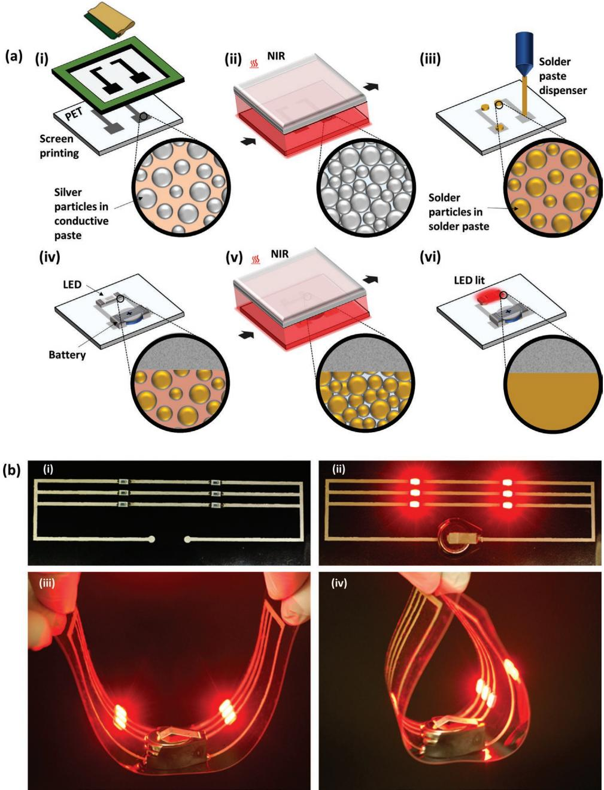  
Figure 1. a) Fabrication process of the flexible electronic device via nondestructive NIR soldering of electrical components to printed circuits: i) screen printing of conductive paste containing silver particles, ii) NIR drying of silver conductive trace, iii) deposition of solder paste using dispenser, iv) placement of SMDs (a LED and a battery) onto solder paste, v) NIR soldering of SMDs, and vi) LED-lit after the formation of electrical connection between solder and SMDs. b) i) Image showing an array of LEDs attached to the printed circuit, ii) image showing an array of lit LEDs with flexible interconnect, and iii,iv) images showing an array of lit LEDs in diferent bending modes with no efect on the electrical connection.

## 2.2. NIR Soldering of Electrical Components

Sn42/Bi57.6/Ag0.4 low-temperature solder paste commonly used in many printed circuit boards was dispensed using Nordson

3-axis automated fluid dispensing robot onto the conductive traces in a dot pattern with a diameter of 3 mm at a pressure of 10 psi. A systematic study was conducted to obtain the optimum conditions for soldering the low-temperature solder paste. A thermocouple (National Instruments NI-DMAX) connected to the computer was used to directly measure the temperature of solder paste as it was passed through NIR radiation under different processing conditions. Thermal profiles of diferent NIR settings were obtained by varying the power between 2 and 6 kW and the speed of the stage between 1 and 3 m min−1.

## 2.3. Material and Surface Characterizations

Surface and cross-sectional images of the solder before and after the soldering process were obtained using a Leica M205C optical microscope with reflection mode. For this study, the samples were prepared under three diferent NIR settings selected based on the abovementioned thermal profiles experimental results. High-resolution surface and cross-sectional images of the solder connections were obtained by field emission scanning electron microscopy (FE-SEM, Hitachi-S 4800, Tokyo, Japan) at an accelerating voltage of 5  kV, current of 20  µA and a working distance of 15  mm. The samples for cross-sectional images were prepared by polishing the samples in the sequential order of 30, 15, 0.5 µm grids, and a diamond polisher at the end. For each sample, polishing was continued until a smooth and mirror-like surface was obtained.

## 2.4. Mechanical and Environmental Stability Assessments

FHEs samples were prepared for these tests by soldering a 1020 Ω SMD resistor onto printed silver conductive pair traces using a process/design shown in Figure S1 (see the Supporting Information). After the conductive trace printing and drying, the solder paste was dispensed onto the conductive parallel traces. The resistor was placed on the solder paste so that the ends of the resistor were held onto the solder paste. To identify the efect of the NIR soldering process on the bond strength, diferent settings of the NIR system were used for soldering the connections between the resistor and conductive traces and characterized in terms of the bond strength (force required to disconnect the solder connection), the stability of solder connection to cyclic bending, and the environmental stability. To measure the bond strength of the soldered connection, a universal testing machine (eXpert 4000, Admet) was used to apply a controlled shear force to the SMD and determine the required shear force to disconnect the soldered SMD from the printed trace (Figure S2, Supporting Information). For stability assessment of solder joints, tension and compression cyclic bending tests were performed by applying a sinusoidal wave movement with an amplitude of 3 mm and a cycle period of $3 0 \ { \mathrm { s . } }$ To assess the environmental stability, the samples soldered with the SMD resistors were exposed to high humid conditions (100%RH) at

www.advelectronicmat.de

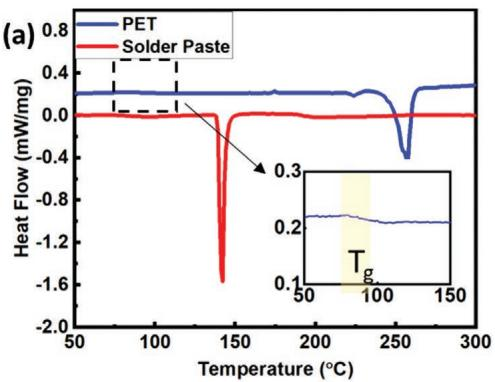

$7 0 ~ ^ { \circ } \mathrm { C } .$ , and the resistance was recorded after each day of exposure for up to 7 days.

## 3. Results and Discussion

Polyethylene derivatives such as PET and PEN are the most commonly used substrates for flexible hybrid electronics (FHEs) because of their useful properties, including low cost, optical transparency, availability in diferent thicknesses, and low surface roughness. However, one of the limitations of using these substrates for many FHEs is their low tolerance to high-temperature exposure, which is often required in soldering electrical components onto printed circuits. Although low-temperature solder paste alternatives such as tin–bis muth (Sn–Bi) alloys with melting temperatures around $1 4 0 ~ ^ { \circ } \mathrm { C }$ are available, the temperatures required to melt these solder pastes are still higher than the glass-transition temperature $( T _ { \mathrm { g } } )$ of these polymers and, therefore, can cause deformation issues in substrates limiting their applications. As shown in the diferential scanning calorimetry (DSC) curve of PET (Figure 2a), two thermal transition regions representing the $T _ { \mathrm { g } }$ around $8 5 { - } 8 7 ~ ^ { \circ } \mathrm { C }$ and the melting point with an endothermic peak at $2 5 0 ~ ^ { \circ } \mathrm { C }$ could be noticed. Also, in the DSC curve of the solder paste, one thermal transition region corresponding to the melting point of alloy solder particles could be found at 140 $^ \circ \mathrm { C } .$ Even though the melting point of PET was higher than the melting point of the solder paste, its $T _ { \mathrm { g } }$ was significantly lower compared to the melting point of the solder paste. Since it is required to heat the solder paste above 140 $^ { \circ } \mathrm { C }$ to reach its reflow and obtain proper solder connection, the soldering process in a conventional oven reflow could cause a rise in the temperature of PET above its $T _ { \mathrm { g } }$ leading to deformation of the substrate.

Due to the detrimental efect on temperature-sensitive substrates and components, convection oven reflow soldering cannot be used for soldering electrical components on FHEs. To address this issue, a roll-to-roll manufacturing-friendly technology that involves selective heating of materials allowing an increase in the temperature of selected materials while keeping other materials at relatively lower temperatures is desirable. In this regard, we demonstrate that NIR technology, which utilizes the radiation with the highest energy densities in the wavelength between 0.7 and 1.4  µm, can be used as an alternative approach for soldering on temperature-sensitive substrates. As shown in Figure  2b, the transmission spectra of PET, the solder paste, and the silver trace, along with the energy spectrum of the NIR emitter on the secondary y-axis, suggest that while PET has very low absorption of NIR radiation, the solder paste and silver trace exhibit excellent absorption of NIR radiation with negligible transmission in the energy spectrum within wavelength between 0.25 and 2.5  µm. Therefore, the NIR radiation energy in this range is selectively absorbed by the metal particles incorporated in the solder paste and silver trace leading to their melting with a low thermal efect on the substrate and environment.

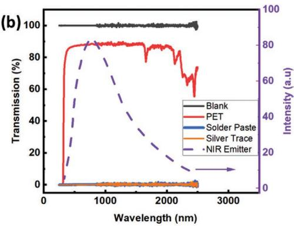  
Figure 2. a) Diferential scanning calorimetry (DSC) curves of PET and solder paste, and b) transmission spectra of blank sample, PET, solder paste, and silver trace along with the energy spectrum of the NIR emitter on the secondary y-axis.

Based on the NIR radiation absorption results discussed above, it is important to determine the appropriate NIR conditions, including the required power and exposure to selectively heat the alloy particles in the solder paste and silver particles in the conductive traces without negatively afecting the substrate and traces. In this regard, a systematic study was performed to determine the optimum NIR conditions required to obtain efective soldering of low-temperature solder paste onto silver traces printed on a PET substrate. First, a thermocouple was used to quantify temperature profiles for the solder paste as the sample was exposed to diferent NIR conditions, as shown in Figure 3a. In this process, the temperature profiles of the solder paste on the printed circuit was recorded as a function of

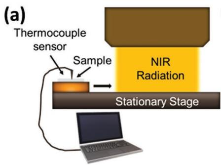

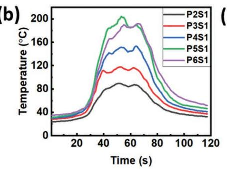

(c)  
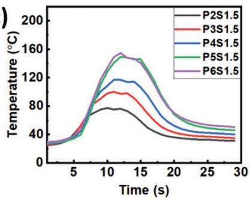

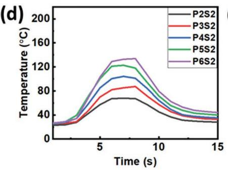

(e)  
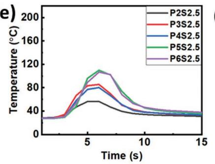

(f)  
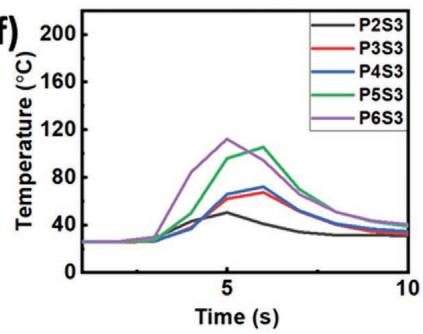

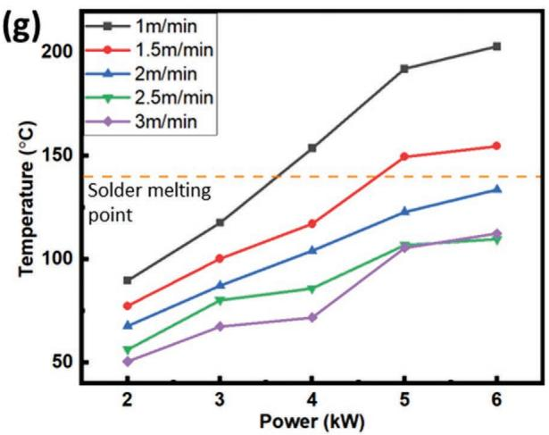

(h)  
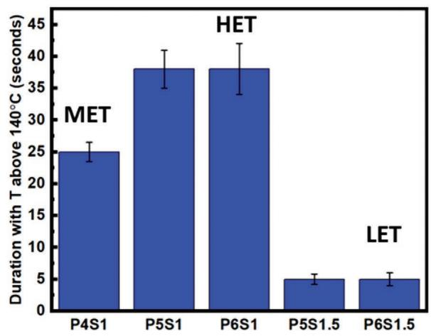  
Figure 3. a) Schematic image of temperature measurement using a thermocouple. b–f) Thermal profiles on the sample surface at diferent NIR lamp powers (2, 3, 4, 5, and 6 kW) and scanning speeds (1, 1.5, 2. 2.5, and 3 m min−1), g) summary of maximum temperature on sample surface under diferent processing conditions (NIR power and scanning speed), and h) NIR processing conditions that provided thermal profiles with maximum temperatures more than 140 °C with diferent exposure times. Low exposure time, medium exposure time, and high exposure time are denoted as LET, MET, and HET, respectively.

NIR lamp power (kW) and conveyor scanning speed (m min−1). Figure  3b–e shows these temperature profiles obtained from operating NIR at diferent powers and speeds. The temperature profiles obtained using diferent powers (2–6  kW) at a fixed speed were compared in each of these figures. At any specific speed, the maximum temperature measured for the solder paste increases with the increase in power. However, as the scanning speed of the stage increases, the duration of NIR exposure for the solder paste decreases, leading to a lower maximum temperature, as noticed in Figure 3b–e. Figure 3g summarizes the maximum temperatures obtained as a function of NIR light source power and scanning speed of the conveyor.

From the summary of the maximum temperatures obtained in each condition shown in Figure 3g, five NIR processing conditions of P4S1 (power 4  kW, speed 1 m min−1), P5S1 (power 5 kW, speed 1 m min−1), P6S1 (power 6 kW, speed 1 m min−1), P5S1.5 (power 5  kW, speed 1.5 m min−1), and P6S1.5 (power 6 kW, speed 1.5 m min−1)) were selected as these were the only conditions that resulted in peek temperatures on the sample’s surface that were equal to or higher than 140 °C, which is required to melt the solder paste. In Figure 3h, these five conditions were presented in terms of their corresponding exposure times during which the sample was exposed to a temperature above 140 °C. As shown in this figure, the exposure times calculated for P4S1, P5S1, P6S1, P5S1.5, and P6S1.5 were 25, 40, 40, 5, and 5 s, respectively. Among these five conditions, three of them with diferent exposure times (P6S1.5 with 5 s, P4S1 with 25 s, and P6S1 with 40 s) were selected for further investigation and labeled as low exposure time (LET), medium expo sure time (MET), and high exposure time (HET), respectively.

One of the critical factors that can afect the quality of solder connection is the degree of spreading of molten solder on the surface of the substrate. The solder paste’s spreading degree onto the printed silver trace was analyzed for the selected three settings (LET, MET, and HET) using an optical microscope. The optical microscopy images of the surfaces of the solder paste deposited on the silver trace before and after the soldering process, as well as the corresponding cross-sectional images of the LET, MET, and HET samples after the soldering process, were presented in Figure 4. As observed in Figure 4d, the exposure time was inadequate in the case of LET resulting in incomplete melting of the solder particles. In this case, the heat supplied from the NIR radiation was insuficient as no sign of the solder reflow and solidification could be noticed, whereas for MET shown in Figure  4e, the solder particles melted and fused to form a continuous solid metallic interface, which exhibited improved spreading on the trace and pushed the remaining flux away from the sample area.

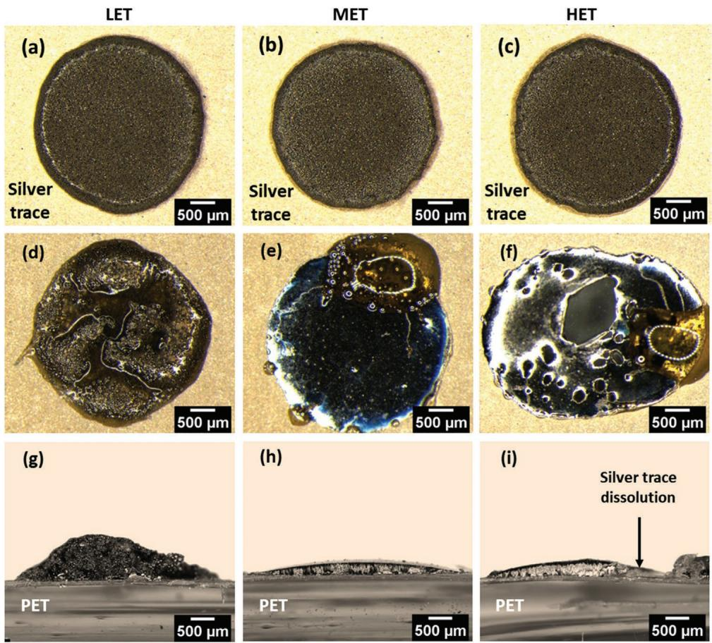  
Figure 4. a–c) Optical microscopy images of surfaces of solder paste deposited on the silver trace before the NIR soldering process using LET, MET, and HET settings, d–f) optical microscopy images of surfaces of solder deposited on silver trace after soldering process for NIR settings LET, MET, and HET, and g–i) cross-sectional images of solder on silver trace after soldering process for NIR settings LET, MET, and HET. Excess heat in the HET setting caused the silver trace dissolution into the solder.

On the other hand, with longer exposure time, as in the case of HET shown in Figure 4f, the dissolution of silver trace into the solder occurred as the sample absorbed excess heat from the NIR radiation leading to the formation of holes in the middle, of the printed area. To further validate the spreading of solder for these 3 settings, the cross-sectional images of the LET, MET, and HET samples were compared, as shown in Figure 4g–i. As shown in Figure 4g of the sample LET, the solder paste did not spread due to insuficient heat absorption. In contrast, both samples MET, and HET exhibited excellent solder spreading. However, the silver trace in the sample HET was damaged due to the excess dissolution of silver metal into the solder.

The intermetallic region at the interface between the solder and conductive trace plays an important role in achieving proper bonding and electrical connection between the solder and conductive trace after the soldering process. To understand the efect of the selected three settings (LET, MET, and HET) on the formation of an intermetallic connection between the solder and silver traces, the cross-sectional analysis of these samples was further performed by obtaining SEM and EDX images.

Figure 5a–c shows the cross-sectional SEM images of the solder interface with silver printed trace after NIR processing with LET, MET, and HET settings. The formation of the intermetallic region between the solder and silver trace with diferent NIR processing conditions was determined using the information obtained from EDX elemental distribution analysis of carbon (Figure 5d–f), silver (Figure 5g–i), and tin (Figure  5j–l). As observed for LET, the majority of the upper region was covered with carbon (red in EDX image; Figure 5d) resulting from the organic-based flux in the solder, and the

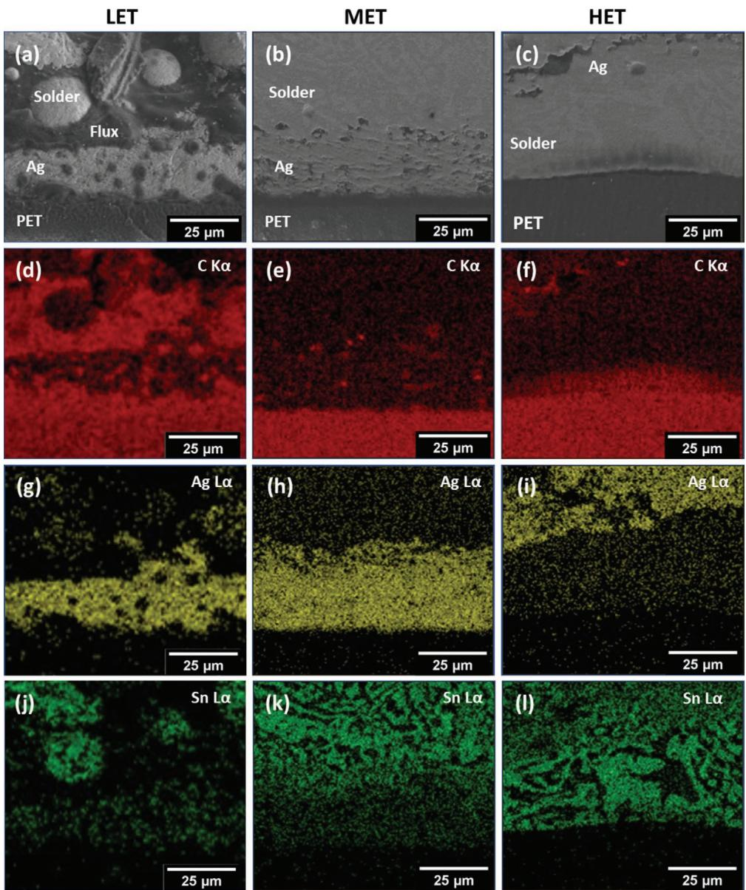  
Figure 5. a–c) Cross-sectional SEM images of NIR settings LET, MET, and HET, d–f) EDX mapping of carbon (C Kα) for NIR settings LET, MET, and HET, g–i) EDX mapping of silver (Ag Lα) for NIR settings LET, MET, and HET, j–l) EDX mapping of tin (Sn Lα) for NIR settings LET, MET, and HET.

www.advelectronicmat.de

spherical regions corresponding to alloy particles containing tin (green in EDX image; Figure 5j) confirming that the solder did not melt and reflow with this NIR processing condition. Whereas for MET, the majority of the upper region was covered with tin (green in EDX image; Figure 5d) resulting from alloy particles, and no red region corresponding to carbon could be found (red in EDX image; Figure 5e), indicating that the solder alloy particles efectively displaced the flux during their melting and fusing process. In this case, most of the silver trace remains intact while some of it dissolves in the solder to form a few microns thick interfacial region with tin, as noticed in Figure 5h. In contrast, for HET, the region on top of the PET was entirely covered with tin, displacing and dissolving a significant amount of the silver trace, as shown in Figure 5i,l. The results from the optical microscopy and SEM/EDX analysis suggest that the optimum bonding between the solder and silver trace without causing dissolution and damage to the printed silver trace could be achieved with the MET processing conditions (medium exposure time condition at a power of 4 kW NIR radiation and with a speed of 1 m min−1).

LET

The bond strength of the soldered connection is often considered essential to achieve a reliable and long-term performance of a flexible electronic device. Shear tests were performed using international standards to evaluate the bond strength of the twoterminal SMD resistor soldered to the printed circuit on the FHE under the selected three settings (LET, MET, and HET). In this test, a cylindrical rod was used to apply force on the soldered component until the solder joints of both terminals were completely disconnected (the dimensions of the SMD resistor and the test setup can be referred to in Figures S1 and S2 in the Supporting Information). The rod displacement rate was kept con stant at 1 mm s−1 using a universal testing machine. The printed conductive traces were connected to the multimeter to continuously record the resistance while the shear force was applied to the SMD resistor. The change in the resistance determines the electrical failure point of the circuit during the applied force.

Figure 6a–f shows the images taken before and after applying the shear force to the SMD resistor soldered onto printed silver traces using diferent NIR processing conditions (LET, MET, and HET). As noticed in these figures, the failure mode of the connection during the test was diferent for LET compared to

MET  
HET  
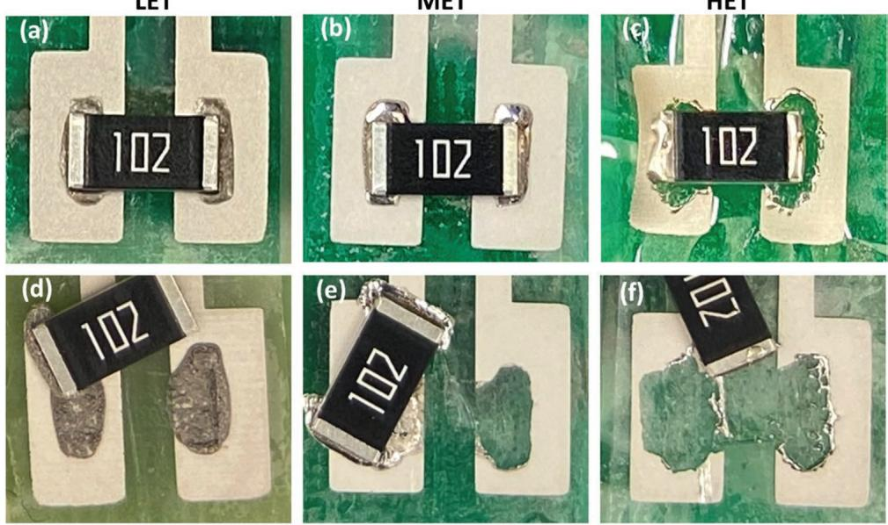

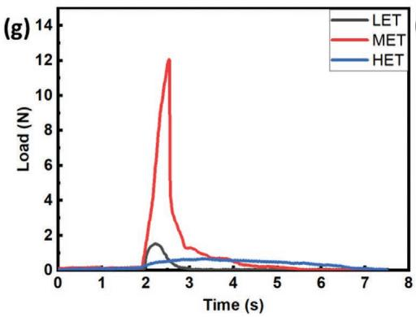

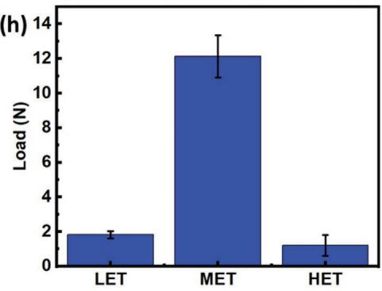  
Figure 6. a–f) Images of 1020 Ω SMD resistor soldered onto printed silver traces using diferent NIR settings (LET, MET, and HET) before (a–c) and after (d–f) shear force applied onto SMD resistor; g) shear force profile measurements and h) peak shear force required to detach SMD resistor from printer traces that were soldered using diferent NIR processing conditions.

www.advelectronicmat.de

MET and HET. For LET, since the solder alloy particles did not completely melt and fuse to form the proper connection, the failure occurred within the solder material (Figure 6d). This is consistent with the optical microscopy results discussed above. When compared between MET and HET, significant silver trace dissolution into the solder paste was noticed for the HET sample (Figure  6f), which led to weaker connections on both sides of the SMD. In contrast, the silver trace was intact for the MET sample (Figure  6b) with well-connected solder joints to the silver trace. Shear test results using MET NIR processing conditions showed the silver printed trace detachment from the PET substrate, confirming the solder joints’ strong mechanical bonding that exceeds the printed trace’s mechanical strength and adhesion to the substrate (Figure 6e).

Figures 6g,h show the results obtained from the shear force measurements performed for the LET, MET, and HET samples. The shear forces required to break the connections for the LET, MET, and HET samples were $1 . 8 1 \pm 0 . 2 , 1 2 . 1 \pm 1 . 2$ , and $1 . 2 \pm 0 . 6$ N, respectively. The sample MET with the optimum NIR processing conditions exhibited the maximum shear force between 12 and 14 N, which is in good agreement with the results obtained for the standard convection oven reflow soldering reported in previous studies. [26] However, it is important to note that in our work, the actual force required to disconnect the soldered joints for the sample MET would be higher than the measured force (14 N) as the disconnection occurred between PET and silver trace, which could be observed in Figure 6e.

In addition to mechanical bond strength evaluation, it is important to assess the long-term environmental stability of the solder connections of FHEs used in health monitoring applications as they are often exposed to high humid and temperature conditions. Figure S3 in the Supporting Information presents the recorded changes in resistance for the LET, MET, and HET samples evaluated under accelerated test conditions at elevated temperature of $7 0 ~ ^ { \circ } \mathrm { C }$ and high humidity (100% RH). As shown in Figure S3 (Supporting Information), the samples prepared using LET settings exhibited increased resistance after 3 days of exposure in this test due to failure at the soldered electrical connections. Since the solder particles did not completely melt and fuse in this case, the solder paste containing flux became brittle over time of exposure and eventually lost the connection with the surface mount resistor. On the other hand, since the solder particles melted and fused to form a good ohmic connection in the samples prepared using MET and HET settings, they exhibited no change in resistance over 7 days of exposure demonstrating excellent environmental stability.

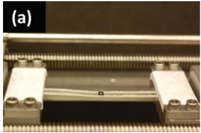

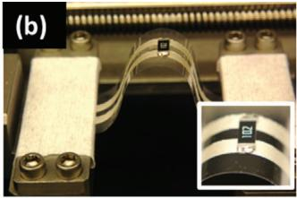

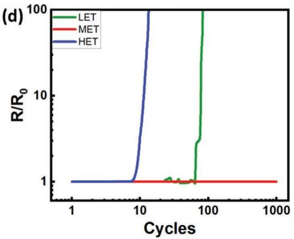

Cyclic mechanical bending was performed to evaluate the reliability of the solder joints using diferent NIR processing conditions (LET, MET, and HET). For this test, the previously described simple, flexible circuit with the SMD resistor was subjected to cyclic bending at a curvature radius of 50  mm within the resistor connection section of the circuit. The bendability of the conductive trace with solder connections and resistor was assessed in two configurations, tension mode when the resistor moves in the upward direction and compression mode when the resistor moves in the downward direction. Figure $\mathsf { 7 a - c }$ shows images of the mechanical bending cycles applied during tension and compression bending modes. Figure $\mathrm { 7 d , e }$ shows the recorded change in resistance measured across the two printed circuit terminals during cyclic tension and compression modes of bending, respectively. As observed in both cases, MET exhibited excellent stability upon bending over 1000 cycles in both tension and compression modes of bending. However, the disconnection at the solder joint between the SMD resistor and the printed circuit occurred in the case of both LET and HET after relatively fewer bending cycles (<100). This resulted in a drastic increase in resistance for LET and HET during both tension and compression bending cycle modes, as shown in Figure 7d,e.

The proposed nondestructive all-NIR processing platform can be used to fabricate a variety of cost-efective mass-producible FHEs for diferent wearable personalized healthcare monitoring systems.[38–41] To demonstrate the applicability of this manufacturing platform, as a proof of concept, we have designed and fabricated a wearable wireless wound monitoring system that can be used to track the volumetric exudate absorption into a wound dressing in real-time. The frequency required for changing the wound dressing highly depends on the amount of exudate and choice of dressings. Frequent and excessive replacement of dressings can be laborintensive and interfere with wound epithelialization. Underhand delayed replacement of dressings can lead to delayed wound healing and risks of infection. [42,43] There is a critical need for low-cost wearable systems that could provide real-time information about the wound dressing status and time point that it needs to be changed to the healthcare providers.[44,45] It is envisioned that this FHE system could be used as an add-on platform that can be integrated with many currently used wound dressings.

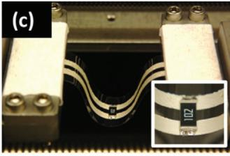

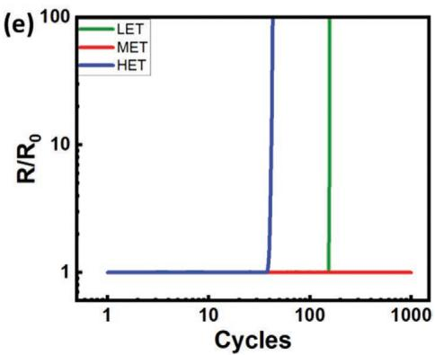  
Figure 7. Mechanical reliability assessment of NIR soldered electrical components on printed silver traces under diferent modes of cyclic bending: a) no bending, b) bending upward (tension), and c) bending downward (compression). d,e) Relative in electrical resistance across the printed circuit with soldered 1020 Ω SMD resistor using LET, MET, and HET NIR processing condition during cyclic tension (d) and compression (e) bending.

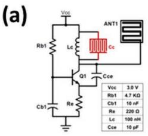  
(i)

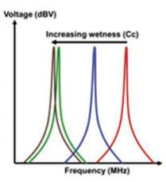  
(ii)

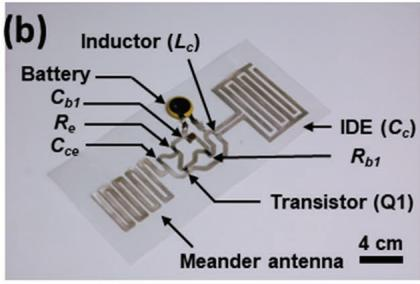

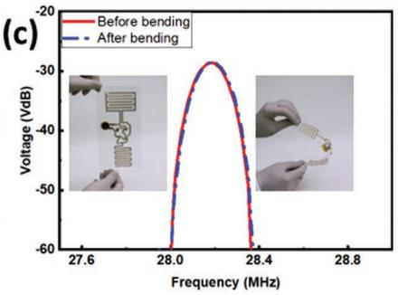

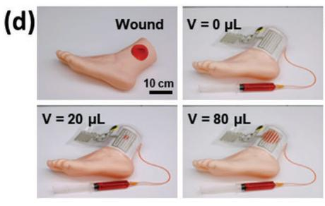

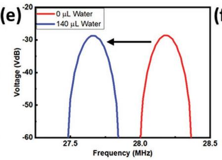

(f)  
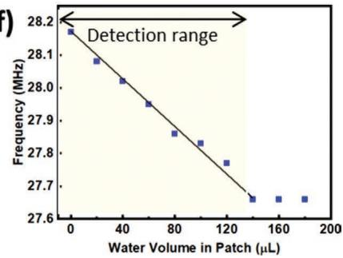  
Figure 8. Wearable wireless wound dressing monitoring sensor: a) i) Sensor configuration with circuit components and connections and ii) expected to change in the resonant frequency of the circuit as a function of change in exudate uptake within the wound dressing, b) image of printed wearable FHE circuit with all soldered electrical components, c) resonant frequency of sensor during normal and bending mode, d) image of wireless sensor applied onto a wound dressing that is attached to plastic mannequin foot where the level of mock exudate in the dressing is adjusted through an external syringe containing food coloring dye, e) change in RF signal captured from the wireless sensor on wound dressing before and after soaking up 140 µL of mock exudate, and f) resonant frequency have a wireless sensor as a function of wound dressing exudate uptake.

The platform consists of an FM transmitter circuit designed to operate as a capacitive sensing-based frequency modulator (Figure 8a). The FM transmitter circuit illustrated in Figure 8a-i consists of a bipolar junction transistor (Q1) biased using two resistors $( R _ { \mathrm { b 1 } }$ and $R _ { \mathrm { e } } )$ and two capacitors $( C _ { \mathrm { b 1 } }$ and $C _ { \mathrm { c e } } )$ to achieve frequency modulation in the MHz range. The transmitting frequency of the circuit is tuned using a tank circuit formed by an inductor, $L _ { \mathrm { c } }$ and a frequency modulating capacitor, $C _ { \mathrm { c } } .$ The $C _ { \mathrm { c } }$ capacitor is printed as an interdigitated electrode structure on the substrate where its capacitance is sensitive to its surrounding efective dielectric constant. The printed interdigitated electrodes can detect volumetric exudate absorption into wound dressings by placing the sensor directly onto the backside of the wound dressing. As shown in Figure 8a-ii, when the volumetric exudate level in the wound dressing increases, the efective capacitance across the interdigitated sensing electrodes increases, leading to an increase in the overall resonant frequency (f) of the FM circuit based on the following equation:

$$
f _ { \mathrm { t } } = \frac { 1 } { \sqrt { L _ { \mathrm { c } } C _ { \mathrm { c } } } }\tag{1}
$$

The FM signal, tuned with the help of the interdigitated sensing electrodes, is wirelessly transmitted to the receiver using a printed meander antenna (Ant1). On the receiver side, $f _ { \mathrm { t } }$ of the transmitting circuit can be obtained from the peak of the fast Fourier transform (FFT) spectrum. Using the equation above, $C _ { \mathrm { c } }$ can be extracted from $f _ { \mathrm { t } }$ and the volumetric exudate level can be estimated. After designing the circuit, the circuit was screen printed, and the electrical components were soldered using the identified optimal NIR processing conditions (MET) (Figure 8b).

To investigate the mechanical reliability, FFT analysis of the sensor was conducted in diferent bending configurations using a wireless reader. As shown in Figure  8c, the FFT peak was obtained at 28.18 MHz both before and after bending the device without observing noticeable shifts in $f _ { \mathrm { t } }$ thereby demonstrating the flexibility of the printed circuit. Furthermore, the resilience of the manufactured device to bending efects confirms perfect adhesion induced by NIR soldering of the components to the silver trace at optimum settings.

Next, to investigate the sensor’s performance in real-time, the manufactured device was attached to a wounded mannequin leg covered with a wound dressing. The artificial exudate uptaken by the dressing was progressively increased from 0 to 180 µL by injecting water into the dressing through an external syringe (Figure 8d). The spread of the injected water increased the volumetric exudate level in the dressing, causing a gradual increase in capacitance of the printed interdigitated electrode (C ) of the circuit which subsequently led to a decrease in f. For instance, Figure 8e shows that injecting 140 µL of water into the dressing led to a discernable frequency shift of 0.51 MHz in f . The shift in f demonstrates a linear correlation with the volumetric exudate level with a linear sensitivity of 3.64  kHz µL−1 over the detection range of 0–140 µL (Figure 8f). However, the frequency shift saturated beyond 140  µL, indicating that the detection for this particular design has reached the maximum limit. The developed platform using NIR technology has been found to provide an accurate estimation of the level of exudate uptake into the wound dressing and could potentially help healthcare providers with accurate time point needed for changing patients’ wound dressings.

## 4. Conclusions

We present an eficient approach that involves the use of nearinfrared (NIR) soldering of electrical components onto flexible digitally printed circuits allowing the fabrication process of flexible hybrid electronic devices in a rapid and scalable manner appropriate for roll-to-roll manufacturing. The NIR technology delivers high energy density in the wavelength range between 0.7 and 1.4  µm, in which the solder pastes and polymer substrates have high and low absorption, respectively. The unique light absorption diference in the materials provides selective heating and melting of the solder paste while causing minimal thermal damage to the polymeric substrate. The thermal profiles of various NIR settings were obtained to determine the processing conditions suitable for the efective soldering of SMD electrical components onto screen-printed circuits that provided both optimal electrical and mechanical properties. Among various NIR settings, low exposure time (LET), medium exposure time (MET), and high exposure time (HET) above the melting point temperature were selected to study the efect of exposure as a part of the optimization process. Based on the optical microscopy, SEM/EDX, and mechanical characterization, the medium exposure conditions with a NIR power of 4  kW and conveyer scan speed of 1m min−1 provided the optimal solder joint performance. This setting resulted in selective heating of the solder paste on the surface printed circuit for 25 seconds above the melting temperature of the solder paste (>140 °C) without causing thermal damage to the printed traces and polymeric substrate. The solder joints exhibited excellent electrical stability in mechanical bending tests with no failure for 1000 bending cycles. Finally, as a proof of concept, the NIRassisted soldering process was utilized in the assembly and integration of a flexible wearable system to monitor the levels of exudate uptake in the wound dressing to help healthcare providers determine the appropriate time point for changing the patient dressing.

## Supporting Information

Supporting Information is available from the Wiley Online Library or from the author.

## Acknowledgements

V.K. and A.Z. contributed equally to this work. The authors thank the staf of the Birck Nanotechnology Center for their support. Funding for this project was provided by Ford Motor Company through the Ford/ Purdue alliance program. R.R., V.K., and A.Z. acknowledge the support from the School of Materials Engineering at Purdue University.

## Conflict of Interest

The authors declare no conflict of interest.

## Data Availability Statement

The data that support the findings of this study are available from the corresponding author upon reasonable request.

## Keywords

conductive paste, electrical soldering, flexible hybrid electronics, near-infrared, printed circuits

Received: September 2, 2022   
Revised: November 7, 2022   
Published online: February 7, 2023

[1] Z. Zhou, H. Zhang, J. Liu, W. Huang, Giant 2021, 6, 100051.

[2] Q.  Li, J.  Zhang, Q.  Li, G.  Li, X.  Tian, Z.  Luo, F.  Qiao, X.  Wu, J. Zhang, Front. Mater. 2019, 5, 77.

[3] Y.  Ma, Y.  Zhang, S.  Cai, Z.  Han, X.  Liu, F.  Wang, Y.  Cao, Z.  Wang, H. Li, Y. Chen, X. Feng, Adv. Mater. 2020, 32, 1902062.

[4] S. Cai, Z. Han, F. Wang, K. Zheng, Y. Cao, Y. Ma, X. Feng, Sci. China Life Sci. 2018, 61, 60410.

[5] S.  Gupta, W. T.  Navaraj, L.  Lorenzelli, R.  Dahiya, npj Flexible Electron. 2018, 2, 8.

[6] U.  Heredia Rivera, S.  Kadian, S.  Nejati, J.  White, S.  Sedaghat, Z. Mutlu, R. Rahimi, ACS Sens. 2022.

[7] V.  Kasi, S.  Sedaghat, A. M.  Alcaraz, M. K.  Maruthamuthu, U. Heredia-Rivera, S. Nejati, J. Nguyen, R. Rahimi, ACS Appl. Mater. Interfaces 2022, 14, 9697.

[8] S. Gopalakrishnan, S. Sedaghat, A. Krishnakumar, Z. He, H. Wang, R. Rahimi, Adv. Electron. Mater. 2022, 8, 2101149.

[9] A.  Zareei, V.  Selvamani, S.  Gopalakrishnan, S.  Kadian, M. K. Maruthamuthu, Z. He, J. Nguyen, H. Wang, R. Rahimi, Adv. Mater. Technol. 2022, 7, 2101722.

[10] S. Sedaghat, V. Kasi, S. Nejati, A. Krishnakumar, R. Rahimi, J. Mater. Chem. C 2022, 10, 10562.

[11] S. Logothetidis, Mater. Sci. Eng., B 2008, 152, 96.

[12] J. Chang, T. Ge, E. Sanchez-Sinencio, in 2012 IEEE 55th Int. Midwest Symp. on Circuits and Systems (MWSCAS), IEEE, Piscataway, NJ, USA, 2012, pp. 582–585.

[13] J.  Wiklund, A.  Karakoç, T.  Palko, H.  Yigitler, K.  Ruttik, R.  Jäntti, J. Paltakari, J. Manuf. Mater. Process. 2021, 5, 89.

[14] G. L. Goh, H. Zhang, T. H. Chong, W. Y. Yeong, Adv. Electron. Mater. 2021, 7, 2100445.

[15] N. D. Sankir, R. O. Claus, J. Mater. Process. Technol. 2008, 196, 155.

[16] U. Heredia-Rivera, S. Gopalakrishnan, S. Kadian, S. Nejati, V. Kasi, R. Rahimi, J. Mater. Chem. C 2022, 10, 9813.

[17] A.  Krishnakumar, R. K.  Mishra, S.  Kadian, A.  Zareei, U. H.  Rivera, R. Rahimi, Anal. Chim. Acta 2022, 1229, 340332.

[18] Y.  Khan, A.  Thielens, S.  Muin, J.  Ting, C.  Baumbauer, A. C.  Arias, Adv. Mater. 2020, 32, 1905279.

[19] X.  Chen, J. A.  Rogers, S. P.  Lacour, W.  Hu, D.-H.  Kim, Chem. Soc. Rev. 2019, 48, 1431.

[20] A. Zareei, S. Gopalakrishnan, Z. Mutlu, Z. He, S. Peana, H. Wang, R. Rahimi, ACS Appl. Electron. Mater. 2021, 3, 3352.

[21] G.  Tong, Z.  Jia, J.  Chang, in 2018 IEEE Int. Symp. on Circuits and Systems (ISCAS), IEEE, Piscataway, NJ, USA, 2018, https://doi. org/10.1109/ISCAS.2018.8351806.

[22] R.  Rahimi, M.  Ochoa, A.  Tamayol, S.  Khalili, A.  Khademhosseini, B. Ziaie, ACS Appl. Mater. Interfaces 2017, 9, 9015.

[23] J. A. Rogers, X. Chen, X. Feng, Adv. Mater. 2020, 32, 1905590.

[24] P. T. Vianco, Jom 2019, 71, 158.

[25] K. A.  Gray, J. J.  Paschkewitz, Next Generation HALT and HASS: Robust Design of Electronics and Systems (Quality and Reliability Engineering Series), Wiley, Hoboken, NJ, USA, 2016.

[26] X.  Li, H.  Andersson, J.  Sidén, T.  Schön, Flexible Printed Electron. 2018, 3, 015003.

[27] N.  Palavesam, S.  Marin, D.  Hemmetzberger, C.  Landesberger, K. Bock, C. Kutter, Flexible Printed Electron. 2018, 3, 014002.

[28] P.  Mostafalu, A.  Tamayol, R.  Rahimi, M.  Ochoa, A.  Khalilpour, G.  Kiaee, I. K.  Yazdi, S.  Bagherifard, M. R.  Dokmeci, B.  Ziaie, S. R. Sonkusale, A. Khademhosseini, Small 2018, 14, 1703509.

[29] H. J. Hwang, K. H. Oh, H. S. Kim, Sci. Rep. 2016, 6, 19696.

[30] H.  Jiang, N. M.  Carter, A.  Zareei, S.  Nejati, J. F.  Waimin, S.  Chittiboyina, E. E.  Niedert, T.  Soleimani, S. A.  Lelièvre, C. J. Goergen, R. Rahimi, ACS Appl Bio Mater 2020, 3, 4012.

www.advelectronicmat.de

[31] M. Cherrington, T. C. Claypole, D. Deganello, I. Mabbett, T. Watson, D. Worsley, J. Mater. Chem. 2011, 21, 7562.

[32] K.  Hooper, M.  Carnie, C.  Charbonneau, T.  Watson, Int. J. Photoenergy 2014, 2014.

[33] D. J.  Keller, K. S.  Jochem, W. J.  Suszynski, L. F.  Francis, J. Coat. Technol. Res. 2019, 16, 1699.

[34] D.  Bryant, I.  Mabbett, P.  Greenwood, T.  Watson, M.  Wijdekop, D. Worsley, Org. Electron. 2014, 15, 1126.

[35] P. Salvo, B. Melai, N. Calisi, C. Paoletti, F. Bellagambi, A. Kirchhain, M. G.  Trivella, R.  Fuoco, F.  Di Francesco, Sens. Actuators, B 2018, 256, 976.

[36] M.  Cherrington, T. C.  Claypole, D. T.  Gethin, D. A.  Worsley, D. Deganello, Thin Solid Films 2012, 522, 412.

[37] W. Gu, W. Yuan, T. Zhong, X. Wu, C. Zhou, J. Lin, Z. Cui, RSC Adv. 2018, 8, 30215.

[38] T. R.  Dargaville, B. L.  Farrugia, J. A.  Broadbent, S.  Pace, Z.  Upton, N. H. Voelcker, Biosens. Bioelectron. 2013, 41, 30.

[39] R. Dong, B. Guo, Nano Today 2021, 41, 101290.

[40] R. Rahimi, U. Brener, M. Ochoa, B. Ziaie, in 2017 IEEE 30th Int. Conf. on Micro Electro Mechanical Systems (MEMS), IEEE, Piscataway, NJ, USA, 2017, pp. 125–128.

[41] M. Sharifuzzaman, A. Chhetry, M. A. Zahed, S. H. Yoon, C. I. Park, S. Zhang, S. Chandra Barman, S. Sharma, H. Yoon, J. Y. Park, Biosens. Bioelectron. 2020, 169, 112637.

[42] G.  Xu, Y.  Lu, C.  Cheng, X.  Li, J.  Xu, Z.  Liu, J.  Liu, G.  Liu, Z.  Shi, Z.  Chen, F.  Zhang, Y.  Jia, D.  Xu, W.  Yuan, Z.  Cui, S. S.  Low, Q.  Liu, Adv. Funct. Mater. 2021, 31, 2100852.

[43] R. Xu, G. Luo, H. Xia, W. He, J. Zhao, B. Liu, J. Tan, J. Zhou, D. Liu, Y. Wang, Z. Yao, R. Zhan, S. Yang, J. Wu, Biomaterials 2015, 40, 1.

[44] C.  Wang, E.  Shirzaei Sani, W.  Gao, Adv. Funct. Mater. 2022, 32, 2111022.

[45] R.  Rahimi, M.  Ochoa, T.  Parupudi, X.  Zhao, I. K.  Yazdi, M. R.  Dokmeci, A.  Tamayol, A.  Khademhosseini, B.  Ziaie, Sens. Actuators, B 2016, 229, 609.