# 近红外辐射辅助焊接用于柔性混合电子 (FHE)

Flexible Hybrid Electronics via Near-Infrared Radiation-Assisted Soldering of SMD on Screen Printed Circuits

Kasi, Zareei, Gopalakrishnan, et al. — Adv. Electron. Mater. 2023, Purdue University / Ford Motor Company

SCIE Q1 (JCR 2026) EI收录 中科院 3区 / 新锐 3区, IF=5.9 | CiteScore: 9.9

## 研究摘要

本文报道了一种利用近红外（Near-Infrared, NIR）辐射在柔性印刷电路上选择性焊接表面贴装元件（SMD）的方法。核心思想：利用 NIR 波段（0.7–1.4 μm）下金属焊料颗粒与聚合物基板之间的吸收率差异—焊料和银浆电路强烈吸收 NIR 辐射并迅速熔化，而 PET 基板在该波段几乎透明。由此实现了：

焊料达到 ${ > } 1 4 0 ^ { \circ } \mathrm { C }$ 熔点形成可靠连接，同时PET基板保持较低温度（远低于其 $T _ { g } \approx 8 5 \mathrm { - } 8 7 ^ { \circ } \mathrm { C } )$

最优条件（4 kW, 1 m/min, MET 参数）的焊点剪切强度达 12–14 N，失效模式为银线从 PET 剥离（焊点强度 > 线路-基板附着力）

1000次弯曲循环无失效，7 天高温高湿 $( 7 0 ^ { \circ } \mathrm { C } _ { \cdot }$ , 100%RH）暴露电阻无变化

原理验证：制造了无线伤口渗出液监测 FHE 传感器（FM 发射电路，3.64 $\mathrm { k H z / \mu L }$ 灵敏度）

## 1. 引言

柔性电子市场 2017 年全球收入 292.8 亿美元（IDTechEx），预计至 2027 年以 11.1% 年增长率持续扩张。虽然全印刷柔性电子具备轻量、柔性和可拉伸等优势，但在性能、功耗和寿命方面仍落后于传统硅基 $\mathrm { I C } _ { \circ }$ 。因此，柔性混合电子（Flexible Hybrid Electronics, FHE）应运而生—将硅基 SMD元件集成到数字印刷的柔性电路上，兼顾性能与柔性的需求。

传统回流焊无法用于 FHE的核心矛盾：常规对流回流炉使整个器件（包括温度敏感基板和印刷线路）暴露于 ${ > } 2 0 0 ^ { \circ } \mathrm { C }$ 高温约 90–120 秒；而 PET/PEN 等常用聚合物基板的玻璃化转变温度 $( T _ { g } )$ 仅约$8 5 \mathrm { { ^ \circ C } }$ ，远超此温度将导致基板变形和印刷线路损伤。

光子焊接方法（如脉冲光）虽可快速加热但脉冲能量仍被所有材料吸收，仍存在线路/基板损伤风险。本文提出的 NIR 方法则依赖选择性吸收机制：

Note

NIR选择性加热的物理原理：NIR 波段（0.7–1.4 μm）具有整个红外光谱中最高的能量密度。聚合物（PET/PEN）在该波段吸收率极低（几乎透明），而金属颗粒（焊料合金中的 $\mathrm { S n / B i / A g } ,$ 银浆中的 Ag）吸收率极高。因此辐射能量被选择性沉积在需要加热的材料中—焊料和银线路升温熔化，而基板通过辐射几乎不吸热。这与传统对流炉的"整体加热"有本质区别。

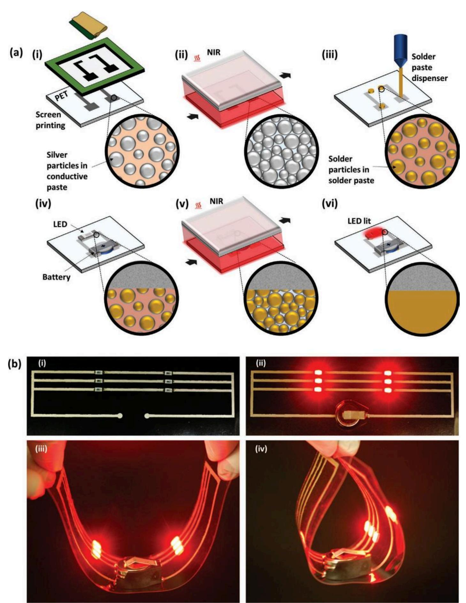

图1—(a)全 NIR 工艺制造FHE流程:i) 丝网印刷银导电浆料，ii) NIR 干燥银线路，iii) 点胶锡膏，iv) 贴装SMD，v) NIR 焊接，vi) LED点亮；(b)柔性FHE 电路点亮2×3LED 阵列，在弯曲状态下照明强度保持不变

## 2. 实验方法

## 2.1 导电线路制备

银导电浆料（DuPont 5025）经丝网印刷至 PET 薄膜（DuPont），平均厚度 10 μm。NIR 干燥/固化参数：干燥 $2 \mathrm { k W } + 1 \mathrm { m } / \mathrm { m i n } $ 固化 $4 \mathrm { k W + 1 \mathrm { m / m i n } }$ ，最终方阻 $1 2 \mathrm { - } 1 5 \mathrm { m } \Omega / \mathrm { s q } / \mathrm { m i l } _ { \odot }$ O

## 2.2 NIR 焊接

采用 Sn42/Bi57.6/Ag0.4 低温焊膏（熔点 ${ \sim } 1 4 0 ^ { \circ } \mathrm { C } )$ ），Nordson 三轴自动点胶机器人直径 3 mm 点状涂布（10 psi）。热电偶（NI-DMAX）直连计算机，在 NIR 功率 2–6 kW 和传送带速度 1–3 m/min范围内系统测量焊膏表面温度曲线。

## 2.3 材料表征

Leica M205C 光学显微镜（反射模式）+ FE-SEM（Hitachi S-4800, 5 kV, 20 μA, WD 15 mm）+EDX 元素分布分析。截面样品依次经 30/15/0.5 μm 砂纸 + 金刚石抛光至镜面。

## 2.4 力学与环境可靠性评估

1020 Ω SMD 电阻焊接到平行银线路（图 S1）。万能试验机（eXpert 4000, Admet）以 1 mm/s 施加剪切力。循环弯曲测试：正弦波振幅 3 mm，周期 30 s（拉伸+压缩模式）。环境测试： $70 \mathrm { ^ { o } C } / 1 0 0 \%$ RH，7 天连续监测电阻变化。

## 3. 结果与讨论

## 3.1 基板热特性与 NIR 选择性吸收

  
PET、焊膏、银线路的透射光谱及NIR发射器能量谱—PET在NIR波段几乎透明，焊膏和银线路几乎完全吸收  
图 2—(a) PET和焊膏的 DSC 曲线: PET的 $T _ { g } \approx 8 5 - 8 7 ^ { o } C ,$ 熔融吸热峰250℃；焊膏熔融峰 $1 4 0 ^ { o } C ;$ (b) PET、焊膏、银线路的透射光谱及NIR发射器能量谱—PET在NIR波段几乎透明，焊膏和银线路几乎完全吸收

Note

DSC 数据揭示的工艺窗口矛盾：焊膏熔点 $( 1 4 0 ^ { \circ } \mathrm { C } )$ 高于 PET 的 $T _ { g } ~ ( 8 5 \mathrm { - } 8 7 ^ { \circ } \mathrm { C } )$ 。在传统对流炉中，焊膏达到 $1 4 0 ^ { \circ } \mathrm { C }$ 回流的过程中，PET 基板早已超过 $T _ { g }$ 进入橡胶态，必然发生变形。但 PET的熔融温度 $( 2 5 0 ^ { \circ } \mathrm { C } )$ 远高于焊膏熔点，这意味着如果热输入是选择性的（仅加热金属不加热聚合物），理论上存在一个"焊料熔化但基板不软化"的工艺窗口。NIR 的选择性吸收正是利用了这一点。

## 3.2 NIR 温度曲线与最佳工艺窗口筛选

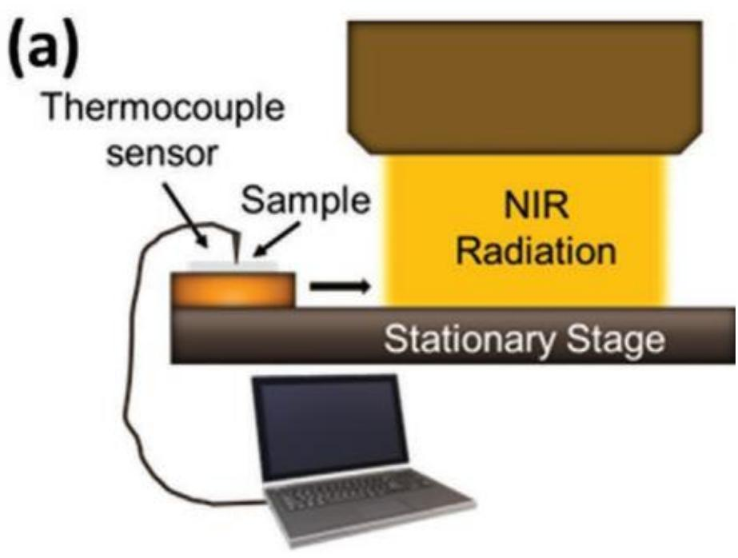  
图3a一热电偶测温示意图

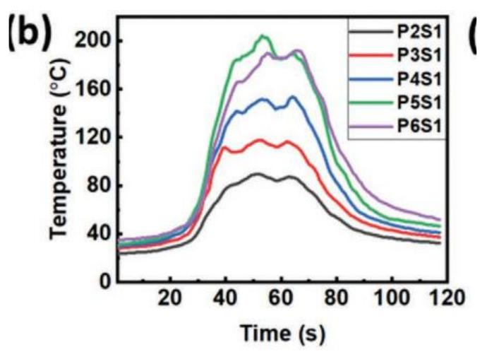  
(b) 1.0 m/min

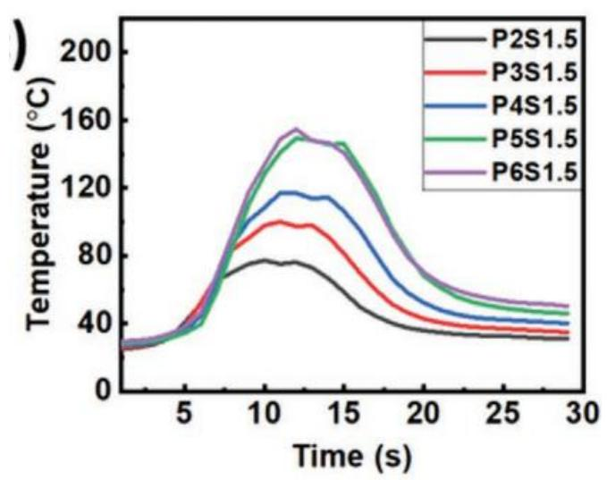  
(c) 1.5 m/min

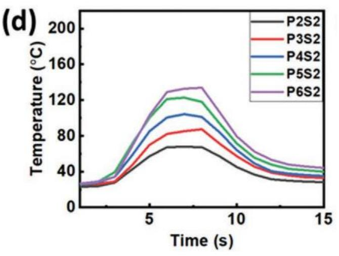

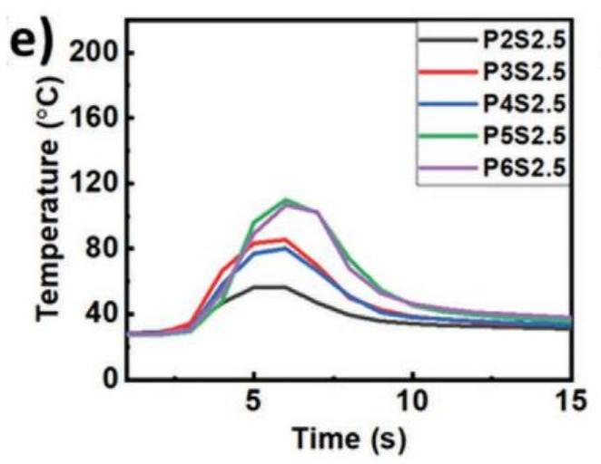

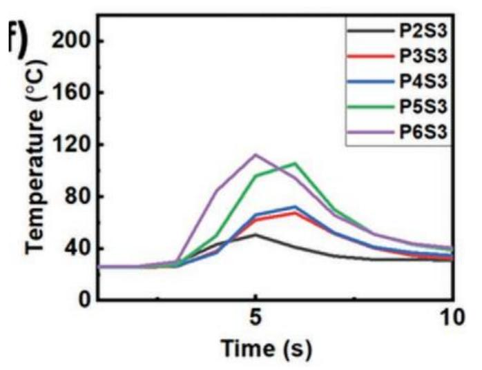  
(f) 3.0 m/min

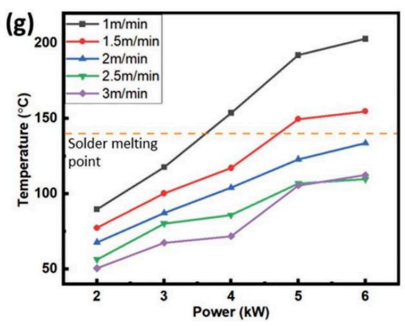  
(g) 峰值温度汇总热图

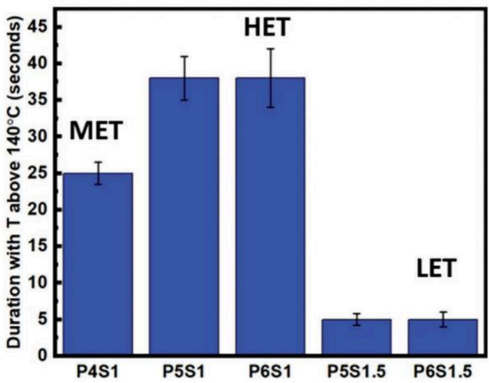  
图 3—(a)热电偶测温示意；(b-f) 不同功率和扫描速度下的温升曲线（2-6 kW×1-3 m/min)；(g)峰值温度汇总热图；(h)筛选出的五个>140℃工艺条件及其在熔点以上的暴露时间(LET=5 s,MET=25 s,HET=40s)

在功率 2–6 kW 和速度 1–3 m/min 的矩阵实验中，仅有 5个条件的峰值温度达到或超过焊膏熔点$1 4 0 ^ { \circ } \mathrm { C }$ ：

<table><tr><td>编号</td><td>功率(kW)</td><td>速度(m/min)</td><td>&gt;140℃ 暴露时间 (s) 分类</td></tr><tr><td>P4S1</td><td>4</td><td>1</td><td>25 MET (中暴露)</td></tr><tr><td>P5S1</td><td>5</td><td>1 40</td><td>选中 (未深入测试)</td></tr><tr><td>P6S1</td><td>6</td><td>1</td><td>40 HET（高暴露）</td></tr><tr><td>P5S1.5</td><td>5</td><td>1.5</td><td>5 选中 (未深入测试)</td></tr><tr><td>P6S1.5</td><td>6</td><td>1.5</td><td>5 LET（低暴露）</td></tr></table>

从 5 个达标条件中选取 3 个不同暴露时间的代表：LET（P6S1.5, 5 s）→ MET（P4S1, 25 s）→ HET（P6S1, 40 s），覆盖"刚好熔化"到"过量加热"的范围，用于后续系统研究。

Note

## 温度曲线的两个关键规律：

1. 功率↑ → 峰值温度↑（在固定速度下）—这反映辐射通量密度与热输入的直接关系

2. 速度↑→ 峰值温度↓—曝光时间减短，总吸收能量减少

注意：MET 使用的功率（4 kW）反而低于 LET 和 HET（6 kW），但速度更慢（1vs 1.5$\mathrm { m } / \mathrm { m i n } )$ ），使得 ${ > } 1 4 0 ^ { \circ } \mathrm { C }$ 暴露时间（25 s）介于 LET（5 s）和 HET（40 s）之间。这表明暴露时间的控制比功率密度更关键—它直接决定了焊料在液态停留的时间，从而影响铺展和 IMC 生长。

## 3.3 焊料铺展与银线路损伤

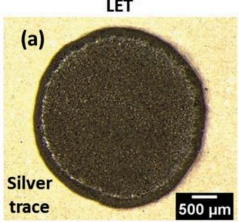

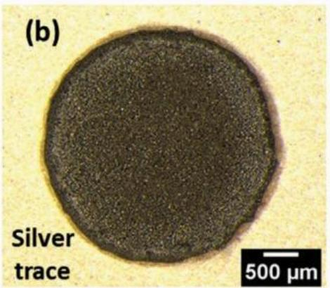

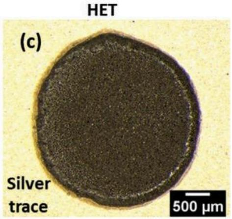

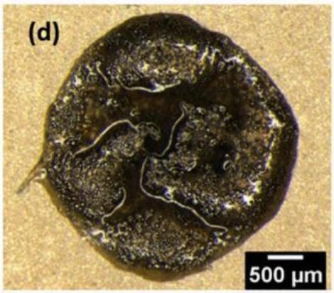

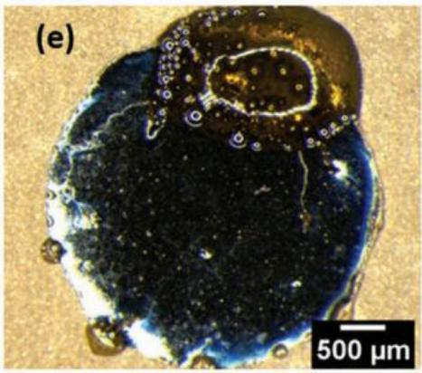

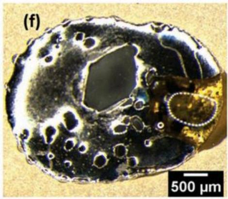

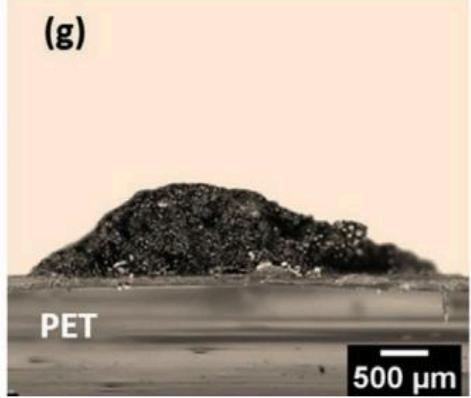

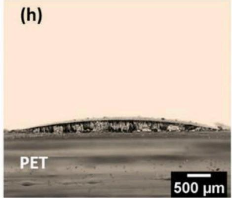

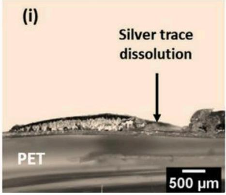  
图 4 — 光学显微镜图像：a-c) 焊接前 LET/MET/HET 的锡膏表面，d-f) 焊接后对应表面，g-i) 焊接后截面。LET=未熔化，MET=完全熔化铺展且银线完整，HET=银线过量溶解形成中心孔洞

<table><tr><td>条件</td><td>焊料熔化状态</td><td>银线路状态</td><td>综合评价</td></tr><tr><td>LET (5 s)</td><td>未完全熔化，球形颗粒残留，无助焊剂 排出</td><td>完整</td><td>热输入不足，未形成有 效连接</td></tr><tr><td>MET (25 s)</td><td>完全熔化、融合，形成连续金属界面， 助焊剂被挤出</td><td>完整，仅微量溶解于焊料 中</td><td>最优</td></tr><tr><td>HET (40 s)</td><td>过度熔化，银线路大量溶解进入焊料</td><td>严重溶解损伤，中央区域 形成孔洞</td><td>过度加热，线路破坏</td></tr></table>

## Note

银线路溶解的机制：HET 条件下过量的 NIR 能量不仅使焊料熔化，还使熔融 Sn-Bi 合金有足够长的时间与 Ag 线路发生溶解反应。Ag 在液态 Sn 中的溶解度较高，长时间高温暴露导致 Ag 从线路大量扩散进入焊料形成 Ag-Sn IMC，留下孔洞。这提示 NIR 工艺的优化核心是"刚好够"的热量—既充分熔化焊料形成铺展和连接，又不超过线路材料的热损伤阈值。

## 3.4 IMC 界面形成（SEM/EDX 分析）

## 术语速览

## 本节涉及的三个核心术语：

IMC（Intermetallic Compound，金属间化合物）：两种金属在界面处通过扩散反应形成的化合物相，具有固定的化学计量比和晶体结构。在电子封装中，IMC 是焊接可靠性的核心指标—太薄说明焊料未充分反应、连接弱；太厚说明过度反应、界面变脆。本文关注的IMC 主要是 Ag₃Sn（银线与 Sn-Bi 焊料反应生成），厚度数微米为最优。

SEM（Scanning Electron Microscopy，扫描电子显微镜）：用聚焦电子束在样品表面逐点扫描，通过收集二次电子信号成像。相比光学显微镜，SEM 的景深大两个数量级，能清晰分辨焊料截面中微米级分层的三维结构。本文使用 Hitachi S-4800 冷场发射 SEM，5 kV 低加速电压以减少 PET 基板充电效应。

EDX（Energy-Dispersive X-ray Spectroscopy，能量色散 X 射线光谱）：SEM 的配套技术—电子束轰击样品时，原子内层电子被激发，外层电子跃迁回落时发射特征 X射线（每种元素的特征能量不同）。EDX 探测器按能量分选这些 X 射线，即可绘制元素分布图。本文中EDX 用于区分 C（助焊剂有机物）、Ag（银线路）、Sn（焊料），三种元素的分布直接揭示界面质量。

阅读提示：下文图 5 的 d–l 子图是 EDX 元素分布图，每种颜色代表一种元素。核心读图线索：C（红色）还在→助焊剂残留在界面；Sn（绿色）完全覆盖界面 + C消失 → 焊接成功；Ag（绿色）断开→线路溶解损坏。

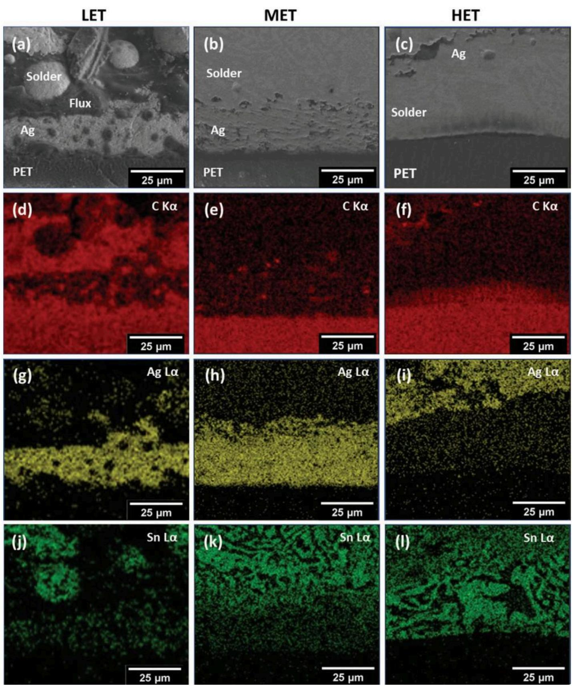  
图 5 — 焊料-银线路界面的截面 SEM 与 EDX 元素分布：a-c) SEM 图像(LET/MET/HET)；d-f) C Kα(红色=助焊剂有机物)；g-i) Ag Lα(绿色=银)；j-1) Sn Lα(绿色=锡)

EDX揭示的三组微结构差异：

LET：上层区域大部分被 C（红色，来自有机助焊剂）覆盖；Sn（绿色）以球形颗粒存在—焊料未熔化，助焊剂未被排出

MET：上层区域全部被 Sn 覆盖，无助焊剂残留（C 消失）；银线路大部分完好，仅少量银溶解形成数微米厚的界面 IMC 层—实现了有效的冶金结合

HET：PET 上方区域几乎全部被 Sn 占据，大部分银线路被溶解置换—线路结构破坏

Note

助焊剂排出的关键信号：从 LET → MET 的转变中，EDX 的 C 信号从"大量覆盖"变为"完全消失"，这表明焊料熔化过程中产生了两个效应：(1) 助焊剂的体积排除—熔融合金液滴的表面张力将较轻的有机相挤出；(2) 清洁金属界面—助焊剂去除氧化物后，洁净的 Ag 表面与熔融 Sn直接接触，形成可靠的冶金结合。LET 条件下这些过程均未发生，因此剪切测试中失效发生在焊料内部。

## 3.5 剪切强度—MET 超越线路附着力

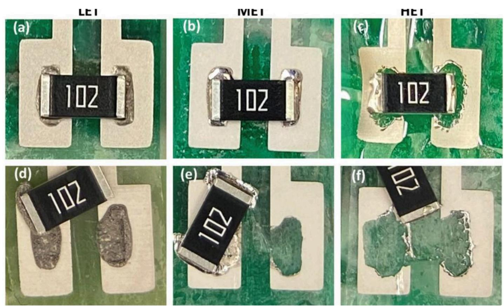

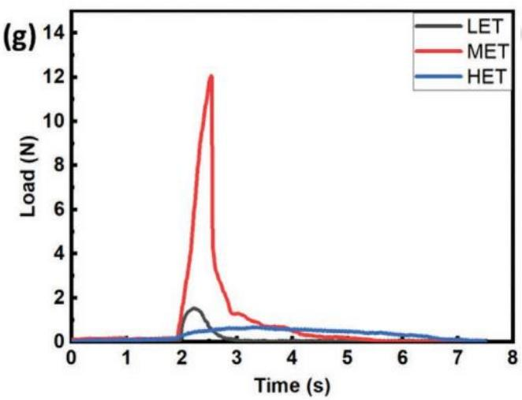  
(g) 剪切力轮廓测量

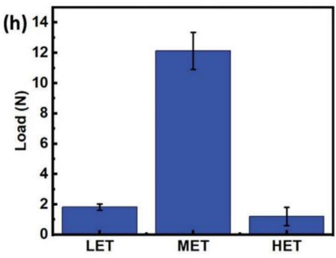  
(h) 峰值剪切力对比

图6—剪切强度测试（按IEC62137-1-2:2007)：a-c)剪切前LET/MET/HET样品；d-f)剪切后—LET:焊料内聚破坏，MET:银线路从PET剥离(焊点完好)，HET:银线路溶解导致弱连接；(g)剪切力轮廓测量；(h)峰值剪切力对比
<table><tr><td>条件</td><td>峰值剪切力 (N) 失效模式</td><td></td></tr><tr><td>LET</td><td> $1 . 8 1 \pm 0 . 2$ </td><td>焊料内部断裂(未形成有效连接）</td></tr><tr><td>MET</td><td> $1 2 . 1 \pm 1 . 2$ </td><td>银线路从PET剥离（焊点强度&gt;线路-基板附着力）</td></tr><tr><td>HET</td><td> $1 . 2 \pm 0 . 6$ </td><td>银线路溶解导致的弱连接</td></tr></table>

## Note

MET失效模式的关键含义：剪切测试中 MET 的失效模式是银线路从 PET 剥离，而非焊点断裂。这意味着NIR 焊接形成的冶金连接强度超过了印刷银线路与 PET 基板之间的附着力。实际焊点强度应 >14 N（测量值受限于线路附着力），这一数值与传统对流回流焊文献报道结果（Liet al., 2018 [26]）相当。换句话说，NIR 焊接在机械强度上不低于传统回流焊，同时保护了基板—这是 NIR 替代对流焊的强有力证据。

## 3.6 环境稳定性与弯曲可靠性

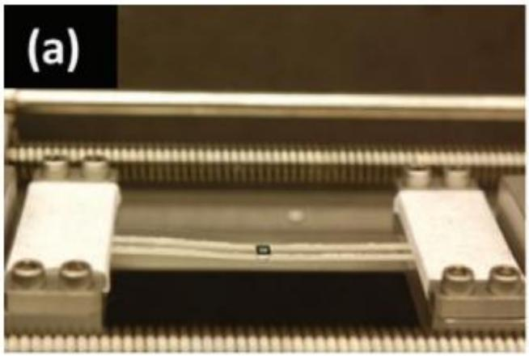  
(a-c) 弯曲模式示意

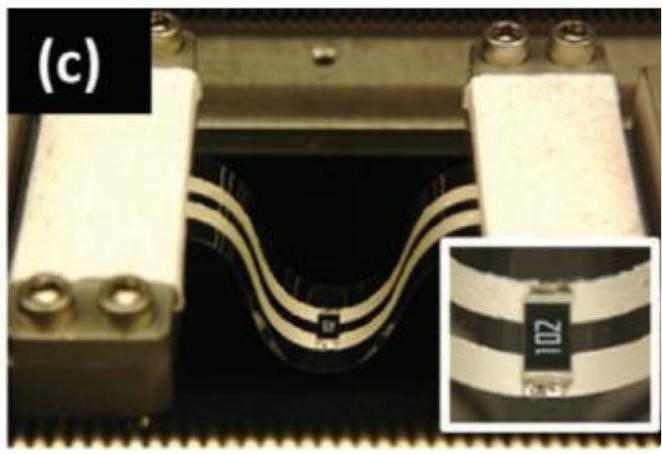  
(d)拉伸模式电阻-循环

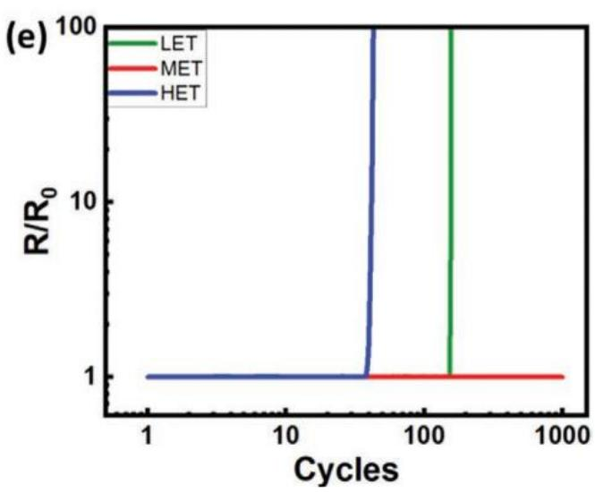  
(e) 压缩模式电阻-循环

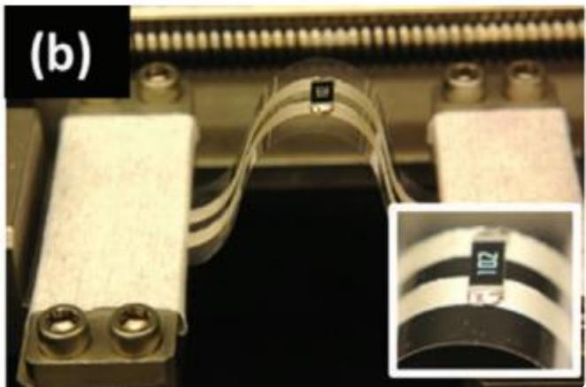  
测试装置照片

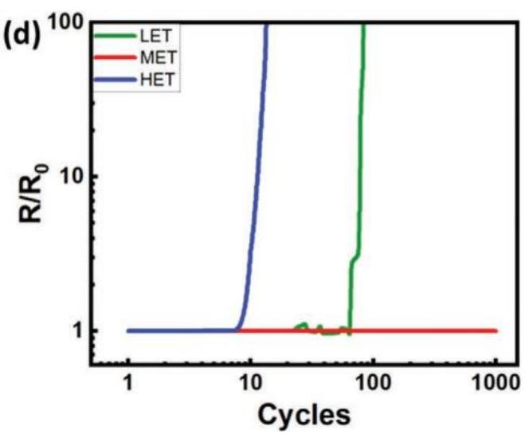  
(c) 向下弯曲照片

(a-ii) 预期频率响应

图7—循环弯曲可靠性测试:a)无弯曲，b)向上弯曲(拉伸)，c)向下弯曲(压缩)，d)拉伸模式电阻变化vs循环，e)压缩模式电阻变化 VS循环—MET在两种模式下1000次后电阻几乎不变，LET/HET<100次即失效

测试条件：弯曲曲率半径 50 mm，拉伸/压缩两种模式各 1000 次循环。关键结果：

MET：拉伸和压缩模式下均 1000次无失效，电阻几乎无变化

LET：两种模式下均 <100次焊点断开，电阻急剧上升—焊料未形成有效冶金结合

HET：同样 <100次失效—银线路溶解导致连接脆弱

环境稳定性： $7 0 ^ { \circ } \mathrm { C } / 1 0 0 \% \mathrm { R H }$ 加速老化测试—LET 在 3 天后因助焊剂脆化导致连接断开（电阻突变）；MET 和 HET 7天无变化—焊料的冶金结合具有良好的环境耐受性。

3.7 概念验证：无线伤口渗出液监测传感器

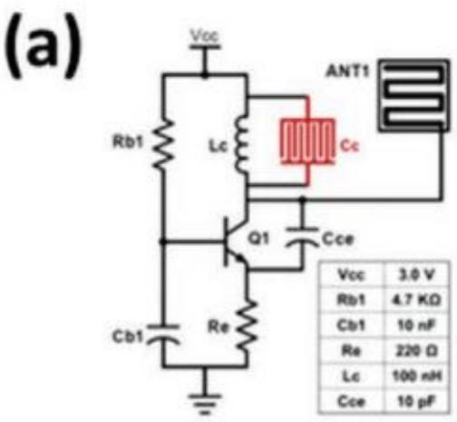  
(a-i) 传感器配置

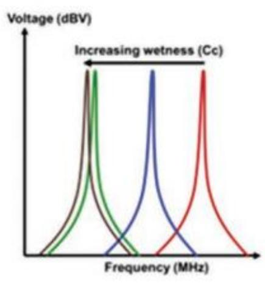

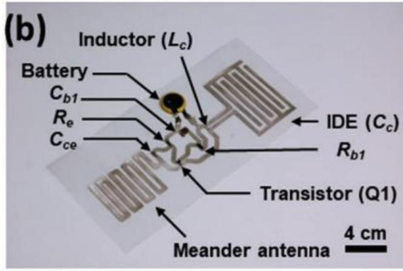  
(b) 印刷 FHE 电路与焊接元件

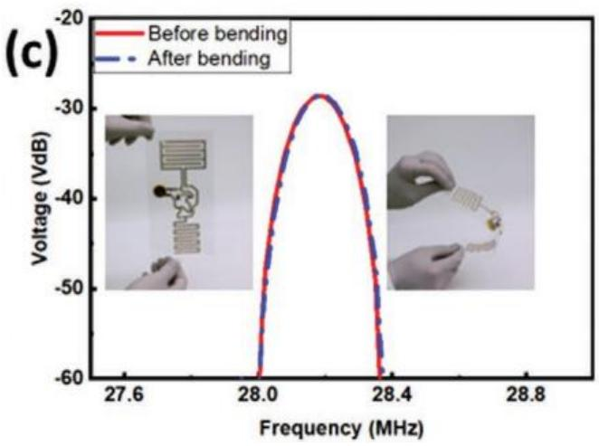

(d)  
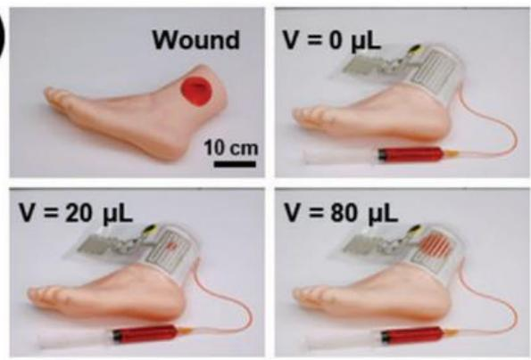  
(d) 人体模型脚踝测试

(c) 正常/弯曲模式谐振频率  
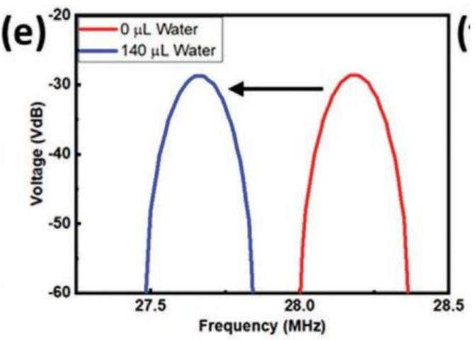  
(e) 注入 140 $\mu L$ 后的RF频移

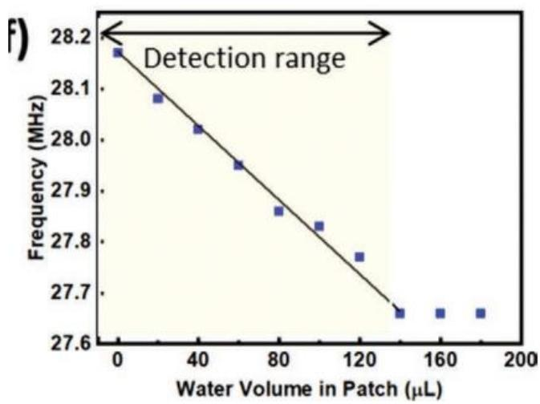  
(f) 谐振频率-渗出液体积  
图8一无线伤口敷料监测传感器：(a-i)传感器配置与电路连接，(a-ii)预期谐振频率随渗出液吸收的变化，(b)印刷FHE电路与焊接元件，(c)正常/弯曲模式下的谐振频率(28.18MHz无偏移)， (d)传感器贴于伤口敷料的人体模型脚踝测试(模拟渗出液为含食用色素的水)，(e)注入140μL前后的RF信号频移(0.51MHz)，(f)谐振频率与渗出液体积(0-180μL 总范围， ${ \leqslant } I { \leqslant } O \mu L$ 线性，灵敏度3.64kHz/μL, ${ > } I 4 O \mu L$ 饱和)

传感器方案是一个 FM 发射器电路，电路拓扑如下：

双极结晶体管（BJT）Q1 — 有源放大元件

偏置电阻 $R _ { b 1 } , \ R _ { e } +$ 电容 $C _ { b 1 } , \ C _ { c e }$ — 设置直流工作点，实现 MHz 范围内的频率调制

LC 槽路（Tank Circuit）：固定电感 $L _ { c } +$ 印刷叉指电极电容（Interdigitated Capacitor） $C _ { c }$ — 决定发射频率， $C _ { c }$ 同时也是传感元件

印刷 Meander 天线（Ant1） — 无线发射已调 FM 信号

接收端通过 $\mathrm { F F T }$ 频谱峰值追踪 $f _ { t }$ 的变化。其谐振频率由 LC 槽路决定：

$$
f _ { t } = \frac { 1 } { \sqrt { L _ { c } C _ { c } } }\tag{1}
$$

解读：当伤口敷料中的渗出液体积增加→叉指电极周围有效介电常数增大→电容 $C _ { c }$ 增大→谐振频率 $f _ { t }$ 降低。接收端通过 FFT 频谱峰值追踪 $f _ { t }$ 的下降，反算出渗出液体积。线性灵敏度 $3 . 6 4 \mathrm { k H z / \mu L } ,$ ，检测范围 $0 { - } 1 8 0 ~ \mu \mathrm { L }$ $( 0 - 1 4 0 ~ \mu \mathrm { L }$ 内呈线性响应，超过 $1 4 0 ~ \mu \mathrm { L }$ 后频率偏移趋于饱和，表明此设计的检测上限约 $1 4 0 \mu \mathrm { L } )$

Note

工程参数还原：初始 $f _ { t } = 2 8 . 1 8 \ : \mathrm { M H z }$ ；注入 $1 4 0 \mu \mathrm { L }$ 后频移 0.51 MHz；线性灵敏度 3.64 kHz/$\mu \mathrm { L } _ { \circ }$ 此传感器在弯曲状态下 $f _ { t }$ 无偏移—再次证实 NIR 焊接点具有良好的抗弯可靠性。该设计本质上是一个 LC压控振荡器（VCO），叉指电容作为频率调制元件，通过 meander 天线无线发射 FM 信号。该方案的精妙之处在于传感和发射功能共享同一个电容 $( C _ { c }$ 既是 LC 振荡元件又是传感元件），实现了最小化的柔性平台。

## 4. 结论

NIR选择性加热机制得到充分验证：在 0.7–1.4 μm 波段，焊膏和银线路吸收率高而 PET 吸收率极低，实现了"焊料熔化 + 基板低温"的选择性效果

MET参数 $( 4 \mathrm { k W } , 1 \mathrm { m / m i n } , > 1 4 0 ^ { \circ } \mathrm { C }$ 暴露 25 s）是最优工艺窗口：提供足够的能量和时间让焊料完全熔化铺展、排出助焊剂、形成致密 IMC 界面，同时避免银线路因过量加热发生溶解

NIR焊接的力学性能不亚于传统对流回流焊：MET 剪切力 12–14 N，失效发生在银线-PET 界面而非焊点，焊点真实强度超过该值

可靠性和环境稳定性优异：1000 次弯曲无失效， $7 0 ^ { \circ } \mathrm { C } / 1 0 0 \% \mathrm { R H }$ 下 7 天无退化

R2R（卷对卷）兼容性：NIR 传送带式工艺适合高通量连续制造，演示了从印刷→干燥→点胶→贴装→焊接的全流水线方案

概念验证成功：无线伤口渗出液监测 FHE 传感器（FM 发射 + 叉指电容传感），线性灵敏度 3.64 kHz/μL， $0 { - } 1 4 0 ~ \mu \mathrm { L }$ 检测范围

## 核心要点总结

NIR选择性加热是解决 FHE 焊接困境的关键—传统对流炉因整体加热损害基板，NIR 利用金属/聚合物的吸收率差异实现"局部熔化、整体低温"

暴露时间（而非功率密度）是主控参数—5 s 不足（未熔化）、25 s 恰好、 $4 0 \ : \mathrm { s }$ 过度（银线路溶解）